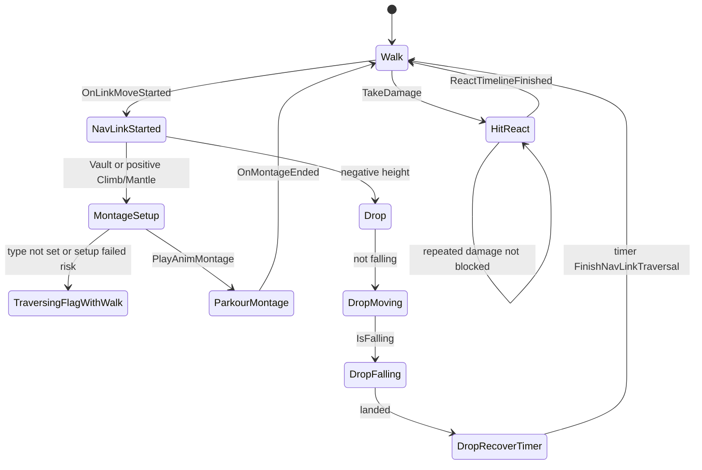
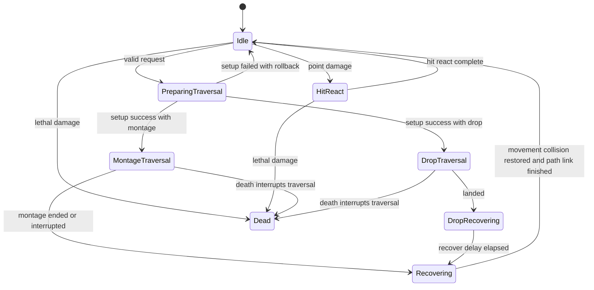

# OutBreak AI Architecture and Pattern Analysis

## 1. Executive Summary

현재 OutBreak의 AI C++ 코드는 아직 Behavior Tree, Blackboard, Perception, Gameplay Ability System 기반 AI 의사결정보다는 "AI 캐릭터, 커스텀 이동 컴포넌트, Generated Nav Link Traversal, 물리 피격 반응, 신체 부위 파괴, Animation Budget"에 집중되어 있다. 실제 중심 클래스는 `AEnemyCharacter`, `UEnemyMovementComponent`, `UEnemyGenNavLinksProxy`, `UEnemyStatusComponent`이다.

가장 큰 구조적 문제는 세 가지다.

1. `UEnemyMovementComponent`가 일반 이동, Nav Link 완료 통지, Traversal 상태, Drop 물리 처리, Capsule/Mesh collision 복구, Motion Warping target 생성, Montage 재생/종료 처리를 모두 가진다. 이는 단순 스타일 문제가 아니라 이동 상태와 애니메이션/물리 표현의 책임이 한 클래스에 섞인 구조 문제다.
2. `AEnemyCharacter`가 캐릭터 소유권과 표현뿐 아니라 데미지 해석, 물리 hit react, 신체 부위 파괴, static mesh 파편 spawn, Animation Budget delegate까지 가진다. `UEnemyStatusComponent`와 `UEnemyLimbComponent`가 존재하지만 실제 데미지/부위 파괴 흐름은 Character가 직접 처리한다.
3. Traversal은 `ETraversalType` enum과 `bIsTraversingNavLink`, `bFallingStart`, Montage delegate, Timer lambda로 암묵적 상태 머신을 구성한다. 실패/중단/사망/중복 진입에 대한 중앙 전환 규칙이 없어 Nav Link가 끝나지 않거나 collision/physics 상태가 복구되지 않을 위험이 있다.

즉시 권장하는 방향은 많은 디자인 패턴을 새로 넣는 것이 아니라, 현재 책임을 유지 가능한 경계로 정리하는 것이다. 최우선은 `UEnemyMovementComponent` 내부에 명시적인 Traversal 상태 전환과 실패 복구를 만들고, Nav Link가 전달하는 Traversal 요청 데이터를 구조화하며, Character의 데미지 진입점에서 hit react와 limb destruction 책임을 기존/신규 컴포넌트로 넘기는 것이다.

현재 규모에서는 별도 UObject Strategy, full Command 객체, 범용 Mediator/Coordinator, Object Pool은 우선 도입하지 않는 편이 낫다. Template Method 성격의 함수 분리, 제한된 Facade, 명시적 상태 머신, 작은 request struct, 필요한 위치의 native delegate가 더 현실적이다.

## 2. Analysis Scope and Constraints

주 분석 범위:

- `Source/OutBreak/Public/AI/`
- `Source/OutBreak/Private/AI/`

AI 코드와 직접 연결되는 범위에서 추가 확인한 파일:

- `Source/OutBreak/Public/FlowField/AnimationBudgetWorldSubsystem.h`
- `Source/OutBreak/Private/FlowField/AnimationBudgetWorldSubsystem.cpp`
- `Source/OutBreak/Public/Ability/Abilities/OBGameplayAbility_RangedWeapon.h`
- `Source/OutBreak/Private/Ability/Abilities/OBGameplayAbility_RangedWeapon.cpp`
- `Source/OutBreak/OutBreak.Build.cs`
- `OutBreak.uproject`

분석 중 소스 코드, 설정, 에셋은 수정하지 않았다. 보고서 파일 `Docs/AI_Architecture_Pattern_Analysis.md`만 생성 대상이다. 분석 시작 시점의 작업 트리에는 이미 수정된 `.cpp`, `.h`, `.uasset`, `.umap`, `.idea` 파일이 존재했으나 이 보고서는 해당 파일을 읽기만 했다.

`UEnemyGenNavLinksProxy`의 부모인 `UBaseGeneratedNavLinksProxy`는 현재 `Source/OutBreak` 아래에서 정의가 검색되지 않았다. 확인된 근거는 `Source/OutBreak/Public/AI/Nav/EnemyGenNavLinksProxy.h:6`의 include와 `:14`의 상속뿐이므로, 부모 클래스 내부 책임은 추정하지 않고 파생 클래스에서 확인 가능한 동작만 분석한다.

## 3. Current Architecture Overview

### 3.1 Class Responsibility Table

| 클래스 | 현재 책임 | 문제점 | 권장 책임 | 권장 패턴 | 우선순위 |
| --- | --- | --- | --- | --- | --- |
| `AEnemyCharacter` | Enemy Character root, custom movement/mesh subobject 설정, collision 설정, Motion Warping/Status/ChildActor 소유, damage 처리, physical hit react, limb destruction, Animation Budget 관리 | 데미지 해석, 부위 파괴, physics blend, budget delegate가 Character에 집중됨. `TakeDamage`가 Status/Limb 컴포넌트를 우회함. | Actor aggregate root. 외부 진입점과 소유 컴포넌트 조정만 담당하고, hit react/limb/status는 컴포넌트에 위임 | 제한적 Facade, Component Pattern 보완, Observer 일부 | 높음 |
| `AEnemyController` | `ADetourCrowdAIController` 파생. 현재 BeginPlay/Tick만 override | 의사결정/MoveTo/BehaviorTree 코드 없음. 빈 Tick 활성화 | AI 의사결정, target 선택, MoveTo 요청 소유. 빈 Tick 제거 후보 | Unreal Gameplay Framework 역할 분리 | 중간 |
| `UEnemyMovementComponent` | Character movement, path move/direct move override, Nav Link traversal, Drop physics, parkour collision, Motion Warping target, Montage 재생/종료 | 이동/애니메이션/물리/collision/Nav Link 완료가 강하게 결합됨. 실패 시 상태 복구 불명확 | 이동 상태와 traversal 실행 소유. 애니메이션 재생은 제한된 helper 또는 Character/Anim 경계로 위임. 상태 전환 중앙화 | 명시적 상태 머신, Template Method식 함수 분리, lightweight request struct | 필수 |
| `UEnemyGenNavLinksProxy` | Generated Nav Link 진입 시 PathFollowing/Pawn/Movement를 찾아 `StartNavLinkTraversal` 호출 | concrete `UEnemyMovementComponent` cast. endpoint 계산 실패를 무시하고 `Start=Zero`로 진행 가능 | Link metadata와 traversal request 생성까지만 담당. 실행/복구는 Movement가 담당 | Adapter 성격 유지, request struct | 높음 |
| `UEnemyBaseActorComponent` | Enemy 소유 컴포넌트 공통 base, BeginPlay에서 owner를 `AEnemyCharacter`로 cache | 모든 파생 컴포넌트 Tick 활성화. owner cast 실패 검사 없음. Enemy 전용 base로 강결합 | Enemy 전용 base로 유지 가능하되 Tick opt-in, owner validation 명확화 | Component Pattern 보완 | 중간 |
| `UEnemyStatusComponent` | limb durability 데이터와 debug string 표시 | 실제 데미지/부위 파괴 흐름에 참여하지 않음. `Limb` enum은 Head만 정의. 매 Tick debug 조회 | limb 상태의 단일 소유자. Character damage 결과를 받아 durability/death/limb destroyed 이벤트 발생 | Component Pattern, Data-Driven 일부 | 높음 |
| `UEnemyLimbComponent` | 현재 빈 ActorComponent | Tick만 활성화된 placeholder | 제거 후보 또는 실제 limb destruction component로 역할 명확화 | 적용 보류 | 낮음 |
| `AModularSkeletalMeshActor` | ChildActor로 붙는 skeletal mesh holder. `LeaderHead` 소유 | Tick 활성화되어 있으나 비어 있음. Character가 concrete actor로 cast하고 public mesh에 직접 접근 | modular mesh presenter. Tick 불필요하면 비활성. mesh 접근은 getter 또는 Character 내부로 제한 | 단순 책임 정리 | 낮음 |
| `FTraversalType`, `ETraversalLinkType` | traversal runtime type/link metadata | runtime state와 link type이 분리되어 있지만 상태 phase가 부족함. Mantle link가 ClimbUp으로 처리됨 | link type, traversal mode, traversal phase를 분리 | 명시적 상태 머신 | 필수 |
| `UAnimationBudgetWorldSubsystem` | game world에서 Animation Budget Allocator 활성화 | `AI/EnemyCharacter.h`를 include해 log category에 의존 | 전역 Animation Budget 서비스 유지. AI log category 의존은 분리 후보 | Subsystem Pattern 유지 | 낮음 |
| `UOBGameplayAbility_RangedWeapon` | 서버 trace, `ApplyPointDamage`, GameplayCue/GE 적용 | AI는 `TakeDamage`로 반응하지만 ASC 기반 damage와 통합 경계가 불명확 | 서버 권한 damage source. AI hit result event의 시작점 | Event boundary 검토 | 중간 |

세부 책임/상태 요약:

| 클래스 | 주요 상태값 | 외부 의존성 | 호출하는 객체 | 호출받는 객체 | Tick | Delegate/Event | 수명/소유권 | 서버/클라이언트 위치 |
| --- | --- | --- | --- | --- | --- | --- | --- | --- |
| `AEnemyCharacter` | `bIsHit`, `CacheBoneName`, `ReactTimeline`, animation budget state, physical materials/static meshes | `UEnemyMovementComponent`, `UMotionWarpingComponent`, `UEnemyStatusComponent`, `UChildActorComponent`, `AModularSkeletalMeshActor`, `USkeletalMeshComponentBudgeted` | mesh/capsule, budget allocator, static mesh spawn | Unreal damage system, Movement via `GetMotionWarpingComponent` | 사용. `Tick`에서 timeline tick (`EnemyCharacter.cpp:190-195`) | BudgetedMesh `OnReduceWork`, timeline delegates, `OnReducedAnimationWorkChanged` | Character가 components와 child actor component 소유 | 명시적 authority guard 없음 |
| `UEnemyMovementComponent` | `TraversalType`, `TraversalDestination`, `ActivePathFollowing`, `ActiveCustomLink`, `bIsTraversingNavLink`, `bFallingStart`, cached Character/Capsule/Mesh | `AEnemyCharacter`, `UEnemyGenNavLinksProxy`, `UPathFollowingComponent`, MotionWarping, AnimInstance | Character montage, MotionWarping, PathFollowing finish, collision/physics | Nav proxy, path following movement system | 사용. Traversal 중 switch (`EnemyMovementComponent.cpp:70-100`) | Montage end delegate, timer lambda | Character movement subobject. cached pointers are `TObjectPtr` | AI path following상 서버 실행 추정. 명시적 복제 없음 |
| `UEnemyGenNavLinksProxy` | `LinkTraversalType` | `UPathFollowingComponent`, `AAIController`, `UNavigationSystemV1`, `UEnemyMovementComponent` | Movement `StartNavLinkTraversal` | Generated Nav Link system | 없음 | Custom link callback override | Nav link proxy가 소유한 UObject로 추정 | Nav/path following상 서버 실행 추정 |
| `UEnemyStatusComponent` | six `FLimbData`, `bIsDrawDebug` | `AEnemyCharacter`, child skeletal mesh sockets | debug draw | 자체 Tick | 사용. Debug 여부와 무관하게 tick | 없음 | Character component | 명시적 authority guard 없음. debug draw는 클라/서버 구분 없음 |
| `UEnemyBaseActorComponent` | cached `EnemyCharacter` | `AEnemyCharacter` | owner cast | 파생 component | 사용 | 없음 | Character component | 구분 없음 |
| `AModularSkeletalMeshActor` | `Root`, `LeaderHead` | `USkeletalMeshComponent` | 없음 | `AEnemyCharacter::GetChildActorSkeletalMesh` | 사용. 비어 있음 | 없음 | ChildActorComponent가 소유 | 구분 없음 |

### 3.2 Dependency Map

현재 확인된 AI 의존성:

```mermaid
flowchart LR
    "UOBGameplayAbility_RangedWeapon" --> "Unreal Damage System"
    "Unreal Damage System" --> "AEnemyCharacter::TakeDamage"
    "AEnemyCharacter" --> "UEnemyMovementComponent"
    "AEnemyCharacter" --> "UMotionWarpingComponent"
    "AEnemyCharacter" --> "UEnemyStatusComponent"
    "AEnemyCharacter" --> "UChildActorComponent"
    "AEnemyCharacter" --> "AModularSkeletalMeshActor"
    "AEnemyCharacter" --> "USkeletalMeshComponentBudgeted"
    "AEnemyCharacter" --> "AStaticMeshActor"
    "UEnemyStatusComponent" --> "UEnemyBaseActorComponent"
    "UEnemyBaseActorComponent" --> "AEnemyCharacter"
    "UEnemyStatusComponent" --> "AEnemyCharacter::GetChildActorSkeletalMesh"
    "UEnemyGenNavLinksProxy" --> "UPathFollowingComponent"
    "UEnemyGenNavLinksProxy" --> "AAIController"
    "UEnemyGenNavLinksProxy" --> "UEnemyMovementComponent"
    "UEnemyMovementComponent" --> "UPathFollowingComponent"
    "UEnemyMovementComponent" --> "UEnemyGenNavLinksProxy"
    "UEnemyMovementComponent" --> "AEnemyCharacter"
    "UEnemyMovementComponent" --> "UMotionWarpingComponent"
    "UEnemyMovementComponent" --> "UAnimInstance"
    "UAnimationBudgetWorldSubsystem" --> "IAnimationBudgetAllocator"
    "UAnimationBudgetWorldSubsystem" --> "LogModularAnimationProxy"
```

순환/강결합 포인트:

- `AEnemyCharacter`는 `UEnemyMovementComponent`를 기본 movement subobject로 지정한다 (`EnemyCharacter.cpp:21-28`).
- `UEnemyMovementComponent`는 owner를 `AEnemyCharacter`로 cast하고 cache한다 (`EnemyMovementComponent.cpp:40-64`).
- `UEnemyGenNavLinksProxy`는 pawn movement를 `UEnemyMovementComponent`로 cast하고 직접 실행 함수를 호출한다 (`EnemyGenNavLinksProxy.cpp:35-68`).
- `UEnemyMovementComponent.h`가 `AI/Nav/EnemyGenNavLinksProxy.h`를 include한다 (`EnemyMovementComponent.h:6`), public header 단계에서 Nav proxy concrete type과 결합한다.
- `UEnemyStatusComponent`는 base component의 cached Character를 통해 child skeletal mesh를 가져온다 (`EnemyStatusComponent.cpp:52-60`).

### 3.3 Ownership and Lifetime Map

```mermaid
flowchart TB
    "AEnemyCharacter" --> "CapsuleComponent"
    "AEnemyCharacter" --> "USkeletalMeshComponentBudgeted"
    "AEnemyCharacter" --> "UEnemyMovementComponent"
    "AEnemyCharacter" --> "UMotionWarpingComponent"
    "AEnemyCharacter" --> "UEnemyStatusComponent"
    "AEnemyCharacter" --> "UChildActorComponent"
    "UChildActorComponent" --> "AModularSkeletalMeshActor"
    "AModularSkeletalMeshActor" --> "LeaderHead SkeletalMesh"
    "UEnemyMovementComponent" -. caches .-> "AEnemyCharacter"
    "UEnemyMovementComponent" -. caches .-> "CapsuleComponent"
    "UEnemyMovementComponent" -. caches .-> "SkeletalMeshComponent"
    "UEnemyMovementComponent" -. active traversal .-> "UPathFollowingComponent"
    "UEnemyMovementComponent" -. active traversal .-> "UEnemyGenNavLinksProxy"
    "AEnemyCharacter" --> "Spawned AStaticMeshActor limb parts"
```

수명 관리상 주의할 지점:

- `UEnemyMovementComponent::TickTraversalDrop`의 timer lambda는 `World->GetTimerManager().SetTimer(..., [&](){ ... FinishNavLinkTraversal(); }, 3.f, false)` 형태다 (`EnemyMovementComponent.cpp:286-314`). UObject bound delegate가 아니라 lambda가 `this`와 cached component를 암묵적으로 사용하므로 component/actor 파괴 후 호출 위험이 있다.
- `UEnemyMovementComponent`는 cached pointers를 `TObjectPtr`로 보관한다 (`EnemyMovementComponent.h:162-169`). UObject ownership을 뜻하지는 않으며, async/timer 안전성까지 보장하지 않는다. Timer 내부에는 `TWeakObjectPtr` 또는 UObject-bound timer가 더 적합하다.
- `AEnemyCharacter::EndPlay`는 Animation Budget `OnReduceWork`를 `Unbind`한다 (`EnemyCharacter.cpp:197-206`). 이 부분은 수명 정리 관점에서 긍정적이다.
- `UEnemyMovementComponent`는 Montage end delegate를 `BindUObject`로 설정한다 (`EnemyMovementComponent.cpp:523-531`, `649-657`). UObject invalidation에는 비교적 안전하지만, active montage cache 검증 코드는 주석 처리되어 있어 예상 외 montage 종료를 구분하지 않는다 (`EnemyMovementComponent.cpp:669-681`).
- `AEnemyCharacter::GetChildActorSkeletalMesh`는 child actor를 `AModularSkeletalMeshActor`로 cast한 뒤 `check(MeshOwner)`를 사용한다 (`EnemyCharacter.cpp:391-399`). Blueprint child class가 다르면 runtime crash가 발생할 수 있다.

### 3.4 Runtime Execution Flow

#### AI 생성 및 초기화

```text
AEnemyCharacter::AEnemyCharacter
→ Mesh를 USkeletalMeshComponentBudgeted로 교체, Movement를 UEnemyMovementComponent로 교체
→ Capsule/Mesh collision 설정
→ MotionWarpingComponent, EnemyStatusComponent, ChildActorComponent 생성
→ ApplyAnimationBudgetSettings 호출
→ BeginPlay
→ BudgetedMesh OnReduceWork delegate 바인딩
→ ReactTimeline delegate 바인딩
→ ChildActorSkeletalMesh 캐시
→ UEnemyMovementComponent::BeginPlay에서 Character/Capsule/Mesh 캐시
→ UEnemyBaseActorComponent::BeginPlay에서 EnemyCharacter 캐시
→ 최종 상태: Character와 movement/status/child mesh가 연결됨
```

코드 근거:

- `AEnemyCharacter`가 기본 subobject class를 지정한다 (`EnemyCharacter.cpp:21-28`).
- `PrimaryActorTick.bCanEverTick = true` (`EnemyCharacter.cpp:30`).
- `MotionWarpingComponent`, `EnemyStatusComponent`, `ChildActorComponent` 생성 (`EnemyCharacter.cpp:112-116`).
- `AEnemyCharacter::BeginPlay`에서 budget delegate와 timeline delegate를 바인딩한다 (`EnemyCharacter.cpp:147-165`).
- `ChildActorSkeletalMesh = GetChildActorSkeletalMesh()` (`EnemyCharacter.cpp:180`).
- `UEnemyMovementComponent::BeginPlay`에서 owner/capsule/mesh를 cache한다 (`EnemyMovementComponent.cpp:36-64`).
- `UEnemyBaseActorComponent::BeginPlay`에서 owner를 `AEnemyCharacter`로 cast한다 (`EnemyBaseActorComponent.cpp:25-29`).

#### 목표 탐색과 이동 명령

현재 C++ 범위에는 target search, aggro, perception, BehaviorTree, Blackboard, explicit `MoveTo` 호출이 없다. `AEnemyController`는 `ADetourCrowdAIController`를 상속하지만 BeginPlay/Tick에서 super만 호출한다 (`EnemyController.cpp:8-25`). 따라서 목표 탐색과 이동 명령은 Blueprint, engine path following, 또는 아직 미구현 영역으로 보인다.

#### 일반 이동

```text
PathFollowingComponent 또는 engine movement request
→ UEnemyMovementComponent::RequestDirectMove 또는 RequestPathMove
→ bIsTraversingNavLink가 false이면 Super 호출
→ CharacterMovementComponent 일반 이동
```

코드 근거:

- `RequestDirectMove`는 traversal 중이면 이동 요청을 무시하고 return한다 (`EnemyMovementComponent.cpp:224-247`).
- `RequestPathMove`도 동일하게 traversal 중 path move를 무시한다 (`EnemyMovementComponent.cpp:249-270`).

#### Generated Nav Link 진입

```text
Generated Nav Link callback
→ UEnemyGenNavLinksProxy::OnLinkMoveStarted(PathComp, DestPoint)
→ PathComp를 UPathFollowingComponent로 cast
→ PathFollowing owner를 AAIController로 cast
→ AIController->GetPawn()
→ Pawn->GetMovementComponent()를 UEnemyMovementComponent로 cast
→ UNavigationSystemV1::GetCustomLink(LinkProxyId) 검증
→ GetActiveLinkEndpoints로 Start/End 계산
→ Movement->StartNavLinkTraversal(DestPoint, PathFollowing, this, Start, End, LinkTraversalType)
→ true 반환
```

코드 근거:

- `UEnemyGenNavLinksProxy::OnLinkMoveStarted` (`EnemyGenNavLinksProxy.cpp:12-70`).
- endpoint 계산 (`EnemyGenNavLinksProxy.cpp:73-126`).

위험:

- `GetActiveLinkEndpoints` 반환값을 검사하지 않는다 (`EnemyGenNavLinksProxy.cpp:63-68`). 실패해도 `Start`와 `End`가 `FVector::ZeroVector`인 채로 traversal이 시작될 수 있다.

#### Vault, Mantle, Climb, Drop 전환

```text
UEnemyMovementComponent::StartNavLinkTraversal
→ ActivePathFollowing, ActiveCustomLink 저장
→ LinkType switch
→ Vault: BeginTraversalVault(Start, TraversalDestination)
→ Mantle/ClimbUp: 높이가 음수면 Drop, 아니면 BegineTraversalClimbUp
→ StopMovementImmediately
→ bIsTraversingNavLink = true
```

코드 근거:

- traversal 시작과 중복 처리 (`EnemyMovementComponent.cpp:103-137`).
- link type 분기 (`EnemyMovementComponent.cpp:150-168`).
- 이동 정지와 traversal flag 설정 (`EnemyMovementComponent.cpp:174-177`).

중요한 문제:

- Vault/ClimbUp 경로에서 `SetTraversalType(ETraversalType::Vault)` 또는 `SetTraversalType(ETraversalType::ClimbUp)` 호출이 없다. Drop만 `SetTraversalType(ETraversalType::Drop)`을 호출한다 (`EnemyMovementComponent.cpp:158-161`). 따라서 public 상태값은 montage traversal 중에도 `Walk`일 수 있다.
- `BeginTraversalVault`나 `BegineTraversalClimbUp`이 montage invalid, anim instance invalid, montage playing 등으로 return해도 `StartNavLinkTraversal`은 이후 `StopMovementImmediately`와 `bIsTraversingNavLink = true`를 수행한다 (`EnemyMovementComponent.cpp:421-532`, `534-659`, `174-177`). 이 경우 `TickComponent` switch는 `Walk` default로 아무 것도 하지 않아 Nav Link가 끝나지 않을 수 있다.
- Mantle link type은 별도 montage를 선언해 놓았지만 positive height에서 `BegineTraversalClimbUp`으로 처리된다 (`EnemyMovementComponent.cpp:156-166`, `EnemyMovementComponent.h:70-74`).

#### Motion Warping과 Montage 재생

Vault:

```text
BeginTraversalVault
→ VaultMontage/Character/Capsule/Mesh/AnimInstance 검사
→ AnimInstance->IsAnyMontagePlaying 검사
→ Character->GetMotionWarpingComponent()
→ WarpTarget 1/2/3 계산
→ BeginParkour: MOVE_Flying, Capsule NoCollision
→ MotionWarping->AddOrUpdateWarpTargetFromLocationAndRotation
→ Character->PlayAnimMontage
→ AnimInstance->Montage_SetEndDelegate(OnMontageEnded)
```

코드 근거:

- validation (`EnemyMovementComponent.cpp:423-463`).
- Motion Warping target 계산과 등록 (`EnemyMovementComponent.cpp:465-509`).
- montage 재생과 end delegate (`EnemyMovementComponent.cpp:511-531`).

ClimbUp:

```text
BegineTraversalClimbUp
→ ClimbUpMontage/Character/Capsule/Mesh/AnimInstance 검사
→ Character->GetMotionWarpingComponent()
→ capsule size와 destination 기반 WarpTarget 1/2/3/4 계산
→ DrawDebugSphere 무조건 호출
→ BeginParkour
→ MotionWarping target 등록
→ Character->PlayAnimMontage
→ AnimInstance->Montage_SetEndDelegate(OnMontageEnded)
```

코드 근거:

- validation (`EnemyMovementComponent.cpp:539-579`).
- target 계산과 debug draw (`EnemyMovementComponent.cpp:581-613`).
- montage 재생과 delegate (`EnemyMovementComponent.cpp:615-657`).

위험:

- `Character->GetMotionWarpingComponent()` 결과에 대한 `IsValid` 검사가 없다 (`EnemyMovementComponent.cpp:465`, `581`).
- ClimbUp debug draw는 `bTraversalDrawDebug` 조건 없이 항상 실행된다 (`EnemyMovementComponent.cpp:604-613`).
- montage 재생 실패 시 `BeginParkour` 이후 상태 복구 없이 return할 수 있다 (`EnemyMovementComponent.cpp:637-646`).

#### Traversal 종료 후 일반 이동 복귀

```text
Montage end
→ UEnemyMovementComponent::OnMontageEnded
→ EndParkour
→ Capsule QueryOnly
→ MovementMode Walking
→ TraversalType Walk
→ FinishNavLinkTraversal
→ bIsTraversingNavLink false
→ ActivePathFollowing/ActiveCustomLink null
→ PathFollowing->FinishUsingCustomLink(CustomLink)
```

코드 근거:

- `OnMontageEnded` (`EnemyMovementComponent.cpp:661-684`).
- `EndParkour` (`EnemyMovementComponent.cpp:408-418`).
- `FinishNavLinkTraversal` (`EnemyMovementComponent.cpp:196-221`).

#### Drop traversal

```text
TickComponent
→ bIsTraversingNavLink && TraversalType == Drop
→ TickTraversalDrop
→ 아직 falling 아님, bFallingStart false: destination 방향 AddInputVector
→ falling 시작: SkeletalMesh physics simulate, mesh PhysicsOnly, capsule Pawn ignore, impulse
→ landing 감지: 3초 timer 등록
→ timer lambda: mesh physics off, collision QueryAndPhysics, mesh transform reset, capsule Pawn block, FinishNavLinkTraversal
```

코드 근거:

- drop tick entry (`EnemyMovementComponent.cpp:70-79`).
- destination 방향 이동 (`EnemyMovementComponent.cpp:320-339`).
- falling physics setup (`EnemyMovementComponent.cpp:342-375`).
- landing timer와 복구 (`EnemyMovementComponent.cpp:274-317`).

위험:

- Timer lambda의 수명 안전성이 낮다 (`EnemyMovementComponent.cpp:286-314`).
- mesh/capsule collision profile 전체가 아니라 일부 channel/enabled 값만 복구한다 (`EnemyMovementComponent.cpp:296-310`).
- `AfterDropToReturnHandle`은 EndPlay에서 clear되지 않는다.

#### 피격 판정과 데미지 적용

```text
UOBGameplayAbility_RangedWeapon::FireOneShot
→ HasAuthority이면 PerformServerWeaponTrace
→ LineTraceSingleByChannel
→ HitActor가 valid이면 UGameplayStatics::ApplyPointDamage
→ AEnemyCharacter::TakeDamage
→ FPointDamageEvent 확인
→ HitResult에서 BoneName, Normal, PhysMaterial 추출
→ pelvis면 return
→ PhysicalMaterialProcess
→ CacheBoneName 저장
→ CharacterMovement StopMovementImmediately
→ GetMesh()->SetAllBodiesBelowSimulatePhysics
→ impulse 적용
→ ReactTimeline.PlayFromStart
→ bIsHit = true
```

코드 근거:

- 서버 trace 시작 (`OBGameplayAbility_RangedWeapon.cpp:160-163`, `240-283`).
- AI `TakeDamage` 처리 (`EnemyCharacter.cpp:238-291`).
- 물리 반응 (`EnemyCharacter.cpp:279-284`).

구조적 문제:

- `TakeDamage` 안에 `DamageEvent.IsOfType(FPointDamageEvent::ClassID)` 검사가 중첩되어 있다 (`EnemyCharacter.cpp:243-252`).
- `if (!bIsHit)` 조건에서 "already a hit" 로그만 찍고 return하지 않는다 (`EnemyCharacter.cpp:265-268`). 의도상 `if (bIsHit) return`일 가능성이 높지만 현재 코드는 중복 hit react를 막지 않는다.
- health, death, status durability 감소가 없다. `UEnemyStatusComponent`의 limb data는 이 흐름에서 사용되지 않는다.
- `UOBGameplayAbility_RangedWeapon`은 `ApplyPointDamage` 후 별도로 Target ASC에 GameplayEffect 적용을 시도한다 (`OBGameplayAbility_RangedWeapon.cpp:329-345`). 현재 AI class에서는 AbilitySystemComponent 소유가 확인되지 않으므로 Damage 시스템과 GAS damage 모델의 경계가 불명확하다.

#### Physics 기반 Hit React와 복귀

```text
ReactTimeline.TickTimeline
→ HandleReactTimeline(value)
→ GetMesh()->SetAllBodiesBelowPhysicsBlendWeight(CacheBoneName, value)
→ Timeline finished
→ HandleReactTimelineFinished
→ all bodies physics blend weight 0
→ all bodies simulate physics false
→ bIsHit false
```

코드 근거:

- timeline tick (`EnemyCharacter.cpp:190-195`).
- blend weight update (`EnemyCharacter.cpp:402-410`).
- finished cleanup (`EnemyCharacter.cpp:412-417`).

#### Ragdoll 진입과 복귀

현재 명시적 ragdoll 상태, `EnterRagdoll`, `RecoverFromRagdoll`, death ragdoll 함수는 없다. Drop traversal은 mesh 전체 physics simulation을 켜는 유사 ragdoll 흐름을 가진다 (`EnemyMovementComponent.cpp:354-357`). Hit react는 hit bone 아래만 physics simulation을 켠다 (`EnemyCharacter.cpp:281-282`). 두 물리 흐름은 서로 상태를 공유하지 않는다.

#### 신체 부위 파괴

```text
TakeDamage
→ HitResult.PhysMaterial
→ PhysicalMaterialProcess
→ Head: GetMesh()->HideBoneByName("Head")
→ Arm/Leg: MeshPartDestruction(static mesh asset, bone name)
→ Spawn AStaticMeshActor at ChildActorSkeletalMesh socket transform
→ static mesh/collision/physics 설정
→ ChildActorSkeletalMesh->HideBoneByName(BoneName, PBO_Term)
```

코드 근거:

- material to limb mapping (`EnemyCharacter.cpp:214-236`).
- static mesh part spawn and setup (`EnemyCharacter.cpp:294-342`).
- child skeletal mesh cast (`EnemyCharacter.cpp:376-399`).

문제:

- limb durability data를 가진 `UEnemyStatusComponent`가 관여하지 않는다 (`EnemyStatusComponent.h:46-65`).
- physical material mapping과 mesh asset mapping이 Character property로 하드코딩되어 있다 (`EnemyCharacter.h:98-125`).
- spawned `AStaticMeshActor` replication 설정이 없다 (`EnemyCharacter.cpp:328-340`).

#### 사망 처리

현재 C++ AI 범위에서 death state, health <= 0, destroy/deactivate, ragdoll death 처리 코드는 확인되지 않았다.

#### AI 객체 제거 또는 비활성화

현재 AI 객체 제거, pooling, deactivation, delayed destroy 코드는 확인되지 않았다.

## 4. Current Strengths

- Unreal Gameplay Framework를 완전히 우회하지 않는다. Enemy는 `ACharacter`, controller는 `ADetourCrowdAIController`, movement는 `UCharacterMovementComponent` 파생으로 구성되어 있다 (`EnemyCharacter.h:30`, `EnemyController.h:10`, `EnemyMovementComponent.h:20`).
- `UEnemyMovementComponent`가 path following의 `RequestDirectMove`/`RequestPathMove`를 traversal 중 차단하는 것은 의도 자체가 명확하다 (`EnemyMovementComponent.cpp:224-270`).
- `FinishNavLinkTraversal`은 `PathFollowing->FinishUsingCustomLink(CustomLink)` 호출을 한 곳에 모아두고 active pointer를 null로 정리한다 (`EnemyMovementComponent.cpp:196-221`).
- Animation Budget 관련 delegate는 `BeginPlay`에서 bind하고 `EndPlay`에서 unbind한다 (`EnemyCharacter.cpp:147-149`, `197-206`). 수명 정리 측면에서 좋은 패턴이다.
- Traversal 수치와 montage는 `UPROPERTY(EditAnywhere, BlueprintReadWrite)`로 노출되어 있어 초기 단계에서는 Blueprint Class Default 기반 데이터 조정이 가능하다 (`EnemyMovementComponent.h:42-94`).
- Drop 중 중복 Nav Link start를 감지해 같은 PathFollowing/Link 조합은 무시한다 (`EnemyMovementComponent.cpp:112-130`).
- Dedicated Server에서 Animation Budget subsystem을 생성하더라도 `OnWorldBeginPlay`에서 서버 전용 world는 allocator enable을 하지 않는다 (`AnimationBudgetWorldSubsystem.cpp:22-24`).

## 5. Structural Problems

### 5.1 Responsibility Problems

#### P1. Movement Component가 이동 외 책임을 과다하게 소유한다

근거:

- `UEnemyMovementComponent`는 traversal 상태와 path following pointer를 보관한다 (`EnemyMovementComponent.h:98-108`).
- Drop에서 mesh physics simulation, collision enabled, capsule channel을 직접 변경한다 (`EnemyMovementComponent.cpp:296-310`, `342-375`).
- Parkour 시작/종료에서 movement mode와 capsule collision을 직접 변경한다 (`EnemyMovementComponent.cpp:397-418`).
- Motion Warping target을 직접 계산/등록한다 (`EnemyMovementComponent.cpp:465-509`, `581-635`).
- Character montage를 직접 재생하고 AnimInstance end delegate를 직접 바인딩한다 (`EnemyMovementComponent.cpp:511-531`, `637-657`).

판단: 단순 코드 스타일 문제가 아니라 책임 배치 문제다. 이동 컴포넌트가 "이동 상태"를 소유하는 것은 맞지만, 현재는 animation, physics, collision profile 복구, nav link callback 종료를 모두 한 클래스에서 관리한다. 그 결과 시작 실패나 중단 시 rollback 지점이 분산된다.

#### P2. Character가 damage, hit react, limb destruction, Animation Budget을 동시에 담당한다

근거:

- `AEnemyCharacter::TakeDamage`가 hit result 해석, physical material 처리, movement stop, physics simulation, impulse, timeline 시작까지 수행한다 (`EnemyCharacter.cpp:238-291`).
- `PhysicalMaterialProcess`가 bone hide와 limb destruction 호출을 직접 수행한다 (`EnemyCharacter.cpp:214-236`).
- `MeshPartDestruction`이 static mesh actor spawn과 physics setup, child mesh bone hide를 수행한다 (`EnemyCharacter.cpp:294-342`).
- 같은 클래스가 Animation Budget 설정/등록/Significance/delegate broadcast도 담당한다 (`EnemyCharacter.cpp:476-598`).

판단: Character가 aggregate root로 컴포넌트를 조정하는 것은 자연스럽지만, 세부 gameplay domain이 Character 내부에 직접 구현되어 있어 Status/Limb 컴포넌트가 실질 책임을 갖지 못한다.

#### P3. Status/Limb 컴포넌트가 실제 gameplay 흐름과 분리되어 있다

근거:

- `UEnemyStatusComponent`는 six limb durability를 갖지만 (`EnemyStatusComponent.h:49-65`), `AEnemyCharacter::TakeDamage`나 `PhysicalMaterialProcess`에서 이 컴포넌트를 호출하지 않는다.
- `UEnemyLimbComponent`는 생성자/BeginPlay/Tick이 모두 super 호출과 placeholder뿐이다 (`EnemyLimbComponent.cpp:8-35`).

판단: Component Pattern을 의도한 흔적은 있으나 실제 책임은 Character에 남아 있다. 이름만 컴포넌트이고 결합도 감소 효과가 아직 없다.

#### P4. Nav Link Proxy가 concrete Movement를 직접 찾아 실행한다

근거:

- `UEnemyGenNavLinksProxy::OnLinkMoveStarted`가 PathFollowing, AIController, Pawn, `UEnemyMovementComponent`를 차례로 cast한다 (`EnemyGenNavLinksProxy.cpp:14-41`).
- 이후 `Movement->StartNavLinkTraversal`을 직접 호출한다 (`EnemyGenNavLinksProxy.cpp:65-68`).

판단: Nav Link가 traversal 실행 전체를 갖고 있지는 않으므로 큰 문제는 아니지만, endpoint 실패 처리와 concrete movement 의존은 request boundary로 줄일 수 있다.

### 5.2 Coupling Problems

#### P5. Public header에서 concrete Nav Link type 의존

근거:

- `EnemyMovementComponent.h`가 `AI/Nav/EnemyGenNavLinksProxy.h`를 include한다 (`EnemyMovementComponent.h:6`).
- `StartNavLinkTraversal` signature가 `UEnemyGenNavLinksProxy*`를 직접 받는다 (`EnemyMovementComponent.h:122-123`).

판단: Movement의 public API가 Nav Link concrete class와 강하게 결합된다. `ETraversalLinkType`과 active link 완료에 필요한 최소 정보만 request struct로 받거나, `INavLinkCustomInterface`/`UObject` 약참조로 축소할 수 있다. 다만 현재는 Enemy 전용 시스템이라 interface부터 추가할 필요는 낮다.

#### P6. Character와 Movement 간 양방향 concrete 의존

근거:

- Character constructor가 movement component class를 `UEnemyMovementComponent`로 지정한다 (`EnemyCharacter.cpp:21-28`).
- Movement BeginPlay가 owner를 `AEnemyCharacter`로 cast하고 cached pointer를 보관한다 (`EnemyMovementComponent.cpp:40-64`).
- Movement가 `Character->GetMotionWarpingComponent()`와 `Character->PlayAnimMontage()`를 호출한다 (`EnemyMovementComponent.cpp:465`, `511`, `581`, `637`).

판단: `ACharacter`와 `UCharacterMovementComponent` 간 의존 자체는 Unreal 표준 구조지만, movement가 Character의 animation/motion warping 내부 세부를 직접 조작하는 부분은 결합도가 높다.

#### P7. ChildActor skeletal mesh 접근이 concrete actor와 public member에 의존한다

근거:

- `AEnemyCharacter::GetChildActorSkeletalMesh`가 child actor를 `AModularSkeletalMeshActor`로 cast하고 `LeaderHead`를 반환한다 (`EnemyCharacter.cpp:384-399`).
- `LeaderHead`는 `AModularSkeletalMeshActor`의 public `TObjectPtr`이다 (`ModularSkeletalMeshActor.h:20-23`).

판단: Blueprint child actor class 설정 오류가 즉시 crash로 이어질 수 있다. 다형성이 필요하다는 뜻은 아니며, getter와 validation만으로도 개선 가능하다.

### 5.3 State Management Problems

#### P8. Traversal 상태가 enum과 bool 조합으로 암묵화되어 있다

근거:

- `TraversalType`, `bIsTraversingNavLink`, `bFallingStart`, `ActivePathFollowing`, `ActiveCustomLink`, timer handle이 분산되어 있다 (`EnemyMovementComponent.h:98-158`).
- `TickComponent`는 `bIsTraversingNavLink`와 `TraversalType` switch에 의존하지만 Vault/Mantle/ClimbUp tick은 주석 처리되어 있다 (`EnemyMovementComponent.cpp:70-97`).
- `OnMontageEnded`는 montage 종류/active traversal과 무관하게 `EndParkour()`를 호출한다 (`EnemyMovementComponent.cpp:661-684`).

판단: 명시적 상태 머신이 필요하다. 단, 별도 UObject state class가 아니라 Movement 내부 enum phase와 enter/exit 함수부터 충분하다.

#### P9. Traversal 시작 실패 후 Nav Link가 stuck될 수 있다

근거:

- `BeginTraversalVault`가 `VaultMontage` invalid이면 `SetTraversalType(Walk)` 후 return한다 (`EnemyMovementComponent.cpp:421-431`).
- Character/Capsule/Mesh/AnimInstance invalid, any montage playing도 return한다 (`EnemyMovementComponent.cpp:433-463`).
- 하지만 `StartNavLinkTraversal`은 이후 `StopMovementImmediately()`와 `bIsTraversingNavLink = true`를 수행한다 (`EnemyMovementComponent.cpp:174-177`).
- `TraversalType`이 Walk이면 Tick switch default는 아무 것도 하지 않는다 (`EnemyMovementComponent.cpp:94-96`).

판단: 실제 버그 가능성이 있는 구조 문제다. Begin 함수는 성공/실패를 반환하고, 실패 시 `FinishNavLinkTraversal` 또는 path following abort/continue 정책을 한 곳에서 처리해야 한다.

#### P10. Hit react 중복 guard가 의도와 반대로 보인다

근거:

- `if (!bIsHit)`에서 "It's already a hit." 로그를 출력한다 (`EnemyCharacter.cpp:265-268`).
- 해당 분기에서 return하지 않고 physics simulation과 timeline을 계속 실행한다 (`EnemyCharacter.cpp:271-287`).

판단: 단순 오타/버그 가능성이 높지만, 더 큰 문제는 hit react state가 Character bool 하나로만 관리되어 Drop physics, traversal montage, death와 충돌할 수 있다는 점이다.

#### P11. Death/Ragdoll/Traversal/HitReact의 상호 배제 규칙이 없다

근거:

- Death state 함수나 health state가 없다.
- Drop에서 mesh physics를 켜고 (`EnemyMovementComponent.cpp:354-357`), hit react에서도 body physics를 켠다 (`EnemyCharacter.cpp:281-282`).
- Montage 중 사망, hit react 중 traversal, drop 중 damage를 막는 중앙 상태 판단이 없다.

판단: 현 기능이 많아질수록 상태 조합 오류가 증가할 가능성이 높다.

### 5.4 Lifetime and Delegate Risks

#### P12. Timer lambda가 UObject lifetime에 안전하지 않다

근거:

- `TickTraversalDrop`에서 `SetTimer(AfterDropToReturnHandle, [&](){ ... FinishNavLinkTraversal(); }, 3.f, false)`를 사용한다 (`EnemyMovementComponent.cpp:286-314`).
- lambda 안에서 `Character`, `SkeletalMeshComponent`, `CapsuleComponent`, `CacheMeshWorldLocation`, `FinishNavLinkTraversal()`를 사용한다.
- `UEnemyMovementComponent`에는 EndPlay/OnUnregister에서 `AfterDropToReturnHandle`을 clear하는 코드가 없다.

판단: Actor destruction, level transition, component unregister 이후 callback이 실행될 수 있다. `TObjectPtr` validity check만으로 `this` 자체의 lifetime을 보호하지 못한다.

#### P13. Montage delegate는 예상 외 montage 종료를 구분하지 않는다

근거:

- `OnMontageEnded`에서 Montage valid만 확인하고 바로 `EndParkour()`를 호출한다 (`EnemyMovementComponent.cpp:661-684`).
- active traversal montage 비교 코드는 주석 처리되어 있다 (`EnemyMovementComponent.cpp:669-681`).

판단: 다른 montage end delegate가 덮어쓰거나 예상 외 montage 종료가 들어오면 traversal state가 잘못 복구될 수 있다.

#### P14. `check(MeshOwner)`는 설정 오류를 runtime crash로 만든다

근거:

- `AEnemyCharacter::GetChildActorSkeletalMesh`에서 `Cast<AModularSkeletalMeshActor>` 후 `check(MeshOwner)`를 사용한다 (`EnemyCharacter.cpp:391-399`).

판단: 개발 중에는 빠른 실패가 도움이 되지만, BP child class 교체 가능성이 있으면 ensure/log/return 정책이 더 안전하다.

### 5.5 Tick and Performance Risks

#### P15. 빈 Tick이 여러 클래스에 활성화되어 있다

근거:

- `AEnemyController` tick 활성화, body는 super only (`EnemyController.cpp:8-25`).
- `AModularSkeletalMeshActor` tick 활성화, body는 super only (`ModularSkeletalMeshActor.cpp:10-32`).
- `UEnemyBaseActorComponent` tick 활성화, body는 super only (`EnemyBaseActorComponent.cpp:10-43`).
- `UEnemyLimbComponent` tick 활성화, body는 super only (`EnemyLimbComponent.cpp:8-35`).
- `UEnemyStatusComponent` tick 활성화, debug draw 여부와 무관하게 매 프레임 `DrawDebug()` 호출 (`EnemyStatusComponent.cpp:8-36`).

판단: 현재 규모에서는 치명적이지 않을 수 있지만 AI 수가 늘면 불필요한 per-frame overhead가 된다. 단순 수정으로 해결 가능한 영역이다.

#### P16. Debug draw와 socket lookup이 tick에서 반복된다

근거:

- `UEnemyStatusComponent::TickComponent`가 매 프레임 `DrawDebug()`를 호출한다 (`EnemyStatusComponent.cpp:29-36`).
- debug enabled일 때 `GetChildActorSkeletalMesh()`와 six socket location lookup을 수행한다 (`EnemyStatusComponent.cpp:52-74`).

판단: debug flag가 false이면 부담은 작지만, component tick 자체는 계속 돈다. debug tick은 opt-in으로 켜는 편이 낫다.

### 5.6 Network Authority Problems

#### P17. AI 코드에 명시적 authority/replication 경계가 없다

근거:

- AI 범위에서 `HasAuthority`, `DOREPLIFETIME`, `RepNotify`, `Server`, `NetMulticast` 검색 결과가 없다.
- weapon ability는 `HasAuthority(&CurrentActivationInfo)`에서 server trace를 수행한다 (`OBGameplayAbility_RangedWeapon.cpp:160-163`).
- AI `TakeDamage`는 point damage를 받아 physics hit react와 limb destruction을 직접 실행한다 (`EnemyCharacter.cpp:238-342`).

판단: Damage 시작점은 서버로 보이지만, AI 반응 결과의 복제/시각 표현 분리가 없다. Dedicated Server에서 montage, motion warping, hit react physics, limb part spawn이 어떻게 클라이언트에 보이는지 명확하지 않다.

#### P18. Animation/visual-only logic과 server gameplay logic이 섞여 있다

근거:

- Movement traversal에서 server path following 흐름이 Motion Warping target과 montage 재생까지 직접 수행한다 (`EnemyMovementComponent.cpp:465-531`, `581-657`).
- `UAnimationBudgetWorldSubsystem`은 dedicated server에서는 allocator enable을 하지 않지만, Character는 dedicated server에서도 budget component 설정 코드를 실행할 수 있다 (`EnemyCharacter.cpp:476-598`).
- ClimbUp debug draw는 debug flag 없이 실행된다 (`EnemyMovementComponent.cpp:604-613`).

판단: 네트워크 대응 전에는 server authoritative state와 client visual playback을 분리해야 한다.

## 6. Existing Pattern Evaluation

| 패턴 | 적용 대상 | 해결하는 문제 | 장점 | 단점 | 현재 적용 권장도 |
| --- | --- | --- | --- | --- | --- |
| Component Pattern | `UEnemyMovementComponent`, `UEnemyStatusComponent`, `UEnemyBaseActorComponent` | Character 책임 일부 분리 | Unreal 표준과 맞음. Movement 교체도 명확함 | Status/Limb는 실제 gameplay 흐름에 연결되지 않아 효과가 낮음 | 높음 |
| Subsystem Pattern | `UAnimationBudgetWorldSubsystem` | world-level Animation Budget allocator 활성화 | dedicated server 제외 조건이 있음 | AI log category include로 불필요한 coupling | 낮음 |
| State Machine | `ETraversalType`, `bIsTraversingNavLink`, `bFallingStart` | traversal 상태 구분 | enum 존재는 좋은 시작점 | phase/enter/exit/rollback이 없어 암묵 상태가 많음 | 필수 |
| Observer/Delegate | Budget `OnReduceWork`, timeline, montage end, multicast delegate | 비동기 완료/상태 변경 알림 | EndPlay unbind가 있는 Budget delegate는 적절 | Montage active 검증 부족, timer lambda lifetime 위험 | 중간 |
| Template Method | Vault/ClimbUp traversal 흐름 | validation, warp target, montage 공통 순서 | 공통 흐름이 이미 반복됨 | 아직 함수 중복과 실패 복구 중복 존재 | 높음 |
| Data-Driven Design | `UPROPERTY` traversal 값/montage/material/static mesh | Blueprint default 조정 | 초기 단계에서는 충분히 단순함 | physical material to limb mapping이 Character code에 박혀 있음 | 중간 |
| Facade | `AEnemyCharacter::GetMotionWarpingComponent`, `GetChildActorSkeletalMesh` | 내부 component 접근 | 최소 API 제공 | getter가 내부 component 직접 조작을 허용함 | 중간 |
| Strategy | Vault/Mantle/Climb/Drop | traversal 방식 분리 | 방식이 늘면 교체 가능 | 현재는 UObject strategy보다 함수 분리가 더 단순 | 낮음 |
| Command | NavLink to Movement request | 요청 데이터 명확화 | request struct는 유용 | full command object는 과도함 | 낮음 |
| Mediator/Coordinator | Character/Movement/Anim/Physics 사이 | 직접 참조 감소 | action orchestration 확장 가능 | 지금 만들면 God Object 위험 | 적용하지 않음 |
| Dependency Inversion/Interface | NavLink/Movement/ChildActor casts | concrete cast 감소 | 여러 AI 타입이면 유용 | 현재는 interface 추가가 흐름을 더 숨길 수 있음 | 낮음 |
| Object Pool | limb part static mesh actor spawn | spawn/destroy 비용 감소 | 대규모 반복 spawn이면 효과 | 현재 spawn 빈도 근거 부족 | 적용하지 않음 |
| Blackboard 기반 의사결정 | AI Controller | target/behavior decision | UE AI 표준 | 현재 C++에서 BT/BB 사용 확인 안 됨 | 적용하지 않음 |

## 7. Recommended Patterns

### 7.1 Explicit Traversal State Machine

- 대상 문제: `UEnemyMovementComponent`의 traversal이 `TraversalType`, `bIsTraversingNavLink`, `bFallingStart`, timer, montage delegate 조합으로 암묵화되어 있다.
- 코드 근거: `EnemyMovementComponent.h:42-108`, `:156-160`, `EnemyMovementComponent.cpp:70-100`, `:103-177`, `:272-317`, `:661-684`.
- 적용 위치: 우선 `UEnemyMovementComponent` 내부. 별도 UObject state class는 아직 불필요하다.
- 변경 개념: link type과 runtime phase를 분리한다. 예: `Idle`, `Preparing`, `DropMovingToEdge`, `DropFalling`, `DropRecoverDelay`, `MontagePlaying`, `Recovering`, `Failed`.
- 기대 효과: 시작 실패, montage 실패, 중복 요청, drop timer, path following finish를 한 흐름에서 처리할 수 있다. 잘못된 bool 조합을 줄인다.
- 단점과 추가 복잡도: enum과 전환 함수가 늘어난다. 기존 tick 함수보다 초기 작성량은 증가한다.
- 도입 우선순위: 필수.
- 대안: `bIsTraversingNavLink`만 유지하고 각 Begin 함수가 bool을 반환하게 하는 최소 수정. 다만 Drop/Hit/Death까지 확장하면 금방 한계가 온다.

제안 예시이며 현재 소스 변경 사항이 아님.

```cpp
enum class EEnemyTraversalPhase : uint8
{
    Idle,
    Preparing,
    DropMoving,
    DropFalling,
    DropRecovering,
    MontagePlaying,
    Recovering
};
```

### 7.2 Lightweight Traversal Request Struct

- 대상 문제: Nav Link Proxy가 `UEnemyMovementComponent` concrete API에 start/end/path/link/type을 loose parameter로 넘긴다. endpoint 계산 실패도 무시된다.
- 코드 근거: `EnemyGenNavLinksProxy.cpp:60-68`, `EnemyMovementComponent.h:122-123`, `EnemyMovementComponent.cpp:103-104`.
- 적용 위치: `UEnemyGenNavLinksProxy::OnLinkMoveStarted`에서 request를 만들고, `UEnemyMovementComponent`가 validation/execute를 담당.
- 변경 개념: full Command object가 아니라 value struct를 사용한다.
- 기대 효과: 시작점, 목적지, link type, path following, source link의 유효성을 한 번에 검증할 수 있다. 실패 시 `false` 반환과 path following 정책을 명확히 할 수 있다.
- 단점과 추가 복잡도: struct 정의와 call signature 변경이 필요하다.
- 도입 우선순위: 높음.
- 대안: 현재 signature 유지 후 `GetActiveLinkEndpoints` 반환값 검사와 Begin 함수 bool 반환만 추가하는 최소 수정.

제안 예시이며 현재 소스 변경 사항이 아님.

```cpp
// 제안 예시이며 현재 소스 변경 사항이 아님.
struct FEnemyTraversalRequest
{
    ETraversalLinkType LinkType = ETraversalLinkType::None;
    FVector Start = FVector::ZeroVector;
    FVector Destination = FVector::ZeroVector;
    TWeakObjectPtr<UObject> SourceLink;
    TWeakObjectPtr<UPathFollowingComponent> PathFollowing;
};
```

### 7.3 Template Method Style Traversal Flow

- 대상 문제: Vault와 ClimbUp이 "validate -> build warp targets -> begin parkour -> register warp targets -> play montage -> bind end delegate" 흐름을 반복한다.
- 코드 근거: Vault `EnemyMovementComponent.cpp:421-531`, ClimbUp `:534-657`.
- 적용 위치: `UEnemyMovementComponent` 내부 helper 함수.
- 변경 개념: 공통 실행 순서는 하나의 `TryBeginTraversalMontage`류 함수로 모으고, warp target 계산만 traversal type별 함수로 분리한다.
- 기대 효과: 실패 복구, montage delegate binding, motion warping validation이 한 곳으로 모인다.
- 단점과 추가 복잡도: 너무 일반화하면 함수 인자가 복잡해질 수 있다. 처음에는 Vault/ClimbUp 두 흐름만 대상으로 작게 시작해야 한다.
- 도입 우선순위: 높음.
- 대안: 현재 두 함수에 동일한 validation/rollback 코드를 명시적으로 보강한다.

### 7.4 Component Boundary for Hit React and Limb Status

- 대상 문제: `AEnemyCharacter::TakeDamage`가 hit react, limb destruction, mesh part spawn까지 직접 수행하고 `UEnemyStatusComponent`를 우회한다.
- 코드 근거: `EnemyCharacter.cpp:238-342`, `EnemyStatusComponent.h:49-65`, `EnemyLimbComponent.cpp:8-35`.
- 적용 위치: Character는 `TakeDamage` entry point만 유지하고, point damage context를 Status/HitReact component로 전달한다.
- 변경 개념: `UEnemyStatusComponent`가 limb durability/has state와 limb destroyed event를 소유한다. physics blend는 `UEnemyHitReactComponent`를 새로 만들거나 기존 Status와 분리된 작은 component로 둘 수 있다. 단, 처음부터 컴포넌트를 과도하게 늘리지는 않는다.
- 기대 효과: damage, status, visual physics reaction, mesh destruction의 변경 이유가 분리된다.
- 단점과 추가 복잡도: component 간 호출 순서가 생긴다. 이벤트를 남발하면 디버깅이 어려워진다.
- 도입 우선순위: 높음.
- 대안: 새 component 없이 `UEnemyStatusComponent`에 `ApplyPointDamageToLimb`와 limb map만 먼저 이동한다.

### 7.5 Limited Facade on Enemy Character

- 대상 문제: 외부 객체가 Character 내부 component를 getter로 받아 직접 조작한다.
- 코드 근거: `AEnemyCharacter::GetMotionWarpingComponent` (`EnemyCharacter.h:49-52`), movement에서 MotionWarping 직접 사용 (`EnemyMovementComponent.cpp:465-509`, `581-635`), status에서 child mesh getter 사용 (`EnemyStatusComponent.cpp:59`).
- 적용 위치: `AEnemyCharacter` public API.
- 변경 개념: 외부에서 내부 component를 자유롭게 만지기보다 Character가 제한된 command-style 함수만 제공한다. 단, 단순 getter를 함수 이름만 바꾸는 facade는 피한다.
- 기대 효과: 내부 구성 변경 시 파급을 줄이고 network authority/visual split을 한 곳에서 적용할 수 있다.
- 단점과 추가 복잡도: Character가 다시 God Object가 될 수 있다. Facade는 "소유 컴포넌트 조정"에만 제한해야 한다.
- 도입 우선순위: 중간.
- 대안: Movement가 Character의 `GetMesh`, `GetCapsuleComponent`, `GetMotionWarpingComponent`를 직접 쓰는 현 구조를 유지하되 validation/rollback만 보강한다.

### 7.6 Targeted Native Events

- 대상 문제: damage, limb destroyed, death, traversal complete가 직접 호출과 bool 변화로만 이어진다.
- 코드 근거: `OnReducedAnimationWorkChanged`만 explicit multicast delegate로 존재 (`EnemyCharacter.h:44-46`, `EnemyCharacter.cpp:597-598`). Traversal complete는 `FinishNavLinkTraversal` 내부 처리만 있다 (`EnemyMovementComponent.cpp:196-221`). Limb destruction은 Character 내부에서 직접 처리된다 (`EnemyCharacter.cpp:214-342`).
- 적용 위치: `UEnemyMovementComponent`의 traversal completed/failed, Status component의 limb destroyed/death.
- 변경 개념: 같은 aggregate 내부에서는 direct call을 우선하고, Blueprint/VFX/UI/AI blackboard 통지가 필요한 지점만 native delegate나 dynamic multicast로 공개한다.
- 기대 효과: damage 반응, VFX, sound, score, death 처리 확장 시 Character 내부에 직접 호출이 늘어나는 것을 막는다.
- 단점과 추가 복잡도: 이벤트 순서와 중복 바인딩 관리가 필요하다.
- 도입 우선순위: 중간.
- 대안: 직접 함수 호출을 유지하고, death/limb destroyed가 실제 필요해질 때만 delegate를 추가한다.

### 7.7 Data-Driven Configuration, Gradually

- 대상 문제: physical material to limb, limb mesh asset, traversal montage/warp 수치가 코드/UPROPERTY에 분산되어 있다.
- 코드 근거: physical material/static mesh fields (`EnemyCharacter.h:98-125`), `PhysicalMaterialProcess` hardcoded mapping (`EnemyCharacter.cpp:214-236`), traversal scalar/montage fields (`EnemyMovementComponent.h:42-94`).
- 적용 위치: 먼저 `USTRUCT` config와 Blueprint Class Default. 이후 designer edit 빈도가 높으면 `UDataAsset`.
- 변경 개념: `FEnemyLimbDefinition`, `FTraversalMontageConfig` 같은 작은 data struct로 묶는다.
- 기대 효과: mapping 누락, field 증가, 조건 분산을 줄인다.
- 단점과 추가 복잡도: DataAsset을 너무 일찍 도입하면 asset 관리 비용이 생긴다.
- 도입 우선순위: 중간.
- 대안: 현재 UPROPERTY를 유지하되 이름과 grouping만 정리한다.

### 7.8 Network Authority Separation

- 대상 문제: AI traversal/damage reaction/limb destruction에 명시적 server authority와 client visual 경계가 없다.
- 코드 근거: AI 범위에서 replication/authority macro 없음. weapon ability는 server trace (`OBGameplayAbility_RangedWeapon.cpp:160-163`), AI damage 반응은 Character에서 직접 수행 (`EnemyCharacter.cpp:238-342`).
- 적용 위치: `AEnemyCharacter::TakeDamage`, `UEnemyMovementComponent::StartNavLinkTraversal`, limb destruction result, montage playback.
- 변경 개념: 서버는 state/result를 소유하고, 클라이언트는 replicated state 또는 multicast cue로 montage/VFX/physics visual을 재생한다.
- 기대 효과: Dedicated Server에서 AI 상태와 클라이언트 표현의 불일치를 줄인다.
- 단점과 추가 복잡도: replication state, RPC, prediction/late join 처리 비용이 생긴다.
- 도입 우선순위: 기능 안정화 후 높음.
- 대안: 당장 single-player/listen-server prototype이라면 authority guard와 logging만 먼저 추가한다.

## 8. Recommended Target Architecture

### 8.1 Responsibility Boundaries

권장 책임 경계:

- `AEnemyController`: target selection, aggro/perception/BehaviorTree, MoveTo 또는 traversal-capable move request. 현재는 비어 있으므로 빈 Tick 제거 후 실제 AI 의사결정이 생길 때 확장.
- `AEnemyCharacter`: Enemy aggregate root. Damage entry point, owned component creation, high-level gameplay events, network state replication owner. 세부 hit react/limb/movement 구현은 component에 위임.
- `UEnemyMovementComponent`: Unreal movement와 traversal movement state owner. Nav Link request validation, movement mode 전환, path following finish, traversal phase 관리. Motion Warping target 계산은 helper로 분리하되 처음에는 내부 유지 가능.
- `UEnemyGenNavLinksProxy`: generated link metadata와 entry callback adapter. `FEnemyTraversalRequest` 생성까지 담당하고 실행은 Movement에 위임.
- `UEnemyStatusComponent`: health/limb durability/death state의 단일 소유자. Physical material 또는 bone hit를 limb data로 해석.
- Hit React/Physics boundary: 단기적으로 Character 함수 분리, 중기적으로 `UEnemyHitReactComponent` 또는 Status와 별도 small component. Drop physics와 hit react physics는 같은 state guard를 공유해야 한다.
- `UAnimInstance`: animation state 표현. gameplay authority와 traversal 완료 소유권을 갖지 않는다.
- `UAnimationBudgetWorldSubsystem`: world-level allocator enable만 담당. Enemy log category와 분리.

### 8.2 Proposed Dependency Direction

```mermaid
flowchart LR
    "AEnemyController" --> "AEnemyCharacter Facade"
    "Generated Nav Link" --> "FEnemyTraversalRequest"
    "FEnemyTraversalRequest" --> "UEnemyMovementComponent"
    "AEnemyCharacter" --> "UEnemyMovementComponent"
    "AEnemyCharacter" --> "UEnemyStatusComponent"
    "AEnemyCharacter" --> "UEnemyHitReactComponent optional"
    "AEnemyCharacter" --> "UMotionWarpingComponent"
    "UEnemyMovementComponent" --> "Traversal State"
    "UEnemyMovementComponent" --> "UPathFollowingComponent"
    "UEnemyMovementComponent" --> "Animation Playback Helper"
    "UEnemyStatusComponent" --> "Limb Data Config"
    "UEnemyStatusComponent" --> "Limb Destroyed Event"
    "UEnemyHitReactComponent optional" --> "SkeletalMesh Physics"
```

핵심은 `NavLink -> Movement -> Character internals`의 직접 깊은 호출을 줄이고, Character가 소유 component의 수명과 network state를 조정하도록 하는 것이다.

### 8.3 Proposed Runtime Flow

권장 Traversal flow:

```text
Nav Link callback
→ FEnemyTraversalRequest 생성
→ Movement.TryStartTraversal(Request)
→ request validation
→ state = Preparing
→ type별 setup 함수 호출
→ setup 성공: state = DropFalling 또는 MontagePlaying
→ setup 실패: state = Recovering 또는 Idle, PathFollowing finish/abort 정책 실행
→ completion delegate/timer
→ centralized RestoreMovementAndCollision()
→ PathFollowing->FinishUsingCustomLink
→ state = Idle
```

권장 Damage flow:

```text
Server damage source
→ AEnemyCharacter::TakeDamage
→ Damage context 생성: damage, bone, phys material, hit direction, causer
→ StatusComponent.ApplyDamage(context)
→ HitReactComponent.PlayHitReact(context) 또는 Character 내부 helper
→ StatusComponent가 limb destroyed/death 결과 반환
→ Character가 network state/event 발행
→ client visual은 replicated event/cue로 처리
```

### 8.4 Proposed State Ownership

현재 상태 전이:



추천 상태 전이:



## 9. Class-by-Class Recommendations

| 클래스 | 권장 사항 |
| --- | --- |
| `AEnemyCharacter` | `TakeDamage`는 damage context 생성과 component dispatch로 축소한다. `PhysicalMaterialProcess`와 `MeshPartDestruction`은 Status/Limb component 또는 dedicated helper로 이동 후보. `GetChildActorSkeletalMesh`의 `check`는 설정 검증 정책을 정한 뒤 crash 대신 failure path를 둘지 검토. Animation Budget 코드는 현재 유지 가능하나 별도 component/subsystem logging coupling을 줄인다. |
| `AEnemyController` | 현재 빈 Tick을 제거 후보로 둔다. AI 의사결정이 C++로 들어오면 controller가 target selection/MoveTo를 소유하고 Character/Movement 내부 구현을 직접 만지지 않도록 한다. |
| `UEnemyMovementComponent` | `TryStartTraversal`/`CancelTraversal`/`CompleteTraversal`로 시작/중단/완료를 중앙화한다. BeginTraversal 함수는 bool/result를 반환해야 한다. Timer lambda는 UObject-bound callback 또는 weak pointer 기반으로 변경한다. Active montage cache 검증을 복구한다. |
| `UEnemyGenNavLinksProxy` | endpoint 계산 실패 시 traversal을 시작하지 않는다. request struct를 만들고 movement에는 request만 넘긴다. LinkProxy는 "어떤 link type인지"와 "어디로 들어가는지"까지만 책임진다. |
| `UEnemyStatusComponent` | `FLimbData`를 실제 damage flow와 연결한다. `Limb` enum을 실제 부위와 맞춘다. Debug tick은 opt-in으로 한다. Physical material/bone mapping은 data struct로 묶는다. |
| `UEnemyBaseActorComponent` | Tick을 기본 비활성으로 두고 필요한 파생 class만 켠다. BeginPlay owner cast 실패를 로그/ensure로 명확히 한다. Enemy 전용 base는 유지해도 된다. |
| `UEnemyLimbComponent` | 빈 placeholder로 남길지, `UEnemyStatusComponent`와 합칠지 결정한다. 별도 컴포넌트로 둘 경우 실제 limb destruction owner가 되어야 한다. 그렇지 않으면 제거 후보지만 현재 요청에서는 소스 변경 금지. |
| `AModularSkeletalMeshActor` | 빈 Tick 제거 후보. `LeaderHead` 직접 public 접근 대신 getter 또는 Character 내부 cached access로 제한. |
| `UAnimationBudgetWorldSubsystem` | Subsystem 자체는 유지. Enemy log category include 의존은 별도 log category로 분리 후보. |
| `UOBGameplayAbility_RangedWeapon` | AI damage와 GAS damage가 동시에/별도로 적용되는지 정책을 정한다. AI가 ASC를 갖지 않는다면 `ApplyPointDamage` 기반 event가 공식 경계인지 명시한다. |

## 10. Migration Plan

### Phase 0. Behavior Preservation Tests

목표: 리팩터링 전 현재 동작을 보존할 기준을 만든다.

- Nav Link Drop: link 진입, falling, recovery timer, `FinishUsingCustomLink` 호출 여부를 자동/수동 테스트한다.
- Vault/ClimbUp: montage valid/invalid, montage already playing, motion warping component null 시 stuck 여부를 재현한다.
- Damage: point damage가 pelvis/head/arm/leg에 들어올 때 현재 hide/spawn/physics 반응을 기록한다.
- Dedicated Server 또는 Listen Server: server trace 후 client에서 montage/hit react/limb destruction이 보이는지 확인한다.

예상 공수: S-M.

### Phase 1. Responsibility Clarification

목표: behavior 변경 없이 책임 경계를 이름과 반환값으로 명확히 한다.

- Traversal Begin 함수들이 성공/실패를 반환하도록 설계한다.
- endpoint 계산 실패 시 Nav Link traversal을 시작하지 않는 정책을 정한다.
- 빈 Tick 클래스 목록을 정리한다.
- `UEnemyStatusComponent`가 실제 damage flow에서 어떤 책임을 가져야 하는지 결정한다.

예상 공수: S-M.

### Phase 2. State Centralization

목표: Traversal과 HitReact 상태 불일치를 줄인다.

- `EEnemyTraversalPhase` 또는 동등한 runtime phase 도입.
- `Enter/Exit/Fail/CompleteTraversal` 함수로 movement mode, collision, path following finish를 중앙화.
- Drop timer callback lifetime을 안전한 방식으로 변경.
- active montage cache 검증과 interruption policy를 복구.

예상 공수: M.

### Phase 3. Dependency Reduction

목표: concrete class 직접 참조와 getter chain을 줄인다.

- `FEnemyTraversalRequest` 또는 최소 request struct 도입.
- Movement public header에서 `UEnemyGenNavLinksProxy` include를 줄일 수 있는지 검토.
- Character의 child actor mesh 접근을 안전한 accessor로 제한.
- damage context를 `UEnemyStatusComponent`/hit react helper로 전달.

예상 공수: M.

### Phase 4. Data-Driven Conversion

목표: 자주 바뀌는 수치/매핑을 구조화한다.

- traversal montage/play rate/warp scalar를 `USTRUCT`로 묶는다.
- physical material to limb/static mesh mapping을 `USTRUCT` 또는 DataAsset 후보로 정리한다.
- 디자이너 편집 빈도가 높아지면 `UDataAsset`로 승격한다.

예상 공수: M-L.

### Phase 5. Network Separation

목표: Dedicated Server 대응을 명확히 한다.

- server authoritative traversal/damage/death state를 정한다.
- montage playback, motion warping visual, limb destruction visual의 replication/RPC/GameplayCue 정책을 정한다.
- spawned limb actor replication 또는 client visual-only spawn 정책을 결정한다.
- AI Character에 ASC를 둘지, legacy Damage System을 유지할지 결정한다.

예상 공수: L-XL.

## 11. Risk and Cost Assessment

| 개선 항목 | 위험도 | 예상 공수 | 비용/단점 | 기대 효과 |
| --- | --- | --- | --- | --- |
| Traversal 시작 실패 처리와 phase 중앙화 | 중간 | M | 기존 traversal 흐름을 건드려 regression 가능 | Nav Link stuck, collision 미복구, montage 실패 대응 개선 |
| Timer lambda lifetime 수정 | 낮음-중간 | S | callback signature 변경 필요 | 파괴 후 callback crash 위험 감소 |
| Status/Limb damage flow 연결 | 중간 | M | 현재 Character 직접 처리와 BP 설정 검증 필요 | limb durability와 destruction 책임 명확화 |
| HitReact component 분리 | 중간 | M | component 증가, 호출 순서 관리 필요 | physics reaction과 Character 책임 분리 |
| Network replication 설계 | 높음 | L-XL | 테스트 비용 큼, RPC/state 설계 필요 | Dedicated Server 대응 가능 |
| DataAsset 도입 | 낮음-중간 | M | asset 관리 비용 | designer edit와 mapping 확장성 개선 |
| Strategy 객체 도입 | 높음 | M-L | 객체 수명/디버깅 복잡도 증가 | 현재 이득 제한적 |
| Object Pool 도입 | 중간 | M | pool lifecycle, reset 누락 위험 | spawn 빈도 근거 없으면 이득 불명확 |

## 12. Patterns Not Recommended

- Full Strategy Pattern for Vault/Mantle/Climb/Drop: 현재는 분기문 자체보다 실패 복구와 상태 중앙화가 문제다. UObject strategy를 만들면 수명과 디버깅 비용이 먼저 늘어난다. `BuildWarpTargets` 함수 분리와 Template Method식 공통 흐름이 더 적절하다.
- Full Command Pattern: Nav Link request를 명시적 데이터로 만드는 것은 유용하지만, 실행/undo/replay를 가진 command 객체는 현재 과하다.
- Global Mediator 또는 AI Action Coordinator: Character/Movement/Anim/Physics 결합을 줄이고 싶은 욕구는 타당하지만, 지금 별도 coordinator를 만들면 또 다른 God Object가 될 가능성이 크다. Character aggregate root와 component boundary를 먼저 정리한다.
- Broad Unreal Interface 도입: 현재 다형성 대상이 여러 AI 타입으로 확인되지 않는다. concrete cast를 줄이기 위해 interface를 넣으면 호출 흐름이 숨겨질 수 있다. ChildActor mesh 접근은 getter/validation으로 충분하다.
- Object Pool: limb part spawn 빈도와 비용 근거가 없다. 신체 부위 파괴는 캐릭터당 제한된 횟수로 보이므로 우선순위가 낮다.
- Blackboard/BehaviorTree 도입: 현재 C++ AI Controller에 의사결정 코드가 없으므로, 보고서 범위에서 구조 개선 대상으로 추천하지 않는다. 실제 AI behavior가 Blueprint에 있다면 별도 분석이 필요하다.
- DataTable/PrimaryDataAsset 전면 도입: 현재는 Blueprint Class Default와 `USTRUCT` grouping으로 충분할 가능성이 높다. 편집 빈도와 팀 workflow가 확인된 뒤 승격한다.

## 13. Final Priority Matrix

| 우선순위 | 개선 항목 | 대상 파일 | 위험도 | 예상 공수 | 선행 조건 |
| --- | --- | --- | --- | --- | --- |
| P0 | Traversal Begin 함수 실패 시 `bIsTraversingNavLink` stuck 방지 | `EnemyMovementComponent.cpp` | 높음 | S-M | 현재 traversal 성공/실패 케이스 재현 |
| P0 | Drop timer lambda lifetime 안전화 | `EnemyMovementComponent.cpp` | 높음 | S | timer 실행 중 actor destroy 테스트 |
| P0 | `GetActiveLinkEndpoints` 실패 처리 | `EnemyGenNavLinksProxy.cpp` | 중간 | XS | endpoint 실패 로그 기준 |
| P1 | 명시적 Traversal phase 도입 | `EnemyMovementComponent.h/.cpp` | 중간 | M | Phase 0 테스트 |
| P1 | Montage active cache와 interruption policy 복구 | `EnemyMovementComponent.cpp` | 중간 | S | montage 중 damage/death 정책 |
| P1 | `TakeDamage` hit react 중복 guard 정책 수정 | `EnemyCharacter.cpp` | 중간 | XS-S | 의도 확인 |
| P1 | `UEnemyStatusComponent`를 damage/limb flow에 연결 | `EnemyCharacter.cpp`, `EnemyStatusComponent.h/.cpp` | 중간 | M | limb durability 규칙 정의 |
| P2 | 빈 Tick 비활성화 후보 정리 | Controller/Base/Limb/Modular/Status | 낮음 | S | profiler 또는 AI count 기준 |
| P2 | physical material to limb mapping 구조화 | `EnemyCharacter.h/.cpp`, Status data | 낮음-중간 | M | designer edit 빈도 확인 |
| P2 | Character facade 경계 정리 | `EnemyCharacter.h/.cpp`, Movement/Status | 중간 | M | component 책임 결정 |
| P3 | Dedicated Server replication 경계 설계 | AI Character/Movement/Status, Ability damage | 높음 | L-XL | gameplay state 안정화 |

최종 특별 평가 항목 답변:

1. 현재 `UEnemyMovementComponent`가 너무 많은 책임을 가지고 있는가? 예. 이동 상태 소유는 맞지만 Motion Warping, Montage, physics/collision 복구, Nav Link 완료까지 직접 들고 있어 과다하다.
2. Traversal 상태 머신은 Movement Component 내부에 유지해야 하는가? 단기적으로는 예. Unreal movement state와 path following 완료를 함께 다뤄야 하므로 내부 enum phase가 적절하다. 별도 state UObject는 아직 과하다.
3. Vault, Mantle, Climb, Drop을 별도 Strategy 객체로 분리해야 하는가? 아직 아니다. 공통 흐름 함수와 warp target builder 분리가 먼저다.
4. `UEnemyGenNavLinksProxy`는 어디까지 책임져야 하는가? link type과 endpoint 기반 traversal request 생성까지다. movement/collision/montage 실행은 Movement가 맡아야 한다.
5. Montage 재생과 완료 처리는 어디에서 소유해야 하는가? gameplay 완료 권한은 Movement의 traversal state가 소유하고, 실제 animation 표현은 Character/AnimInstance helper를 통해 실행하는 경계가 좋다. AnimInstance가 gameplay 완료 소유자가 되면 안 된다.
6. Motion Warping Target 생성 책임은 어디에 두는 것이 적절한가? 현재는 Movement 내부 helper가 현실적이다. 다만 Character의 MotionWarping component를 직접 노출하기보다 Movement가 Character facade/helper를 통해 target 등록하도록 축소하는 것이 좋다.
7. Ragdoll 및 Physics Hit React는 Movement Component에서 분리해야 하는가? 예. Drop traversal physics와 이동 상태는 Movement가 알 수 있지만, damage hit react/ragdoll/death physics는 별도 hit react 또는 status/physics component가 더 적절하다.
8. 신체 부위 파괴는 Character가 직접 처리해야 하는가, 별도 Component가 적절한가? Character는 entry point만 두고 `UEnemyStatusComponent` 또는 Limb component가 limb state/destruction result를 소유하는 편이 적절하다.
9. 데미지 처리와 시각적 반응 사이에 Event 또는 Component 경계가 필요한가? 필요하다. 다만 event bus가 아니라 damage context -> status/hit react component direct call, 필요 시 limb/death delegate 정도가 적절하다.
10. 현재 코드에서 Interface가 실제로 필요한 위치는 어디인가? 즉시 필요한 곳은 없다. 여러 child mesh actor 타입이나 여러 enemy movement 타입이 생기기 전까지는 getter/struct로 충분하다.
11. AI Controller와 Character 사이의 책임은 적절하게 분리되어 있는가? 현재 Controller가 비어 있어 분리 여부를 평가할 행동이 없다. 향후 의사결정과 MoveTo는 Controller에 두고 Character 내부 컴포넌트 조작은 피해야 한다.
12. Dedicated Server 대응을 위해 우선적으로 분리해야 하는 로직은 무엇인가? damage/traversal의 server authoritative state와 montage/hit react/limb destruction visual playback이다.
13. 가장 먼저 수정해야 할 구조적 문제 세 가지는 무엇인가? traversal stuck 가능성, timer lambda lifetime, Status/Limb flow 미연결이다.
14. 현재 구조에서 유지하는 것이 더 나은 부분은 무엇인가? `ACharacter`/`UCharacterMovementComponent`/`ADetourCrowdAIController` 기반, Animation Budget EndPlay unbind, path following traversal 중 move request 차단은 유지 가치가 있다.
15. 적용하지 않는 것이 더 나은 디자인 패턴은 무엇인가? full Strategy object, full Command object, global Mediator/Coordinator, broad Interface, Object Pool, Blackboard 강제 도입은 현재 보류가 낫다.

최종 권장 구조 요약:

```text
AI Controller는 목표 선택과 이동 요청을 담당하고,
Character는 Enemy Actor의 소유 컴포넌트 조정, damage entry point, network state의 소유자를 담당하며,
Movement Component는 실제 이동, Nav Link traversal state, path following 완료, movement/collision 복구를 담당하고,
Traversal은 Movement 내부의 명시적 phase enum과 작은 request struct, 공통 montage traversal helper로 구성하며,
Animation과 Physics는 AnimInstance/Character helper/HitReact component 경계에서 표현과 gameplay 상태를 분리해 처리하고,
Nav Link는 link type과 endpoint를 담은 traversal request를 만드는 곳까지만 관여해야 한다.
```
