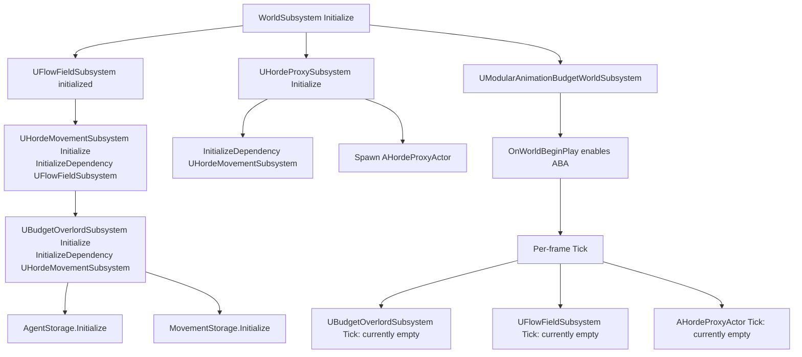
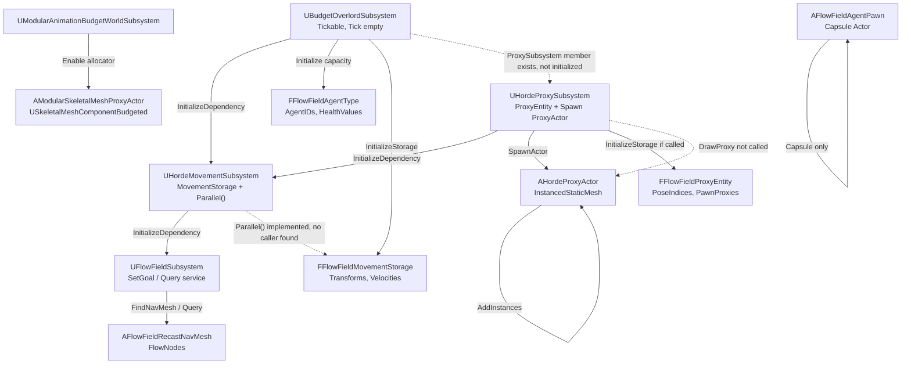
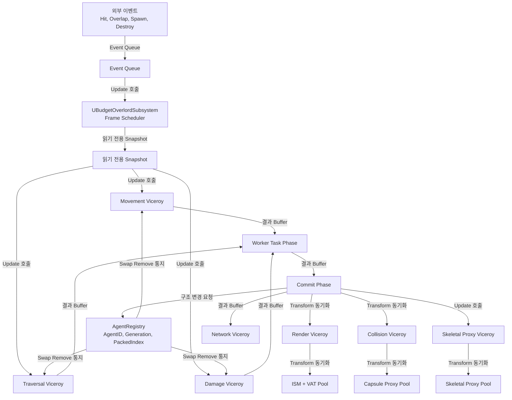
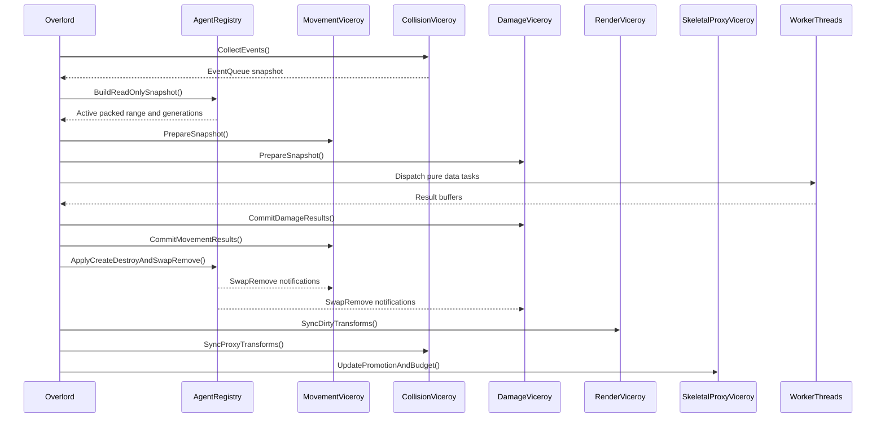
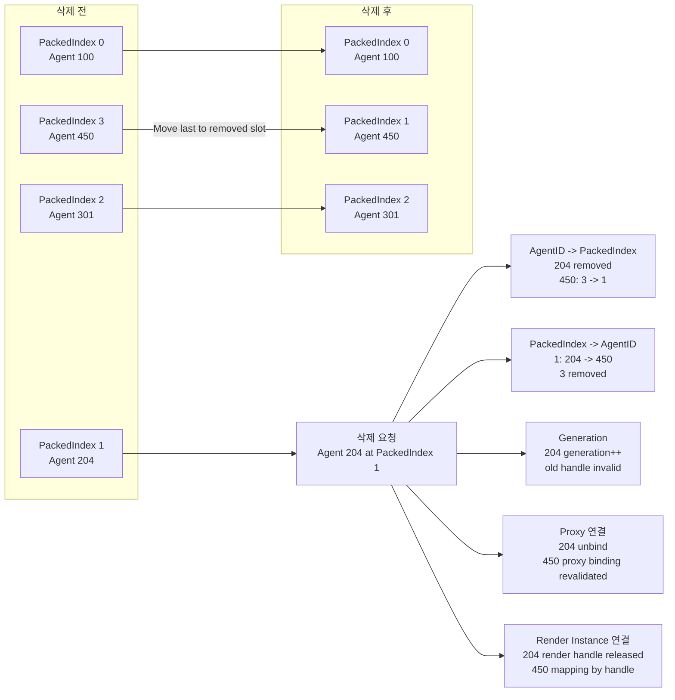
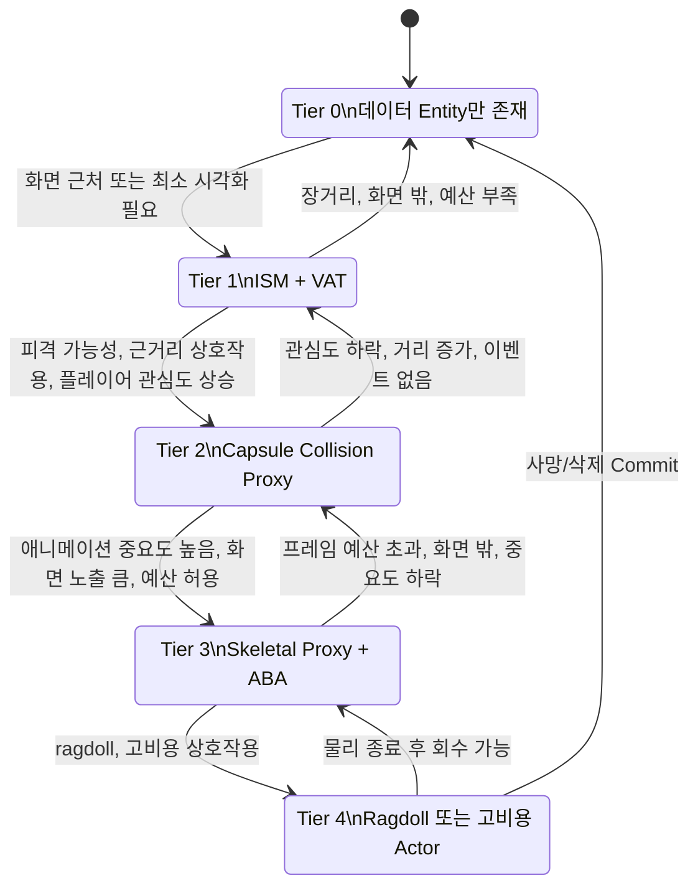

# Centralized Entity Architecture Review

## 1. 분석 대상과 전제

[확인된 사실]

- 이 문서는 2026-06-30 재평가 시점의 현재 디스크 상태를 기준으로 작성했다.
- 분석 대상은 `OutBreak.uproject` 기준 Unreal Engine `5.7` 프로젝트다.
- 주요 분석 범위는 `Source/OutBreak/Public/FlowField`, `Source/OutBreak/Private/FlowField`, `Config/DefaultEngine.ini`, `Config/DefaultGame.ini`, `OutBreak.uproject`, `Source/OutBreak/OutBreak.Build.cs`이다.
- 현재 FlowField/Horde 관련 C++ 파일 목록에서 `FlowFieldMovementComponent.h/.cpp`와 `FlowFieldDensityComponent.h/.cpp`는 존재하지 않는다. Git 상태상 삭제된 파일로 표시된다.
- 현재 `UFlowFieldSubsystem`에는 Flow Field 목표 설정과 질의 함수만 남아 있으며, Pawn 생성/삭제 함수와 DensityComponent 등록/해제 함수는 현재 파일에 없다.
- 빌드와 에디터 실행은 수행하지 않았다. 이 보고서는 정적 코드 읽기 기반이다.

[코드 기반 추론]

- 이전 분석에서 언급한 Actor/Component 기반 이동 경로와 Density 분리 경로는 현재 소스 상태에는 존재하지 않는다. 따라서 현재 구조 평가는 SoA 기반 Horde 저장소와 FlowField 질의 서비스, ISM Proxy Actor, Skeletal Proxy Actor 중심으로 다시 수행해야 한다.
- Blueprint와 `.uasset` 내부에 별도 컴포넌트가 남아 있을 수 있으나, 이 문서는 현재 C++ 텍스트에서 확인 가능한 사실만 근거로 삼는다.

[개선 제안]

- 삭제된 파일에 의존하는 설계 판단은 제거하고, 현재 남아 있는 코드의 책임 경계와 미연결 지점을 기준으로 아키텍처 개선 순서를 잡아야 한다.

## 2. 핵심 결론

[확인된 사실]

- `UBudgetOverlordSubsystem`은 현재 Overlord 역할 후보이지만 `Tick()`에서 어떤 Viceroy도 호출하지 않는다.
- `UBudgetOverlordSubsystem` 헤더에는 `MovementSubsystem`과 `ProxySubsystem` 멤버가 선언되어 있으나, `.cpp`에서는 `UHordeMovementSubsystem`만 `InitializeDependency`로 초기화한다.
- `ProxySubsystem`은 Overlord에서 초기화되지 않고, `ProxySubsystem->InitializeStorage()` 또는 `DrawProxy()` 호출도 없다.
- `UHordeMovementSubsystem::Parallel()`에는 SoA 배열 기반 `ParallelFor` 이동 계산이 구현되어 있으나 현재 호출 사용처가 확인되지 않는다.
- `UHordeProxySubsystem`은 자체 `Initialize()`에서 `AHordeProxyActor`를 Spawn하지만, Overlord 실행 순서와 연결되지 않는다.
- `AHordeProxyActor::Parallel()` 내부의 `UpdateInstanceTransform`/`BatchUpdateInstancesTransforms` 호출은 현재 주석 처리되어 있다. 빌드 오류로 단정할 수는 없지만 렌더 Transform 갱신 경로는 미구현 상태다.
- `UFlowFieldSubsystem`은 `UTickableWorldSubsystem`이지만 현재 `Tick()` 본문은 `Super::Tick(DeltaTime)`만 수행한다.
- `AFlowFieldAgentPawn`은 이름과 달리 `AActor`를 상속하며, C++ 생성자에서 `UCapsuleComponent`만 생성한다.
- 안정적인 `AgentHandle`, `Generation`, `Free List`, `AgentID -> PackedIndex`, `PackedIndex -> AgentID` 매핑은 구현되어 있지 않다.
- Agent 저장소에 생성/삭제 API, active count, `RemoveAtSwap` 기반 동기화, 구조 변경 Commit 단계는 없다.
- FlowField/Horde 범위에서 Event Queue, Commit Queue, Snapshot, Result Buffer는 확인되지 않는다.
- `AnimationBudgetAllocator` 플러그인과 모듈은 활성화되어 있고, `AModularSkeletalMeshProxyActor`는 `USkeletalMeshComponentBudgeted`를 사용한다. 그러나 Agent와 연결된 Skeletal Proxy Pool이나 최대 개수 제한은 없다.

[코드 기반 추론]

- 현재 구조는 중앙 집권형 Agent 파이프라인이 아니라, 초기 SoA 저장소와 Viceroy 후보 클래스가 만들어졌지만 실제 frame pipeline에 연결되지 않은 상태다.
- 현재 C++ 기준으로 대규모 Agent의 실제 이동 업데이트가 실행된다고 볼 수 있는 경로는 확인되지 않는다. `UHordeMovementSubsystem::Parallel()`은 구현되어 있지만 호출되지 않는다.
- `UHordeProxySubsystem`이 `AHordeProxyActor`를 직접 Spawn하는 경로는 존재하지만, instance 생성/갱신/삭제를 Agent 수명과 연결하는 mapping이 없다.

[개선 제안]

- 첫 개선 순서는 `AgentRegistry/Handle`, `Overlord Tick 실행 순서`, `Movement/Proxy Viceroy 연결`, `Render Instance mapping`, `Commit 단계` 순서가 적합하다.

## 3. 현재 프로젝트 구조 요약

| 영역 | 파일 | 클래스/구조체 | 현재 역할 |
| --- | --- | --- | --- |
| Overlord 후보 | `Source/OutBreak/Public/FlowField/BudgetOverlordSubsystem.h` | `UBudgetOverlordSubsystem` | AgentStorage와 MovementStorage 초기화, Tick은 비어 있음 |
| Movement Viceroy 후보 | `Source/OutBreak/Public/FlowField/Subsystem/HordeMovementSubsystem.h` | `UHordeMovementSubsystem` | `FFlowFieldMovementStorage` 보유, `Parallel()` 계산 구현 |
| Proxy/Render Viceroy 후보 | `Source/OutBreak/Public/FlowField/Subsystem/HordeProxySubsystem.h` | `UHordeProxySubsystem` | `AHordeProxyActor` Spawn, `FFlowFieldProxyEntity` 보유 |
| Render Actor | `Source/OutBreak/Public/FlowField/HordeProxyActor.h` | `AHordeProxyActor` | `UInstancedStaticMeshComponent` 보유, AddInstances 제공 |
| Agent 저장소 | `Source/OutBreak/Public/FlowField/Struct/FlowFieldAgentType.h` | `FFlowFieldAgentType`, `FFlowFieldMovementStorage`, `FFlowFieldProxyEntity` | Capacity 기반 SoA 배열 |
| FlowField 질의 | `Source/OutBreak/Public/FlowField/Subsystem/FlowFieldSubsystem.h` | `UFlowFieldSubsystem` | SetGoal, QueryDirection, QueryConstrainedMove, QueryNavLink |
| Capsule Actor | `Source/OutBreak/Public/FlowField/FlowFieldAgentPawn.h` | `AFlowFieldAgentPawn` | Capsule만 가진 `AActor` |
| Flow graph | `Source/OutBreak/Public/FlowField/FlowFieldRecastNavMesh.h` | `AFlowFieldRecastNavMesh` | FlowNodes, integration cost, nav link traversal bake |
| Skeletal Proxy | `Source/OutBreak/Public/FlowField/ModularSkeletalMeshProxyActor.h` | `AModularSkeletalMeshProxyActor` | Budgeted Skeletal Mesh Component 보유 |
| Animation Budget | `Source/OutBreak/Public/FlowField/ModularAnimationBudgetWorldSubsystem.h` | `UModularAnimationBudgetWorldSubsystem` | GameWorld에서 Animation Budget Allocator 활성화 |

## 4. 시스템 설계 의도와 현재 구현 비교

| 설계 의도 | 현재 구현 | 평가 |
| --- | --- | --- |
| Overlord가 Viceroy 실행 순서 관리 | `UBudgetOverlordSubsystem::Tick()`이 비어 있음 | 미충족 |
| 기능별 Viceroy가 Overlord 호출로만 업데이트 | `UHordeMovementSubsystem`은 자체 Tick이 없지만 Overlord에서도 호출되지 않음. `UHordeProxySubsystem`은 자체 Initialize에서 Actor Spawn | 부분 충족 |
| Agent를 데이터 Entity로 관리 | SoA 구조체는 있으나 생성/삭제/active count/registry가 없음 | 미충족 |
| 같은 Agent 데이터가 여러 저장소에서 정확히 대응 | 공통 Handle, mapping, swap 통지 없음 | 미충족 |
| ISM + VAT 중심 시각화 | ISM Actor는 있으나 VAT 전달, instance mapping, transform batch update 미구현 | 미충족 |
| 일부 Agent만 Skeletal Proxy + ABA | ABA Actor는 있으나 Agent 중요도 기반 Pool/연결 없음 | 부분 충족 |
| Collision Proxy 이벤트를 Queue에 삽입 | Capsule Actor는 있으나 collision delegate나 queue 없음 | 미충족 |
| 순수 데이터 병렬 계산 | `UHordeMovementSubsystem::Parallel()` 내부 `ParallelFor`는 있음. 호출/Barrier/Commit 없음 | 부분 충족 |

## 5. 클래스별 책임 분석

### `UBudgetOverlordSubsystem`

[확인된 사실]

- 파일: `Source/OutBreak/Public/FlowField/BudgetOverlordSubsystem.h`, `Source/OutBreak/Private/FlowField/BudgetOverlordSubsystem.cpp`
- 클래스: `UBudgetOverlordSubsystem`
- 함수: `Initialize`, `Tick`, `InitializeViceroy`
- 멤버: `MovementSubsystem`, `ProxySubsystem`, `AgentStorage`
- `Initialize()`는 `MovementSubsystem = Collection.InitializeDependency<UHordeMovementSubsystem>()`만 수행한다.
- `ProxySubsystem`은 헤더에 선언되어 있지만 `.cpp`에서 초기화되지 않는다.
- `InitializeViceroy()`는 `AgentStorage.Initialize(Capacity)`와 `MovementSubsystem->InitializeStorage(Capacity)`만 호출한다.
- `Tick()`은 `Super::Tick(DeltaTime)`만 호출한다.

[코드 기반 추론]

- 현재 Overlord 후보는 존재하지만 "중앙 스케줄러"로 기능하지 않는다.
- `ProxySubsystem` 멤버가 추가되었지만 Overlord 초기화/프레임 순서에 연결되지 않아 Render/Proxy Viceroy가 중앙 관리 대상이 아니다.

[개선 제안]

- `MovementSubsystem`, `ProxySubsystem`을 모두 명시적으로 초기화하고, 초기화 성공 이후에만 `InitializeViceroy()`가 각 저장소를 준비하도록 해야 한다.
- Tick에서는 최소한 `CollectEvents -> Movement -> Barrier -> Commit -> Render/Proxy Sync` 순서의 skeleton을 먼저 확정해야 한다.

### `UHordeMovementSubsystem`

[확인된 사실]

- 파일: `Source/OutBreak/Public/FlowField/Subsystem/HordeMovementSubsystem.h`, `Source/OutBreak/Private/FlowField/Subsystem/HordeMovementSubsystem.cpp`
- 클래스: `UHordeMovementSubsystem`
- 함수: `Initialize`, `InitializeStorage`, `Parallel`
- 멤버: `MovementStorage`, `FlowFieldSubsystem`
- `Initialize()`는 `FlowFieldSubsystem = Collection.InitializeDependency<UFlowFieldSubsystem>()`를 호출한다.
- `Parallel()`은 Game Thread에서 `FlowFieldSubsystem->QueryDirection()`을 `MovementStorage.Size()`만큼 순차 호출한 뒤, `ParallelFor`에서 Transform/Velocity 배열을 갱신한다.
- `Parallel()`은 `protected`이고 `UBudgetOverlordSubsystem`, `UHordeProxySubsystem`이 friend다.
- 현재 코드 검색상 `Parallel()` 호출자는 없다.

[코드 기반 추론]

- Worker Thread 람다 내부에는 UObject 접근이 보이지 않아 데이터 병렬화 방향은 적절하다.
- 그러나 FlowField 질의를 모든 배열 원소에 대해 Game Thread에서 수행한다. `MovementStorage.Size()`는 active count가 아니라 `Transforms.Num()`이고, `Initialize(Capacity)` 이후 Capacity 전체가 계산 대상이 된다.

[개선 제안]

- `ActiveCount` 또는 Registry에서 받은 dense active range를 사용해야 한다.
- FlowField 질의와 이동 계산 결과를 Snapshot/Result Buffer로 나누어야 한다.

### `UHordeProxySubsystem`

[확인된 사실]

- 파일: `Source/OutBreak/Public/FlowField/Subsystem/HordeProxySubsystem.h`, `Source/OutBreak/Private/FlowField/Subsystem/HordeProxySubsystem.cpp`
- 클래스: `UHordeProxySubsystem`
- 함수: `Initialize`, `InitializeStorage`, `DrawProxy`
- 멤버: `ProxyEntity`, `HordeProxy`, `MovementSubsystem`
- `Initialize()`는 `UHordeMovementSubsystem`을 dependency로 초기화한다.
- `Initialize()`는 `Settings->GetProxySkeletalMesh()`를 호출해 `USkeletalMesh* SkeletalMesh` 지역 변수를 만들지만 이후 사용하지 않는다.
- `Initialize()`는 `World->SpawnActor<AHordeProxyActor>()`를 호출한다.
- `InitializeStorage()`는 `ProxyEntity.Initialize(Capacity)`만 수행한다.
- `DrawProxy()`는 `MovementSubsystem->MovementStorage.Transforms` 전체를 `HordeProxy->AddInstances(Transforms)`에 전달한다.
- 현재 코드 검색상 `DrawProxy()` 호출자는 없다.

[코드 기반 추론]

- `UHordeProxySubsystem`은 Render/Proxy Viceroy 후보지만 Overlord에서 등록/호출되지 않는다.
- `DrawProxy()`가 호출될 경우 MovementStorage 배열 순서와 ISM instance 생성 순서가 암묵적으로 결합된다.
- `ProxyEntity`의 `PawnProxies`는 `APawn` weak pointer 배열이지만 현재 `AFlowFieldAgentPawn`은 `AActor` 상속이라 C++ 타입 설계가 맞지 않는다.

[개선 제안]

- `ProxyEntity`는 AgentHandle 기반 proxy binding으로 바꾸고, Actor 타입도 `AActor` 또는 명시적 proxy base class로 정리해야 한다.
- Render Instance와 Agent PackedIndex를 직접 연결하지 말고 별도 `RenderInstanceHandle`을 둔다.

### `AHordeProxyActor`

[확인된 사실]

- 파일: `Source/OutBreak/Public/FlowField/HordeProxyActor.h`, `Source/OutBreak/Private/FlowField/HordeProxyActor.cpp`
- 클래스: `AHordeProxyActor`
- 함수: `AddInstances`, `Parallel`, `Tick`
- 멤버: `InstancedStaticMesh`, `InstanceIds`
- 생성자에서 `UInstancedStaticMeshComponent`를 생성한다.
- `AddInstances()`는 `InstancedStaticMesh->AddInstances(Transforms, true, bWorldSpace)` 반환값을 `InstanceIds`에 저장한다.
- `Parallel()` 내부의 transform update 관련 호출은 주석 처리되어 있다.
- `Tick()`은 `Super::Tick(DeltaTime)`만 수행한다.

[코드 기반 추론]

- 기존 평가의 "구문상 미완성으로 빌드 실패 가능" 판단은 현재 코드 기준으로는 철회한다. 현재는 주석 처리된 placeholder로 보는 것이 정확하다.
- 다만 runtime transform batch update 경로는 여전히 구현되어 있지 않다.

[개선 제안]

- `AddInstances()`는 초기 생성에만 사용하고, 이후 transform 갱신은 dirty list 기반 batch update로 분리한다.

### `UFlowFieldSubsystem`

[확인된 사실]

- 파일: `Source/OutBreak/Public/FlowField/Subsystem/FlowFieldSubsystem.h`, `Source/OutBreak/Private/FlowField/Subsystem/FlowFieldSubsystem.cpp`
- 클래스: `UFlowFieldSubsystem`
- 함수: `Tick`, `SetGoal`, `QueryDirection`, `QueryNodeRef`, `QueryConstrainedMove`, `QueryNavLink`, `HasFlowField`, `FindNavMesh`
- `Tick()`은 현재 `Super::Tick(DeltaTime)`만 수행한다.
- `SetGoal()`은 `AFlowFieldRecastNavMesh::BuildFlowField()`를 호출한다.
- `QueryDirection`, `QueryConstrainedMove`, `QueryNavLink`는 `AFlowFieldRecastNavMesh`에 위임한다.
- 헤더에는 `RegisteredDensityComponents`, `PreviousDensityComponentPositions` 멤버가 남아 있으나 현재 cpp에 등록/해제/처리 함수는 없다.
- cpp에는 `ComputeDensity2D()` helper가 남아 있으나 현재 호출되지 않는다.

[코드 기반 추론]

- 현재 `UFlowFieldSubsystem`은 Tickable이지만 실제 Tick 작업이 없다. FlowField query service로만 사용된다.
- Density 관련 멤버와 helper는 삭제된 `FlowFieldDensityComponent`의 잔여 코드로 보인다.

[개선 제안]

- Tickable이 필요 없다면 `UWorldSubsystem`으로 낮추거나, Tick을 유지한다면 Overlord가 호출하는 서비스와의 책임 경계를 명확히 해야 한다.
- 사용되지 않는 Density 잔여 멤버는 향후 정리 대상이다. 현재 작업에서는 수정하지 않는다.

### `AFlowFieldAgentPawn`

[확인된 사실]

- 파일: `Source/OutBreak/Public/FlowField/FlowFieldAgentPawn.h`, `Source/OutBreak/Private/FlowField/FlowFieldAgentPawn.cpp`
- `AFlowFieldAgentPawn`은 `AActor`를 상속한다.
- 생성자에서 `UCapsuleComponent`를 만들고 RootComponent로 설정한다.
- C++ 생성자에서 Movement/Density/Skeletal/ISM 관련 컴포넌트를 생성하지 않는다.
- Tick override는 없다.
- Replication 설정도 현재 C++에서 확인되지 않는다.

[코드 기반 추론]

- 현재 C++ 기준으로 `AFlowFieldAgentPawn`은 "Agent 본체"라기보다 Capsule 기반 proxy 후보에 가깝다.
- 하지만 AgentHandle과 연결되지 않으므로 중앙 Entity proxy로 기능한다고 볼 수는 없다.

[개선 제안]

- `AFlowFieldAgentPawn`을 유지한다면 모든 Agent용 Actor가 아니라 Collision Proxy Pool의 재사용 Actor로 제한해야 한다.

### `AModularSkeletalMeshProxyActor`와 `UModularAnimationBudgetWorldSubsystem`

[확인된 사실]

- `UModularAnimationBudgetWorldSubsystem::OnWorldBeginPlay()`는 Dedicated Server가 아니면 `IAnimationBudgetAllocator::Get(&InWorld)` 후 `Allocator->SetEnabled(true)`를 호출한다.
- `AModularSkeletalMeshProxyActor`는 `USkeletalMeshComponentBudgeted`를 `ABAHead`로 생성하고 RootComponent로 설정한다.
- `ApplyAnimationBudgetSettings()`는 auto register, manual significance, actor rendered flag를 설정한다.
- `SetAnimationSignificance()`와 `SetComponentSignificance()` 경로가 있다.
- Agent와 Skeletal Proxy 사이의 binding, pool, 최대 개수 제한은 확인되지 않는다.

[코드 기반 추론]

- Animation Budget Allocator 사용 준비는 되어 있지만, 대규모 Agent 시스템의 Tier/Pool 제어와 결합되어 있지 않다.

[개선 제안]

- Skeletal Proxy Viceroy는 Agent 중요도 평가, pool cap, ABA significance 갱신을 한 곳에서 수행해야 한다.

## 6. 초기화와 Tick 순서 분석

[확인된 사실]

- `UBudgetOverlordSubsystem::Initialize()`는 `UHordeMovementSubsystem` dependency만 보장한다.
- `UHordeMovementSubsystem::Initialize()`는 `UFlowFieldSubsystem` dependency를 보장한다.
- `UHordeProxySubsystem::Initialize()`는 `UHordeMovementSubsystem` dependency를 보장하고 `AHordeProxyActor`를 Spawn한다.
- `UModularAnimationBudgetWorldSubsystem::OnWorldBeginPlay()`는 Animation Budget Allocator를 활성화한다.
- `UBudgetOverlordSubsystem::Tick()`, `UFlowFieldSubsystem::Tick()`, `AHordeProxyActor::Tick()`은 현재 유의미한 작업을 수행하지 않는다.

[코드 기반 추론]

- Tickable 객체는 존재하지만 중앙 frame pipeline은 없다.
- 현재 상태에서는 이중 이동이 발생한다고 단정할 수 없다. 이동 계산 호출 자체가 확인되지 않기 때문이다.
- 향후 Overlord가 `UHordeMovementSubsystem::Parallel()`을 호출하고 별도 Actor/Proxy 이동을 추가하면 이중 업데이트 위험이 생긴다.

[개선 제안]

- Tick 책임은 `UBudgetOverlordSubsystem`으로 집중하고, 다른 시스템은 Overlord가 호출하는 명시적 함수로 전환하는 것이 목표 구조와 맞다.

### 수명 주기 시각화



## 7. Agent 데이터 소유권 분석

[확인된 사실]

- `FFlowFieldAgentType`는 `FlowQueryAges`, `NetworkUpdateAges`, `AgentIDs`, `HealthValues`, `FlowRevisions`를 저장한다.
- `FFlowFieldMovementStorage`는 `Transforms`, `Velocities`, `CachedFlowDirections`, `MoveSpeeds`, `MovementStates`, `TraversalStates`, `PriorityTiers`를 저장한다.
- `FFlowFieldProxyEntity`는 `PoseIndices`, `PawnProxies`를 저장한다.
- `FFlowFieldAgentType`는 `UBudgetOverlordSubsystem::AgentStorage`에 있다.
- `FFlowFieldMovementStorage`는 `UHordeMovementSubsystem::MovementStorage`에 있다.
- `FFlowFieldProxyEntity`는 `UHordeProxySubsystem::ProxyEntity`에 있다.
- `FFlowFieldAgentType`, `FFlowFieldMovementStorage`, `FFlowFieldProxyEntity` 모두 `Initialize(Capacity)`로 capacity 크기 배열을 채운다.

[코드 기반 추론]

- 데이터 원본이 `AgentStorage`인지 `MovementStorage`인지 명확히 정의되어 있지 않다.
- `AgentIDs` 배열은 있지만 stable ID lifecycle이나 mapping으로 쓰이지 않는다.
- `PawnProxies`는 `APawn` weak pointer인데 현재 C++ Agent actor 후보는 `AActor`다.

[개선 제안]

- AgentRegistry가 Agent 수명과 packed mapping의 유일한 원본이 되어야 한다.
- Viceroy 저장소는 Registry의 packed index 변화 통지를 받는 소비자로 내려야 한다.

## 8. 생성과 삭제 및 Swap Remove 분석

[확인된 사실]

- 현재 SoA 저장소에는 Agent 생성 API가 없다.
- 현재 SoA 저장소에는 Agent 삭제 API가 없다.
- active count, free list, generation, swap remove 통지 함수가 없다.
- `RemoveAtSwap`은 `AFlowFieldRecastNavMesh::CalculateIntegrationCosts()`의 open set 처리에서만 확인된다. Agent 저장소에는 사용되지 않는다.

[코드 기반 추론]

- 현재 코드만으로 Agent 삭제 방식이 안전한지 평가할 실제 삭제 경로가 없다.
- 하지만 생성/삭제가 추가되면 지금 구조로는 모든 저장소 동기화, proxy binding, render mapping, queue invalidation을 보장할 수 없다.

[개선 제안]

- 생성/삭제는 즉시 실행이 아니라 Overlord Commit 단계에서만 처리해야 한다.
- 삭제 시 마지막 packed entry를 이동하고, Registry와 모든 Viceroy 저장소에 `SwapRemove` 통지를 보내야 한다.

## 9. Handle과 인덱스 안정성 분석

[확인된 사실]

- `using AgentID = int32`가 존재한다.
- `AgentHandle`, `Generation`, `PackedIndex`, `FreeList`, `AgentIDToPackedIndex`, `PackedIndexToAgentID` 구조는 확인되지 않는다.
- `UHordeMovementSubsystem::Parallel()`은 `AgentIndex`를 배열 index로 직접 사용한다.
- `AHordeProxyActor`는 `InstanceIds`를 저장하지만 Agent와 instance 사이의 역방향 mapping은 없다.

[코드 기반 추론]

- 현재 배열 index를 외부 영구 식별자로 쓰는 코드가 확인되지는 않는다.
- 그러나 stable handle도 없기 때문에 queue, proxy, render instance, network를 추가할 때 ABA 문제가 발생할 가능성이 높다.

[개선 제안]

```text
AgentHandle = AgentID + Generation
AgentID -> PackedIndex
PackedIndex -> AgentID
AgentID -> Generation
FreeAgentIDs
```

- 모든 event payload, proxy binding, render binding은 배열 index가 아니라 `AgentHandle`을 저장해야 한다.

## 10. 병렬 처리와 Thread 안전성 분석

[확인된 사실]

- `UHordeMovementSubsystem::Parallel()`은 `check(IsInGameThread())`로 시작한다.
- FlowField 방향 질의는 Game Thread에서 순차 수행된다.
- `ParallelFor` 내부는 배열 포인터를 읽고 쓰며 UObject 접근은 확인되지 않는다.
- 구조 변경 API가 없어 병렬 중 삭제 race가 현재 발생한다고 단정할 수는 없다.

[코드 기반 추론]

- 현재 병렬 계산은 안전한 방향으로 작성되어 있지만, 원본 배열을 Worker Thread에서 직접 쓰는 형태다.
- Render/Proxy/Network가 같은 frame에서 어떤 데이터를 읽는지 보장하는 Snapshot/Barrier/Commit 단계가 없다.

[개선 제안]

- Worker Thread는 read-only Snapshot과 write-only Result Buffer만 사용해야 한다.
- 원본 SoA 갱신은 Game Thread Commit에서만 수행해야 한다.

## 11. Event Queue 분석

[확인된 사실]

- FlowField/Horde 코드에서 `TQueue`, `Enqueue`, `Dequeue`, Event Queue 구조는 확인되지 않는다.
- `AFlowFieldAgentPawn`의 CapsuleComponent에 Hit/Overlap delegate를 바인딩하는 코드는 없다.
- 현재 FlowField/Horde 범위에는 DamageViceroy 또는 CollisionViceroy 구현이 없다.

[코드 기반 추론]

- 설계 의도인 "충돌/피격 이벤트를 즉시 처리하지 않고 Queue에 삽입"하는 구조는 아직 없다.
- 향후 Capsule Proxy를 붙이면 delegate 내부에서 직접 처리하지 말고 queue payload로 `AgentHandle`과 event data를 복사해야 한다.

[개선 제안]

```text
수집 Queue
처리용 Snapshot
처리 결과 Buffer
Commit Queue
```

- 현재 확인된 이벤트 생산자는 Game Thread로 시작할 가능성이 높으므로, 초기 구현은 lock-free보다 Game Thread 전용 수집 배열이 적절하다.

## 12. Capsule Proxy 분석

[확인된 사실]

- `AFlowFieldAgentPawn`은 `UCapsuleComponent`를 가진다.
- `AFlowFieldAgentPawn`은 mesh를 만들지 않는다.
- C++ 기준 movement/density component를 만들지 않는다.
- Capsule hit/overlap delegate는 없다.
- `FFlowFieldProxyEntity`는 `TArray<TWeakObjectPtr<APawn>> PawnProxies`를 가진다.

[코드 기반 추론]

- `AFlowFieldAgentPawn`은 목표 설계의 Capsule Proxy 후보지만, 현재 AgentHandle과 연결되지 않았다.
- 모든 Agent에 할당되는 proxy인지, 일부 Agent에만 할당되는 proxy인지 정책이 없다.
- 타입 면에서도 `PawnProxies`와 `AActor` 상속의 `AFlowFieldAgentPawn`이 어긋난다.

[개선 제안]

- Capsule Proxy Pool은 `AgentHandle -> ProxyHandle` mapping을 가져야 한다.
- Proxy 재사용 시 collision state, delegate, timer, owner-specific state를 reset해야 한다.

## 13. ISM 및 VAT 렌더링 분석

[확인된 사실]

- `AHordeProxyActor`가 `UInstancedStaticMeshComponent`를 보유한다.
- `UHordeProxySubsystem::DrawProxy()`는 MovementStorage의 `Transforms` 전체를 `AddInstances()`에 넘긴다.
- `DrawProxy()` 호출자는 확인되지 않는다.
- `AHordeProxyActor::Parallel()`의 transform update 코드는 주석 처리되어 있다.
- VAT 상태를 per-instance custom data 등으로 전달하는 코드는 확인되지 않는다.
- ISM instance 삭제나 재배치 처리 코드는 확인되지 않는다.

[코드 기반 추론]

- 현재 구조는 "초기 instance 추가"까지만 초안으로 존재하고, frame별 transform 동기화 및 Agent lifecycle 대응은 없다.
- Agent PackedIndex와 ISM Instance Index를 같은 값으로 쓰는 코드는 명시되어 있지 않지만, `Transforms` 배열 전체를 그대로 `AddInstances`에 넣는 구조는 순서 결합 위험을 만든다.

[개선 제안]

```text
AgentHandle -> RenderInstanceHandle
RenderInstanceHandle -> ISM Instance Index
ISM Instance Index -> RenderInstanceHandle
RenderInstanceHandle -> AgentHandle
```

- VAT pose/frame 정보는 `FFlowFieldProxyEntity::PoseIndices`와 Render instance custom data를 명시적으로 연결해야 한다.

## 14. Skeletal Mesh와 Animation Budget 분석

[확인된 사실]

- `OutBreak.uproject`에서 `AnimationBudgetAllocator`와 `AnimToTexture` 플러그인이 활성화되어 있다.
- `OutBreak.Build.cs`는 `AnimationBudgetAllocator` 모듈을 포함한다.
- `UModularAnimationBudgetWorldSubsystem`은 GameWorld에서 Animation Budget Allocator를 활성화한다.
- `AModularSkeletalMeshProxyActor`는 `USkeletalMeshComponentBudgeted`를 사용한다.
- Agent 중요도 조건, proxy pool, 최대 skeletal proxy 수 제한은 구현되어 있지 않다.

[코드 기반 추론]

- ABA 적용 준비는 되어 있지만 대규모 Agent tier 시스템과 연결되지 않았다.
- Animation Budget Allocator는 이미 존재하는 skeletal component의 작업량을 줄이는 도구이지, 프로젝트 차원의 proxy 수명/개수 정책을 대신하지 않는다.

[개선 제안]

- `SkeletalProxyViceroy`가 pool cap, 승격/강등, significance 갱신을 담당해야 한다.

## 15. 네트워크 분석

[확인된 사실]

- `OnlineSubsystemSteam`과 Steam NetDriver 설정은 있다.
- FlowField/Horde 관련 클래스에서 `GetLifetimeReplicatedProps`, `Replicated`, `OnRep`, `SetReplicates`, `SetReplicateMovement`는 확인되지 않는다.
- `AFlowFieldAgentPawn`도 현재 C++에서 replication 설정을 하지 않는다.
- PackedIndex를 네트워크 식별자로 쓰는 코드도 확인되지 않는다.

[코드 기반 추론]

- 대규모 Agent 네트워크 복제 구조는 아직 구현되지 않았다.
- 현재 단계에서 네트워크 문제를 구체적 버그로 단정하기보다 향후 설계 고려사항으로 분리하는 것이 맞다.

[개선 제안]

- 네트워크 식별자는 PackedIndex가 아니라 stable AgentID/Generation 또는 서버 발급 NetAgentID를 사용해야 한다.

## 16. 주요 문제점 목록

| 심각도 | 위치 | 확인된 문제 | 발생 가능한 증상 | 원인 | 개선 방향 |
| --- | --- | --- | --- | --- | --- |
| High | `UBudgetOverlordSubsystem::Tick` | Overlord Tick이 비어 있음 | 중앙 집권형 실행 순서가 성립하지 않음 | Frame pipeline 미구현 | Overlord Tick pipeline 작성 |
| High | `UBudgetOverlordSubsystem::Initialize` | `ProxySubsystem` 멤버가 선언됐지만 초기화/사용되지 않음 | Render/Proxy Viceroy가 중앙 관리 밖에 남음 | dependency 등록 누락 | `InitializeDependency<UHordeProxySubsystem>()`와 저장소 초기화 순서 정리 |
| High | `FFlowFieldAgentType`, `FFlowFieldMovementStorage` | 생성/삭제/active count/handle 없음 | 동적 Agent lifecycle 추가 시 index 불일치 | AgentRegistry 부재 | stable handle과 packed mapping 도입 |
| High | `UHordeMovementSubsystem::Parallel` | 구현됐지만 호출자 없음 | Movement 계산이 실제 frame pipeline에 반영되지 않음 | Overlord 호출 누락 | Overlord가 명시 호출 |
| High | `UHordeProxySubsystem::DrawProxy` | Agent와 ISM instance mapping 없음 | 잘못된 instance 갱신/삭제 | Render handle 부재 | RenderInstanceHandle 도입 |
| Medium | `AHordeProxyActor::Parallel` | Transform batch update가 주석 처리됨 | instance 위치 갱신 경로 없음 | placeholder 상태 | dirty transform batch update 구현 |
| Medium | `UFlowFieldSubsystem` | Tickable이나 Tick이 비어 있음 | 불필요한 tickable 책임 | 서비스와 tick 책임 혼재 | tick 제거 또는 Overlord 연동 |
| Medium | `UFlowFieldSubsystem` | Density 관련 멤버/helper 잔존 | 유지보수 혼선 | 삭제된 component 흔적 | 향후 정리 |
| Medium | `FFlowFieldProxyEntity` | `APawn` proxy 배열과 `AFlowFieldAgentPawn : AActor` 타입 불일치 | proxy binding 설계 혼선 | proxy base type 미정 | proxy type/handle 계약 정리 |
| Medium | FlowField/Horde 전체 | Event Queue 없음 | 충돌/피격 이벤트 commit 검증 불가 | Collision/Damage Viceroy 미구현 | queue/snapshot/result/commit 구조 도입 |
| Medium | Skeletal Proxy | Agent 연결 pool과 cap 없음 | 고비용 skeletal proxy 과다 생성 가능 | SkeletalProxyViceroy 부재 | pool cap과 tier 정책 |
| Low | `HordeProxySubsystem::Initialize` | `SkeletalMesh` 지역 변수 미사용 | 유지보수 혼선 | asset 준비 코드 미연결 | 사용 의도 확정 |

## 17. 권장 목표 아키텍처

[개선 제안]

```text
UBudgetOverlordSubsystem
 ├─ AgentRegistry
 ├─ MovementViceroy        기존 UHordeMovementSubsystem 확장
 ├─ TraversalViceroy       현재 별도 구현 없음
 ├─ DamageViceroy          현재 별도 구현 없음
 ├─ CollisionViceroy       AFlowFieldAgentPawn 기반 Capsule Proxy Pool 후보
 ├─ RenderViceroy          기존 UHordeProxySubsystem/AHordeProxyActor 정리
 ├─ SkeletalProxyViceroy   기존 AModularSkeletalMeshProxyActor Pool 관리
 ├─ NetworkViceroy         향후 snapshot/delta
 └─ DebugViceroy
```

### 동일 PackedIndex 배열 방식과 Sparse Set 방식 비교

| 방식 | 장점 | 단점 | 현재 프로젝트 적합성 |
| --- | --- | --- | --- |
| 모든 Viceroy가 동일 PackedIndex 길이 유지 | 구현 단순, direct array access 쉬움 | 기능 없는 Agent도 비용 부담, 삭제 시 모든 저장소 동기화 필요 | `MovementStorage`와 기본 health 정도에만 적합 |
| 기능별 Sparse Set/Pool | Render/Collision/Skeletal 같은 희소 기능에 적합 | mapping과 검증 필요 | 현재 목표 구조에 더 적합 |

## 18. 프레임 업데이트 파이프라인

[개선 제안]

| 단계 | Thread | 책임 |
| --- | --- | --- |
| 1. 외부 이벤트 수집 | Game Thread | hit/overlap/spawn/destroy request 수집 |
| 2. 생성/삭제 요청 수집 | Game Thread | 즉시 구조 변경 금지 |
| 3. 읽기 전용 Snapshot 확정 | Game Thread | active packed range와 generation 확정 |
| 4. 이동/상태 계산 | Worker Thread | 순수 데이터 계산, result buffer 기록 |
| 5. Barrier | Game Thread | worker 완료 대기 |
| 6. 결과 Commit | Game Thread | movement/damage/traversal 결과 반영 |
| 7. 구조 변경 적용 | Game Thread | create/destroy/swap remove |
| 8. Render Transform 동기화 | Render Thread에 전달되는 Game Thread 작업 | ISM dirty transform batch update |
| 9. Skeletal Proxy 중요도 결정 | Game Thread | 승격/강등, ABA significance |
| 10. Collision Proxy Transform 동기화 | Game Thread | capsule proxy 위치 갱신 |
| 11. Network 출력 생성 | Game Thread | snapshot/delta 작성 |

## 19. 단계별 마이그레이션 계획

### 1단계: Agent 식별자와 수명 규칙 확정

- 목표: `AgentID`, `Generation`, `PackedIndex` 의미 분리
- 영향받는 클래스: `UBudgetOverlordSubsystem`, `FFlowFieldAgentType`
- 변경해야 할 책임: Agent 생성/삭제 권한을 AgentRegistry로 집중
- 선행 조건: 현재 capacity 기반 배열 사용처 정리
- 검증 방법: 500개 생성, 100개 삭제, stale handle 거부 로그
- 실패 시 발생 가능한 문제: stale event가 새 Agent에 적용

### 2단계: 데이터 소유권 확정

- 목표: Transform/Velocity/Health 원본 위치 확정
- 영향받는 클래스: `UHordeMovementSubsystem`, `FFlowFieldAgentType`
- 변경해야 할 책임: 원본 SoA와 출력/캐시 데이터 분리
- 선행 조건: AgentRegistry 도입
- 검증 방법: 같은 Agent의 데이터 원본이 하나인지 debug 출력
- 실패 시 발생 가능한 문제: 저장소 간 상태 불일치

### 3단계: Overlord 실행 순서 구현

- 목표: Viceroy update를 `UBudgetOverlordSubsystem::Tick()`에서 명시 호출
- 영향받는 클래스: `UBudgetOverlordSubsystem`, `UHordeMovementSubsystem`, `UHordeProxySubsystem`
- 변경해야 할 책임: `Parallel`, `DrawProxy` 같은 protected 작업을 Overlord 호출 단계로 연결
- 선행 조건: Viceroy 등록 순서 확정
- 검증 방법: frame별 phase 로그
- 실패 시 발생 가능한 문제: 미호출 시스템 또는 이중 호출

### 4단계: 구조 변경 Commit 단계 분리

- 목표: 병렬 계산 중 배열 구조 변경 금지
- 영향받는 클래스: AgentRegistry, 모든 Viceroy
- 변경해야 할 책임: create/destroy request buffering
- 선행 조건: result buffer 도입
- 검증 방법: 병렬 이동 계산 중 삭제 요청 테스트
- 실패 시 발생 가능한 문제: 메모리 손상 또는 index 불일치

### 5단계: Queue의 Handle 안정성 확보

- 목표: event payload가 raw index/UObject pointer에 의존하지 않게 함
- 영향받는 클래스: CollisionViceroy, DamageViceroy
- 변경해야 할 책임: `AgentHandle` 기반 queue payload
- 선행 조건: generation validation
- 검증 방법: 삭제 직전 생성된 hit event 처리
- 실패 시 발생 가능한 문제: ABA 피해 적용

### 6단계: Viceroy 저장소 동기화

- 목표: Swap Remove 통지로 모든 dense 저장소 정렬
- 영향받는 클래스: MovementViceroy, DamageViceroy, TraversalViceroy
- 변경해야 할 책임: `OnAgentMoved(FromIndex, ToIndex, AgentHandle)` 처리
- 선행 조건: Registry swap event
- 검증 방법: 마지막 Agent가 중간 index로 이동하는 케이스
- 실패 시 발생 가능한 문제: Movement/Health/Proxy index 불일치

### 7단계: 렌더링 Instance 매핑 분리

- 목표: Agent PackedIndex와 ISM Instance Index 분리
- 영향받는 클래스: `UHordeProxySubsystem`, `AHordeProxyActor`
- 변경해야 할 책임: RenderInstanceHandle, dirty transform batch
- 선행 조건: AgentHandle stable validation
- 검증 방법: ISM instance 연결 Agent 삭제
- 실패 시 발생 가능한 문제: 잘못된 instance 갱신

### 8단계: Collision Proxy Pool 적용

- 목표: Capsule Proxy를 필요한 Agent에만 할당
- 영향받는 클래스: `AFlowFieldAgentPawn`, CollisionViceroy
- 변경해야 할 책임: proxy reset, delegate clear, binding 관리
- 선행 조건: AgentHandle과 ProxyHandle mapping
- 검증 방법: proxy 연결 Agent 삭제 후 재할당
- 실패 시 발생 가능한 문제: 이전 Agent 상태 잔존

### 9단계: Skeletal Proxy Tier 적용

- 목표: Skeletal Proxy 수를 ABA 외부에서 제한
- 영향받는 클래스: `AModularSkeletalMeshProxyActor`, SkeletalProxyViceroy
- 변경해야 할 책임: pool cap, significance, 승격/강등
- 선행 조건: Render/Collision tier 정보
- 검증 방법: 예산 초과 시 Tier 강등
- 실패 시 발생 가능한 문제: skeletal component 과다 생성

### 10단계: 병렬 처리 범위 확장

- 목표: 순수 데이터 계산만 Worker Thread로 확대
- 영향받는 클래스: MovementViceroy, DamageViceroy, TraversalViceroy
- 변경해야 할 책임: UObject 접근 제거, result buffer 기록
- 선행 조건: Snapshot/Commit 구조
- 검증 방법: Insights task trace
- 실패 시 발생 가능한 문제: thread unsafe 접근

### 11단계: CPU 예산 시스템 적용

- 목표: query/render/proxy/skeletal 갱신 빈도 예산화
- 영향받는 클래스: Overlord, 각 Viceroy
- 변경해야 할 책임: priority tier와 frame budget 적용
- 선행 조건: 측정 지표 도입
- 검증 방법: 최대 frame spike 측정
- 실패 시 발생 가능한 문제: 평균 FPS는 높지만 spike 발생

### 12단계: 네트워크 결합

- 목표: stable ID 기반 snapshot/delta 설계
- 영향받는 클래스: NetworkViceroy, AgentRegistry
- 변경해야 할 책임: PackedIndex를 네트워크 식별자로 사용하지 않음
- 선행 조건: Agent lifecycle 안정화
- 검증 방법: Client late join 복구
- 실패 시 발생 가능한 문제: client가 다른 Agent 상태를 복구

## 20. 검증 및 성능 측정 계획

### 기능 검증 시나리오

| 시나리오 | 확인할 내용 |
| --- | --- |
| Agent 500개 생성 | active count, AgentID, PackedIndex, Generation |
| 무작위 Agent 100개 삭제 | generation 증가와 stale handle 무효화 |
| 삭제와 생성 반복 | free list 재사용 안전성 |
| 마지막 Agent가 중간 인덱스로 이동 | 모든 Viceroy mapping 갱신 |
| 삭제 직전 생성된 Hit Event 처리 | stale handle 거부 |
| Proxy 연결 Agent 삭제 | proxy binding 해제와 reset |
| ISM Instance 연결 Agent 삭제 | render mapping 갱신 |
| Skeletal Proxy 연결 Agent 삭제 | ABA component unbind와 pool 반환 |
| 병렬 이동 계산 중 삭제 요청 | Commit까지 구조 변경 지연 |
| World 종료 중 Queue 잔존 | queue discard/drain 정책 |
| Client 늦은 접속 | snapshot 복구 |
| 프레임 예산 초과 | Tier 강등과 query throttle |

### 로그/디버그 권장 필드

```text
AgentID
PackedIndex
Generation
Render Instance Index
Collision Proxy Index
Skeletal Proxy Index
Movement Update Frame
Render Update Frame
마지막 구조 변경 Frame
Handle 유효성
Queue Event 수
삭제 요청 수
```

### 성능 측정 지표

```text
Overlord Tick 시간
각 Viceroy 계산 시간
Worker Task 총 시간
Game Thread Commit 시간
ISM Transform Update 시간
Skeletal Proxy Update 시간
Collision Proxy Update 시간
Queue 처리량
프레임당 생성 및 삭제 수
Swap Remove 수
Agent당 평균 CPU 비용
최대 Frame Spike
```

[개선 제안]

- Unreal Insights: Overlord/Viceroy/Worker/Commit phase에 profiler scope를 넣는다.
- CSV Profiler: frame별 Viceroy timing과 생성/삭제 수를 기록한다.
- Stat 명령: Horde 전용 stat group을 추가해 실시간 확인한다.

## 21. Mermaid 다이어그램

### 현재 구조 다이어그램



### 목표 구조 다이어그램



### 프레임 실행 Sequence Diagram



### Agent 삭제와 Swap Remove 다이어그램



### Tier 기반 시각화 상태 전이



## 22. Draw.io XML

아래 XML은 Draw.io의 `Arrange -> Insert -> Advanced -> XML`로 가져올 수 있는 목표 아키텍처 예시다.

```xml
<mxfile host="app.diagrams.net">
  <diagram id="centralized-entity-architecture" name="Target Architecture">
    <mxGraphModel dx="1440" dy="900" grid="1" gridSize="10" guides="1" tooltips="1" connect="1" arrows="1" fold="1" page="1" pageScale="1" pageWidth="1400" pageHeight="900" math="0" shadow="0">
      <root>
        <mxCell id="0" />
        <mxCell id="1" parent="0" />
        <mxCell id="overlord" value="Overlord" style="rounded=1;whiteSpace=wrap;html=1;fillColor=#dae8fc;strokeColor=#6c8ebf;" vertex="1" parent="1">
          <mxGeometry x="560" y="60" width="180" height="60" as="geometry" />
        </mxCell>
        <mxCell id="registry" value="Agent Registry" style="rounded=1;whiteSpace=wrap;html=1;fillColor=#d5e8d4;strokeColor=#82b366;" vertex="1" parent="1">
          <mxGeometry x="560" y="180" width="180" height="60" as="geometry" />
        </mxCell>
        <mxCell id="movement" value="Movement Viceroy" style="rounded=1;whiteSpace=wrap;html=1;fillColor=#fff2cc;strokeColor=#d6b656;" vertex="1" parent="1">
          <mxGeometry x="120" y="320" width="170" height="60" as="geometry" />
        </mxCell>
        <mxCell id="traversal" value="Traversal Viceroy" style="rounded=1;whiteSpace=wrap;html=1;fillColor=#fff2cc;strokeColor=#d6b656;" vertex="1" parent="1">
          <mxGeometry x="320" y="320" width="170" height="60" as="geometry" />
        </mxCell>
        <mxCell id="collision" value="Collision Viceroy" style="rounded=1;whiteSpace=wrap;html=1;fillColor=#fff2cc;strokeColor=#d6b656;" vertex="1" parent="1">
          <mxGeometry x="520" y="320" width="170" height="60" as="geometry" />
        </mxCell>
        <mxCell id="damage" value="Damage Viceroy" style="rounded=1;whiteSpace=wrap;html=1;fillColor=#fff2cc;strokeColor=#d6b656;" vertex="1" parent="1">
          <mxGeometry x="720" y="320" width="170" height="60" as="geometry" />
        </mxCell>
        <mxCell id="render" value="Render Viceroy" style="rounded=1;whiteSpace=wrap;html=1;fillColor=#fff2cc;strokeColor=#d6b656;" vertex="1" parent="1">
          <mxGeometry x="920" y="320" width="170" height="60" as="geometry" />
        </mxCell>
        <mxCell id="skeletal" value="Skeletal Proxy Viceroy" style="rounded=1;whiteSpace=wrap;html=1;fillColor=#fff2cc;strokeColor=#d6b656;" vertex="1" parent="1">
          <mxGeometry x="1120" y="320" width="190" height="60" as="geometry" />
        </mxCell>
        <mxCell id="network" value="Network Viceroy" style="rounded=1;whiteSpace=wrap;html=1;fillColor=#fff2cc;strokeColor=#d6b656;" vertex="1" parent="1">
          <mxGeometry x="720" y="500" width="170" height="60" as="geometry" />
        </mxCell>
        <mxCell id="worker" value="Worker Task Phase" style="rounded=1;whiteSpace=wrap;html=1;fillColor=#e1d5e7;strokeColor=#9673a6;" vertex="1" parent="1">
          <mxGeometry x="280" y="500" width="190" height="60" as="geometry" />
        </mxCell>
        <mxCell id="commit" value="Commit Phase" style="rounded=1;whiteSpace=wrap;html=1;fillColor=#f8cecc;strokeColor=#b85450;" vertex="1" parent="1">
          <mxGeometry x="520" y="500" width="170" height="60" as="geometry" />
        </mxCell>
        <mxCell id="ism" value="ISM + VAT Pool" style="rounded=1;whiteSpace=wrap;html=1;fillColor=#d5e8d4;strokeColor=#82b366;" vertex="1" parent="1">
          <mxGeometry x="920" y="650" width="170" height="60" as="geometry" />
        </mxCell>
        <mxCell id="capsule" value="Capsule Proxy Pool" style="rounded=1;whiteSpace=wrap;html=1;fillColor=#d5e8d4;strokeColor=#82b366;" vertex="1" parent="1">
          <mxGeometry x="520" y="650" width="170" height="60" as="geometry" />
        </mxCell>
        <mxCell id="skpool" value="Skeletal Proxy Pool" style="rounded=1;whiteSpace=wrap;html=1;fillColor=#d5e8d4;strokeColor=#82b366;" vertex="1" parent="1">
          <mxGeometry x="1120" y="650" width="190" height="60" as="geometry" />
        </mxCell>
        <mxCell id="e1" value="Update 호출" style="endArrow=block;html=1;rounded=0;" edge="1" parent="1" source="overlord" target="movement"><mxGeometry relative="1" as="geometry" /></mxCell>
        <mxCell id="e2" value="Update 호출" style="endArrow=block;html=1;rounded=0;" edge="1" parent="1" source="overlord" target="traversal"><mxGeometry relative="1" as="geometry" /></mxCell>
        <mxCell id="e3" value="Update 호출" style="endArrow=block;html=1;rounded=0;" edge="1" parent="1" source="overlord" target="collision"><mxGeometry relative="1" as="geometry" /></mxCell>
        <mxCell id="e4" value="Update 호출" style="endArrow=block;html=1;rounded=0;" edge="1" parent="1" source="overlord" target="damage"><mxGeometry relative="1" as="geometry" /></mxCell>
        <mxCell id="e5" value="Update 호출" style="endArrow=block;html=1;rounded=0;" edge="1" parent="1" source="overlord" target="render"><mxGeometry relative="1" as="geometry" /></mxCell>
        <mxCell id="e6" value="Update 호출" style="endArrow=block;html=1;rounded=0;" edge="1" parent="1" source="overlord" target="skeletal"><mxGeometry relative="1" as="geometry" /></mxCell>
        <mxCell id="e7" value="읽기 전용 Snapshot" style="endArrow=block;html=1;rounded=0;" edge="1" parent="1" source="registry" target="overlord"><mxGeometry relative="1" as="geometry" /></mxCell>
        <mxCell id="e8" value="결과 Buffer" style="endArrow=block;html=1;rounded=0;" edge="1" parent="1" source="movement" target="worker"><mxGeometry relative="1" as="geometry" /></mxCell>
        <mxCell id="e9" value="결과 Buffer" style="endArrow=block;html=1;rounded=0;" edge="1" parent="1" source="damage" target="worker"><mxGeometry relative="1" as="geometry" /></mxCell>
        <mxCell id="e10" value="결과 Buffer" style="endArrow=block;html=1;rounded=0;" edge="1" parent="1" source="worker" target="commit"><mxGeometry relative="1" as="geometry" /></mxCell>
        <mxCell id="e11" value="구조 변경 요청" style="endArrow=block;html=1;rounded=0;" edge="1" parent="1" source="commit" target="registry"><mxGeometry relative="1" as="geometry" /></mxCell>
        <mxCell id="e12" value="Swap Remove 통지" style="endArrow=block;html=1;rounded=0;" edge="1" parent="1" source="registry" target="movement"><mxGeometry relative="1" as="geometry" /></mxCell>
        <mxCell id="e13" value="Event Queue" style="endArrow=block;html=1;rounded=0;" edge="1" parent="1" source="collision" target="overlord"><mxGeometry relative="1" as="geometry" /></mxCell>
        <mxCell id="e14" value="Transform 동기화" style="endArrow=block;html=1;rounded=0;" edge="1" parent="1" source="render" target="ism"><mxGeometry relative="1" as="geometry" /></mxCell>
        <mxCell id="e15" value="Transform 동기화" style="endArrow=block;html=1;rounded=0;" edge="1" parent="1" source="collision" target="capsule"><mxGeometry relative="1" as="geometry" /></mxCell>
        <mxCell id="e16" value="Transform 동기화" style="endArrow=block;html=1;rounded=0;" edge="1" parent="1" source="skeletal" target="skpool"><mxGeometry relative="1" as="geometry" /></mxCell>
        <mxCell id="e17" value="결과 Buffer" style="endArrow=block;html=1;rounded=0;" edge="1" parent="1" source="commit" target="network"><mxGeometry relative="1" as="geometry" /></mxCell>
      </root>
    </mxGraphModel>
  </diagram>
</mxfile>
```

HTML 시각화 예시는 생략한다. Mermaid와 Draw.io XML이 같은 구조 정보를 제공하고, 현재 상태에서는 별도 HTML이 추가 검증 가치를 제공하지 않는다.

## 23. 최종 권고안

| 질문 | 답변 | 근거 |
| --- | --- | --- |
| 현재 구조에서 Overlord 중앙 집권형 Tick이 실제로 성립하는가? | 아니오 | `UBudgetOverlordSubsystem::Tick()`이 비어 있다. |
| 현재 Viceroy들이 독립적인 시스템으로 분리되어 있으면서도 Agent 데이터 일관성을 유지할 수 있는가? | 아니오 | Registry, handle, mapping, swap 통지가 없다. |
| 현재 Agent 삭제 방식은 안전한가? | 조건부 | SoA Agent 삭제 방식 자체가 구현되어 있지 않아 안전성을 판단할 실행 경로가 없다. 향후 구현 시 현재 구조만으로는 부족하다. |
| 현재 배열 인덱스를 Agent의 영구 식별자로 사용하고 있는가? | 아니오 | 영구 식별자로 외부 노출하는 경로는 확인되지 않는다. 다만 stable handle도 없다. |
| 병렬 처리 도중 구조 변경 가능성이 있는가? | 조건부 | 구조 변경 API가 없어 현재 발생 경로는 없다. 생성/삭제 추가 시 Commit 단계가 필요하다. |
| ISM Instance Index와 Agent PackedIndex를 분리해야 하는가? | 예 | `DrawProxy()`는 Transform 배열 전체를 AddInstances에 넘기므로 동적 삭제/재배치 대응 mapping이 필요하다. |
| Capsule Proxy는 모든 Agent에 필요한가? | 아니오 | 현재 `AFlowFieldAgentPawn`은 Capsule Proxy 후보일 뿐이며, 대규모 구조에서는 관심 대상 Agent에만 필요하다. |
| Skeletal Proxy의 최대 개수를 Animation Budget Allocator 외부에서 제한해야 하는가? | 예 | ABA는 작업량 조절 장치이고 proxy lifecycle/cap 정책을 대신하지 않는다. |
| 현재 구조를 유지한 상태에서 점진적으로 개선할 수 있는가? | 예 | 기존 Overlord/Movement/Proxy/ABA 후보 클래스를 확장 축으로 사용할 수 있다. |
| 가장 먼저 수정해야 할 세 가지 구조적 문제는 무엇인가? | 조건부 | 1. AgentRegistry/Handle/Generation, 2. Overlord Tick pipeline, 3. Render/Proxy mapping과 Commit 단계다. |

최종 권고는 현재 코드를 버리는 것이 아니라, 남아 있는 SoA/Horde 초안을 중앙 실행 파이프라인에 연결하는 것이다. 가장 먼저 식별자와 수명 규칙을 확정하고, 그 다음 Overlord가 실제로 Viceroy를 호출하게 만든 뒤, Render/Proxy/Skeletal 시스템을 AgentHandle 기반 Pool로 붙이는 순서가 안전하다.
