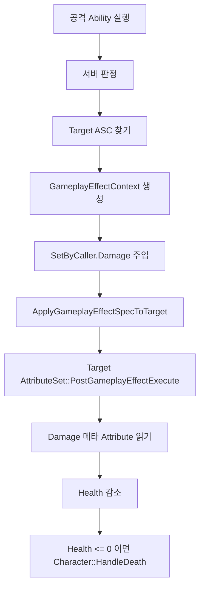
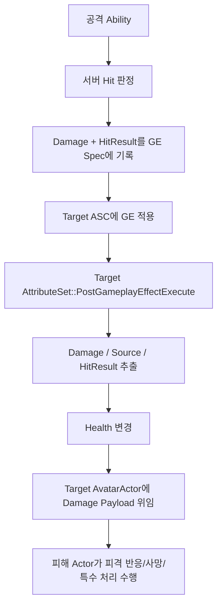

# OutBreak GAS Damage / HitResult 위임 처리 보고서

작성일: 2026-07-14  
대상 프로젝트: `OutBreak` / Unreal Engine 5.7

## 1. 목적

이 문서는 현재 프로젝트의 GAS(Gameplay Ability System) 기반 데미지 처리 흐름을 정리하고, 앞으로 데미지 값뿐 아니라 `FHitResult`까지 함께 전달해서 **피해를 받은 Actor가 피격 처리를 담당하도록 위임**하는 설계 방향을 정리한다.

요구사항을 기준으로 보면 핵심은 다음이다.

- 공격 Ability는 서버에서 판정한다.
- 데미지 수치는 `SetByCaller.Damage`로 `GameplayEffect`에 넣는다.
- 명중 정보는 `GameplayEffectContextHandle::AddHitResult()`로 `GameplayEffect`에 같이 넣는다.
- Target의 `AttributeSet`은 `PostGameplayEffectExecute()`에서 데미지와 HitResult를 꺼낸다.
- 최종 피격 처리는 Target ASC의 `AvatarActor`, 즉 실제 피해 Actor에게 위임한다.

현재 코드 기준 결론은 다음이다.

| 항목 | 현재 상태 | 판단 |
| --- | --- | --- |
| 원거리 무기 | `FHitResult`를 `EffectContext`에 넣고 GE 적용 | 요구 방향과 가장 가까움 |
| 근접 무기 | `OverlapMultiByChannel()` 기반이라 실제 `FHitResult`가 GE에 들어가지 않음 | 보강 필요 |
| 수류탄 | 반경 Overlap 기반이라 실제 `FHitResult`가 GE에 들어가지 않음 | 보강 필요 |
| AttributeSet | `Damage` 메타 Attribute를 `Health`에 반영하고 사망 처리까지 직접 호출 | 위임 구조로 바꾸기 좋음 |
| EnemyCharacter | 현재 확인된 `AEnemyCharacter`는 ASC/GAS 인터페이스가 없음 | GAS 데미지 경로만으로는 맞지 않음 |

## 2. 관련 파일

| 파일 | 역할 |
| --- | --- |
| `Source/OutBreak/Public/Ability/Attributes/OBAttributeSetBase.h` | `Health`, `MaxHealth`, `Damage` Attribute 선언 |
| `Source/OutBreak/Private/Ability/Attributes/OBAttributeSetBase.cpp` | `Damage`를 `Health`에 반영하는 핵심 지점 |
| `Source/OutBreak/Private/Ability/Abilities/OBGameplayAbility_RangedWeapon.cpp` | 원거리 서버 Trace, HitResult 생성, GE 적용 |
| `Source/OutBreak/Private/Ability/Abilities/OBGameplay/OBGameplayAbility_Melee.cpp` | 근접 Overlap 판정, GE 적용 |
| `Source/OutBreak/Private/Weapon/Projectile/OBGrenadeProjectile.cpp` | 수류탄 폭발 반경 데미지 적용 |
| `Source/OutBreak/Public/Weapon/Data/OBWeaponData.h` | `BaseDamage`, `DamageEffect`, `AbilitySet` 데이터 |
| `Source/OutBreak/Public/Ability/Tags/OBGameplayTags.h` | `SetByCaller.Damage` Native GameplayTag 선언 |
| `Source/OutBreak/Private/Ability/Tags/OBGameplayTags.cpp` | `SetByCaller.Damage` Native GameplayTag 정의 |
| `Source/OutBreak/Private/Player/State/OBPlayerStateBase.cpp` | PlayerState에 ASC와 AttributeSet 생성 |
| `Source/OutBreak/Private/Character/OBCharacterBase.cpp` | ASC Owner/Avatar 초기화, 현재 사망 처리 |
| `Source/OutBreak/Private/Ability/Data/OBAbilitySet.cpp` | Ability/Effect를 ASC에 부여 |
| `Source/OutBreak/Public/AI/EnemyCharacter.h` | 현재 확인된 Enemy Actor, ASC 없음 |

## 3. GAS 기초 개념

GAS를 처음 보는 기준으로, 현재 데미지 처리에 필요한 개념만 정리한다.

### 3.1 AbilitySystemComponent

`UAbilitySystemComponent`, 줄여서 ASC는 GAS의 중심 컴포넌트다.

ASC가 하는 일:

- GameplayAbility 보유 및 실행
- GameplayEffect 적용
- AttributeSet 관리
- GameplayTag 관리
- GameplayCue 실행
- 네트워크 복제 처리

현재 프로젝트에서는 플레이어 기준 ASC가 `AOBPlayerStateBase`에 있다.

```cpp
// Source/OutBreak/Private/Player/State/OBPlayerStateBase.cpp:13
AbilitySystemComponent = CreateDefaultSubobject<UOBAbilitySystemComponent>(TEXT("AbilitySystemComponent"));
AbilitySystemComponent->SetIsReplicated(true);
AbilitySystemComponent->SetReplicationMode(EGameplayEffectReplicationMode::Mixed);

// Source/OutBreak/Private/Player/State/OBPlayerStateBase.cpp:18
AttributeSet = CreateDefaultSubobject<UOBAttributeSetBase>(TEXT("AttributeSet"));
```

플레이어 ASC는 `PlayerState`가 Owner이고, 실제 몸체인 `Character`가 Avatar다.

```cpp
// Source/OutBreak/Private/Character/OBCharacterBase.cpp:419
AbilitySystemComponent->InitAbilityActorInfo(PS, this);
```

이 구조에서 중요한 점은 다음이다.

| 구분 | 의미 |
| --- | --- |
| OwnerActor | ASC를 소유하는 Actor. 현재 플레이어는 `AOBPlayerStateBase` |
| AvatarActor | 실제 월드에서 움직이고 맞는 Actor. 현재 플레이어는 `AOBCharacterBase` |
| 피격 Actor를 찾을 때 | `OwnerActor`가 아니라 `AvatarActor`를 봐야 함 |

따라서 `AttributeSet`에서 피해를 받은 Actor에게 위임하려면 `GetOwningAbilitySystemComponent()->GetAvatarActor()`를 써야 한다. `GetOwner()`류로 접근하면 PlayerState를 잡을 수 있다.

### 3.2 AttributeSet

`AttributeSet`은 체력, 스태미나, 공격력 같은 수치 저장소다.

현재 프로젝트의 `UOBAttributeSetBase`에는 다음 Attribute가 있다.

| Attribute | 용도 |
| --- | --- |
| `Health` | 현재 체력 |
| `MaxHealth` | 최대 체력 |
| `Damage` | 실제 저장용이 아니라 데미지 계산용 메타 Attribute |

`Damage`는 영구적으로 남기는 값이 아니라, GE가 들어왔을 때 `PostGameplayEffectExecute()`에서 읽고 즉시 0으로 되돌리는 임시 값이다.

```cpp
// Source/OutBreak/Private/Ability/Attributes/OBAttributeSetBase.cpp:41
const float LocalDamage = GetDamage();
SetDamage(0.0f);
```

### 3.3 GameplayAbility

`GameplayAbility`는 “발사”, “근접 공격”, “수류탄 투척”, “회복” 같은 행동 단위다.

현재 프로젝트 예:

| Ability | 파일 | 역할 |
| --- | --- | --- |
| `UOBGameplayAbility_RangedWeapon` | `OBGameplayAbility_RangedWeapon.cpp` | 원거리 발사 |
| `UOBGameplayAbility_Melee` | `OBGameplayAbility_Melee.cpp` | 근접 공격 |
| `UOBGameplayAbility_Grenade` | `OBGameplayAbility_Grenade.cpp` | 수류탄 투척 |
| `UOBGameplayAbility_Heal` | `OBGameplayAbility_Heal.cpp` | 회복 |

현재 기본 `UOBGameplayAbility`는 `LocalPredicted`다.

```cpp
// Source/OutBreak/Private/Ability/Abilities/OBGameplayAbility.cpp:15
NetExecutionPolicy = EGameplayAbilityNetExecutionPolicy::LocalPredicted;
```

하지만 실제 데미지 판정은 원거리/근접 모두 서버 권위로 처리한다.

```cpp
// Source/OutBreak/Private/Ability/Abilities/OBGameplayAbility_RangedWeapon.cpp:160
if (HasAuthority(&CurrentActivationInfo))
{
    PerformServerWeaponTrace();
}
```

### 3.4 GameplayEffect

`GameplayEffect`, 줄여서 GE는 Attribute를 변경하는 데이터 에셋이다.

현재 프로젝트에는 다음 에셋이 있다.

| 에셋 | 추정 역할 |
| --- | --- |
| `Content/GameAbilitySystem/Effects/GE_InitStats.uasset` | 초기 스탯 부여 |
| `Content/GameAbilitySystem/Effects/GE_Damage.uasset` | 데미지 적용 |
| `Content/GameAbilitySystem/Effects/GE_Heal.uasset` | 회복 적용 |

`GE_Damage.uasset`은 바이너리 에셋이라 텍스트로 직접 확인하지는 못했다. 다만 코드와 주석상 다음 형태여야 현재 코드가 정상 동작한다.

| GE_Damage 설정 | 값 |
| --- | --- |
| Duration Policy | Instant |
| Modifier Attribute | `UOBAttributeSetBase::Damage` |
| Modifier Op | Add |
| Modifier Magnitude | Set By Caller |
| SetByCaller Tag | `SetByCaller.Damage` |

`SetByCaller.Damage` 태그는 C++에 Native GameplayTag로 정의되어 있다.

```cpp
// Source/OutBreak/Private/Ability/Tags/OBGameplayTags.cpp:8
UE_DEFINE_GAMEPLAY_TAG(SetByCaller_Damage, "SetByCaller.Damage");
```

GE 에셋의 SetByCaller 태그와 코드의 태그가 다르면 데미지가 0으로 들어가거나 런타임 경고가 난다.

### 3.5 GameplayEffectSpec

`GameplayEffectSpec`은 “이번에 적용할 GE의 실제 인스턴스 데이터”라고 보면 된다.

예를 들어 `GE_Damage`라는 같은 에셋을 쓰더라도, 권총은 20 데미지, 저격총은 100 데미지를 넣을 수 있다.

현재 원거리 코드:

```cpp
// Source/OutBreak/Private/Ability/Abilities/OBGameplayAbility_RangedWeapon.cpp:323
FGameplayEffectSpecHandle SpecHandle =
    SourceASC->MakeOutgoingSpec(WeaponData->DamageEffect, GetAbilityLevel(), Context);

// Source/OutBreak/Private/Ability/Abilities/OBGameplayAbility_RangedWeapon.cpp:328
SpecHandle.Data->SetSetByCallerMagnitude(
    OBGameplayTags::SetByCaller_Damage,
    WeaponData->BaseDamage);
```

### 3.6 GameplayEffectContext

`GameplayEffectContext`는 GE와 함께 전달되는 부가 정보다.

데미지 처리에서 특히 중요한 값:

| 데이터 | 접근 방식 |
| --- | --- |
| 공격자 | `Context.GetInstigator()` 또는 `Context.GetOriginalInstigator()` |
| 데미지를 발생시킨 오브젝트 | `Context.GetEffectCauser()` |
| 무기/아이템 등 소스 오브젝트 | `Context.GetSourceObject()` |
| 명중 정보 | `Context.GetHitResult()` |

현재 원거리 코드는 `HitResult`를 Context에 넣고 있다.

```cpp
// Source/OutBreak/Private/Ability/Abilities/OBGameplayAbility_RangedWeapon.cpp:319
FGameplayEffectContextHandle Context = SourceASC->MakeEffectContext();
Context.AddSourceObject(Weapon);
Context.AddHitResult(Hit);
```

이 지점이 “Damage뿐 아니라 HitResult도 같이 전달”하는 정석적인 GAS 경로다.

### 3.7 GameplayCue

`GameplayCue`는 VFX/SFX/카메라 흔들림 같은 연출용 이벤트에 가깝다.

현재 프로젝트는 발사와 충돌 연출에 GameplayCue를 쓴다.

```cpp
// Source/OutBreak/Private/Ability/Abilities/OBGameplayAbility_RangedWeapon.cpp:292
SourceASC->ExecuteGameplayCue(OBGameplayTags::GameplayCue_Weapon_Fire, FireCueParams);

// Source/OutBreak/Private/Ability/Abilities/OBGameplayAbility_RangedWeapon.cpp:310
SourceASC->ExecuteGameplayCue(OBGameplayTags::GameplayCue_Weapon_Impact, ImpactCueParams);
```

GameplayCue는 연출에는 좋지만, 데미지의 권위 데이터 저장소로 쓰면 안 된다. 데미지 판정과 체력 변화는 GE/AttributeSet에서 처리하고, Hit VFX는 Cue나 Multicast로 처리하는 편이 안전하다.

## 4. 현재 데미지 처리 흐름

현재 데미지 처리의 큰 흐름은 다음이다.



### 4.1 원거리 무기

위치:

```text
Source/OutBreak/Private/Ability/Abilities/OBGameplayAbility_RangedWeapon.cpp:240
```

현재 흐름:

```text
FireOneShot()
  서버 권위면 PerformServerWeaponTrace()

PerformServerWeaponTrace()
  Character / Weapon / WeaponData 확인
  ViewLocation / ViewRotation 기준으로 TraceStart, TraceEnd 계산
  LineTraceSingleByChannel()
  GameplayCue.Weapon.Fire 실행
  공격 Montage Multicast
  Hit 없으면 return
  GameplayCue.Weapon.Impact 실행
  Hit.GetActor()에서 TargetASC 찾기
  SourceASC->MakeEffectContext()
  Context.AddSourceObject(Weapon)
  Context.AddHitResult(Hit)
  SourceASC->MakeOutgoingSpec(DamageEffect, Context)
  Spec.SetSetByCallerMagnitude(SetByCaller.Damage, BaseDamage)
  SourceASC->ApplyGameplayEffectSpecToTarget(TargetASC)
```

핵심 코드:

```cpp
// Source/OutBreak/Private/Ability/Abilities/OBGameplayAbility_RangedWeapon.cpp:266
const bool bHit = GetWorld()->LineTraceSingleByChannel(
    Hit, TraceStart, TraceEnd, OB_TraceChannel_Weapon, QueryParams);

// Source/OutBreak/Private/Ability/Abilities/OBGameplayAbility_RangedWeapon.cpp:314
UAbilitySystemComponent* TargetASC =
    UAbilitySystemBlueprintLibrary::GetAbilitySystemComponent(Hit.GetActor());

// Source/OutBreak/Private/Ability/Abilities/OBGameplayAbility_RangedWeapon.cpp:319
FGameplayEffectContextHandle Context = SourceASC->MakeEffectContext();
Context.AddSourceObject(Weapon);
Context.AddHitResult(Hit);

// Source/OutBreak/Private/Ability/Abilities/OBGameplayAbility_RangedWeapon.cpp:328
SpecHandle.Data->SetSetByCallerMagnitude(
    OBGameplayTags::SetByCaller_Damage,
    WeaponData->BaseDamage);

// Source/OutBreak/Private/Ability/Abilities/OBGameplayAbility_RangedWeapon.cpp:329
SourceASC->ApplyGameplayEffectSpecToTarget(*SpecHandle.Data, TargetASC);
```

판단:

- 원거리 무기는 이미 요구사항의 핵심인 `Context.AddHitResult(Hit)`가 들어가 있다.
- 이후 `AttributeSet`에서 `Data.EffectSpec.GetContext().GetHitResult()`를 읽으면 된다.
- 단, `SourceASC`가 null일 때 데미지 분기에서 `SourceASC->MakeEffectContext()`를 호출할 수 있으므로 방어 코드가 있으면 더 안전하다.

### 4.2 근접 무기

위치:

```text
Source/OutBreak/Private/Ability/Abilities/OBGameplay/OBGameplayAbility_Melee.cpp:75
```

현재 흐름:

```text
PerformMeleeTrace()
  OverlapMultiByChannel()로 주변 Pawn 수집
  전방 Dot 검사
  TargetASC 찾기
  SourceASC->MakeEffectContext()
  Ctx.AddInstigator(Char, Weapon)
  DamageEffect Spec 생성
  SetByCaller.Damage = Data->BaseDamage
  ApplyGameplayEffectSpecToTarget()
  별도 GameplayCue.Melee.Impact 실행
```

핵심 코드:

```cpp
// Source/OutBreak/Private/Ability/Abilities/OBGameplay/OBGameplayAbility_Melee.cpp:92
GetWorld()->OverlapMultiByChannel(
    Overlaps, Center, FQuat::Identity, ECC_Pawn,
    FCollisionShape::MakeSphere(SphereRadius), Params);

// Source/OutBreak/Private/Ability/Abilities/OBGameplay/OBGameplayAbility_Melee.cpp:125
FGameplayEffectContextHandle Ctx = SourceASC->MakeEffectContext();
Ctx.AddInstigator(Char, Weapon);

// Source/OutBreak/Private/Ability/Abilities/OBGameplay/OBGameplayAbility_Melee.cpp:130
Spec.Data->SetSetByCallerMagnitude(
    OBGameplayTags::SetByCaller_Damage,
    Data->BaseDamage);
```

판단:

- 현재 근접은 `FOverlapResult` 기반이라 실제 표면 충돌 정보인 `FHitResult`가 없다.
- 따라서 `Context.AddHitResult()`도 없다.
- 피해 Actor가 피격 위치, 피격 Bone, 충돌 Normal, Physical Material을 알아야 한다면 현재 구조로는 부족하다.

근접에서 HitResult를 넣는 방법은 두 가지다.

| 방식 | 장점 | 단점 |
| --- | --- | --- |
| `SweepMultiByChannel()`로 변경 | 실제 `FHitResult`를 얻음 | 기존 넓은 전방 판정과 결과가 달라질 수 있음 |
| Overlap 결과로 Synthetic HitResult 생성 | 기존 판정을 유지 | 표면/Bone/PhysMaterial 정확도가 낮음 |

권장:

- 무기 피격 반응, 피격 부위, 표면 Normal, 물리 재질이 중요하면 `SweepMultiByChannel()`로 바꾼다.
- 단순히 “누가 맞았고 어느 방향에서 맞았는지”만 필요하면 Synthetic HitResult도 가능하다.

### 4.3 수류탄

위치:

```text
Source/OutBreak/Private/Weapon/Projectile/OBGrenadeProjectile.cpp:70
```

현재 흐름:

```text
Explode()
  폭발 위치 Center
  Multicast_OnExploded()
  OverlapMultiByChannel()로 반경 내 Pawn 수집
  TargetASC 찾기
  거리 기반 Falloff 계산
  SourceASC->MakeEffectContext()
  Ctx.AddInstigator(GetInstigator(), this)
  SetByCaller.Damage = FinalDamage
  ApplyGameplayEffectSpecToTarget()
```

핵심 코드:

```cpp
// Source/OutBreak/Private/Weapon/Projectile/OBGrenadeProjectile.cpp:85
GetWorld()->OverlapMultiByChannel(
    Overlaps, Center, FQuat::Identity, ECC_Pawn,
    FCollisionShape::MakeSphere(ExplosionRadius), Params);

// Source/OutBreak/Private/Weapon/Projectile/OBGrenadeProjectile.cpp:102
const float FinalDamage = Damage * Falloff;

// Source/OutBreak/Private/Weapon/Projectile/OBGrenadeProjectile.cpp:105
FGameplayEffectContextHandle Ctx = SourceASC->MakeEffectContext();
Ctx.AddInstigator(GetInstigator(), this);
```

판단:

- 수류탄도 반경 Overlap 기반이라 실제 `FHitResult`가 없다.
- 폭발은 “표면에 맞은 HitResult”보다 “폭발 중심, 대상 위치, 폭발 방향, 거리 감쇠”가 더 중요한 경우가 많다.
- `FHitResult`만으로는 폭발 특화 정보가 부족하므로, 장기적으로는 커스텀 Damage Payload에 `ExplosionOrigin`, `DamageDirection`, `Distance`, `Falloff` 같은 값을 추가하는 편이 낫다.

## 5. 현재 AttributeSet 데미지 처리

위치:

```text
Source/OutBreak/Private/Ability/Attributes/OBAttributeSetBase.cpp:35
```

현재 구현:

```cpp
void UOBAttributeSetBase::PostGameplayEffectExecute(
    const FGameplayEffectModCallbackData& Data)
{
    Super::PostGameplayEffectExecute(Data);

    if (Data.EvaluatedData.Attribute == GetDamageAttribute())
    {
        const float LocalDamage = GetDamage();
        SetDamage(0.0f);

        if (LocalDamage > 0.0f)
        {
            const float NewHealth = GetHealth() - LocalDamage;
            SetHealth(FMath::Clamp(NewHealth, 0.0f, GetMaxHealth()));
        }
    }
    else if (Data.EvaluatedData.Attribute == GetHealthAttribute())
    {
        SetHealth(FMath::Clamp(GetHealth(), 0.0f, GetMaxHealth()));
    }

    const bool bAffectedHealth =
        Data.EvaluatedData.Attribute == GetDamageAttribute() ||
        Data.EvaluatedData.Attribute == GetHealthAttribute();

    if (bAffectedHealth && GetHealth() <= 0.0f)
    {
        if (UAbilitySystemComponent* OwningASC = GetOwningAbilitySystemComponent())
        {
            if (AOBCharacterBase* Character =
                Cast<AOBCharacterBase>(OwningASC->GetAvatarActor()))
            {
                Character->HandleDeath();
            }
        }
    }
}
```

현재 특징:

- `Damage` Attribute가 들어오면 `LocalDamage`를 읽는다.
- `Damage`를 0으로 초기화한다.
- `Health`를 감소시킨다.
- `Health <= 0`이면 AvatarActor를 `AOBCharacterBase`로 캐스팅해서 `HandleDeath()`를 호출한다.

현재 구조의 장점:

- 체력 변경 위치가 한 곳이다.
- 서버 권위 체력 변경과 RepNotify 구조가 단순하다.
- `Damage` 메타 Attribute 패턴을 잘 쓰고 있다.

현재 구조의 한계:

- `HitResult`를 읽지 않는다.
- 피해 Actor에게 일반화된 피격 이벤트를 넘기지 않는다.
- `AOBCharacterBase`에 직접 의존한다.
- 적, 보스, 파괴 오브젝트, Horde Proxy처럼 다른 Actor 타입이 들어오면 확장성이 낮다.

## 6. 요구사항에 맞는 목표 구조

목표 구조는 다음처럼 잡는 것을 권장한다.



중요한 설계 원칙:

- AttributeSet은 수치 변경의 중심으로 둔다.
- Actor는 피격 반응, 사망 처리, AI 상태 변화, Horde 이벤트 연결 같은 도메인 로직을 담당한다.
- 데미지 최종 수치 계산까지 Actor가 직접 해버리면 GAS의 Attribute 복제/예측/집계 장점을 잃을 수 있다.
- “데미지 적용”과 “피격 후처리”를 구분해야 한다.

권장 책임 분리:

| 책임 | 권장 위치 |
| --- | --- |
| 공격 판정 | Ability 또는 Projectile |
| 데미지 값 주입 | Ability/Projectile에서 GE Spec |
| HitResult 전달 | Ability/Projectile에서 EffectContext |
| Health 감소 | AttributeSet |
| 피격 반응 | 피해 Actor |
| 사망 처리 | 피해 Actor |
| UI 체력 표시 | Attribute 복제 구독 |
| VFX/SFX | GameplayCue 또는 Actor Multicast |

## 7. Damage Payload 설계안

피해 Actor에게 넘길 데이터를 구조체로 묶는 것을 권장한다.

예시:

```cpp
USTRUCT(BlueprintType)
struct FOBGameplayDamageData
{
    GENERATED_BODY()

    UPROPERTY(BlueprintReadOnly)
    float Damage = 0.0f;

    UPROPERTY(BlueprintReadOnly)
    float OldHealth = 0.0f;

    UPROPERTY(BlueprintReadOnly)
    float NewHealth = 0.0f;

    UPROPERTY(BlueprintReadOnly)
    float MaxHealth = 0.0f;

    UPROPERTY(BlueprintReadOnly)
    TObjectPtr<AActor> SourceActor = nullptr;

    UPROPERTY(BlueprintReadOnly)
    TObjectPtr<AActor> EffectCauser = nullptr;

    UPROPERTY(BlueprintReadOnly)
    TObjectPtr<UObject> SourceObject = nullptr;

    UPROPERTY(BlueprintReadOnly)
    FHitResult HitResult;

    UPROPERTY(BlueprintReadOnly)
    bool bHasHitResult = false;
};
```

이 구조체에 담으면 좋은 정보:

| 필드 | 의미 |
| --- | --- |
| `Damage` | 이번에 실제 반영한 데미지 |
| `OldHealth` | 데미지 적용 전 체력 |
| `NewHealth` | 데미지 적용 후 체력 |
| `MaxHealth` | 최대 체력 |
| `SourceActor` | 공격자 |
| `EffectCauser` | 실제 원인 Actor. 예: 투사체, 수류탄 |
| `SourceObject` | 무기나 아이템 데이터 |
| `HitResult` | 명중 위치, Normal, Bone, PhysMaterial 등 |
| `bHasHitResult` | HitResult가 실제로 유효한지 |

폭발이나 상태이상까지 확장할 계획이면 다음 필드도 후보가 된다.

| 필드 | 필요한 경우 |
| --- | --- |
| `DamageTypeTag` | 총알, 근접, 폭발, 화염, 독 같은 구분 |
| `HitDirection` | 피격 방향 기반 애니메이션 |
| `Impulse` | 넉백/래그돌 힘 |
| `ExplosionOrigin` | 수류탄/폭발 |
| `Falloff` | 폭발 거리 감쇠 |
| `bWasFatal` | 이번 데미지로 죽었는지 |

## 8. 피해 Actor 위임 방식

가장 일반적인 방식은 인터페이스다.

```cpp
UINTERFACE(BlueprintType)
class OUTBREAK_API UOBDamageReceiverInterface : public UInterface
{
    GENERATED_BODY()
};

class OUTBREAK_API IOBDamageReceiverInterface
{
    GENERATED_BODY()

public:
    UFUNCTION(BlueprintNativeEvent, BlueprintCallable, Category = "OB|Damage")
    void HandleGameplayDamage(const FOBGameplayDamageData& DamageData);
};
```

장점:

- `AOBCharacterBase`뿐 아니라 적, 보스, 오브젝트, 프록시 Actor도 같은 방식으로 받을 수 있다.
- AttributeSet이 특정 Actor 클래스에 직접 의존하지 않는다.
- Blueprint에서도 구현할 수 있다.

대안:

| 방식 | 평가 |
| --- | --- |
| `AOBCharacterBase`에 virtual 함수 추가 | 플레이어/캐릭터만 대상이면 단순함 |
| `UOBDamageReceiverComponent` 추가 | Actor에 컴포넌트로 붙이는 구조에 좋음 |
| Interface 사용 | 가장 범용적이고 현재 요구사항에 적합 |

권장안은 Interface 또는 Component다. 현재 프로젝트처럼 플레이어와 적/Horde/프록시 구조가 섞일 가능성이 있으면 Interface가 더 안전하다.

## 9. AttributeSet 수정 방향

현재 `PostGameplayEffectExecute()`는 `HitResult`를 읽지 않는다. 아래처럼 확장하면 된다.

예시 코드:

```cpp
void UOBAttributeSetBase::PostGameplayEffectExecute(
    const FGameplayEffectModCallbackData& Data)
{
    Super::PostGameplayEffectExecute(Data);

    const bool bIsDamage = Data.EvaluatedData.Attribute == GetDamageAttribute();
    const bool bIsHealth = Data.EvaluatedData.Attribute == GetHealthAttribute();

    float AppliedDamage = 0.0f;
    const float OldHealth = GetHealth();

    if (bIsDamage)
    {
        AppliedDamage = GetDamage();
        SetDamage(0.0f);

        if (AppliedDamage > 0.0f)
        {
            SetHealth(FMath::Clamp(
                OldHealth - AppliedDamage,
                0.0f,
                GetMaxHealth()));
        }
    }
    else if (bIsHealth)
    {
        SetHealth(FMath::Clamp(GetHealth(), 0.0f, GetMaxHealth()));
    }

    if (!bIsDamage && !bIsHealth)
    {
        return;
    }

    UAbilitySystemComponent* TargetASC = GetOwningAbilitySystemComponent();
    AActor* TargetActor = TargetASC ? TargetASC->GetAvatarActor() : nullptr;

    const FGameplayEffectContextHandle& Context = Data.EffectSpec.GetContext();
    const FHitResult* HitResult = Context.GetHitResult();

    FOBGameplayDamageData DamageData;
    DamageData.Damage = AppliedDamage;
    DamageData.OldHealth = OldHealth;
    DamageData.NewHealth = GetHealth();
    DamageData.MaxHealth = GetMaxHealth();
    DamageData.SourceActor = Context.GetOriginalInstigator();
    DamageData.EffectCauser = Context.GetEffectCauser();
    DamageData.SourceObject = Context.GetSourceObject();
    DamageData.bHasHitResult = HitResult != nullptr;
    if (HitResult)
    {
        DamageData.HitResult = *HitResult;
    }

    if (TargetActor &&
        TargetActor->GetClass()->ImplementsInterface(
            UOBDamageReceiverInterface::StaticClass()))
    {
        IOBDamageReceiverInterface::Execute_HandleGameplayDamage(
            TargetActor,
            DamageData);
    }
}
```

실제 적용 시 선택해야 할 부분:

| 선택지 | 설명 |
| --- | --- |
| AttributeSet이 계속 `HandleDeath()` 호출 | 기존 구조 유지, Actor 위임은 피격 반응만 담당 |
| Actor가 사망 처리까지 담당 | 요구사항에 더 부합. 기존 직접 캐스팅 제거 필요 |

요구사항이 “피해 받은 Actor가 그 처리를 하도록 위임”이라면 두 번째가 더 맞다.

권장:

- `AttributeSet`은 Health만 변경한다.
- `AttributeSet`은 DamageData를 TargetActor에게 넘긴다.
- `AOBCharacterBase::HandleGameplayDamage_Implementation()`에서 `NewHealth <= 0`이면 `HandleDeath()`를 호출한다.
- 인터페이스를 구현하지 않은 Actor에 대해서만 AttributeSet에서 fallback 사망 처리를 한다.

## 10. AOBCharacterBase 구현 방향

현재 사망 처리는 `AOBCharacterBase::HandleDeath()`에 있다.

위치:

```text
Source/OutBreak/Private/Character/OBCharacterBase.cpp:97
```

현재 `HandleDeath()` 역할:

- 서버 권위 확인
- 중복 사망 방지
- Ability 취소
- `State.Dead` 태그 추가
- 무기 해제
- 이동/충돌 비활성화
- Ragdoll 시작
- GameMode에 Respawn 요청

피격 위임 구조에서는 `AOBCharacterBase`가 인터페이스를 구현하고, 여기서 HitResult 기반 처리를 하면 된다.

예시:

```cpp
void AOBCharacterBase::HandleGameplayDamage_Implementation(
    const FOBGameplayDamageData& DamageData)
{
    if (!HasAuthority())
    {
        return;
    }

    // 예: HitResult.BoneName 기반 피격 반응, 헤드샷 처리, 피격 방향 저장 등
    if (DamageData.bHasHitResult)
    {
        const FName HitBone = DamageData.HitResult.BoneName;
        const FVector ImpactPoint = DamageData.HitResult.ImpactPoint;
        const FVector ImpactNormal = DamageData.HitResult.ImpactNormal;
    }

    if (DamageData.NewHealth <= 0.0f)
    {
        HandleDeath();
    }
}
```

클라이언트 연출이 필요하면 여기서 바로 클라이언트 전용 이펙트를 실행하지 말고, 다음 중 하나를 선택한다.

| 방식 | 용도 |
| --- | --- |
| GameplayCue | 충돌 VFX/SFX, 표준 GAS 연출 |
| NetMulticast RPC | 캐릭터별 피격 애니메이션, 래그돌 연출 |
| RepNotify | 상태 변화 기반 UI/Animation 반응 |

## 11. 원거리 무기 보강 포인트

원거리 무기는 이미 `Context.AddHitResult(Hit)`가 있다.

보강하면 좋은 점:

1. `SourceASC` null guard를 데미지 적용 전에 확실히 넣는다.
2. `TargetASC`가 없는 Actor에 대한 별도 위임 경로를 결정한다.
3. HitResult를 AttributeSet에서 읽고 TargetActor에게 넘긴다.

현재 원거리 코드는 다음 조건을 만족하는 Target만 데미지를 받는다.

```cpp
UAbilitySystemComponent* TargetASC =
    UAbilitySystemBlueprintLibrary::GetAbilitySystemComponent(Hit.GetActor());

if (!TargetASC || !WeaponData->DamageEffect) return;
```

즉, `Hit.GetActor()`가 ASC를 제공하지 않으면 데미지 처리가 끝난다.

이 조건은 플레이어/보스처럼 ASC가 있는 대상에게는 맞다. 하지만 현재 확인된 `AEnemyCharacter`는 `IAbilitySystemInterface`를 구현하지 않고 ASC도 없다. 그러면 원거리 총알이 `AEnemyCharacter`에 맞아도 이 GAS 경로로는 데미지가 들어가지 않는다.

선택지는 두 가지다.

| 선택지 | 설명 |
| --- | --- |
| 모든 피해 가능 Actor에 ASC 부여 | GAS 일관성은 좋지만 대량 좀비/Horde에는 무거울 수 있음 |
| ASC 없는 Actor는 별도 DamageReceiver 경로로 분기 | Horde/대량 AI에 유리 |

대량 적이 있다면 두 번째가 현실적이다.

예시 흐름:

```cpp
if (TargetASC)
{
    // GAS 데미지 경로
    ApplyGameplayEffectSpecToTarget(...);
}
else if (HitActor->GetClass()->ImplementsInterface(
    UOBDamageReceiverInterface::StaticClass()))
{
    // ASC 없는 Actor 위임 경로
    FOBGameplayDamageData DamageData;
    DamageData.Damage = WeaponData->BaseDamage;
    DamageData.HitResult = Hit;
    DamageData.bHasHitResult = true;
    DamageData.SourceActor = Character;
    DamageData.SourceObject = Weapon;

    IOBDamageReceiverInterface::Execute_HandleGameplayDamage(
        HitActor,
        DamageData);
}
```

주의:

- 이 경로는 GAS AttributeSet을 거치지 않는다.
- 따라서 ASC 없는 Actor의 체력/사망 처리는 해당 Actor나 별도 StatusSubsystem이 책임져야 한다.
- 플레이어 같은 ASC 대상과 Horde 같은 비ASC 대상을 같은 방식으로 다루려면 `FOBGameplayDamageData` 구조체를 공통 payload로 쓰는 것이 좋다.

## 12. 근접 무기 HitResult 보강

현재 근접은 Overlap 기반이다. 이 상태에서 `HitResult`가 꼭 필요하면 다음 중 하나를 선택한다.

### 12.1 Sweep으로 변경

예시 방향:

```cpp
TArray<FHitResult> Hits;
GetWorld()->SweepMultiByChannel(
    Hits,
    SweepStart,
    SweepEnd,
    FQuat::Identity,
    ECC_Pawn,
    FCollisionShape::MakeSphere(MeleeRadius),
    Params);

for (const FHitResult& Hit : Hits)
{
    AActor* HitActor = Hit.GetActor();
    UAbilitySystemComponent* TargetASC =
        UAbilitySystemBlueprintLibrary::GetAbilitySystemComponent(HitActor);

    FGameplayEffectContextHandle Ctx = SourceASC->MakeEffectContext();
    Ctx.AddInstigator(Char, Weapon);
    Ctx.AddSourceObject(Weapon);
    Ctx.AddHitResult(Hit);
}
```

장점:

- `ImpactPoint`, `ImpactNormal`, `BoneName`, `PhysMaterial` 같은 정보가 자연스럽게 들어온다.
- 원거리와 같은 패턴이 된다.

주의:

- 기존 Overlap 판정보다 좁거나 달라질 수 있다.
- 무기 궤적 기반으로 정확히 하려면 애니메이션 Notify 시점에 여러 소켓 위치를 Sweep해야 한다.

### 12.2 Synthetic HitResult 생성

Overlap 판정을 유지하면서 근사치만 넣는 방법이다.

예시 방향:

```cpp
FHitResult SyntheticHit;
SyntheticHit.bBlockingHit = true;
SyntheticHit.TraceStart = Start;
SyntheticHit.TraceEnd = HitActor->GetActorLocation();
SyntheticHit.Location = HitActor->GetActorLocation();
SyntheticHit.ImpactPoint = HitActor->GetActorLocation();
SyntheticHit.Normal = -Dir;
SyntheticHit.ImpactNormal = -Dir;
```

주의:

- Actor/Component를 `FHitResult`에 안정적으로 채우는 방식은 UE 버전에 따라 API 차이가 있다.
- 실제 표면 충돌이 아니므로 Bone/PhysMaterial은 믿기 어렵다.
- 정확한 피격 부위가 필요하면 Synthetic 방식은 피해야 한다.

권장:

- 근접 피격 반응이 중요하면 `SweepMultiByChannel()`로 바꾸는 편이 낫다.
- 단순 데미지와 방향만 필요하면 Synthetic HitResult 또는 별도 `HitDirection` 필드를 쓰는 편이 더 단순하다.

## 13. 수류탄 HitResult 보강

수류탄 폭발은 실제 단일 HitResult보다 폭발 payload가 더 중요하다.

권장 payload:

| 필드 | 의미 |
| --- | --- |
| `ExplosionOrigin` | 폭발 중심 |
| `HitResult.ImpactPoint` | 대상에게 가장 가까운 위치 또는 Actor 위치 |
| `HitDirection` | `TargetLocation - ExplosionOrigin` |
| `Distance` | 폭발 중심과 대상 거리 |
| `Falloff` | 거리 감쇠 |

간단한 Synthetic HitResult 방향:

```cpp
const FVector TargetLocation = Actor->GetActorLocation();
const FVector Direction = (TargetLocation - Center).GetSafeNormal();

FHitResult SyntheticHit;
SyntheticHit.bBlockingHit = true;
SyntheticHit.TraceStart = Center;
SyntheticHit.TraceEnd = TargetLocation;
SyntheticHit.Location = TargetLocation;
SyntheticHit.ImpactPoint = TargetLocation;
SyntheticHit.Normal = -Direction;
SyntheticHit.ImpactNormal = -Direction;

FGameplayEffectContextHandle Ctx = SourceASC->MakeEffectContext();
Ctx.AddInstigator(GetInstigator(), this);
Ctx.AddSourceObject(this);
Ctx.AddHitResult(SyntheticHit);
```

하지만 폭발 반응을 제대로 하려면 `FOBGameplayDamageData`에 폭발 전용 필드를 추가하는 쪽이 좋다. `FHitResult` 하나만으로는 “폭발 중심에서 밀려났다”는 정보를 표현하기 애매하다.

## 14. GE_Damage 에셋 점검 체크리스트

에디터에서 `Content/GameAbilitySystem/Effects/GE_Damage.uasset`을 열고 다음을 확인한다.

| 항목 | 기대값 |
| --- | --- |
| Duration Policy | Instant |
| Modifiers 배열 | 최소 1개 |
| Attribute | `OBAttributeSetBase.Damage` |
| Modifier Op | Add |
| Magnitude Calculation Type | Set By Caller |
| Data Tag | `SetByCaller.Damage` |

실패 증상:

| 문제 | 증상 |
| --- | --- |
| Data Tag가 다름 | `SetByCaller` 값이 0 또는 런타임 경고 |
| Attribute가 Health로 직접 설정됨 | `PostGameplayEffectExecute()`의 Damage 분기가 안 탐 |
| Duration이 Infinite | 데미지가 Active Effect로 남아 의도치 않은 반복/집계 가능 |
| Modifier Op가 Override | Damage 메타 Attribute 패턴과 어긋남 |

## 15. 네트워크 관점

현재 프로젝트는 서버 권위로 데미지를 처리한다.

원거리:

- 로컬 입력으로 Ability 실행 가능
- 실제 탄약 소모, Trace, 데미지 적용은 `HasAuthority()`에서 수행

Attribute:

- `Health`, `MaxHealth`는 복제된다.
- `Damage`는 메타 Attribute라 복제 대상이 아니다.

```cpp
// Source/OutBreak/Private/Ability/Attributes/OBAttributeSetBase.cpp:17
DOREPLIFETIME_CONDITION_NOTIFY(
    UOBAttributeSetBase,
    Health,
    COND_None,
    REPNOTIFY_Always);
```

HitResult 위임에서 주의할 점:

- `PostGameplayEffectExecute()`는 서버에서 실행되는 권위 처리로 보는 것이 안전하다.
- 클라이언트 연출이 필요하면 Actor 위임 함수 안에서 Multicast 또는 GameplayCue를 따로 호출해야 한다.
- Instant GE의 Context가 모든 클라이언트에게 영구적으로 남는다고 가정하면 안 된다.
- UI는 HitResult가 아니라 복제된 Health Attribute를 구독해야 한다.

## 16. ASC 없는 Actor 문제

현재 확인한 `AEnemyCharacter`는 다음 특징을 갖는다.

```cpp
// Source/OutBreak/Public/AI/EnemyCharacter.h
class OUTBREAK_API AEnemyCharacter : public ACharacter
```

- `IAbilitySystemInterface`를 상속하지 않는다.
- `UAbilitySystemComponent`를 갖지 않는다.
- `AttributeSet`도 없다.

따라서 현재 원거리 데미지 코드의 이 조건에서 걸러진다.

```cpp
UAbilitySystemComponent* TargetASC =
    UAbilitySystemBlueprintLibrary::GetAbilitySystemComponent(Hit.GetActor());

if (!TargetASC || !WeaponData->DamageEffect) return;
```

이것은 설계상 매우 중요한 분기다.

피해 대상이 모두 플레이어처럼 ASC를 가진다면:

- 지금 GAS 경로를 확장하면 된다.
- AttributeSet에서 HitResult를 꺼내 Actor에게 위임하면 된다.

피해 대상 중 대량 적/Horde/Proxy처럼 ASC가 없는 Actor가 있다면:

- GAS GE 적용 전에 HitActor 타입을 분기해야 한다.
- ASC 없는 Actor는 `UOBDamageReceiverInterface` 또는 전용 StatusSubsystem으로 바로 위임해야 한다.
- 이 경우 `GE_Damage`는 사용하지 않지만, 같은 `FOBGameplayDamageData`를 사용하면 코드 해석이 쉬워진다.

권장 분기 순서:

```text
HitActor 있음
  SourceASC 있음
  if TargetASC 있음:
    GAS GE 적용
  else if HitActor가 DamageReceiverInterface 구현:
    DamageData 직접 전달
  else:
    데미지 처리 없음
```

## 17. Headshot / Bone / Physical Material 처리

HitResult를 위임하려는 가장 큰 이유는 보통 다음 때문이다.

- 헤드샷
- 피격 부위별 데미지 배율
- 피격 애니메이션 방향
- 물리 재질별 이펙트
- 약점 판정
- 방어구 판정

처리 위치를 잘 골라야 한다.

| 처리 | 권장 위치 |
| --- | --- |
| 피격 부위별 최종 데미지 배율 | 데미지 적용 전. Ability 또는 ExecutionCalculation |
| 피격 애니메이션 | 피해 Actor |
| 피격 VFX/SFX | GameplayCue 또는 피해 Actor |
| 사망 처리 | 피해 Actor |
| UI 체력 감소 | Attribute 복제 |

중요:

`AttributeSet::PostGameplayEffectExecute()`는 이미 GE Modifier가 적용된 뒤 호출된다. 여기서 Headshot 배율을 적용하려면 Health를 추가로 조정해야 해서 구조가 지저분해질 수 있다.

Headshot이 최종 데미지 수치에 영향을 줘야 한다면 다음 중 하나가 낫다.

| 방식 | 설명 |
| --- | --- |
| Ability에서 HitResult를 보고 `BaseDamage * HeadshotMultiplier` 계산 후 SetByCaller | 단순하고 현재 구조에 맞음 |
| `UGameplayEffectExecutionCalculation` 추가 | 방어력, 저항, Source/Target Attribute까지 계산할 때 적합 |
| Custom GameplayEffectContext 추가 | DamageType, CartridgeId, SurfaceType 등 더 많은 데이터를 네트워크 직렬화해야 할 때 |

현재 프로젝트 단계에서는 Ability에서 배율을 계산해서 SetByCaller에 넣는 방식이 가장 실용적이다.

## 18. ExecutionCalculation 도입 기준

현재 프로젝트에는 `UGameplayEffectExecutionCalculation` 구현이 보이지 않는다. 지금은 `SetByCaller.Damage`를 `Damage` 메타 Attribute에 더하는 단순 구조다.

지금 구조로 충분한 경우:

- 무기별 고정 데미지
- 단순 Headshot 배율
- 단순 거리 감쇠
- 피해 Actor 후처리 위임

ExecutionCalculation을 고려할 시점:

- 공격자 Attribute와 방어자 Attribute를 동시에 읽어야 함
- 방어력, 관통력, 저항, 치명타, 약점, 버프/디버프가 많아짐
- 데미지 공식이 GE 에셋/Ability 코드에 흩어지기 시작함
- 서버 권위 계산을 GAS 표준 계산 파이프라인에 넣고 싶음

ExecutionCalculation에서도 `Data.EffectSpec.GetContext().GetHitResult()`로 HitResult를 읽을 수 있다. 따라서 “HitResult를 GE Context에 넣는다”는 원칙은 동일하다.

## 19. 추천 구현 순서

### 1단계: 공통 DamageData와 Interface 추가

추가 후보:

```text
Source/OutBreak/Public/Combat/OBDamageTypes.h
Source/OutBreak/Public/Combat/OBDamageReceiverInterface.h
Source/OutBreak/Private/Combat/OBDamageReceiverInterface.cpp
```

내용:

- `FOBGameplayDamageData`
- `UOBDamageReceiverInterface`
- `IOBDamageReceiverInterface::HandleGameplayDamage()`

### 2단계: AttributeSet에서 Context 읽기

수정 후보:

```text
Source/OutBreak/Private/Ability/Attributes/OBAttributeSetBase.cpp
```

변경:

- `Data.EffectSpec.GetContext()` 읽기
- `Context.GetHitResult()` 읽기
- `TargetASC->GetAvatarActor()`로 피해 Actor 찾기
- DamageData 생성
- 피해 Actor에게 Interface 호출
- 기존 `AOBCharacterBase` 직접 캐스팅은 제거하거나 fallback으로 축소

### 3단계: AOBCharacterBase가 Interface 구현

수정 후보:

```text
Source/OutBreak/Public/Character/OBCharacterBase.h
Source/OutBreak/Private/Character/OBCharacterBase.cpp
```

변경:

- `IOBDamageReceiverInterface` 상속
- `HandleGameplayDamage_Implementation()` 추가
- `DamageData.NewHealth <= 0`이면 `HandleDeath()`
- HitResult 기반 피격 반응 Hook 추가

### 4단계: 원거리 경로 안전화

수정 후보:

```text
Source/OutBreak/Private/Ability/Abilities/OBGameplayAbility_RangedWeapon.cpp
```

변경:

- `SourceASC` null guard
- `TargetASC` 없는 Actor의 처리 정책 추가
- 필요하면 Headshot 배율 계산 후 SetByCaller에 반영

### 5단계: 근접 HitResult 개선

수정 후보:

```text
Source/OutBreak/Private/Ability/Abilities/OBGameplay/OBGameplayAbility_Melee.cpp
```

선택:

- `SweepMultiByChannel()`로 변경
- 또는 Synthetic HitResult 생성

### 6단계: 수류탄 Payload 개선

수정 후보:

```text
Source/OutBreak/Private/Weapon/Projectile/OBGrenadeProjectile.cpp
```

변경:

- 폭발 중심/방향/거리 감쇠 정보를 DamageData 또는 Context에 담을 정책 결정
- 필요하면 Synthetic HitResult 추가

### 7단계: ASC 없는 적 처리 정책 결정

현재 `AEnemyCharacter`는 ASC가 없다. 따라서 다음 중 하나를 결정해야 한다.

| 선택 | 추천 상황 |
| --- | --- |
| `AEnemyCharacter`에도 ASC 부여 | 적 수가 적고 GAS 버프/디버프를 적극 사용할 때 |
| `AEnemyCharacter`는 `UOBDamageReceiverInterface`만 구현 | 적 수가 많고 단순 체력/피격 처리면 |
| Horde/SoA StatusSubsystem으로 위임 | 대량 좀비를 packed data로 처리할 때 |

## 20. 검증 체크리스트

원거리:

- 총알이 캐릭터에 맞으면 `AttributeSet::PostGameplayEffectExecute()`가 호출되는가
- `Context.GetHitResult()`가 null이 아닌가
- `HitResult.GetActor()`가 피격 Actor인가
- `HitResult.ImpactPoint`가 실제 충돌 위치인가
- `HitResult.BoneName`이 필요한 경우 들어오는가
- 피해 Actor의 `HandleGameplayDamage()`가 서버에서 호출되는가
- 체력이 한 번만 감소하는가
- 사망 처리가 한 번만 실행되는가

근접:

- 근접 공격에서도 `bHasHitResult` 정책이 명확한가
- Sweep으로 바꿨다면 기존 공격 범위와 체감이 유지되는가
- 같은 대상이 한 번의 공격에서 중복 피격되지 않는가

수류탄:

- 거리 감쇠가 기존과 동일한가
- 폭발 중심과 피격 방향이 DamageData에 들어가는가
- 여러 대상에게 개별 DamageData가 전달되는가

네트워크:

- 서버에서만 Health가 감소하는가
- 클라이언트 UI는 복제된 Health로 갱신되는가
- 피격 연출이 모든 클라이언트에서 보이는가
- Dedicated Server에서 VFX/SFX 코드가 잘 분리되는가

ASC 없는 Actor:

- `TargetASC == nullptr`일 때도 의도한 대상은 데미지를 받는가
- GAS 대상과 비GAS 대상이 중복으로 데미지를 받지 않는가
- 비GAS 대상의 체력/사망 처리는 별도 시스템에서 일관되게 처리되는가

## 21. 요약

현재 프로젝트의 GAS 데미지 핵심은 `GE_Damage`가 `Damage` 메타 Attribute를 올리고, `UOBAttributeSetBase::PostGameplayEffectExecute()`가 그 값을 `Health`에 반영하는 구조다.

원거리 무기는 이미 `Context.AddHitResult(Hit)`를 호출하고 있으므로, AttributeSet에서 `Data.EffectSpec.GetContext().GetHitResult()`를 읽어 피해 Actor에게 넘기면 요구사항의 중심은 충족된다.

다만 근접과 수류탄은 Overlap 기반이라 실제 `FHitResult`가 없고, 현재 확인된 `AEnemyCharacter`는 ASC가 없어서 기존 GAS 데미지 경로에 들어오지 않는다. 따라서 다음 설계 결정을 먼저 해야 한다.

1. 모든 피해 가능 Actor가 ASC를 가질 것인가.
2. ASC 없는 Actor는 별도 `DamageReceiverInterface` 또는 StatusSubsystem으로 처리할 것인가.
3. 근접/폭발에서 실제 HitResult가 필요한가, 아니면 DamageData의 방향/위치 필드로 충분한가.

추천 최종 방향은 다음이다.

```text
ASC 있는 대상:
  GE_Damage + EffectContext.HitResult
  -> AttributeSet에서 Health 반영
  -> AvatarActor에게 DamageData 위임

ASC 없는 대상:
  Ability/Projectile에서 HitActor에 DamageData 직접 위임
  -> Actor 또는 StatusSubsystem이 체력/사망 처리
```

이 구조로 가면 GAS의 장점인 Attribute/Effect/Replication은 유지하면서, 실제 피격 반응과 사망 처리는 피해 Actor가 책임지는 형태로 확장할 수 있다.
