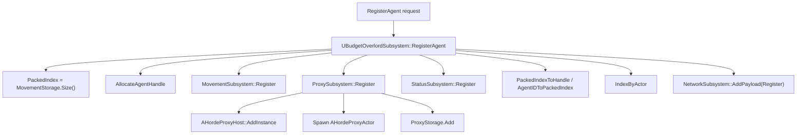
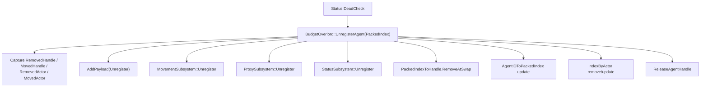
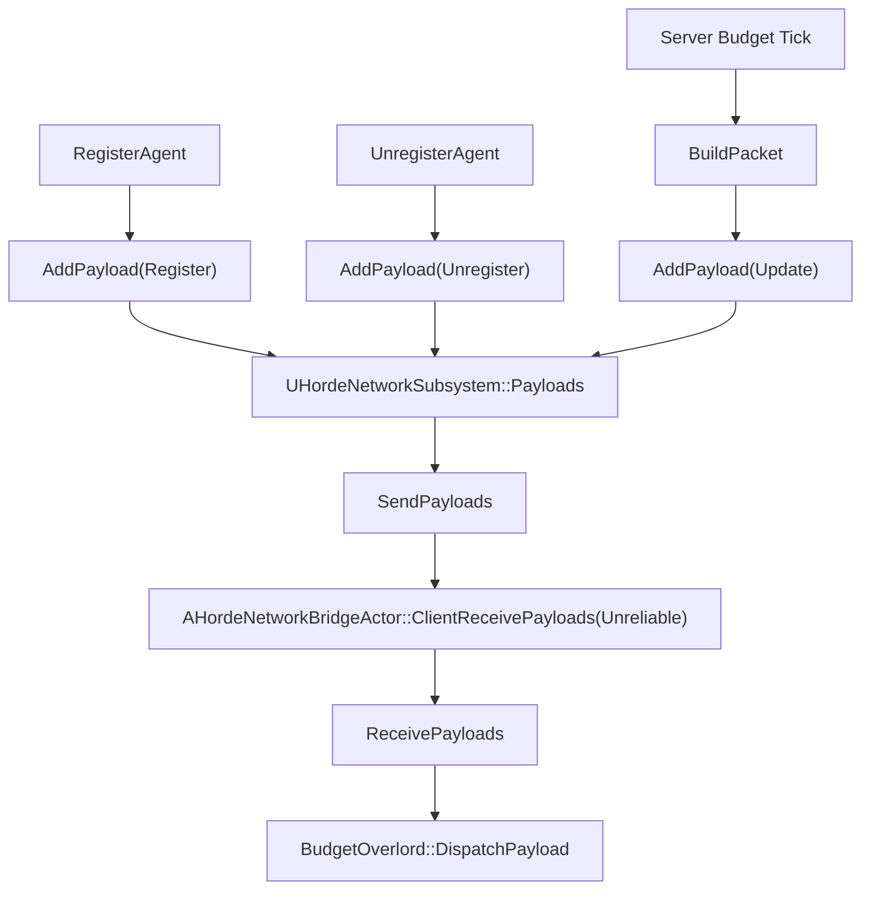

# Horde Agent Lifecycle Audit

작성 기준: 현재 작업트리의 `Source/OutBreak` C++ 코드. 이 문서는 코드 수정 없이 등록, 삭제, 이동, 렌더링, 네트워크 동기화 흐름과 데이터 소유권을 감사한 결과다.

요약 판단: 현재 구조는 `UBudgetOverlordSubsystem` 중심의 packed index SoA 설계 방향 자체는 유지 가능하다. 다만 지금 상태에서 삭제와 handle 반환 기능을 그대로 확장하면 Status SoA 불일치, 네트워크 lifecycle 미처리, stale packed index 적용, proxy 리소스 미반환 문제가 서로 겹친다.

문제 수: Critical 3개, High 6개, Medium 4개, Low 1개.

가장 중요한 근본 문제 3개:

1. `FHordeAgentHandle`이 stable id로 도입됐지만 수신 적용은 여전히 `Handle.AgentID == PackedIndex`라고 가정한다.
2. 삭제 transaction이 모든 외부 캐시와 리소스를 한 번에 갱신하지 못한다.
3. lifecycle event와 movement snapshot이 같은 unreliable payload 배열에 섞여 있고, client 적용 함수가 operation을 처리하지 않는다.

## 1. 분석 범위

검토한 주요 파일:

- `Source/OutBreak/Public/FlowField/Struct/HordeSystemType.h`
- `Source/OutBreak/Public/FlowField/Subsystem/BudgetOverlordSubsystem.h`
- `Source/OutBreak/Private/FlowField/Subsystem/BudgetOverlordSubsystem.cpp`
- `Source/OutBreak/Public/FlowField/Subsystem/HordeMovementSubsystem.h`
- `Source/OutBreak/Private/FlowField/Subsystem/HordeMovementSubsystem.cpp`
- `Source/OutBreak/Public/FlowField/Subsystem/HordeProxySubsystem.h`
- `Source/OutBreak/Private/FlowField/Subsystem/HordeProxySubsystem.cpp`
- `Source/OutBreak/Public/FlowField/Subsystem/HordeStatusSubsystem.h`
- `Source/OutBreak/Private/FlowField/Subsystem/HordeStatusSubsystem.cpp`
- `Source/OutBreak/Public/FlowField/Subsystem/HordeNetworkSubsystem.h`
- `Source/OutBreak/Private/FlowField/Subsystem/HordeNetworkSubsystem.cpp`
- `Source/OutBreak/Public/FlowField/Subsystem/BaseHordeWorldSubsystem.h`
- `Source/OutBreak/Private/FlowField/Subsystem/BaseHordeWorldSubsystem.cpp`
- `Source/OutBreak/Public/FlowField/Subsystem/FlowFieldSubsystem.h`
- `Source/OutBreak/Private/FlowField/Subsystem/FlowFieldSubsystem.cpp`
- `Source/OutBreak/Public/FlowField/HordeProxyHost.h`
- `Source/OutBreak/Private/FlowField/HordeProxyHost.cpp`
- `Source/OutBreak/Public/FlowField/HordeNetworkBridgeActor.h`
- `Source/OutBreak/Private/FlowField/HordeNetworkBridgeActor.cpp`
- `Source/OutBreak/Public/FlowField/Settings/FlowFieldSettings.h`
- `Source/OutBreak/Private/Ability/Abilities/OBGameplayAbility_RangedWeapon.cpp`

검색한 핵심 항목:

- `RegisterAgent`, `UnregisterAgent`, `Register`, `Unregister`, `RemoveAtSwap`
- `AllocateAgentHandle`, `ReleaseAgentHandle`, `FreeAgentIDs`, `AgentGenerations`
- `PackedIndexToHandle`, `AgentIDToPackedIndex`, `IndexByActor`
- `InstanceId`, `AddPayload`, `BuildPacket`, `DispatchPayload`, `ReceivePayloads`
- `MovementStorage`, `StatusStorage`, `ProxyStorage`
- `FHordeAgentHandle`, `HordeRemoveResult`, `FHordeNetworkFormat`, `ProxyRegisterResult`

확인 불가:

- Blueprint graph 또는 asset 내부에서 `RegisterAgent`를 호출하는 위치.
- Blueprint 또는 asset 내부에서 damage path가 `UHordeStatusSubsystem::AddDamageEvent()`로 연결되는지 여부.

## 2. 현재 시스템 구조

현재 Horde agent는 여러 subsystem의 SoA storage에 동일한 packed index로 저장되는 구조다.

| 구성요소 | 현재 책임 | 주요 위치 |
| --- | --- | --- |
| `UBudgetOverlordSubsystem` | subsystem 초기화, tick 순서, agent 등록/삭제, handle/index mapping, network payload 생성/적용 | `BudgetOverlordSubsystem.cpp:21`, `BudgetOverlordSubsystem.cpp:55`, `BudgetOverlordSubsystem.cpp:87`, `BudgetOverlordSubsystem.cpp:156` |
| `UHordeMovementSubsystem` | movement SoA 저장, authority/client movement simulation | `HordeMovementSubsystem.cpp:23`, `HordeMovementSubsystem.cpp:28`, `HordeMovementSubsystem.cpp:33` |
| `UHordeProxySubsystem` | proxy actor/ISM instance 생성, movement transform을 렌더 proxy에 반영 | `HordeProxySubsystem.cpp:30`, `HordeProxySubsystem.cpp:68`, `HordeProxySubsystem.cpp:82` |
| `UHordeStatusSubsystem` | health storage, damage event 적용, dead check | `HordeStatusSubsystem.cpp:8`, `HordeStatusSubsystem.cpp:47`, `HordeStatusSubsystem.cpp:57` |
| `UHordeNetworkSubsystem` | payload queue, owner-only bridge actor RPC 전송, client payload 수신 | `HordeNetworkSubsystem.h:26`, `HordeNetworkSubsystem.cpp:41`, `HordeNetworkSubsystem.cpp:97` |
| `UFlowFieldSubsystem` | movement direction query 제공 | `FlowFieldSubsystem.cpp:58` |
| `AHordeProxyHost` | ISM instance add/update/remove 함수 제공 | `HordeProxyHost.cpp:30`, `HordeProxyHost.cpp:36`, `HordeProxyHost.cpp:41` |
| `AHordeNetworkBridgeActor` | owner client unreliable RPC endpoint | `HordeNetworkBridgeActor.h:18`, `HordeNetworkBridgeActor.cpp:16` |

현재 tick 순서:

```text
UBudgetOverlordSubsystem::Tick
  -> MovementSubsystem->ProcessSystem()
  -> StatusSubsystem->ProcessSystem()
       -> Parallel()
       -> DeadCheck()
  -> ProxySubsystem->ProcessSystem()
  -> BuildPacket()
  -> NetworkSubsystem->ProcessSystem()
       -> SendPayloads()
```

관련 위치: `BudgetOverlordSubsystem.cpp:55-64`, `HordeStatusSubsystem.cpp:57-62`, `HordeNetworkSubsystem.cpp:148-152`.

## 3. Register 호출 흐름



현재 구현:

1. `RegisterAgent()`는 `MovementSubsystem->MovementStorage.Size()`를 packed index 후보로 잡는다. 위치: `BudgetOverlordSubsystem.cpp:98-99`.
2. `AllocateAgentHandle()`로 stable handle을 만든다. 위치: `BudgetOverlordSubsystem.cpp:101-102`, `BudgetOverlordSubsystem.cpp:525-548`.
3. movement, proxy, status 순서로 append한다. 위치: `BudgetOverlordSubsystem.cpp:104-113`.
4. `PackedIndexToHandle.Add(Handle)` 후 `AgentIDToPackedIndex[Handle.AgentID] = PackedIndex`를 설정한다. 위치: `BudgetOverlordSubsystem.cpp:116-124`.
5. proxy actor가 유효하면 `IndexByActor[Actor] = PackedIndex`를 추가한다. 위치: `BudgetOverlordSubsystem.cpp:126-130`.
6. `Operation = Register`인 `FHordeNetworkFormat`을 `NetworkSubsystem->AddPayload()`로 넣는다. 위치: `BudgetOverlordSubsystem.cpp:137-151`.

호출 위치:

- C++에서 `RegisterAgent(` 호출부는 선언과 구현 외에는 발견하지 못했다.
- `BudgetOverlordSubsystem.h:26`의 `UFUNCTION(BlueprintCallable)`이므로 Blueprint 호출 가능성은 있다.

중간 실패 분석:

- `UHordeProxySubsystem::Register()`는 먼저 `HordeProxy->AddInstance()`를 호출한 뒤 proxy actor class를 검사한다. 위치: `HordeProxySubsystem.cpp:31-44`.
- class가 없으면 `ProxyRegisterResult()`를 반환하고 `ProxyStorage.Add()`는 실행되지 않는다. 이 경우 movement/status/handle mapping은 계속 진행되므로 storage size가 어긋날 수 있다.
- `SpawnActor` 실패 시에는 null actor가 `ProxyStorage.Add()`로 들어갈 수 있다. 위치: `HordeProxySubsystem.cpp:48-65`.
- 현재 register 함수들은 실패를 반환하지 않으므로 rollback 경로가 없다.

## 4. Unregister 호출 흐름



현재 구현:

1. `UnregisterAgent(int32 PackedIndex)`는 public C++ 함수지만 Blueprint callable은 아니다. 위치: `BudgetOverlordSubsystem.h:34`.
2. C++ 호출부는 `UHordeStatusSubsystem::DeadCheck()` 하나만 발견했다. 위치: `HordeStatusSubsystem.cpp:65-72`.
3. 삭제 전 `RemovedHandle`, `MovedHandle`, `RemovedActor`, `MovedActor`를 저장한다. 위치: `BudgetOverlordSubsystem.cpp:203-224`.
4. `Operation = Unregister` payload를 먼저 queue에 추가한다. 위치: `BudgetOverlordSubsystem.cpp:231-237`.
5. movement/proxy/status/picked-handle 배열에 같은 index로 `RemoveAtSwap`을 적용한다. 위치: `BudgetOverlordSubsystem.cpp:246-263`.
6. removed id는 `INDEX_NONE`, moved id는 삭제 위치로 갱신한다. 위치: `BudgetOverlordSubsystem.cpp:268-291`.
7. removed actor는 `IndexByActor`에서 삭제하고, moved actor는 새 index로 갱신한다. 위치: `BudgetOverlordSubsystem.cpp:299-311`.
8. `ReleaseAgentHandle()`에서 generation을 증가시키고 free list에 agent id를 반환한다. 위치: `BudgetOverlordSubsystem.cpp:320`, `BudgetOverlordSubsystem.cpp:337-394`.

현재 개선된 점:

- 삭제 전 moved/removed handle과 actor를 저장한다.
- `PackedIndexToHandle`도 같은 `RemoveAtSwap(..., EAllowShrinking::No)` 정책을 사용한다.
- moved agent의 `AgentIDToPackedIndex`와 `IndexByActor`를 갱신한다.
- generation 증가는 release 시점에 한 번만 수행된다.

남은 문제:

- `ProxyStorage.Size()`와 `PackedIndexToHandle.Num()`의 일치 여부를 `UnregisterAgent()`에서 검사하지 않는다.
- proxy actor destroy/pool 반환과 ISM instance 제거가 없다.
- removed/moved instance id를 저장하지 않는다.
- `HordeRemoveResult` 구조체는 선언만 있고 실제 unregister transaction에 쓰이지 않는다.

## 5. Storage 정합성

정상 등록 직후 의도한 invariant:

```text
MovementStorage.Size()
== ProxyStorage.Size()
== StatusStorage.Size()
== PackedIndexToHandle.Num()
```

현재 storage별 상태:

| Storage | Add | RemoveAtSwap | `EAllowShrinking::No` | 정합성 판단 |
| --- | --- | --- | --- | --- |
| `HordeMovementStorage` | 모든 movement 배열 append | 모든 movement 배열 remove | 사용함 | 내부 SoA는 정상 |
| `HordeStatusStorage` | `CurrentHealths`, `MaxHealths` append | `MaxHealths`만 remove | `MaxHealths`에만 사용 | 내부 SoA 깨짐 |
| `HordeProxyStorage` | `PoseIndices`, `InstanceIds`, `PawnProxies` append | 세 배열 remove | 사용함 | 내부 remove는 대체로 맞지만 `IsValid()`가 `InstanceIds`를 검사하지 않음 |
| `PackedIndexToHandle` | append | remove | 사용함 | unregister path 기준 정상 |
| `AgentIDToPackedIndex` | handle id -> packed index | removed id none, moved id 갱신 | 해당 없음 | unregister path 기준 정상 |
| `IndexByActor` | actor -> packed index | removed actor 삭제, moved actor 갱신 | 해당 없음 | unregister path 기준 일부 보완됨 |

중요한 불일치:

- `HordeStatusStorage::Initialize()`는 `MaxHealths`만 reserve한다. 위치: `HordeSystemType.h:149-151`.
- `HordeStatusStorage::RemoveAtSwap()`은 `MaxHealths`만 제거한다. 위치: `HordeSystemType.h:169-174`.
- `HordeStatusStorage::IsValid()`는 `MaxHealths.Num()`을 bool로 반환할 뿐 `CurrentHealths.Num()`과 비교하지 않는다. 위치: `HordeSystemType.h:162-166`.

삭제 직후 요구 invariant 중 현재 충족되는 것:

- removed handle의 `AgentIDToPackedIndex`는 `INDEX_NONE`이 된다.
- moved handle의 `AgentIDToPackedIndex`는 삭제 위치로 갱신된다.
- removed actor와 moved actor에 대한 `IndexByActor` 처리는 존재한다.

삭제 직후 요구 invariant 중 현재 미충족 또는 확인 부족:

- `StatusStorage.CurrentHealths.Num()`이 줄어들지 않는다.
- proxy actor와 ISM instance가 실제 world/component에서 제거되지 않는다.
- removed/moved instance id에 대한 갱신 계약이 없다.

## 6. Handle 및 Generation 생명주기

선언:

- `FHordeAgentHandle`은 `AgentID`, `Generation`을 가진다. 위치: `HordeSystemType.h:37-58`.
- `AgentID`의 타입 alias `HordeAgentID = int32`도 있지만 실제 `FHordeAgentHandle::AgentID`는 `uint32`다. 위치: `HordeSystemType.h:12`, `HordeSystemType.h:42-46`.

할당:

- free list가 비어 있지 않으면 `FreeAgentIDs.Pop(EAllowShrinking::No)`를 사용한다. 위치: `BudgetOverlordSubsystem.cpp:529-531`.
- 새 id면 `AgentGenerations.Add(0)`과 `AgentIDToPackedIndex.Add(INDEX_NONE)`를 수행한다. 위치: `BudgetOverlordSubsystem.cpp:533-538`.
- 할당 시 generation은 증가시키지 않고 현재 generation을 handle에 넣는다. 위치: `BudgetOverlordSubsystem.cpp:544-546`.

반환:

- `ReleaseAgentHandle()`은 id/generation 배열 유효성과 generation 일치를 확인한다. 위치: `BudgetOverlordSubsystem.cpp:342-378`.
- 일치하면 `AgentIDToPackedIndex[AgentID] = INDEX_NONE`, `++AgentGenerations[AgentID]`, `FreeAgentIDs.Add(Handle.AgentID)`를 수행한다. 위치: `BudgetOverlordSubsystem.cpp:381-394`.

판단:

- release 시 generation을 한 번 증가시키는 정책은 handle 재사용 방지 의도에 맞다.
- 그러나 network 수신 적용에서 generation을 검사하지 않는다.
- `ReleaseAgentHandle()`이 public이라 active handle에 직접 호출되면 storage 제거 없이 id가 free list에 들어갈 수 있다. 현재 C++ 호출부는 `UnregisterAgent()`뿐이지만 API 노출 책임은 불안정하다.

## 7. Packed Index Swap 처리

현재 `RemoveAtSwap` 전 저장하는 데이터:

- `RemovedHandle`: 저장함. 위치: `BudgetOverlordSubsystem.cpp:203-204`.
- `MovedHandle`: 마지막 agent가 이동될 때 저장함. 위치: `BudgetOverlordSubsystem.cpp:206-212`.
- `RemovedActor`: 저장함. 위치: `BudgetOverlordSubsystem.cpp:215-217`.
- `MovedActor`: 마지막 agent가 이동될 때 저장함. 위치: `BudgetOverlordSubsystem.cpp:219-224`.
- `PreviousLastIndex`: 저장함. 위치: `BudgetOverlordSubsystem.cpp:193-197`.
- `bMovedLastAgent`: 저장함. 코드 변수명은 `bMovesLastAgent`. 위치: `BudgetOverlordSubsystem.cpp:196-197`.

현재 저장하지 않는 데이터:

- `RemovedInstanceId`
- `MovedInstanceId`
- proxy actor가 destroy되는지, pool로 돌아가는지에 대한 결과
- ISM `RemoveInstance()` 이후 instance id remap 결과

`HordeRemoveResult` 상태:

- `HordeRemoveResult`는 `HordeSystemType.h:62-71`에 선언되어 있다.
- 요청서의 `FHordeRemoveResult` 이름은 현재 코드에서 찾지 못했다.
- 현재 unregister 함수는 `HordeRemoveResult`를 만들거나 반환하지 않는다.
- 구조체도 actor와 instance id 정보를 담지 않는다.

## 8. Actor 및 Proxy 매핑

`IndexByActor` 사용 위치:

- 선언: `BudgetOverlordSubsystem.h:66`.
- 조회: `BudgetOverlordSubsystem.cpp:72-84`.
- 등록 시 추가: `BudgetOverlordSubsystem.cpp:126-130`.
- 삭제 시 removed actor 삭제: `BudgetOverlordSubsystem.cpp:299-300`.
- swap 이동 actor 갱신: `BudgetOverlordSubsystem.cpp:308-311`.
- damage event 생성 시 actor -> index 조회: `HordeStatusSubsystem.cpp:30`.

현재 보완된 점:

- 이전 구조에 비해 unregister path에서 removed actor 삭제와 moved actor index 갱신이 들어와 있다.

남은 충돌:

- `UHordeProxySubsystem::Unregister()`는 `ProxyStorage.RemoveAtSwap(Index)`만 호출한다. 위치: `HordeProxySubsystem.cpp:68-71`.
- `AHordeProxyActor::Destroy()` 호출이 없다.
- pool 반환, hide, collision disable도 없다.
- `AHordeProxyHost::RemoveInstance()` 함수는 있지만 호출되지 않는다. 위치: `HordeProxyHost.cpp:36-38`.
- proxy actor가 world에 남으면 이후 hit/damage 대상처럼 보일 수 있다.
- 제거된 actor는 `IndexByActor`에서는 삭제되므로 이후 `GetIndexByActor()`가 `INDEX_NONE`을 반환할 수 있는데, `AddDamageEvent()`는 이 값을 검증하지 않고 event를 추가한다.

TWeakObjectPtr 판단:

- `IndexByActor`는 `TWeakObjectPtr<AActor>` key를 사용한다.
- weak key 자체는 destroy 후 dangling raw pointer보다 안전하지만, map에 남은 invalid key를 자동 정리하는 흐름은 없다.
- 현재 unregister에서 removed actor를 제거하므로 정상 삭제 path에서는 일부 해결된다.
- actor가 외부에서 먼저 destroy되는 path는 별도 정리되지 않는다.

## 9. Instance ID 의미와 정합성

현재 코드에서 구분해야 하는 값:

| 이름 | 의미 | 현재 위치 |
| --- | --- | --- |
| Horde Agent Packed Index | SoA 배열 index | `MovementStorage.Size()`, `PackedIndexToHandle` |
| ProxyStorage index | `ProxyStorage.PawnProxies` 배열 index | `HordeProxyStorage::Add()` 반환 |
| ISM InstanceId | `UInstancedStaticMeshComponent::AddInstance()` 반환값 | `AHordeProxyHost::AddInstance()` |
| Handle AgentID | stable id 후보 | `FHordeAgentHandle::AgentID` |
| Network Payload `InstanceId` | 현재 코드상 proxy storage index가 들어감 | `BudgetOverlordSubsystem.cpp:149` |

중요한 버그:

- `UHordeProxySubsystem::Register()`는 실제 ISM instance id를 `InstanceId` 지역 변수에 저장하고 `ProxyStorage.Add(SpawnActor, InstanceId)`에 넣는다. 위치: `HordeProxySubsystem.cpp:31`, `HordeProxySubsystem.cpp:64-65`.
- 그러나 반환값 `ProxyRegisterResult.Index`는 `ProxyStorage.Add()`의 반환값, 즉 proxy storage index다.
- `RegisterAgent()`는 `Payload.InstanceId = ProxyResult.Index`를 사용한다. 위치: `BudgetOverlordSubsystem.cpp:149`.
- 따라서 payload의 `InstanceId`는 이름과 달리 실제 ISM instance id가 아니다.

추가 위험:

- `AHordeProxyHost::UpdateInstances()`는 transform 수와 ISM instance 수가 다르면 `ClearInstances()` 후 `AddInstances()`로 재생성한다. 위치: `HordeProxyHost.cpp:50-54`.
- 이 경우 `ProxyStorage.InstanceIds`에 저장된 기존 ISM instance id는 모두 stale이 된다.
- 현재 `RemoveInstance()`가 호출되지 않으므로 즉시 드러나지 않을 수 있지만, 삭제 구현을 확장하면 충돌한다.

판단:

- server의 ISM instance id를 client에 보내도 client local ISM instance와 같은 id라는 보장은 없다.
- network payload에는 instance id보다 stable handle과 visual archetype/state가 우선이다.

## 10. Network Register/Update/Unregister 흐름

현재 payload 구조:

- `EHordeNetworkOperation`은 `Register`, `Update`, `Unregister`를 가진다. 위치: `HordeSystemType.h:15-21`.
- `FHordeNetworkFormat`에 `Operation` 필드가 있다. 위치: `HordeSystemType.h:233-234`.
- `Handle`, movement fields, proxy fields는 `UPROPERTY()`로 선언되어 있다. 위치: `HordeSystemType.h:236-267`.

치명적 문제:

- `FHordeNetworkFormat::Operation`에는 `UPROPERTY()`가 없다. Unreal RPC에서 reflected struct field만 직렬화된다고 보면, client에는 operation이 전달되지 않거나 default `Update`로 남을 가능성이 높다.
- `UBudgetOverlordSubsystem::DispatchPayload()`는 `Payload.Operation`을 전혀 읽지 않는다. 위치: `BudgetOverlordSubsystem.cpp:397-435`.
- 수신 적용은 `const int32 ID = Handle.AgentID`를 movement storage index로 사용한다. 위치: `BudgetOverlordSubsystem.cpp:406-415`.
- generation 검사도 없고 `AgentIDToPackedIndex` resolve도 없다.

현재 송신 흐름:



현재 `BuildPacket()`:

- server가 아니면 return한다. 위치: `BudgetOverlordSubsystem.cpp:439-445`.
- 최대 payload 수는 `constexpr int32 MaxPayloadCount = 8`이다. 위치: `BudgetOverlordSubsystem.cpp:451-467`.
- `PackedIndexToHandle[PackedIndex]`를 payload handle로 넣는다. 위치: `BudgetOverlordSubsystem.cpp:490-518`.

현재 수신 흐름:

- `ClientReceivePayloads` RPC는 `Unreliable`이다. 위치: `HordeNetworkBridgeActor.h:18-19`.
- `ReceivePayloads()`는 client world가 아니면 무시한다. 위치: `HordeNetworkSubsystem.cpp:97-124`.
- 각 payload를 `BudgetOverlord->DispatchPayload(Payload)`로 넘긴다. 위치: `HordeNetworkSubsystem.cpp:142-145`.

판단:

- Register payload는 client local storage를 생성하지 않는다.
- Unregister payload는 client local storage를 제거하지 않는다.
- Unregister payload가 `DispatchPayload()`에 들어가면 default movement 값으로 `Handle.AgentID` index를 덮을 수 있다.
- lifecycle event와 movement snapshot이 같은 unreliable queue에 섞인다.
- 같은 handle의 update가 lifecycle event 뒤에 queue에 남을 수 있고, client는 operation을 구분하지 못한다.

## 11. Tick 및 병렬 처리 충돌 가능성

현재 병렬 처리:

- movement authority/client simulation은 `ParallelFor`에서 raw array pointer를 사용한다. 위치: `HordeMovementSubsystem.cpp:138-187`, `HordeMovementSubsystem.cpp:275-323`.
- status damage 적용도 `ParallelFor`에서 `CurrentHealths` raw pointer를 사용한다. 위치: `HordeStatusSubsystem.cpp:84-99`.

현재 Game Thread check:

- movement simulation 함수 내부에 `check(IsInGameThread())`가 있다. 위치: `HordeMovementSubsystem.cpp:73`, `HordeMovementSubsystem.cpp:226`, `HordeMovementSubsystem.cpp:370`.
- status `AddDamageEvent()`와 `Parallel()`에 `check(IsInGameThread())`가 있다. 위치: `HordeStatusSubsystem.cpp:12`, `HordeStatusSubsystem.cpp:78`.

부족한 점:

- `RegisterAgent()`와 `UnregisterAgent()`에는 `check(IsInGameThread())`가 없다.
- 현재 C++ 삭제 호출은 `DeadCheck()`에서 status `ParallelFor` 완료 후 실행되므로 내부 tick path에서는 병렬 작업과 겹치지 않는다.
- 하지만 외부 C++ 또는 Blueprint에서 register/unregister가 병렬 처리 중 호출되면 TArray 재할당 또는 remove로 raw pointer가 무효화될 수 있다.

tick order 관점:

- deletion은 `StatusSubsystem->ProcessSystem()` 안에서 일어나므로 `ProxySubsystem->ProcessSystem()`과 `BuildPacket()`은 삭제 후 storage를 본다.
- 즉 같은 tick의 movement update payload는 삭제 후 상태 기준으로 생성된다.
- 하지만 unregister payload는 이미 `NetworkSubsystem->Payloads`에 들어가 있고, 같은 배열에 update payload도 추가된다.

## 12. 중복 기능 및 책임 충돌

현재 friend/직접 접근 관계:

- `UBudgetOverlordSubsystem`은 movement/proxy/status/network subsystem에 직접 접근하고 storage size와 배열을 읽는다.
- `UHordeProxySubsystem`은 `UHordeMovementSubsystem`의 movement storage를 직접 읽는다. 위치: `HordeMovementSubsystem.h:39`, `HordeProxySubsystem.cpp:93`.
- `UHordeNetworkSubsystem`은 `UBudgetOverlordSubsystem::DispatchPayload()`를 friend로 호출한다. 위치: `BudgetOverlordSubsystem.h:39-41`, `HordeNetworkSubsystem.cpp:144`.
- 모든 `UBaseHordeWorldSubsystem` 파생 subsystem은 base에서 `BudgetOverlord` dependency를 가진다. 위치: `BaseHordeWorldSubsystem.cpp:13-14`.

권장 소유권 기준과 현재 상태:

| 데이터 | 권장 소유자 | 현재 상태 |
| --- | --- | --- |
| agent lifecycle | `UBudgetOverlordSubsystem` | 대체로 일치 |
| handle allocation/release | `UBudgetOverlordSubsystem` | 구현됨, 단 release public |
| handle <-> packed index mapping | `UBudgetOverlordSubsystem` | 구현됨 |
| cross-storage invariant | `UBudgetOverlordSubsystem` | 일부만 검사, proxy/status 내부 누락 |
| movement SoA | `UHordeMovementSubsystem` | 저장은 일치, Budget/Proxy가 직접 읽음 |
| proxy actor/instance resource | `UHordeProxySubsystem` | 등록은 담당, 삭제 리소스 반환 미완성 |
| health/status SoA | `UHordeStatusSubsystem` | storage remove 불완전 |
| network scheduling | `UHordeNetworkSubsystem` | queue 전송 담당, payload 생성은 Budget |
| lifecycle network semantics | Budget + Network 경계 필요 | 현재 operation 처리 미완성 |

책임 충돌:

- Budget이 unregister transaction 중심이어야 하는데, proxy actor/ISM 실제 반환 정보는 ProxySubsystem 내부에 있다.
- NetworkSubsystem이 payload queue만 들고 있지만 lifecycle와 snapshot의 reliability/ordering 정책은 없다.
- StatusSubsystem이 packed index를 damage event에 저장한다. 이 index는 swap remove 후 stale해진다.

## 13. 발견된 문제

### C1. `HordeStatusStorage`가 `CurrentHealths`를 삭제하지 않는다

Severity: Critical

관련 파일:

- `Source/OutBreak/Public/FlowField/Struct/HordeSystemType.h:139`
- `Source/OutBreak/Public/FlowField/Struct/HordeSystemType.h:149`
- `Source/OutBreak/Public/FlowField/Struct/HordeSystemType.h:162`
- `Source/OutBreak/Public/FlowField/Struct/HordeSystemType.h:169`

관련 함수:

- `HordeStatusStorage::Initialize`
- `HordeStatusStorage::IsValid`
- `HordeStatusStorage::RemoveAtSwap`
- `UHordeStatusSubsystem::Unregister`

현재 동작:

- register 시 `CurrentHealths`와 `MaxHealths`를 모두 append한다.
- unregister 시 `MaxHealths`만 `RemoveAtSwap`한다.
- `Size()`는 `MaxHealths.Num()`만 반환한다.

문제가 발생하는 조건:

- agent가 한 번이라도 삭제된다.

예상 결과:

- `MaxHealths.Num() == CurrentHealths.Num() == PackedIndexToHandle.Num()`을 유지해야 한다.

실제 위험:

- health SoA가 한 번 삭제 후 바로 깨진다.
- `DeadCheck()`와 damage 적용이 다른 agent의 health를 읽거나 쓸 수 있다.
- 이후 register에서 `CurrentHealths.Add()`와 `MaxHealths.Add()`의 logical slot이 달라질 수 있다.

최소 수정안:

- `Initialize()`에서 `CurrentHealths.Reserve(Capacity)` 추가.
- `IsValid()`를 `MaxHealths.Num() == CurrentHealths.Num()`으로 변경.
- `RemoveAtSwap()`에서 `CurrentHealths.RemoveAtSwap(PackedIndex, 1, EAllowShrinking::No)`도 호출.

### C2. Network payload 수신이 operation/generation/mapping을 처리하지 않는다

Severity: Critical

관련 파일:

- `Source/OutBreak/Public/FlowField/Struct/HordeSystemType.h:233`
- `Source/OutBreak/Private/FlowField/Subsystem/BudgetOverlordSubsystem.cpp:397`
- `Source/OutBreak/Private/FlowField/Subsystem/BudgetOverlordSubsystem.cpp:406`
- `Source/OutBreak/Private/FlowField/Subsystem/HordeNetworkSubsystem.cpp:142`

관련 함수:

- `UBudgetOverlordSubsystem::DispatchPayload`
- `UHordeNetworkSubsystem::ReceivePayloads`
- `UBudgetOverlordSubsystem::BuildPacket`

현재 동작:

- `Operation` enum은 payload에 있지만 `UPROPERTY()`가 아니다.
- `DispatchPayload()`는 `Payload.Operation`을 읽지 않는다.
- `Handle.AgentID`를 곧바로 movement storage index로 사용한다.
- `Generation`과 `AgentIDToPackedIndex`를 검증하지 않는다.

문제가 발생하는 조건:

- client가 register/update/unregister payload를 수신한다.
- server와 client의 packed index가 달라진다.
- old update가 unregister 이후 도착한다.
- reused `AgentID`에 old generation payload가 도착한다.

예상 결과:

- Register는 local agent를 생성해야 한다.
- Update는 handle을 local packed index로 resolve한 뒤 적용해야 한다.
- Unregister는 local agent를 제거해야 한다.
- generation mismatch payload는 무시해야 한다.

실제 위험:

- register payload는 client storage를 만들지 못한다.
- unregister payload는 삭제가 아니라 movement overwrite처럼 처리된다.
- stale update가 다른 agent에게 적용될 수 있다.
- generation이 있어도 stale packet 차단 효과가 없다.

최소 수정안:

- `FHordeNetworkFormat::Operation`에 `UPROPERTY()` 추가.
- `DispatchPayload()`를 operation별로 분기.
- `TryResolvePackedIndex(Handle, OutPackedIndex)`를 만들어 `AgentGenerations`, `AgentIDToPackedIndex`, `PackedIndexToHandle`을 모두 검증.
- register/unregister 수신은 movement update 적용 함수와 분리.

### C3. Damage event가 stale packed index와 무효 index를 그대로 사용한다

Severity: Critical

관련 파일:

- `Source/OutBreak/Public/FlowField/Struct/HordeSystemType.h:29`
- `Source/OutBreak/Public/FlowField/Subsystem/HordeStatusSubsystem.h:18`
- `Source/OutBreak/Public/FlowField/Subsystem/HordeStatusSubsystem.h:21`
- `Source/OutBreak/Private/FlowField/Subsystem/HordeStatusSubsystem.cpp:8`
- `Source/OutBreak/Private/FlowField/Subsystem/HordeStatusSubsystem.cpp:23`
- `Source/OutBreak/Private/FlowField/Subsystem/HordeStatusSubsystem.cpp:30`
- `Source/OutBreak/Private/FlowField/Subsystem/HordeStatusSubsystem.cpp:84`

관련 함수:

- `UHordeStatusSubsystem::AddDamageEvent`
- `UHordeStatusSubsystem::Parallel`
- `UBudgetOverlordSubsystem::GetIndexByActor`

현재 동작:

- `GetIndexByActor()`가 `INDEX_NONE`을 반환해도 damage event를 추가한다.
- `Parallel()`은 `CurrentHealths[StatusIndex]`에 바로 접근한다.
- `HordeDamageEvents`와 `DamageEventIndexMap`을 처리 후 clear하지 않는다.
- swap remove 후 event에 저장된 `StatusIndex`를 갱신하지 않는다.

문제가 발생하는 조건:

- `AddDamageEvent()` 경로가 활성화된다.
- 제거된 actor, map에 없는 actor, 또는 swap remove 후 stale index actor에 damage가 들어온다.

예상 결과:

- invalid actor/index는 event에 들어가지 않아야 한다.
- event queue는 tick 처리 후 비워져야 한다.
- packed index 대신 handle 또는 actor resolve를 commit 시점에 수행해야 한다.

실제 위험:

- `CurrentHealths[-1]` 또는 범위 밖 index 접근 가능성.
- 같은 damage가 매 tick 반복 적용될 가능성.
- 삭제된 agent 또는 swap으로 이동한 다른 agent에게 damage가 적용될 가능성.

최소 수정안:

- `AddDamageEvent()`에서 `INDEX_NONE`과 `StatusStorage` index 유효성을 검사.
- `Parallel()` 후 `HordeDamageEvents.Reset()` 및 `DamageEventIndexMap.Reset()`.
- event에는 packed index보다 handle 또는 weak actor를 저장하고 적용 직전에 resolve.

참고: C++ 검색 기준 `AddDamageEvent()` 호출부는 선언/구현 외에 발견하지 못했다. 현재 weapon hit path는 `UGameplayStatics::ApplyDamage()`를 호출하지만 `AddDamageEvent()`로 연결된 C++ binding은 보이지 않는다.

### H1. Proxy unregister가 actor와 ISM instance를 반환하지 않는다

Severity: High

관련 파일:

- `Source/OutBreak/Private/FlowField/Subsystem/HordeProxySubsystem.cpp:30`
- `Source/OutBreak/Private/FlowField/Subsystem/HordeProxySubsystem.cpp:68`
- `Source/OutBreak/Private/FlowField/HordeProxyHost.cpp:36`
- `Source/OutBreak/Private/FlowField/HordeProxyHost.cpp:50`

관련 함수:

- `UHordeProxySubsystem::Register`
- `UHordeProxySubsystem::Unregister`
- `AHordeProxyHost::RemoveInstance`
- `AHordeProxyHost::UpdateInstances`

현재 동작:

- register는 ISM instance를 추가하고 proxy actor를 spawn한다.
- unregister는 `ProxyStorage.RemoveAtSwap(Index)`만 수행한다.
- proxy actor destroy, pool 반환, hide, collision disable이 없다.
- ISM `RemoveInstance()`도 호출되지 않는다.

문제가 발생하는 조건:

- agent가 삭제된다.

예상 결과:

- 삭제된 agent의 proxy actor와 ISM resource도 같이 반환되거나, 명확히 pool로 전환되어야 한다.

실제 위험:

- world에 proxy actor가 남아 hit/damage 대상으로 보일 수 있다.
- ISM instance count와 movement transform count가 달라진다.
- `UpdateInstances()`가 clear/readd로 맞추더라도 `ProxyStorage.InstanceIds`는 stale해진다.

최소 수정안:

- unregister 전에 removed actor와 instance id를 저장.
- actor를 destroy하거나 pool로 반환하고 collision을 비활성화.
- ISM instance 제거 정책을 정하고 `InstanceIds` remap을 갱신.
- 또는 `UpdateInstances()`가 매번 authoritative rebuild를 하는 정책이면 `InstanceIds`를 network/lifecycle 의미에서 제거.

### H2. 공개 삭제 API가 unstable packed index를 받는다

Severity: High

관련 파일:

- `Source/OutBreak/Public/FlowField/Subsystem/BudgetOverlordSubsystem.h:34`
- `Source/OutBreak/Private/FlowField/Subsystem/HordeStatusSubsystem.cpp:65`

관련 함수:

- `UBudgetOverlordSubsystem::UnregisterAgent(int32 PackedIndex)`
- `UHordeStatusSubsystem::DeadCheck`

현재 동작:

- public C++ API가 packed index를 받는다.
- handle 또는 actor 기반 public unregister overload는 없다.

문제가 발생하는 조건:

- 외부 코드가 packed index를 캐시한다.
- `RemoveAtSwap` 이후 index가 바뀐다.
- 지연 이벤트나 비동기 이벤트가 이전 index를 사용한다.

예상 결과:

- 외부 API는 handle 또는 actor를 받고, packed index는 내부 resolve 결과로만 사용해야 한다.

실제 위험:

- 다른 agent 삭제.
- stale index damage/network event 적용.

최소 수정안:

- public API: `UnregisterAgent(FHordeAgentHandle Handle)`와 `UnregisterAgent(AActor* Actor)` 중심으로 전환.
- `UnregisterAgent(int32 PackedIndex)`는 private/internal로 제한.

### H3. `DeadCheck()`가 forward loop 중 `RemoveAtSwap`을 호출한다

Severity: High

관련 파일:

- `Source/OutBreak/Private/FlowField/Subsystem/HordeStatusSubsystem.cpp:65`

관련 함수:

- `UHordeStatusSubsystem::DeadCheck`
- `UBudgetOverlordSubsystem::UnregisterAgent`

현재 동작:

- `for (int32 i = 0; i < StatusStorage.Size(); i++)`로 앞에서 뒤로 순회한다.
- dead agent를 발견하면 즉시 `UnregisterAgent(i)`를 호출한다.

문제가 발생하는 조건:

- 삭제한 index로 마지막 agent가 swap 이동한다.
- 이동한 agent도 dead 상태다.

예상 결과:

- 같은 tick에서 모든 dead agent를 누락 없이 제거해야 한다.

실제 위험:

- swap으로 들어온 agent를 이번 tick에서 건너뛴다.
- 삭제가 한 tick 이상 지연되고 stale update/damage가 더 발생할 수 있다.

최소 수정안:

- 뒤에서 앞으로 순회.
- 또는 death 대상 index를 모은 뒤 내림차순으로 삭제.
- 더 안전하게는 handle 목록으로 death queue를 만들고 commit 단계에서 resolve.

### H4. Register 중간 실패에 대한 rollback이 없다

Severity: High

관련 파일:

- `Source/OutBreak/Private/FlowField/Subsystem/BudgetOverlordSubsystem.cpp:87`
- `Source/OutBreak/Private/FlowField/Subsystem/HordeProxySubsystem.cpp:31`
- `Source/OutBreak/Private/FlowField/Subsystem/HordeProxySubsystem.cpp:39`

관련 함수:

- `UBudgetOverlordSubsystem::RegisterAgent`
- `UHordeProxySubsystem::Register`

현재 동작:

- movement register, proxy register, status register, mapping 추가가 순차적으로 진행된다.
- 실패를 반환하는 계약이 없다.
- proxy actor class 누락 시 proxy storage가 추가되지 않을 수 있다.

문제가 발생하는 조건:

- proxy host/class가 유효하지 않다.
- actor spawn 실패.
- ensure 후 default result가 반환된다.

예상 결과:

- register는 all-or-nothing이어야 한다.

실제 위험:

- movement/status/handle mapping은 생기고 proxy storage는 없는 상태.
- 이후 unregister 또는 proxy update에서 index 정합성이 깨진다.

최소 수정안:

- 각 subsystem register가 성공/실패와 추가 index를 반환하게 하거나, Budget에서 rollback transaction을 가진다.
- 등록 완료 후 movement/proxy/status/handle count를 모두 검사한다.

### H5. Lifecycle event와 movement snapshot이 같은 unreliable queue를 사용한다

Severity: High

관련 파일:

- `Source/OutBreak/Public/FlowField/Subsystem/HordeNetworkSubsystem.h:26`
- `Source/OutBreak/Public/FlowField/HordeNetworkBridgeActor.h:18`
- `Source/OutBreak/Private/FlowField/Subsystem/BudgetOverlordSubsystem.cpp:151`
- `Source/OutBreak/Private/FlowField/Subsystem/BudgetOverlordSubsystem.cpp:237`
- `Source/OutBreak/Private/FlowField/Subsystem/BudgetOverlordSubsystem.cpp:518`

관련 함수:

- `UHordeNetworkSubsystem::AddPayload`
- `AHordeNetworkBridgeActor::ClientReceivePayloads`
- `UBudgetOverlordSubsystem::BuildPacket`

현재 동작:

- register, unregister, update가 모두 `Payloads` 배열에 들어간다.
- RPC는 `Client, Unreliable`이다.
- dedup, coalesce, lifecycle 우선순위가 없다.

문제가 발생하는 조건:

- register/unregister가 drop된다.
- 같은 handle update가 lifecycle event와 같은 tick에 섞인다.
- stale update가 unregister 이후 도착한다.

예상 결과:

- Register/Unregister는 reliable lifecycle queue 또는 별도 sequence 기반 보장 경로를 사용해야 한다.
- Movement update는 unreliable snapshot queue에서 최신 상태만 보내도 된다.

실제 위험:

- client가 agent를 만들지 못하거나 삭제하지 못한다.
- 삭제된 agent의 update가 남는다.
- 같은 AgentID 재사용 시 old update가 새 agent에 적용될 수 있다.

최소 수정안:

- lifecycle queue와 snapshot queue 분리.
- lifecycle에는 sequence/generation 확인 추가.
- snapshot queue는 handle별 최신 값으로 coalesce.

### H6. Register/Unregister에 Game Thread 계약이 없다

Severity: High

관련 파일:

- `Source/OutBreak/Private/FlowField/Subsystem/BudgetOverlordSubsystem.cpp:87`
- `Source/OutBreak/Private/FlowField/Subsystem/BudgetOverlordSubsystem.cpp:156`
- `Source/OutBreak/Private/FlowField/Subsystem/HordeMovementSubsystem.cpp:138`
- `Source/OutBreak/Private/FlowField/Subsystem/HordeStatusSubsystem.cpp:84`

관련 함수:

- `UBudgetOverlordSubsystem::RegisterAgent`
- `UBudgetOverlordSubsystem::UnregisterAgent`
- `UHordeMovementSubsystem::Parallel`
- `UHordeStatusSubsystem::Parallel`

현재 동작:

- movement/status processing은 raw array pointer를 `ParallelFor`에 넘긴다.
- register/unregister는 TArray add/remove를 수행한다.
- register/unregister 함수 자체에는 `check(IsInGameThread())`가 없다.

문제가 발생하는 조건:

- 외부 코드가 game thread가 아닌 곳에서 register/unregister를 호출한다.
- 병렬 처리 중 storage size 또는 allocation이 바뀐다.

예상 결과:

- storage 변경은 game thread commit 단계에서만 허용되어야 한다.

실제 위험:

- TArray 재할당으로 raw pointer 무효화.
- remove 중 병렬 worker가 stale memory 접근.

최소 수정안:

- `RegisterAgent()`와 `UnregisterAgent()` 시작에 `check(IsInGameThread())`.
- 외부 비동기 요청은 queue에 모아 tick commit 단계에서 처리.

### M1. `ReleaseAgentHandle()`이 public이고 active id를 직접 free할 수 있다

Severity: Medium

관련 파일:

- `Source/OutBreak/Public/FlowField/Subsystem/BudgetOverlordSubsystem.h:35`
- `Source/OutBreak/Private/FlowField/Subsystem/BudgetOverlordSubsystem.cpp:337`

관련 함수:

- `UBudgetOverlordSubsystem::ReleaseAgentHandle`

현재 동작:

- public C++ 함수다.
- generation만 맞으면 `AgentIDToPackedIndex`를 `INDEX_NONE`으로 만들고 free list에 넣는다.
- storage 제거 여부는 확인하지 않는다.

문제가 발생하는 조건:

- 외부 코드가 active handle에 대해 직접 `ReleaseAgentHandle()`을 호출한다.

예상 결과:

- handle release는 unregister transaction 내부에서만 호출되어야 한다.

실제 위험:

- active agent가 storage에 남은 채 AgentID가 재사용 가능 상태가 된다.

최소 수정안:

- `ReleaseAgentHandle()`을 private/internal로 이동.
- 또는 `AgentIDToPackedIndex[AgentID] == INDEX_NONE`일 때만 free하도록 계약을 바꾼다.

### M2. Storage validity check가 불완전하다

Severity: Medium

관련 파일:

- `Source/OutBreak/Public/FlowField/Struct/HordeSystemType.h:162`
- `Source/OutBreak/Public/FlowField/Struct/HordeSystemType.h:203`
- `Source/OutBreak/Private/FlowField/Subsystem/BudgetOverlordSubsystem.cpp:183`

관련 함수:

- `HordeStatusStorage::IsValid`
- `HordeProxyStorage::IsValid`
- `UBudgetOverlordSubsystem::UnregisterAgent`

현재 동작:

- status validity는 count equality를 검사하지 않는다.
- proxy validity는 `InstanceIds.Num()`을 검사하지 않는다.
- unregister는 movement/status count는 검사하지만 proxy count는 검사하지 않는다.

문제가 발생하는 조건:

- proxy register 실패 또는 status remove 누락으로 storage count가 어긋난다.

예상 결과:

- 모든 SoA 내부 배열과 cross-storage count를 검사해야 한다.

실제 위험:

- 문제 원인이 발생한 지점보다 훨씬 뒤에서 crash 또는 잘못된 agent 접근으로 나타난다.

최소 수정안:

- 각 storage `IsValid()`에서 모든 내부 배열 count 비교.
- Budget의 register/unregister 종료 시 movement/proxy/status/handle count 비교.

### M3. Network budget/settings가 코드에 연결되지 않았다

Severity: Medium

관련 파일:

- `Source/OutBreak/Public/FlowField/Settings/FlowFieldSettings.h:48`
- `Source/OutBreak/Public/FlowField/Settings/FlowFieldSettings.h:52`
- `Source/OutBreak/Private/FlowField/Subsystem/BudgetOverlordSubsystem.cpp:452`

관련 함수:

- `UBudgetOverlordSubsystem::BuildPacket`
- `UFlowFieldSettings`

현재 동작:

- `NetworkUpdateInterval`과 `HordeUpdateBudget` 설정이 있지만 public getter가 없다.
- `BuildPacket()`은 `constexpr int32 MaxPayloadCount = 8`을 사용한다.
- interval throttling이 없다.

문제가 발생하는 조건:

- network budget을 설정에서 조정한다고 기대한다.

예상 결과:

- settings 값이 실제 scheduler에 반영되어야 한다.

실제 위험:

- tuning 값과 실제 동작이 다르다.
- register/update 지연과 bandwidth를 제어하기 어렵다.

최소 수정안:

- settings getter 추가.
- `BuildPacket()`이 update interval과 budget을 사용하도록 이동.

### M4. `HordeRemoveResult`가 선언만 있고 transaction 계약으로 쓰이지 않는다

Severity: Medium

관련 파일:

- `Source/OutBreak/Public/FlowField/Struct/HordeSystemType.h:62`
- `Source/OutBreak/Private/FlowField/Subsystem/BudgetOverlordSubsystem.cpp:156`

관련 함수:

- `UBudgetOverlordSubsystem::UnregisterAgent`

현재 동작:

- `HordeRemoveResult`는 선언만 있다.
- unregister는 지역 변수로 removed/moved 정보를 처리하고 결과를 반환하지 않는다.

문제가 발생하는 조건:

- 다른 subsystem이나 event cache가 삭제 결과를 필요로 한다.

예상 결과:

- removed/moved handle, actor, instance id, previous last index를 명확한 transaction result로 다뤄야 한다.

실제 위험:

- 삭제 책임과 캐시 갱신 책임이 함수 내부 로컬 처리에 갇힌다.
- 장기적으로 network/status/proxy cache가 각자 다른 방식으로 swap 이동을 처리할 가능성이 있다.

최소 수정안:

- `HordeRemoveResult`를 실제 unregister 내부 결과 타입으로 사용하거나 제거.
- 필요한 필드에 actor와 instance id 정보를 추가.

### L1. 명명과 serialization 의도가 불명확하다

Severity: Low

관련 파일:

- `Source/OutBreak/Public/FlowField/Struct/HordeSystemType.h:12`
- `Source/OutBreak/Public/FlowField/Struct/HordeSystemType.h:42`
- `Source/OutBreak/Public/FlowField/Struct/HordeSystemType.h:267`

관련 함수:

- `FHordeAgentHandle`
- `FHordeNetworkFormat`

현재 동작:

- `HordeAgentID = int32` alias가 있지만 실제 handle field는 `uint32`다.
- `FHordeNetworkFormat::InstanceId`는 이름과 달리 proxy storage index가 들어간다.

문제가 발생하는 조건:

- 새 기능 구현자가 이름만 보고 의미를 추론한다.

예상 결과:

- AgentID, PackedIndex, ProxyStorageIndex, ISMInstanceId가 이름으로 구분되어야 한다.

실제 위험:

- network payload나 proxy 삭제 구현에서 잘못된 id를 사용할 수 있다.

최소 수정안:

- `InstanceId` 사용 의미를 재정의하거나 이름을 변경.
- type alias와 field type 통일.

## 14. 잠재적 문제

- Blueprint에서 `RegisterAgent()`를 같은 tick에 대량 호출하면 `BuildPacket()`이 register payload와 update payload를 같은 unreliable batch에 섞는다.
- `UHordeNetworkSubsystem::ReceivePayloads()`는 client world에서만 적용하므로 server storage를 덮어쓰는 위험은 현재 방어되어 있다.
- Listen Server의 owner client RPC 경로에서 host player client world와 server world의 subsystem 상태가 다를 수 있다. 현재 코드는 net mode guard로 server receive는 막지만 client mirror lifecycle이 없어서 sync는 완성되지 않는다.
- `AddDamageEvent()`가 C++에서 현재 호출되지 않는다면 damage system 자체가 Horde status와 연결되지 않았을 수 있다.
- `ProxyStorage.PawnProxies`에 null actor가 들어갈 수 있고, 이 경우 `IndexByActor`에는 등록되지 않는다.
- `AHordeProxyHost::UpdateInstances()`의 clear/readd 정책은 visual count mismatch를 임시로 복구할 수 있지만, instance id 기반 삭제 정책과는 충돌한다.

## 15. 유지해도 되는 현재 구조

현재 구조 중 유지 가능한 부분:

- `UBudgetOverlordSubsystem`을 agent lifecycle과 cross-storage invariant의 중심으로 두는 방향.
- movement/proxy/status를 packed SoA로 유지하고 같은 packed index를 공유하는 방향.
- 삭제 전 removed/moved handle과 actor를 저장해 swap 이동을 갱신하려는 방향.
- `ReleaseAgentHandle()`에서 release 시 generation을 증가시키는 방향.
- `BuildPacket()`을 server world에서만 수행하고, `ReceivePayloads()`를 client world에서만 수행하는 net mode 분리.
- `ProxySubsystem`이 movement transform을 읽고 렌더링 proxy를 반영하는 tick order.

유지 조건:

- public API는 handle/actor 중심으로 바꾸고 packed index는 내부 구현 detail로 제한해야 한다.
- 삭제 transaction은 status, proxy, handle map, actor map, network lifecycle을 한 번에 다뤄야 한다.
- client storage는 server packed index를 그대로 신뢰하지 않고 handle mapping으로 resolve해야 한다.

## 16. 최소 수정 권고안

이번 문서는 코드 수정을 하지 않으므로 방향만 정리한다.

1. Status storage부터 고친다.

```cpp
void Initialize(int32 Capacity)
{
    MaxHealths.Reserve(Capacity);
    CurrentHealths.Reserve(Capacity);
}

bool IsValid() const
{
    return MaxHealths.Num() == CurrentHealths.Num();
}

void RemoveAtSwap(int32 PackedIndex)
{
    check(IsValid());
    check(MaxHealths.IsValidIndex(PackedIndex));
    MaxHealths.RemoveAtSwap(PackedIndex, 1, EAllowShrinking::No);
    CurrentHealths.RemoveAtSwap(PackedIndex, 1, EAllowShrinking::No);
}
```

2. handle resolve 함수를 추가한다.

```cpp
bool TryResolvePackedIndex(
    const FHordeAgentHandle& Handle,
    int32& OutPackedIndex) const
{
    if (!Handle.IsValid())
    {
        return false;
    }

    const int32 AgentID = static_cast<int32>(Handle.AgentID);
    if (!AgentGenerations.IsValidIndex(AgentID)
        || AgentGenerations[AgentID] != Handle.Generation
        || !AgentIDToPackedIndex.IsValidIndex(AgentID))
    {
        return false;
    }

    const int32 PackedIndex = AgentIDToPackedIndex[AgentID];
    if (!PackedIndexToHandle.IsValidIndex(PackedIndex)
        || !(PackedIndexToHandle[PackedIndex] == Handle))
    {
        return false;
    }

    OutPackedIndex = PackedIndex;
    return true;
}
```

3. network dispatch를 operation별로 나눈다.

```cpp
switch (Payload.Operation)
{
case EHordeNetworkOperation::Register:
    ApplyRegisterPayload(Payload);
    break;
case EHordeNetworkOperation::Update:
    ApplyUpdatePayload(Payload);
    break;
case EHordeNetworkOperation::Unregister:
    ApplyUnregisterPayload(Payload);
    break;
}
```

4. `FHordeNetworkFormat::Operation`에 `UPROPERTY()`를 붙인다.

5. lifecycle queue와 snapshot queue를 분리한다.

```text
Reliable lifecycle:
  Register
  Unregister

Unreliable snapshot:
  Update
  same-handle latest snapshot only
```

6. `UnregisterAgent(FHordeAgentHandle)`와 `UnregisterAgent(AActor*)`를 public API로 두고, `UnregisterAgent(int32)`는 private/internal로 제한한다.

7. proxy unregister는 actor와 ISM policy를 확정한다.

- destroy 방식이면 `RemovedActor->Destroy()`와 `RemoveInstance(RemovedInstanceId)` 계약을 함께 정의.
- pool 방식이면 hidden/collision disabled/state reset과 `IndexByActor.Remove()` 시점을 정의.
- ISM clear/readd 방식이면 `InstanceIds`를 persistent id로 쓰지 않는다.

8. damage event는 tick-local queue로 바꾼다.

- invalid index 차단.
- 처리 후 reset.
- packed index 대신 handle 또는 actor resolve.

9. `RegisterAgent()`와 `UnregisterAgent()`에 `check(IsInGameThread())`를 추가한다.

10. `DeadCheck()`는 뒤에서 앞으로 순회하거나 death list를 만든 뒤 내림차순 삭제한다.

## 17. 장기 개선 권고안

- `HordeRemoveResult`를 실제 transaction result로 승격하고 필드를 확장한다.

```text
RemovedIndex
PreviousLastIndex
bMovedLastAgent
RemovedHandle
MovedHandle
RemovedActor
MovedActor
RemovedInstanceId
MovedInstanceId
```

- client 전용 mirror storage를 명확히 둔다. server storage와 client storage는 같은 packed index 순서를 공유한다고 가정하지 않는다.
- lifecycle event에는 sequence number 또는 ack/retry 정책을 둔다.
- movement snapshot에는 snapshot sequence와 timestamp를 둔다.
- `FHordeNetworkFormat`은 lifecycle payload와 movement snapshot payload로 분리한다.
- proxy visual id와 gameplay collision proxy id를 분리한다.
- packed index를 저장하는 모든 event/cache를 handle 기반으로 바꾼다.
- automated test를 추가한다.

테스트 우선순위:

1. register 3개 -> index 1 삭제 -> moved handle/index/actor map 검증.
2. delete 후 새 register -> old handle generation mismatch update 무시.
3. dead agent 2개 이상 forward/descending 삭제 결과 비교.
4. proxy actor/ISM count가 movement count와 유지되는지 검증.
5. client에서 register/update/unregister payload 순서별 적용 검증.

## 18. 검증 체크리스트

삭제 전:

- `MovementStorage.Size() == ProxyStorage.Size() == StatusStorage.Size() == PackedIndexToHandle.Num()`
- `StatusStorage.MaxHealths.Num() == StatusStorage.CurrentHealths.Num()`
- 모든 packed index `i`에 대해 `AgentIDToPackedIndex[PackedIndexToHandle[i].AgentID] == i`
- proxy actor가 있으면 `IndexByActor[ProxyActor] == i`

삭제 직후:

- removed handle의 `AgentIDToPackedIndex == INDEX_NONE`
- removed handle의 generation이 증가함
- removed agent id가 `FreeAgentIDs`에 한 번만 들어감
- removed actor가 `IndexByActor`에 없음
- moved handle이 있으면 `AgentIDToPackedIndex[MovedHandle.AgentID] == RemovedIndex`
- moved actor가 있으면 `IndexByActor[MovedActor] == RemovedIndex`
- movement/proxy/status/handle count가 모두 같음
- proxy actor/ISM 리소스 정책에 맞게 destroy/pool/remove가 완료됨

네트워크:

- `Operation`이 client에서 실제로 구분됨
- register payload가 client local mapping/storage를 생성함
- update payload는 generation과 local mapping 검증 후 적용됨
- unregister payload는 client local agent를 제거함
- unregister 이후 old update가 도착해도 무시됨
- lifecycle queue는 unreliable movement queue와 분리됨

최종 판단 항목:

1. 현재 Register 로직과 추가하려는 Unregister 로직은 대칭적인가?
   - 부분적이다. movement/proxy/status/handle 배열에는 대칭 remove가 시도되지만, status `CurrentHealths`, proxy actor/ISM, network client lifecycle은 대칭이 아니다.

2. 모든 Storage가 동일한 Packed Index 정책을 사용하는가?
   - 의도는 그렇다. 그러나 `HordeStatusStorage` 내부가 깨지고, proxy register 실패 path에서는 storage count가 어긋날 수 있다.

3. RemoveAtSwap 이후 Handle 및 Actor 역매핑이 정확히 갱신되는가?
   - `AgentIDToPackedIndex`와 `IndexByActor`는 현재 unregister path에서 갱신된다. 다만 status damage event cache와 instance id는 갱신되지 않는다.

4. 삭제된 AgentID를 안전하게 재사용할 수 있는가?
   - core release path만 보면 generation 증가 후 free list 반환은 맞다. 하지만 network 수신이 generation을 검증하지 않고, `ReleaseAgentHandle()`이 public이라 완전히 안전하지 않다.

5. Generation이 오래된 Handle과 패킷을 차단하는가?
   - 현재는 차단하지 못한다. generation은 증가하지만 `DispatchPayload()`에서 검사하지 않는다.

6. Register/Update/Unregister 네트워크 기능이 중복되거나 섞여 있는가?
   - 섞여 있다. 같은 `FHordeNetworkFormat`, 같은 `Payloads` queue, 같은 unreliable RPC를 사용한다.

7. 생명주기 이벤트와 이동 Snapshot이 같은 Queue에서 충돌하는가?
   - 충돌 가능성이 높다. Register/Unregister는 보장 이벤트인데 update와 같은 queue에 있다.

8. 클라이언트가 서버 Packed Index 또는 Instance ID에 의존하는가?
   - 현재 수신 적용은 `Handle.AgentID`를 packed index로 사용한다. `InstanceId`는 실제 ISM instance id가 아니라 proxy storage index가 들어가며, 현재 dispatch에서는 사용하지 않는다.

9. ParallelFor 실행 중 Storage가 변경될 가능성이 있는가?
   - 현재 tick 내부 순서에서는 직접 겹치지 않는다. 그러나 public register/unregister에 game thread check가 없어 외부 호출로는 가능성이 있다.

10. 현재 삭제 기능 추가 시 기존 Damage, Movement, Proxy, Network 로직과 충돌하는가?
    - 충돌한다. 특히 status health array, damage event cache, proxy 리소스, network dispatch와 충돌한다.

11. 현재 설계를 유지하면서 최소 수정으로 안전하게 구현 가능한가?
    - 가능하다. 단 StatusStorage 수정, handle resolve, operation별 network dispatch, proxy resource policy, packed index API 제한은 선행되어야 한다.

12. 삭제 API는 Packed Index, Handle, Actor 중 무엇을 public interface로 사용해야 하는가?
    - public interface는 `FHordeAgentHandle` 또는 `AActor*`가 맞다. `int32 PackedIndex`는 내부 transaction용으로 제한해야 한다.

