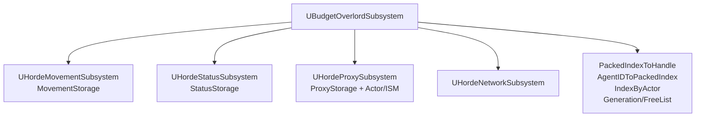
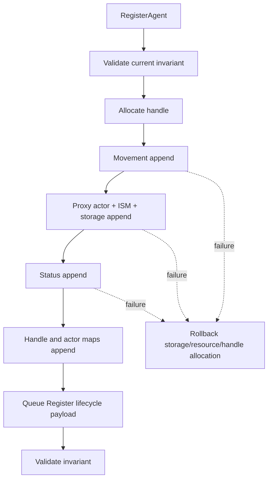
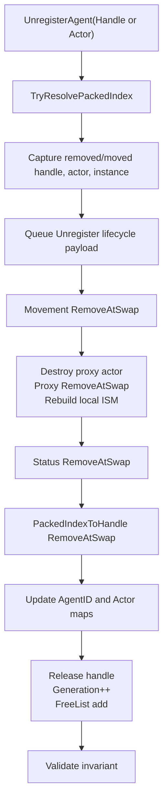
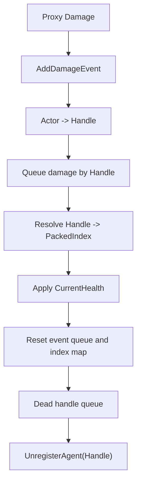
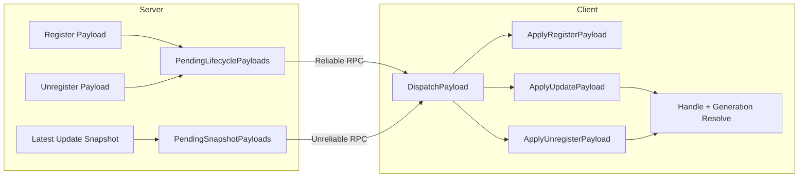

# Horde Agent Lifecycle Refactor

## 1. 작업 목적

현재 packed SoA 구조를 유지하면서 Horde Agent의 등록, 삭제, damage, proxy resource, network lifecycle 흐름을 `UBudgetOverlordSubsystem` 중심의 transaction으로 정리했다.

유지한 설계 방향:

- `UBudgetOverlordSubsystem`: Agent lifecycle과 cross-storage invariant 소유
- Movement, Status, Proxy subsystem: 동일 packed index를 공유하는 SoA storage
- `FHordeAgentHandle`: `AgentID + Generation` 기반 외부 안정 식별자
- Packed index: 내부 storage 접근 전용의 불안정한 index

## 2. 감사 보고서 검토 결과

`Docs/HordeAgentLifecycleAudit.md`를 먼저 검토한 뒤 현재 작업 트리의 실제 코드와 대조했다. 보고서의 핵심 지적 중 다음 항목은 현재 코드에서도 재현됐다.

- `HordeStatusStorage`가 `CurrentHealths`를 reserve/remove/validity 검사에서 빠뜨림
- `DeadCheck()`가 정방향 순회 중 packed index 삭제를 즉시 수행
- damage event가 packed index를 저장하고 tick 후 reset되지 않음
- public 삭제 경로가 packed index 중심임
- `FHordeNetworkFormat::Operation`이 RPC 직렬화 대상이 아님
- network receive가 operation을 분기하지 않고 `AgentID == PackedIndex`로 처리
- proxy unregister가 actor/ISM resource를 반환하지 않고 storage 배열만 제거
- register 실패 시 rollback 계약이 없음

## 3. 현재 코드에서 실제로 확인된 문제

### Status SoA 불일치

- 심각도: Critical
- 기존 동작: `MaxHealths`만 reserve/remove하고 `IsValid()`가 배열 크기 일치를 검사하지 않았다.
- 발생 조건: Agent 삭제 또는 status storage 검증 시점.
- 원인: `HordeStatusStorage`가 `CurrentHealths`를 SoA 구성원으로 끝까지 동일하게 다루지 않았다.
- 수정 내용: reserve, remove, validity check에 `CurrentHealths`를 포함했다.
- 수정 파일: `Source/OutBreak/Public/FlowField/Struct/HordeSystemType.h`
- 검증 방법: `OutBreakEditor Win64 Development` 빌드, `ValidateAgentRegistry()`의 storage invariant check.
- 남은 제약: runtime automation test는 추가하지 않았다.

### Packed Index 기반 삭제 API

- 심각도: High
- 기존 동작: `UnregisterAgent(int32 PackedIndex)`가 public C++ API였고 `DeadCheck()`가 직접 호출했다.
- 발생 조건: 외부 코드가 packed index를 오래 저장하거나 삭제 요청에 사용.
- 원인: stable handle 도입 이후에도 deletion boundary가 packed index였다.
- 수정 내용: public 삭제 API를 `FHordeAgentHandle` 및 `AActor*` 중심으로 바꾸고, packed index 삭제는 `UnregisterAgentByPackedIndex()` 내부 transaction으로 제한했다.
- 수정 파일: `BudgetOverlordSubsystem.h`, `BudgetOverlordSubsystem.cpp`, `HordeStatusSubsystem.cpp`
- 검증 방법: 호출부 검색, 빌드 성공.
- 남은 제약: Blueprint asset 내부 호출 여부는 C++ 검색만으로 확인할 수 없다. `RegisterAgent`는 BlueprintCallable로 유지됐다.

### Damage Event Stale Index

- 심각도: High
- 기존 동작: damage event가 `StatusIndex`를 저장하고 reset 없이 다음 tick에도 남을 수 있었다.
- 발생 조건: damage 수집 후 unregister/swap 이동 또는 다음 tick 재처리.
- 원인: event payload가 unstable packed index를 장기 저장했다.
- 수정 내용: damage event가 `FHordeAgentHandle`을 저장하고 적용 직전에 `TryResolvePackedIndex()`로 재조회한다. 처리 후 `HordeDamageEvents.Reset()` 및 `DamageEventIndexMap.Reset()`을 수행한다.
- 수정 파일: `HordeSystemType.h`, `HordeStatusSubsystem.cpp`
- 검증 방법: stale pattern 검색, 빌드 성공.
- 남은 제약: damage event는 같은 tick 안에서 actor 기준으로 coalesce한다.

### Proxy Resource Leak

- 심각도: High
- 기존 동작: proxy unregister가 storage 배열만 `RemoveAtSwap`하고 actor delegate, actor, ISM 정합성을 정리하지 않았다.
- 발생 조건: Agent 삭제.
- 원인: proxy resource 정책이 destroy/pool 중 하나로 확정되지 않았다.
- 수정 내용: pool 구현이 없으므로 destroy 정책을 적용했다. 삭제 시 damage delegate 제거, collision 비활성화, hidden 처리, actor destroy 후 proxy storage를 제거한다.
- 수정 파일: `HordeProxySubsystem.h`, `HordeProxySubsystem.cpp`, `HordeProxyHost.h`, `HordeProxyHost.cpp`
- 검증 방법: 빌드 성공, proxy unregister 경로 확인.
- 남은 제약: ISM instance id는 persistent id로 쓰지 않고 count mismatch 때 dense rebuild한다.

### Network Operation 및 Generation 미검증

- 심각도: Critical
- 기존 동작: RPC struct의 `Operation`이 `UPROPERTY`가 아니며, receive는 operation 분기 없이 `AgentID`를 packed index처럼 사용했다.
- 발생 조건: client register/update/unregister 수신, packed index 순서가 server와 client에서 달라질 때.
- 원인: handle generation mapping과 local packed index resolve가 receive path에 없었다.
- 수정 내용: `Operation`을 `UPROPERTY`로 직렬화하고 `ApplyRegisterPayload`, `ApplyUpdatePayload`, `ApplyUnregisterPayload`로 분리했다. Update/Unregister는 `TryResolvePackedIndex()`가 성공할 때만 적용한다.
- 수정 파일: `HordeSystemType.h`, `BudgetOverlordSubsystem.cpp`, `HordeNetworkSubsystem.h`, `HordeNetworkSubsystem.cpp`, `HordeNetworkBridgeActor.h`, `HordeNetworkBridgeActor.cpp`
- 검증 방법: build, stale `AgentID == PackedIndex` pattern 검색.
- 남은 제약: UE reliable RPC에 의존하며 별도 ack/retry protocol은 추가하지 않았다.

### Register Rollback 부재

- 심각도: High
- 기존 동작: movement/proxy/status append 중간 실패 시 일부 storage만 추가될 수 있었다.
- 발생 조건: proxy host/class 없음, spawn 실패, ISM instance 추가 실패, storage index mismatch.
- 원인: subsystem register가 성공/실패와 추가 index를 명시적으로 반환하지 않았다.
- 수정 내용: movement/status register는 추가 packed index를 반환하고, proxy register는 actor, proxy storage index, instance index, success flag를 반환한다. 실패 시 이미 추가된 storage/resource를 역순으로 rollback한다.
- 수정 파일: `BudgetOverlordSubsystem.cpp`, `HordeMovementSubsystem.h/.cpp`, `HordeStatusSubsystem.h/.cpp`, `HordeProxySubsystem.h/.cpp`
- 검증 방법: build, register failure branch static review.
- 남은 제약: 실제 proxy spawn failure automation scenario는 추가하지 않았다.

## 4. 이미 해결되어 있던 보고서 항목

- 삭제 전 removed/moved handle과 actor를 일부 캡처하는 흐름은 이미 있었다.
- `ReleaseAgentHandle()`이 generation을 증가시키고 free list로 반환하는 기본 정책은 이미 있었다.
- server build packet과 client receive를 net mode로 나누는 큰 흐름은 이미 있었다.
- movement/proxy/status가 packed SoA를 공유하는 구조 자체는 유지 가능했다.

## 5. 수정한 파일 목록

| 파일 | 변경한 함수/구조체 | 변경 이유 | 영향 범위 |
| --- | --- | --- | --- |
| `Source/OutBreak/Public/FlowField/Struct/HordeSystemType.h` | `FHordeNetworkFormat`, `HordeStatusStorage`, `HordeProxyStorage`, `HordeDamageEvent`, `HordeRemoveResult`, `ProxyRegisterResult` | SoA invariant, operation serialization, handle damage event | Horde lifecycle data contract |
| `Source/OutBreak/Public/FlowField/Subsystem/BudgetOverlordSubsystem.h` | public unregister API, resolve/debug helper declarations | packed index API 내부화 | C++ Horde lifecycle callers |
| `Source/OutBreak/Private/FlowField/Subsystem/BudgetOverlordSubsystem.cpp` | register rollback, unregister transaction, network apply, invariant check | lifecycle 소유권 집중 | 핵심 agent lifecycle |
| `Source/OutBreak/Public/FlowField/Subsystem/HordeMovementSubsystem.h` | `Register()` return type | append index 검증 | Budget transaction |
| `Source/OutBreak/Private/FlowField/Subsystem/HordeMovementSubsystem.cpp` | `Register()`, `Unregister()` | game thread check, storage validity | Movement storage |
| `Source/OutBreak/Public/FlowField/Subsystem/HordeStatusSubsystem.h` | `Register()` return type | append index 검증 | Status storage |
| `Source/OutBreak/Private/FlowField/Subsystem/HordeStatusSubsystem.cpp` | `AddDamageEvent()`, `Parallel()`, `DeadCheck()` | handle damage, reset queue, death commit | Damage/death lifecycle |
| `Source/OutBreak/Public/FlowField/Subsystem/HordeProxySubsystem.h` | instance getter, refresh/destroy helpers | proxy resource policy | Proxy lifecycle |
| `Source/OutBreak/Private/FlowField/Subsystem/HordeProxySubsystem.cpp` | `Register()`, `Unregister()`, `RefreshInstancesFromMovement()` | rollback-aware proxy resource handling | Proxy actor/ISM |
| `Source/OutBreak/Public/FlowField/HordeProxyHost.h` | `UpdateInstances()` signature | local instance id rebuild | ISM local resource |
| `Source/OutBreak/Private/FlowField/HordeProxyHost.cpp` | `AddInstance()`, `UpdateInstances()` | invalid component guard, dense rebuild | ISM update |
| `Source/OutBreak/Public/FlowField/Subsystem/HordeNetworkSubsystem.h` | lifecycle/snapshot queues | network path separation | RPC queueing |
| `Source/OutBreak/Private/FlowField/Subsystem/HordeNetworkSubsystem.cpp` | `AddPayload()`, `SendPayloads()` | reliable lifecycle, coalesced snapshot | Server-to-client sync |
| `Source/OutBreak/Public/FlowField/HordeNetworkBridgeActor.h` | reliable/unreliable RPC split | lifecycle reliability | Network bridge |
| `Source/OutBreak/Private/FlowField/HordeNetworkBridgeActor.cpp` | lifecycle/snapshot receive implementations | dispatch split | Client receive |

## 6. Lifecycle 소유권 구조

`UBudgetOverlordSubsystem`이 handle allocation, packed index mapping, cross-storage size, actor mapping, network lifecycle event 생성을 소유한다. Movement, Status, Proxy subsystem은 append/remove와 local resource 처리만 수행한다.



## 7. Register Transaction 변경

Register는 now all-or-nothing 방식이다.



Rollback은 외부에 노출되지 않은 handle generation을 증가시키지 않고 free list로 되돌린다.

## 8. Unregister Transaction 변경

삭제는 handle 또는 actor public API에서 시작하고, 내부에서 매번 packed index를 resolve한다.



## 9. Packed Index와 Handle API 변경

추가/변경된 public API:

- `bool UnregisterAgent(const FHordeAgentHandle& Handle)`
- `bool UnregisterAgent(const AActor* Actor)`
- `bool TryResolvePackedIndex(const FHordeAgentHandle& Handle, int32& OutPackedIndex) const`
- `bool TryGetHandleByActor(const AActor* Actor, FHordeAgentHandle& OutHandle) const`
- `FHordeAgentHandle GetHandleByPackedIndex(int32 PackedIndex) const`

`UnregisterAgentByPackedIndex()`와 `ReleaseAgentHandle()`은 internal transaction 전용으로 이동했다.

## 10. Status Storage 수정

`HordeStatusStorage`는 `MaxHealths`와 `CurrentHealths`를 항상 같은 길이로 유지한다.

- `Initialize()`가 두 배열을 모두 reserve
- `IsValid()`가 두 배열 `Num()` 일치 검사
- `RemoveAtSwap()`이 두 배열을 같은 packed index로 삭제
- 삭제 후 `check(IsValid())`

## 11. Damage Event 수정

damage collection은 actor를 handle로 변환해 저장하고, 적용 직전에 handle generation과 current packed index를 재검증한다.



## 12. Proxy Actor 및 Instance 정책

선택한 정책: destroy 정책.

- Actor damage delegate 제거
- collision 비활성화
- hidden 처리
- actor destroy
- proxy storage `RemoveAtSwap`
- movement/proxy storage 삭제 후 ISM instances를 dense order로 rebuild

서버의 ISM instance index는 network payload에서 제거했다. `ProxyStorage.InstanceIds`는 local resource 정합성 확인용이며 persistent network id가 아니다.

## 13. Network Register/Update/Unregister 분리

`FHordeNetworkFormat::Operation`을 `UPROPERTY()`로 직렬화 대상에 포함했다. Receive path는 operation별로 분기한다.



Update payload는 같은 handle에 대해 최신 snapshot만 유지한다. Unregister payload가 추가되면 같은 handle의 pending update를 제거한다.

## 14. Generation 및 Free List 보호

`TryResolvePackedIndex()`는 다음을 모두 검사한다.

- handle 자체 유효성
- `AgentID`가 `int32` index 범위 안인지
- `AgentGenerations`와 `AgentIDToPackedIndex` 범위
- generation 일치
- packed index가 `INDEX_NONE`이 아닌지
- `PackedIndexToHandle[PackedIndex] == Handle`

`ReleaseAgentHandle()`은 active packed index가 남아 있거나 free list에 중복 ID가 있으면 release하지 않는다. Generation overflow는 `ensureAlwaysMsgf`로 감지한다.

## 15. Game Thread 및 Commit Phase

storage 크기를 바꾸는 다음 경로에 `check(IsInGameThread())`를 추가했다.

- `RegisterAgent`
- `UnregisterAgentByPackedIndex`
- Movement `Register/Unregister`
- Status `Register/Unregister`
- Proxy `Register/Unregister`
- Damage queue collect/apply
- Proxy instance refresh

`ParallelFor` 내부에서는 storage add/remove, actor spawn/destroy, handle allocation/release를 수행하지 않는다.

## 16. 추가한 Invariant와 Debug Check

`UBudgetOverlordSubsystem::ValidateAgentRegistry()`를 추가했다. `DO_CHECK` 빌드에서 다음을 검사한다.

- Movement, Proxy, Status, Handle count 일치
- 각 SoA 내부 배열 count 일치
- packed index별 handle 유효성
- generation 일치
- `AgentIDToPackedIndex` 역참조 일치
- active AgentID 중복 없음
- free list 중복 없음
- active AgentID가 free list에 없음
- valid proxy actor의 `IndexByActor` 역참조 일치

호출 지점:

- register 시작 전 및 성공 직후
- unregister 시작 직전 및 완료 직후
- network snapshot build 직전
- client register/unregister 적용 후

## 17. 주요 코드 변경 전후 비교

이전 update receive 핵심 문제:

```cpp
const int32 ID = Handle.AgentID;
MovementStorage.Transforms[ID] = Payload.Transforms;
```

변경 후 의미:

```cpp
int32 PackedIndex = INDEX_NONE;
if (!TryResolvePackedIndex(Payload.Handle, PackedIndex))
{
    return;
}
MovementStorage.Transforms[PackedIndex] = Payload.Transforms;
```

이전 death check 핵심 문제:

```cpp
for (int32 i = 0; i < StatusStorage.Size(); ++i)
{
    if (StatusStorage.CurrentHealths[i] <= 0.f)
    {
        BudgetOverlord->UnregisterAgent(i);
    }
}
```

변경 후 의미:

```cpp
// collect handle first, then commit by handle
PendingDeadAgents.Add(BudgetOverlord->GetHandleByPackedIndex(PackedIndex));
BudgetOverlord->UnregisterAgent(Handle);
```

## 18. 테스트한 시나리오

자동화 테스트 코드는 추가하지 않았다. 이번 변경은 world subsystem, actor spawn, RPC, ISM component가 얽힌 runtime 시나리오라 별도 map/test harness 없이 단위 자동화를 넣으면 검증 신뢰도가 낮다고 판단했다.

수행한 검증:

- C++ 호출부 검색으로 stale packed index damage/update 패턴 제거 확인
- `git diff --check`
- `OutBreakEditor Win64 Development` 빌드

권장 수동 검증:

- Agent 1개 등록 후 삭제
- Agent 3개 등록 후 첫 index 삭제, moved handle/map 확인
- Agent 5개 등록 후 중간 index 삭제
- 같은 tick에 동일 actor damage 여러 번 적용
- unregister 이후 늦게 도착한 update 수신
- client local packed index와 server packed index가 다른 상태에서 update/unregister 수신
- proxy actor destroy 및 ISM instance count 재구성 확인

## 19. 빌드 결과

빌드 명령:

```text
C:\Program Files\Epic Games\UE_5.7\Engine\Build\BatchFiles\Build.bat OutBreakEditor Win64 Development -Project=C:\Users\Admin\Documents\Unreal Projects\OutBreak\OutBreak.uproject -WaitMutex -FromMsBuild
```

결과:

- UHT 통과
- C++ 컴파일 통과
- Link 통과
- Result: Succeeded

남은 빌드 경고:

- `Source/OutBreak/Private/UI/Widgets/OBMainMenuWidget.cpp`: `UUserWidget::bIsFocusable` deprecated warning. 이번 Horde lifecycle 변경 범위와 무관하다.

## 20. 남아 있는 위험 요소

- Blueprint asset 내부에서 `RegisterAgent` 또는 Horde 관련 함수를 호출하는지 C++ 검색만으로는 확인할 수 없다.
- reliable lifecycle은 Unreal reliable RPC에 의존한다. 별도 sequence/ack/retry protocol은 아직 없다.
- client register payload는 status max/current health만 포함한다. 더 많은 status state가 생기면 lifecycle payload 확장이 필요하다.
- proxy actor destroy 정책을 적용했지만 object pool은 구현하지 않았다.
- ISM instance id는 persistent id가 아니며 count mismatch 때 rebuild한다. instance-level effect나 persistent material state가 생기면 별도 mapping이 필요하다.
- runtime automation test는 추가하지 않았다.

## 21. 후속 권장 작업

- Horde lifecycle automation test용 minimal test world/map을 추가한다.
- lifecycle payload에 sequence number를 추가해 duplicate/out-of-order register/unregister를 더 명확히 처리한다.
- proxy pool이 필요해지는 시점에 destroy 정책을 pool 반환 정책으로 교체한다.
- `FlowFieldSettings`의 network update budget/interval을 `BuildPacket()`에 연결한다.
- Blueprint asset reference audit를 별도로 수행한다.
