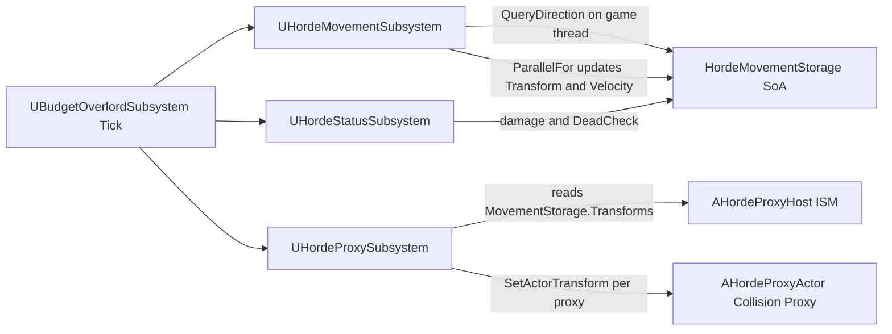
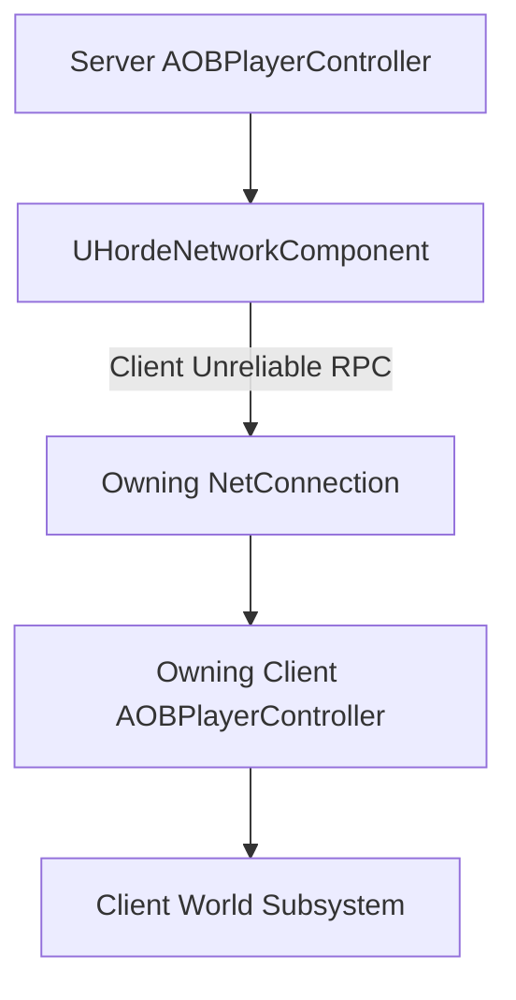

# Horde 이동 네트워크 아키텍처 분석

작성 기준: 2026-07-07 현재 `C:\Users\Admin\Documents\Unreal Projects\OutBreak` 워크트리. 이 문서는 소스와 설정을 읽은 분석 보고서이며, 소스 코드와 프로젝트 설정은 수정하지 않았다.

## 1. 분석 목적

목표는 현재 Horde 시뮬레이션의 중앙 집중 SoA storage를 유지하면서, 서버가 클라이언트별로 필요한 Agent 이동 스냅숏 배열만 선별해 보내고, 클라이언트가 로컬 Subsystem에서 보간, 예측, 시각화를 수행하는 네트워크 구조를 정하는 것이다.

이 보고서는 다음을 구분한다.

- 프로젝트에서 확인한 사실: 실제 파일과 경로를 근거로 기록한다.
- Unreal 네트워크 일반 제약: 현재 프로젝트에 아직 구현되지 않았지만 설계 판단에 필요한 엔진 규칙으로 분리한다.
- 권장 구현안: 현재 코드와 결합 난이도, Owning Connection 안정성, Dedicated/Listen Server 호환성을 기준으로 제안한다.

주 결론은 `AOBPlayerController`에 Horde 전송용 `UActorComponent`를 붙이고, 그 컴포넌트의 `Client, Unreliable` RPC로 이동 Batch를 소유 클라이언트에 전달하는 구조다. `UHordeNetworkSubsystem`은 직접 복제 객체가 아니라 per-client 스케줄링과 Batch 구성 책임만 가져야 한다.

## 2. 현재 프로젝트 구조

확인된 프로젝트와 엔진 설정은 다음과 같다.

- UE 버전은 `OutBreak.uproject:3`의 `EngineAssociation = 5.7`이다.
- `Source/OutBreakServer.Target.cs:10`에 `TargetType.Server`가 있어 Dedicated Server 빌드 타깃이 존재한다.
- `Config/DefaultEngine.ini:172-185`에서 `GameNetDriver`는 `OnlineSubsystemSteam.SteamNetDriver`, fallback은 `OnlineSubsystemUtils.IpNetDriver`다.
- `Config/DefaultEngine.ini:176-181`에서 Steam OnlineSubsystem이 활성화되어 있고 `bInitServerOnClient=true`다.
- `Config/DefaultGame.ini:23`에서 `MaxPlayers=100`이다.
- `OutBreak.uproject:29`, `Source/OutBreak/OutBreak.Build.cs:32-33`에서 OnlineSubsystem/OnlineSubsystemUtils 사용이 확인된다.
- `Config/DefaultEngine.ini`와 `Source/OutBreak` 검색 기준으로 `Iris`, `ReplicationGraph`, `AddReplicatedSubObject`, `FFastArraySerializer` 사용은 확인되지 않았다.

게임 클래스 구성은 `Source/OutBreak/Private/Game/GameMode/OBGameModeBase.cpp:13-17`에서 확인된다.

- `DefaultPawnClass = AOBCharacterBase`
- `PlayerControllerClass = AOBPlayerController`
- `PlayerStateClass = AOBPlayerStateBase`
- `GameStateClass = AOBGameStateBase`
- `HUDClass = AOBHUD`

Horde 관련 핵심 클래스는 다음 파일에 존재한다.

- `UHordeMovementSubsystem`: `Source/OutBreak/Public/FlowField/Subsystem/HordeMovementSubsystem.h`
- `UHordeProxySubsystem`: `Source/OutBreak/Public/FlowField/Subsystem/HordeProxySubsystem.h`
- `UHordeStatusSubsystem`: `Source/OutBreak/Public/FlowField/Subsystem/HordeStatusSubsystem.h`
- `UBudgetOverlordSubsystem`: `Source/OutBreak/Public/FlowField/Subsystem/BudgetOverlordSubsystem.h`
- `UHordeNetworkSubsystem`: `Source/OutBreak/Public/FlowField/Subsystem/HordeNetworkSubsystem.h`
- `AHordeNetworkBridge`: `Source/OutBreak/Public/FlowField/HordeNetworkBridge.h`
- 공용 Horde storage/handle: `Source/OutBreak/Public/FlowField/Struct/HordeSystemType.h`

## 3. 현재 이동 데이터 흐름

현재 Horde Agent의 위치와 회전은 `HordeMovementStorage`에 있다. `Source/OutBreak/Public/FlowField/Struct/HordeSystemType.h:56-65` 기준으로 storage는 다음 SoA 배열을 가진다.

- `Transforms`
- `MoveSpeeds`
- `Velocities`
- `CachedFlowDirections`
- `MovementStates`
- `TraversalStates`
- `PriorityTiers`

`UHordeMovementSubsystem`은 `MovementStorage`를 private 멤버로 보유한다(`HordeMovementSubsystem.h:31`). `Register()`는 `MovementStorage.Add()`를 호출하고, `Unregister()`는 `MovementStorage.RemoveAtSwap()`을 호출한다(`HordeMovementSubsystem.cpp:19-29`).

현재 Tick 흐름은 `UBudgetOverlordSubsystem::Tick()`이 중앙에서 실행한다(`BudgetOverlordSubsystem.cpp:39-43`). 순서는 다음과 같다.

1. `MovementSubsystem->ProcessSystem(DeltaTime)`
2. `StatusSubsystem->ProcessSystem(DeltaTime)`
3. `ProxySubsystem->ProcessSystem(DeltaTime)`

이동 계산 내부는 두 단계다.

- 게임 스레드에서 모든 Agent에 대해 `FlowFieldSubsystem->QueryDirection()`을 호출해 `CachedFlowDirections`를 채운다(`HordeMovementSubsystem.cpp:51-55`).
- 이후 `ParallelFor`에서 `Transforms`, `Velocities`, `CachedFlowDirections`, `MoveSpeeds`의 raw pointer를 사용해 위치, 회전, 속도를 갱신한다(`HordeMovementSubsystem.cpp:63-113`).

따라서 네트워크 전송용 데이터 추출은 `ParallelFor` 내부가 아니라, `MovementSubsystem->ProcessSystem()` 완료 뒤 게임 스레드의 Publish 단계에서 수행하는 것이 안전하다. 현재 Tick 순서라면 `Movement`와 `Status` 이후, `Proxy` 전이나 후에 한 프레임의 일관된 snapshot을 읽는 단계가 필요하다.



## 4. 요구되는 서버·클라이언트 책임 분리

서버 책임은 다음으로 분리하는 것이 맞다.

- `UBudgetOverlordSubsystem`: Horde lifecycle과 Tick 순서의 소유자. 현재도 Movement, Status, Proxy 의존성을 초기화하고 capacity를 잡는다(`BudgetOverlordSubsystem.cpp:18-23`, `96-102`).
- `UHordeMovementSubsystem`: 서버 권위 위치, 회전, 속도 계산. 현재 `ParallelFor`에서 movement SoA를 직접 갱신한다.
- `UHordeStatusSubsystem`: 데미지 queue, 체력, 사망 판정. 현재 `AddDamageEvent`, `Parallel`, `DeadCheck`를 가진다.
- `UHordeNetworkSubsystem`: 직접 복제되는 객체가 아니라 클라이언트별 관심 Agent 선별, 우선순위, 전송 예산, Batch 구성 담당으로 두는 것이 적합하다. 현재 이 Subsystem은 빈 껍데기다(`HordeNetworkSubsystem.h:13`).
- 네트워크 전송 객체: `AOBPlayerController`에 붙은 `UActorComponent`를 주 권장안으로 둔다.

클라이언트 책임은 서버 전체 시뮬레이션 복제가 아니라 로컬 표시용 시뮬레이션이다.

- Batch 수신 후 sequence, handle, generation 검증
- `AgentId -> LocalPackedIndex`로 client local movement storage 갱신
- 목표 위치와 yaw 저장
- interpolation/correction buffer 갱신
- proxy 또는 ISM 시각화 갱신

현재 프로젝트에는 별도 `UHordeClientSimulationSubsystem` 또는 client 전용 Horde movement storage가 확인되지 않았다. 따라서 구현 단계에서는 서버용 `HordeMovementStorage`를 그대로 복제하지 말고, 클라이언트용 mirror storage와 correction buffer를 추가하는 경계부터 잡아야 한다.

## 5. Unreal 네트워크 제약

프로젝트에서 확인한 네트워크 사용 패턴은 legacy replication 기반이다.

- `UOBInventoryComponent`와 `UOBEquipmentComponent`는 `SetIsReplicatedByDefault(true)`를 사용한다(`OBInventoryComponent.cpp:18`, `OBEquipmentComponent.cpp:21`).
- `UOBInventoryComponent`에는 `UFUNCTION(Server, Reliable)`이 있다(`OBInventoryComponent.h:56`).
- `AOBCharacterBase`, `AOBGrenadeProjectile`에는 `NetMulticast, Unreliable` 예시가 있다(`OBCharacterBase.h:41-45`, `OBGrenadeProjectile.h:36`).
- `AOBPlayerStateBase`의 AbilitySystemComponent는 `SetIsReplicated(true)`와 Mixed replication mode를 사용한다(`OBPlayerStateBase.cpp:12-13`).

일반 Unreal 제약은 다음과 같다.

- `UWorldSubsystem`은 자체 replication 채널이나 owning connection을 갖지 않는다. `UHordeNetworkSubsystem`에 `UFUNCTION(Client)`를 선언해도 소유 클라이언트로 자동 전송되는 구조가 아니다.
- Client RPC는 서버에서 호출되고, 해당 Actor 또는 ActorComponent의 owning connection을 가진 클라이언트에서 실행된다.
- PlayerController는 기본적으로 각 연결마다 서버와 소유 클라이언트에 존재하고, 서버가 특정 클라이언트로 RPC를 보내기 쉬운 경로다.
- NetMulticast는 관련 클라이언트 전체에 같은 호출을 보내는 방식이므로, 클라이언트별로 서로 다른 Agent 배열을 보내려는 요구사항에는 기본 전송 방식으로 맞지 않는다.
- Reliable RPC를 지속적인 movement snapshot에 쓰면 손실 시 재전송 대기와 큐 적체가 발생해 최신 위치보다 오래된 위치가 늦게 도착하는 문제가 생길 수 있다.
- Unreliable movement snapshot은 일부 손실되어도 다음 snapshot으로 회복되므로 지속 이동 보정에 적합하다.

## 6. Network Bridge Actor 분석

프로젝트에는 이미 `AHordeNetworkBridge`가 있다. 하지만 현재 구현은 기본 Actor shell이다.

- 헤더는 `AActor` 파생, `BeginPlay`, `Tick`만 선언한다(`HordeNetworkBridge.h:8-22`).
- cpp는 `PrimaryActorTick.bCanEverTick = true`와 빈 `BeginPlay`, `Tick`만 가진다(`HordeNetworkBridge.cpp:10-24`).
- `bReplicates`, owner 설정, Client RPC, relevancy 설정은 확인되지 않는다.

Bridge Actor를 사용할 경우 장점은 전송 객체가 PlayerController 코드에서 분리된다는 점이다. 그러나 현재 프로젝트 기준 단점이 더 크다.

- 접속마다 Actor를 생성, owner 지정, 삭제해야 한다.
- Actor relevancy와 lifetime 관리 책임이 새로 생긴다.
- 현재 `AHordeNetworkBridge`는 아무 네트워크 구현이 없어 실제로는 거의 새로 만드는 수준이다.
- Bridge Actor가 PlayerController의 owning connection을 올바르게 쓰려면 서버에서 `SetOwner(PlayerController)` 또는 spawn owner 설정이 필요하다.
- Dedicated Server와 Listen Server, seamless travel, logout 처리까지 별도 검증해야 한다.

결론: 현재 프로젝트에서는 별도 Network Bridge Actor가 필수는 아니다. 이미 존재하는 shell을 재사용할 수는 있지만, 현 단계 주 권장안으로는 과하다. PlayerController 수정 충돌이 심하거나 bridge를 Blueprint/level actor와 분리 운용해야 할 이유가 생길 때 대안으로 남긴다.

## 7. UActorComponent 분석

주 권장안은 `AOBPlayerController`에 전송용 `UActorComponent`를 붙이는 것이다.

근거는 다음과 같다.

- `AOBGameModeBase`가 `PlayerControllerClass = AOBPlayerController::StaticClass()`로 지정한다(`OBGameModeBase.cpp:14`).
- `AOBPlayerController`는 `APlayerController` 파생이다(`OBPlayerController.h:19`).
- PlayerController는 서버와 소유 클라이언트의 연결 관계가 명확해 per-client Client RPC 경로로 적합하다.
- 프로젝트는 이미 `UActorComponent` replication 패턴을 사용한다. `UOBInventoryComponent`와 `UOBEquipmentComponent`가 대표 예다.
- 컴포넌트는 별도 Actor spawn, relevancy, owner 설정 없이 PlayerController의 네트워크 소유 관계를 활용할 수 있다.
- 현재 PlayerController는 입력과 recoil 등 플레이어 로직을 갖고 있으므로, Horde 전송 자체를 PlayerController 본문에 직접 넣기보다 component로 분리하는 편이 책임 분리가 낫다.

컴포넌트 생성 위치는 두 가지가 가능하다.

- C++ default subobject로 `AOBPlayerController` 생성자에서 붙인다. 현재 `AOBPlayerController`에는 명시 생성자가 없으므로 구현 시 생성자 추가가 필요하다.
- Blueprint PlayerController 파생에서 component를 붙인다. 다만 현재 GameMode는 C++ class를 직접 지정하므로 C++ 생성이 더 명확하다.

`SetIsReplicatedByDefault(true)`는 컴포넌트가 replicated property를 갖거나 서버 RPC 수신도 해야 한다면 켜는 것이 안전하다. Client RPC만 사용할 경우에도 네트워크 주소 지정과 컴포넌트 복제 생성을 명확히 하기 위해 켜는 편을 권장한다. 기존 `UOBInventoryComponent`, `UOBEquipmentComponent`와 같은 프로젝트 스타일이다.

결론: `AOBPlayerController` 소유 `UHordeNetworkComponent`가 가장 단순하고 안전한 주 권장안이다.

## 8. Replicated UObject Subobject 분석

일반 `UObject`는 독립적인 네트워크 엔드포인트가 아니다. 네트워크 채널과 owning connection은 복제 Actor를 통해 제공된다. 따라서 UObject 방식을 쓰려면 `AOBPlayerController` 같은 replicated actor를 Outer/owner로 두고 replicated subobject로 등록해야 한다.

현재 프로젝트에서 확인된 사실은 다음과 같다.

- `AddReplicatedSubObject`, `ReplicateSubobjects`, `GetFunctionCallspace`, `CallRemoteFunction`, `IsSupportedForNetworking` 사용은 검색되지 않았다.
- 기존 네트워크 확장 패턴은 Actor, ActorComponent, replicated property, RPC다.
- Iris/ReplicationGraph 사용 설정도 확인되지 않았다.

UObject subobject 방식으로 갈 경우 필요한 항목은 다음이다.

```cpp
virtual bool IsSupportedForNetworking() const override;
virtual int32 GetFunctionCallspace(UFunction* Function, FFrame* Stack) override;
virtual bool CallRemoteFunction(UFunction* Function, void* Parameters, FOutParmRec* OutParms, FFrame* Stack) override;
```

그리고 owner actor 쪽에서 다음 수명 처리가 필요하다.

```cpp
AddReplicatedSubObject(HordeNetworkObject);
RemoveReplicatedSubObject(HordeNetworkObject);
```

legacy replication에서는 `ReplicateSubobjects()` override 방식과 Registered Subobject List 방식 중 하나를 선택해야 한다. UE 5.7에서는 registered subobject list를 사용할 수 있지만, 프로젝트가 현재 그 패턴을 전혀 쓰지 않으므로 첫 구현 난이도와 디버깅 비용이 ActorComponent보다 높다.

UObject 방식의 실제 장점은 ActorComponent보다 더 순수한 data/service object로 둘 수 있다는 점뿐이다. 하지만 이 요구사항은 per-client RPC endpoint가 필요하므로 결국 PlayerController의 네트워크 채널에 의존한다. 현재 프로젝트에서는 UObject subobject가 ActorComponent보다 명확히 나은 이유가 확인되지 않는다.

결론: UObject subobject는 대안으로는 가능하지만 주 권장안이 아니다. 단순히 “가볍다”는 이유로 선택하면 네트워크 라우팅 구현만 늘어난다.

## 9. Client RPC와 배열 전송 방식 분석

이동 snapshot은 `Client, Unreliable` RPC batch가 적합하다.

권장 인터페이스 예시는 다음 수준이다.

```cpp
USTRUCT()
struct FHordeMovementNetItem
{
    GENERATED_BODY()

    UPROPERTY()
    uint32 AgentId = 0;

    UPROPERTY()
    uint32 Generation = 0;

    UPROPERTY()
    FVector_NetQuantize10 Location;

    UPROPERTY()
    uint16 CompressedYaw = 0;
};

USTRUCT()
struct FHordeMovementNetBatch
{
    GENERATED_BODY()

    UPROPERTY()
    uint32 Sequence = 0;

    UPROPERTY()
    float ServerTimeSeconds = 0.0f;

    UPROPERTY()
    TArray<FHordeMovementNetItem> Items;
};
```

```cpp
UCLASS(ClassGroup=(OutBreak), meta=(BlueprintSpawnableComponent))
class OUTBREAK_API UHordeNetworkComponent : public UActorComponent
{
    GENERATED_BODY()

public:
    UHordeNetworkComponent();

    UFUNCTION(Client, Unreliable)
    void ClientReceiveMovementBatch(const FHordeMovementNetBatch& Batch);
};
```

```cpp
void UHordeNetworkComponent::ClientReceiveMovementBatch_Implementation(
    const FHordeMovementNetBatch& Batch)
{
    if (UWorld* World = GetWorld())
    {
        if (UHordeClientSimulationSubsystem* Subsystem =
            World->GetSubsystem<UHordeClientSimulationSubsystem>())
        {
            Subsystem->ConsumeMovementBatch(Batch);
        }
    }
}
```

현재 `HordeNetworkFormat`는 `HordeSystemType.h:211-225`에 존재하지만 그대로 RPC payload로 쓰기에는 적합하지 않다.

- `USTRUCT`/`UPROPERTY`가 아니다.
- `FTransform` 전체를 담는다.
- sequence와 server time이 없다.
- client별 전송 budget을 고려한 batch header가 없다.

첫 구현 payload는 `AgentId`, `Generation`, `Location`, `Yaw`만으로 시작하는 것이 좋다. Velocity는 처음부터 필수는 아니다. 클라이언트는 이전 snapshot과 현재 snapshot 차이로 시각적 속도를 추정할 수 있고, 필요하면 이후 `FVector_NetQuantize10 Velocity` 또는 `FVector_NetQuantizeNormal FlowDirection`을 추가한다.

Fast Array Serializer는 현재 movement snapshot에는 주 권장안이 아니다. 요구사항이 “서버가 이번 tick에 각 클라이언트별 배열을 직접 구성해 전달”하는 구조이고, 대부분 Agent가 계속 움직여 거의 모든 항목이 자주 바뀐다. 이 경우 replicated property 기반 Fast Array는 per-client 필터링과 전송 예산 제어가 Client RPC batch보다 불리하다. 다만 Agent roster, 외형, 영구 상태처럼 드물게 바뀌고 복구 가능해야 하는 상태에는 별도 검토 가치가 있다.

## 10. Agent 등록·제거와 이동 정보 분리

Agent 등록/제거는 movement snapshot과 분리해야 한다.

현재 `UBudgetOverlordSubsystem::RegisterAgent()`에는 `NetworkSubsystem->AgentRegistered()` 주석이 있고(`BudgetOverlordSubsystem.cpp:79-80`), `UnregisterAgent()`에도 `NetworkSubsystem->AgentUnegistered()` 주석이 있다(`BudgetOverlordSubsystem.cpp:91-92`). 코드 의도상 lifecycle event와 movement update를 분리하려는 흔적이 이미 있다.

권장 분리는 다음과 같다.

- Agent 등록: Reliable Client RPC 또는 복구 가능한 replicated roster 상태
- Agent 제거/사망 확정: Reliable Client RPC 또는 복구 가능한 replicated roster 상태
- 외형 변경, archetype 변경: Reliable 또는 replicated state
- 사망 직전 시각 효과, 피격 표시: relevancy 기반 event
- 지속 이동 snapshot: Unreliable Client RPC

중요한 전제는 packed index를 네트워크 ID로 보내지 않는 것이다. 현재 storage는 `RemoveAtSwap()`을 사용한다(`HordeSystemType.h:106-117`, `200-207`). 제거 시 마지막 Agent가 제거 index로 이동하므로 서버와 클라이언트의 packed index는 쉽게 달라진다.

이미 `HordeAgentHandle`은 `AgentID + Generation` 구조로 존재한다(`HordeSystemType.h:28-41`). 그러나 현재 코드에서 `AgentID -> PackedIndex`, `PackedIndex -> AgentID`, free list, generation 증가 정책은 확인되지 않았다. 네트워크 구현 전에 이 mapping을 확정해야 한다.

## 11. 우선순위와 전송 예산 설계

현재 프로젝트에서 재사용 가능한 입력은 다음이다.

- `MovementStorage.PriorityTiers`: 존재하지만 계산/사용 로직은 확인되지 않았다(`HordeSystemType.h:65`, `101-103`).
- `MovementStorage.MovementStates`, `TraversalStates`: 존재하지만 실제 state 전환 사용은 확인 범위에서 명확하지 않다.
- `HordeStatusSubsystem`의 damage/death 흐름: combat relevancy 입력으로 확장 가능하다.
- `UFlowFieldSettings`의 `NetworkUpdateInterval = 0.1f`, `OffscreenUpdateIntervalScale = 4.0f`, `MaxAgentCount = 500`이 존재한다(`FlowFieldSettings.h:51-62`). 단, 현재 public getter는 `MaxAgentCount`, `MaxVelocity`, proxy class에만 있고 network interval getter는 없다.
- `AnimationBudgetAllocator`, `AnimToTexture` 플러그인과 모듈 사용이 확인된다(`OutBreak.uproject:53-57`, `OutBreak.Build.cs:26`). 시각화/LOD budget과 연계 가능하지만 네트워크 priority hook은 아직 확인되지 않았다.

권장 priority tier는 다음이다.

| Tier | 조건 | 권장 주기 범위 |
| --- | --- | ---: |
| Critical | 플레이어와 충돌/공격 중, 피격/사망 직전, Traversal 중 | 0.05-0.10s |
| High | 근거리, 화면 안, 빠른 이동 | 0.10-0.20s |
| Normal | 중거리, 곧 보일 수 있는 Agent | 0.25-0.50s |
| Low | 원거리, 화면 밖, 군집 중심 유지 정도면 되는 Agent | 0.75-2.00s |
| Dormant | relevance 없음 | event only |

전체 Agent를 매 전송마다 정렬하는 방식은 500 Agent 규모에서는 가능하더라도, `MaxPlayers=100` 설정을 고려하면 클라이언트별 전체 정렬은 쉽게 비싸진다. 첫 구현은 다음 방식이 적합하다.

- 거리 bucket + priority tier bucket
- Agent별 last sent time / age 누적
- Critical bucket 우선 전송
- 나머지는 round robin 또는 score 상위 일부 전송
- batch당 Agent 수 제한과 byte budget 적용

권장 초기 범위는 클라이언트당 한 network tick에 32-96 Agent다. `NetworkUpdateInterval = 0.1f`가 있으므로 10Hz 기준 가까운 Agent는 10Hz, 중거리 2-4Hz, 원거리 0.5-1Hz부터 시작하는 편이 안전하다. 이는 `MaxAgentCount=500`을 근거로 한 범위 제안이며 절대 최적값은 아니다.

## 12. Client Subsystem 파싱 및 로컬 시뮬레이션 구조

클라이언트 처리 순서는 다음을 권장한다.

1. `UHordeNetworkComponent::ClientReceiveMovementBatch()` 수신
2. `UHordeClientSimulationSubsystem::ConsumeMovementBatch()`로 전달
3. batch `Sequence`가 마지막 처리 sequence보다 오래되면 폐기
4. 각 item의 `AgentId + Generation` 검증
5. `AgentId -> LocalPackedIndex` mapping으로 client local storage index 검색
6. 등록되지 않은 Agent의 movement item은 pending queue 또는 폐기 정책 적용
7. target location/yaw/server time 저장
8. correction buffer 갱신
9. client tick에서 interpolation 또는 제한된 prediction 적용
10. proxy/ISM 시각화 갱신

클라이언트가 서버와 동일한 원본 계산을 모두 수행할 필요는 없다.

- Flow Field Integration Cost, `NavNodeRef`, 서버 충돌 판정, 서버 데미지 판정, 서버 우선순위 계산, 서버 이동 의사결정은 서버 권위 데이터다.
- `DefaultEngine.ini:192`에서 `bAllowClientSideNavigation=True`는 확인되지만, 이것만으로 서버와 동일한 FlowField 결과를 보장한다고 볼 수 없다.
- 기본 구조는 서버 snapshot 기반 로컬 보간/제한 예측이어야 한다.

Client local storage는 현재 서버의 `HordeMovementStorage`와 비슷한 SoA 구조를 가져도 되지만, 다음 client-only 배열이 추가로 필요하다.

- `TargetLocations`
- `TargetYaws`
- `LastReceivedSequences`
- `LastReceivedServerTimes`
- `CorrectionRemainingTimes`
- `bRegistered`

## 13. 후보별 비교표

| 후보 | 장점 | 단점 | 구현 복잡도 | 현재 프로젝트 적합도 | 추천 여부 |
| --- | --- | --- | ---: | ---: | --- |
| Bridge Actor | 전송 책임을 독립 Actor로 분리 가능. 기존 `AHordeNetworkBridge` 이름은 있음. | 현재 구현은 빈 Actor shell. per-client spawn, owner, relevancy, logout cleanup 필요. 별도 Actor lifetime이 늘어남. | 중간 | 중간 이하 | 대안 |
| ActorComponent | PlayerController owning connection을 그대로 사용. 기존 replicated component 패턴과 일치. 별도 Actor 필요 없음. Client RPC 경로가 명확함. | `AOBPlayerController`에 생성자 또는 BP component 추가 필요. 컴포넌트 수명은 PC 수명에 종속됨. | 낮음 | 높음 | 주 권장 |
| UObject Subobject | ActorComponent보다 순수 service object로 분리 가능. | 독립 endpoint가 아님. Outer/owner actor, subobject 등록, callspace routing 구현 필요. 프로젝트 내 선례 없음. 디버깅 어려움. | 높음 | 낮음 | 비권장 |

## 14. 최종 추천 아키텍처

최종 권장 구조는 다음이다.

```text
AOBPlayerController
└─ UHordeNetworkComponent
       Client Unreliable RPC
       ↓
UHordeClientSimulationSubsystem
```

서버는 `UHordeNetworkSubsystem`에서 per-client batch를 구성하되, 실제 RPC 호출은 각 클라이언트의 `AOBPlayerController`에 붙은 `UHordeNetworkComponent`를 통해 수행한다.

```mermaid
flowchart LR
    A[Server Horde MovementStorage]
    B[UHordeNetworkSubsystem]
    C[AOBPlayerController per connection]
    D[UHordeNetworkComponent]
    E[Client RPC]
    F[UHordeClientSimulationSubsystem]
    G[Client Local Movement Storage]
    H[Client Proxy or ISM Visualization]

    A --> B
    B -->|per-client interest and budget| C
    C --> D
    D -->|ClientReceiveMovementBatch unreliable| E
    E --> F
    F --> G
    G --> H
```



객체 소유와 RPC 흐름은 다음이다.



## 15. 권장 클래스 책임

`UBudgetOverlordSubsystem`

- 현재처럼 Horde 하위 subsystem 의존성과 Tick 순서를 관리한다.
- Agent 등록/제거 transaction의 중심이 된다.
- 네트워크 lifecycle hook을 호출하되 직접 RPC payload를 직렬화하지 않는다.

`UHordeMovementSubsystem`

- 서버 권위 movement SoA를 갱신한다.
- `ParallelFor` 완료 뒤 읽을 수 있는 snapshot source를 제공한다.
- 네트워크 객체나 PlayerController에는 접근하지 않는다.

`UHordeNetworkSubsystem`

- 접속 중인 PlayerController 또는 등록된 `UHordeNetworkComponent`를 찾는다.
- 클라이언트별 관심 Agent와 priority를 계산한다.
- `FHordeMovementNetBatch`를 구성한다.
- sequence와 server time을 기록한다.
- 게임 스레드에서 `UHordeNetworkComponent::ClientReceiveMovementBatch()`를 호출한다.

`UHordeNetworkComponent`

- PlayerController 소유 네트워크 transport endpoint다.
- Client RPC만 받고, 수신 즉시 client simulation subsystem으로 넘긴다.
- 가능하면 Horde storage와 scheduling 로직을 직접 갖지 않는다.

`UHordeClientSimulationSubsystem`

- 수신 batch 검증, local storage 갱신, 보간/보정/예측을 담당한다.
- proxy/ISM 갱신은 별도 client visualization subsystem으로 분리 가능하다.

## 16. 권장 데이터 구조

현재 `HordeAgentHandle`은 재사용하되, storage mapping이 필요하다.

```cpp
struct FHordeAgentRegistry
{
    TArray<uint32> PackedIndexToAgentId;
    TMap<uint32, int32> AgentIdToPackedIndex;
    TArray<uint32> Generations;
    TArray<uint32> FreeAgentIds;
};
```

movement item은 첫 구현에서 다음 정도가 적합하다.

```cpp
USTRUCT()
struct FHordeMovementNetItem
{
    GENERATED_BODY()

    UPROPERTY()
    uint32 AgentId;

    UPROPERTY()
    uint32 Generation;

    UPROPERTY()
    FVector_NetQuantize10 Location;

    UPROPERTY()
    uint16 CompressedYaw;
};
```

batch는 다음 header를 가진다.

```cpp
USTRUCT()
struct FHordeMovementNetBatch
{
    GENERATED_BODY()

    UPROPERTY()
    uint32 Sequence;

    UPROPERTY()
    float ServerTimeSeconds;

    UPROPERTY()
    TArray<FHordeMovementNetItem> Items;
};
```

`FTransform`은 위치, 회전 quaternion, scale까지 포함하므로 이동 snapshot에는 과하다. 현재 Horde Agent가 roll/pitch/scale 변화가 필요하지 않다면 `Location + CompressedYaw`가 첫 구현에 적합하다. Velocity는 보간 품질이 부족하다고 검증된 뒤 추가한다.

## 17. 예상 호출 흐름

서버 tick의 권장 흐름은 다음이다.

```text
UBudgetOverlordSubsystem::Tick
    MovementSubsystem->ProcessSystem
        QueryDirection on game thread
        ParallelFor movement update
    StatusSubsystem->ProcessSystem
        damage apply
        death/lifecycle queue
    HordeNetworkSubsystem->PublishMovementBatches
        collect PlayerControllers
        read MovementStorage on game thread
        build per-client batches
        call UHordeNetworkComponent Client RPC
    ProxySubsystem->ProcessSystem
        server-side proxy/ISM update if needed
```

클라이언트 수신 흐름은 다음이다.

```text
UHordeNetworkComponent::ClientReceiveMovementBatch
    UHordeClientSimulationSubsystem::ConsumeMovementBatch
        validate Sequence
        validate AgentId + Generation
        update correction targets
Client Tick
    interpolate/predict local transforms
    update proxy/ISM visualization
```

`ParallelFor` 내부에서 RPC를 호출하거나 `AActor`, `UObject`, `UActorComponent`에 접근하면 안 된다. 현재 movement code도 raw array pointer만 넘기는 구조이므로, network publish 단계는 그 이후 게임 스레드에 두는 것이 일관된다.

## 18. 단계별 구현 순서

1. Agent handle registry 확정: `AgentID + Generation`, `AgentIdToPackedIndex`, `PackedIndexToAgentId`, free list를 추가한다.
2. `RemoveAtSwap()` transaction 정리: removed/moved agent 정보를 반환하고 모든 subsystem mapping을 갱신할 수 있게 한다.
3. 현재 unregister 위험 수정 전제 정리: `HordeStatusStorage::RemoveAtSwap()`의 `CurrentHealths` 누락, `DeadCheck()` 순회, `IndexByActor` stale 문제, proxy actor/ISM 반환 문제를 먼저 해결해야 네트워크 mapping이 안정된다.
4. network payload `USTRUCT` 정의: `FHordeMovementNetItem`, `FHordeMovementNetBatch`, lifecycle event struct를 분리한다.
5. `AOBPlayerController` 기반 `UHordeNetworkComponent`를 추가한다.
6. 서버에서 `UHordeNetworkSubsystem`이 PlayerController/component를 찾는 방식을 정한다. 초기에는 World의 PlayerController 순회 + `FindComponentByClass`가 단순하고, 이후 PostLogin/Logout 등록 map으로 최적화한다.
7. `UHordeNetworkSubsystem`에서 클라이언트별 batch 구성, sequence, server time 기록을 추가한다.
8. Client RPC 수신 후 client subsystem으로 전달한다.
9. client local movement storage와 correction buffer를 구축한다.
10. 위치와 yaw 보간을 적용한다.
11. Agent 등록/제거 reliable 경로를 분리한다.
12. priority tier, 거리 bucket, 전송 예산을 적용한다.
13. network debug stat, batch size log, packet loss 테스트를 추가한다.

## 19. 위험 요소와 검증 항목

현재 구조에서 가장 위험한 네트워크 설계 오류는 packed index를 네트워크 ID로 사용하는 것이다. `RemoveAtSwap()`으로 index가 바뀌기 때문에, 반드시 `AgentId + Generation` handle과 mapping을 먼저 안정화해야 한다.

구현 전 주의할 현재 코드 위험 요소는 다음이다.

- `HordeStatusStorage::RemoveAtSwap()`은 `MaxHealths`만 제거하고 `CurrentHealths`를 제거하지 않는다(`HordeSystemType.h:152-157`).
- `DeadCheck()`는 앞에서 뒤로 순회하면서 즉시 unregister한다(`HordeStatusSubsystem.cpp:65-71`). swap remove 시 다음 Agent를 건너뛸 수 있다.
- `IndexByActor`는 등록 시 추가되지만 unregister/swap 갱신 경로가 확인되지 않는다(`BudgetOverlordSubsystem.cpp:75`).
- `UHordeProxySubsystem::Unregister()`는 `ProxyStorage.RemoveAtSwap()`만 호출한다(`HordeProxySubsystem.cpp:66-68`). `AHordeProxyActor` destroy와 ISM instance 반환이 확인되지 않는다.
- `AHordeProxyHost::UpdateInstances()`는 transform 수와 instance 수가 같다고 check한다(`HordeProxyHost.cpp:41-45`). unregister가 불완전하면 check 실패 위험이 있다.
- `UHordeNetworkSubsystem`은 아직 빈 `UWorldSubsystem`이므로 여기에 직접 replicated property/RPC를 넣는 설계는 실패한다.
- NetMulticast로 모든 클라이언트에 같은 movement batch를 보내면 클라이언트별 관심 Agent 요구사항을 만족하지 못한다.
- Reliable RPC로 지속 movement를 보내면 손실과 재전송 상황에서 최신성이 떨어질 수 있다.

구현 후 검증 항목은 다음이다.

- Dedicated Server에서 클라이언트별 Client RPC가 소유 클라이언트에만 전달되는지.
- Listen Server의 host client에서도 동일하게 동작하는지.
- Client A의 movement batch가 Client B에 전달되지 않는지.
- `AgentId` 재사용 시 `Generation` 검증으로 오래된 item이 무시되는지.
- 오래된 `Sequence` batch가 폐기되는지.
- Unreliable packet loss 후 다음 snapshot으로 자연스럽게 복구되는지.
- Agent 등록 전에 movement item이 도착한 경우 pending/폐기 정책이 동작하는지.
- Agent 제거 후 늦은 movement item이 도착한 경우 generation 검증으로 무시되는지.
- map travel, logout 후 server subsystem의 weak reference/map이 정리되는지.
- 한 batch의 item 수와 byte 수가 budget을 넘지 않는지.
- `ParallelFor` 내부에서 Actor/UObject/network object 접근이 없는지.
- priority tier별 update rate가 의도대로 차등 적용되는지.

## 20. 최종 결론

현재 프로젝트에서는 별도 Network Bridge Actor가 필요하지 않다. `AHordeNetworkBridge`는 존재하지만 네트워크 구현이 없는 빈 Actor이며, per-client owner/relevancy/lifetime 관리 비용이 추가된다.

가장 단순하고 안전한 주 권장안은 `AOBPlayerController`에 `UHordeNetworkComponent`를 붙이고, 그 컴포넌트에서 `Client, Unreliable` movement batch RPC를 받는 구조다. `AOBGameModeBase`가 이미 `AOBPlayerController`를 PlayerControllerClass로 사용하고, 프로젝트가 replicated ActorComponent 패턴을 이미 사용하기 때문이다.

일반 UObject replicated subobject는 구현 가능하지만 현재 프로젝트에서는 대안일 뿐이다. 독립 네트워크 endpoint가 아니므로 결국 PlayerController 같은 Actor의 channel을 빌려야 하고, `IsSupportedForNetworking`, subobject 등록, RPC callspace routing 같은 구현 부담이 늘어난다.

`UHordeNetworkSubsystem`은 직접 네트워크 객체가 아니라 scheduler/publisher가 되어야 한다. 서버의 `HordeMovementStorage`에서 게임 스레드 publish 단계에 snapshot을 읽고, client별 priority와 budget에 따라 `FHordeMovementNetBatch`를 만든 뒤, 해당 PlayerController의 `UHordeNetworkComponent`로 보낸다.

이동 snapshot은 `AgentId`, `Generation`, `Location`, `CompressedYaw`, `Sequence`, `ServerTimeSeconds`만으로 시작하는 것이 적합하다. 등록, 제거, 사망 확정, 외형 변경은 movement snapshot과 분리해 reliable event 또는 복구 가능한 상태로 처리한다.

구현을 시작하기 전에 반드시 stable handle registry와 `RemoveAtSwap()` 이후 mapping 갱신 계약을 먼저 확정해야 한다. 현재의 packed index 공유 구조, status/proxy unregister 누락, stale index cache 문제를 그대로 둔 채 네트워크를 얹으면 클라이언트 storage와 서버 storage가 빠르게 어긋난다.
