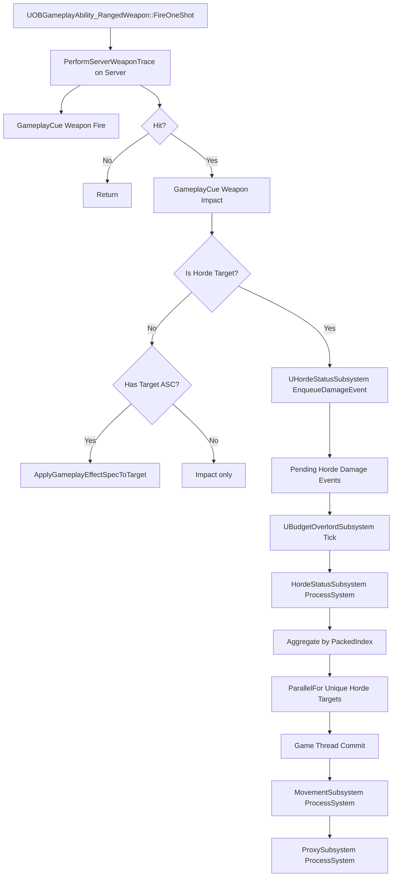

# RangedWeapon GAS Hit 처리와 Horde Event 병렬화 보고서

작성일: 2026-07-03

## 1. 목적

`UOBGameplayAbility_RangedWeapon::PerformServerWeaponTrace()`는 현재 GAS 기반 무기 명중 처리 함수다. 이 함수는 서버에서 히트스캔 판정, GameplayCue 실행, GameplayEffect 데미지 적용까지 한 번에 수행한다.

HordeSystem의 대량 적은 Actor 또는 ASC 단위로 매번 GAS 데미지를 적용하면 확장성이 떨어진다. 따라서 Horde 대상 피격은 GAS 데미지 적용 경로로 바로 보내지 말고, HordeSystem이 피격 이벤트를 별도로 수집한 뒤 한 프레임 단위로 모아서 병렬 처리해야 한다.

이 문서는 Claude Code가 현재 코드를 이해하고, `PerformServerWeaponTrace()`와 HordeSystem을 연결할 때 잘못된 방향으로 구현하지 않도록 하기 위한 코드 보고서다.

## 2. 분석 범위

관련 파일:

| 파일 | 역할 |
| --- | --- |
| `Source/OutBreak/Private/Ability/Abilities/OBGameplayAbility_RangedWeapon.cpp` | 서버 무기 트레이스, GameplayCue, GAS 데미지 적용 |
| `Source/OutBreak/Public/Ability/Abilities/OBGameplayAbility_RangedWeapon.h` | 원거리 무기 GameplayAbility 선언 |
| `Source/OutBreak/Public/Weapon/Data/OBWeaponData.h` | 무기 데미지, 사거리, DamageEffect 데이터 |
| `Source/OutBreak/Private/Ability/Attributes/OBAttributeSetBase.cpp` | GAS Damage 메타 속성을 Health에 반영 |
| `Source/OutBreak/Public/FlowField/Struct/HordeSystemType.h` | Horde SoA 저장소, `HordeDamageEvent`, `HordeAgentHandle` |
| `Source/OutBreak/Public/FlowField/Subsystem/HordeStatusSubsystem.h` | Horde 데미지 이벤트 큐 후보 |
| `Source/OutBreak/Private/FlowField/Subsystem/HordeStatusSubsystem.cpp` | Horde 이벤트 처리 후보, 현재 미구현 |
| `Source/OutBreak/Public/FlowField/Subsystem/BudgetOverlordSubsystem.h` | Horde Overlord 후보 |
| `Source/OutBreak/Private/FlowField/Subsystem/BudgetOverlordSubsystem.cpp` | Horde 서브시스템 Tick 순서 |
| `Source/OutBreak/Public/FlowField/Subsystem/HordeMovementSubsystem.h` | Horde 이동 SoA 저장소 |
| `Source/OutBreak/Private/FlowField/Subsystem/HordeMovementSubsystem.cpp` | Movement `ParallelFor` 구현 |
| `Source/OutBreak/Public/FlowField/Subsystem/HordeProxySubsystem.h` | Horde Proxy 저장소 |
| `Source/OutBreak/Private/FlowField/Subsystem/HordeProxySubsystem.cpp` | Proxy Actor/ISM 갱신 |
| `Source/OutBreak/Public/FlowField/HordeProxyActor.h` | 피격 가능한 Capsule Proxy 후보 |
| `Source/OutBreak/Private/FlowField/HordeProxyActor.cpp` | Capsule Proxy Actor 생성 |
| `Source/OutBreak/Public/FlowField/HordeProxyHost.h` | ISM Host |
| `Source/OutBreak/Private/FlowField/HordeProxyHost.cpp` | ISM Instance 추가/갱신 |

## 3. 현재 `PerformServerWeaponTrace()` 흐름

위치:

```text
Source/OutBreak/Private/Ability/Abilities/OBGameplayAbility_RangedWeapon.cpp:238
```

현재 흐름:

```text
FireOneShot()
  서버 권위이면 PerformServerWeaponTrace()

PerformServerWeaponTrace()
  Character / Weapon / WeaponData 확인
  Character 눈 위치 기준 TraceStart, TraceEnd 계산
  LineTraceSingleByChannel(OB_TraceChannel_Weapon)
  SourceASC 확보
  GameplayCue.Weapon.Fire 실행
  FireMontage Multicast
  Hit 없으면 return
  GameplayCue.Weapon.Impact 실행
  Hit Actor에서 TargetASC 찾기
  TargetASC와 DamageEffect가 있으면
    SourceASC->MakeEffectContext()
    Context.AddSourceObject(Weapon)
    Context.AddHitResult(Hit)
    SourceASC->MakeOutgoingSpec(WeaponData->DamageEffect)
    Spec.SetSetByCallerMagnitude(SetByCaller.Damage, WeaponData->BaseDamage)
    SourceASC->ApplyGameplayEffectSpecToTarget(TargetASC)
```

현재 코드는 명중 대상이 ASC를 가진 Actor라는 전제를 가진다. 플레이어, 일반 GAS 캐릭터, 보스처럼 개별 Actor/ASC가 있는 대상에는 이 경로가 맞다.

하지만 Horde Agent가 SoA 데이터와 Proxy Actor로 관리되는 대상이라면, 이 함수에서 곧바로 `TargetASC`를 찾거나 GameplayEffect를 적용하면 안 된다.

## 4. 현재 GAS 데미지 반영 흐름

`WeaponData->BaseDamage`는 다음 위치에 있다.

```text
Source/OutBreak/Public/Weapon/Data/OBWeaponData.h:88
```

GAS 데미지 태그:

```text
Source/OutBreak/Public/Ability/Tags/OBGameplayTags.h:17
Source/OutBreak/Private/Ability/Tags/OBGameplayTags.cpp:8
```

실제 Health 감소:

```text
Source/OutBreak/Private/Ability/Attributes/OBAttributeSetBase.cpp:35
```

`UOBAttributeSetBase::PostGameplayEffectExecute()`는 `Damage` 메타 속성을 읽어 `Health`를 감소시키고, `Health <= 0`이면 `Character->HandleDeath()`를 호출한다.

즉 현재 GAS 경로는 다음 조건에서만 자연스럽다.

```text
대상 Actor가 ASC를 가지고 있음
대상 Actor가 UOBAttributeSetBase Health를 사용함
죽음 처리를 Character::HandleDeath()로 수행함
```

HordeSystem의 목표 구조는 위 조건과 다르다. Horde Agent는 `HordeAgentHandle`, packed index, SoA `HealthValues`로 처리되어야 한다.

## 5. 현재 Horde 이벤트 시스템 상태

현재 `HordeDamageEvent`는 다음과 같다.

```cpp
struct HordeDamageEvent
{
    TWeakObjectPtr<AActor> DamagedActor;
    double Damage;
};
```

위치:

```text
Source/OutBreak/Public/FlowField/Struct/HordeSystemType.h:13
```

현재 디스크 기준 클래스명은 `UHordeStatusSubsystem`이다. 역할상으로는 피격 이벤트 큐를 보유한 Event/Status 서브시스템 후보에 가깝다.

```cpp
TArray<HordeDamageEvent> HordeDamageEvents;
void AddDamageEvent(AActor* DamagedActor, const double Damage);
void ProcessEvent();
void Parallel();
```

위치:

```text
Source/OutBreak/Public/FlowField/Subsystem/HordeStatusSubsystem.h:18
Source/OutBreak/Private/FlowField/Subsystem/HordeStatusSubsystem.cpp:6
```

현재 문제:

| 항목 | 현재 상태 |
| --- | --- |
| `AddDamageEvent()` 접근성 | `public`이 아니라 클래스 기본 private 영역에 있음 |
| 호출처 | 없음 |
| `ProcessSystem()` | `ProcessEvent()` 또는 `Parallel()`을 호출하지 않음 |
| `ProcessEvent()` | 큐 순회 후 바로 Empty, 실제 처리 없음 |
| `Parallel()` | 비어 있음 |
| Overlord 연결 | `UBudgetOverlordSubsystem`이 `UHordeStatusSubsystem`을 초기화하거나 Tick하지 않음 |
| 이벤트 식별자 | `AActor*`만 보유, `HordeAgentHandle` 또는 packed index 없음 |

현재 구조는 "Horde 피격 이벤트를 모아 처리한다"는 의도만 있고, 실제 시스템 파이프라인에는 연결되어 있지 않다.

## 6. 현재 Overlord Tick 순서

위치:

```text
Source/OutBreak/Private/FlowField/Subsystem/BudgetOverlordSubsystem.cpp:31
```

현재 Tick:

```cpp
void UBudgetOverlordSubsystem::Tick(float DeltaTime)
{
    Super::Tick(DeltaTime);

    MovementSubsystem->ProcessSystem(DeltaTime);
    ProxySubsystem->ProcessSystem(DeltaTime);
}
```

현재 순서:

```text
Movement -> Proxy
```

Horde 피격 이벤트를 처리하려면 최소한 다음 순서가 필요하다.

```text
Event -> Movement -> Proxy
```

이유:

```text
1. 무기 Trace는 임의의 시점에 Hit Event를 큐에 넣는다.
2. Overlord Tick 초반에 Status/Event Subsystem이 큐를 Drain한다.
3. Damage 결과로 사망/삭제/상태 변경이 나오면 그 결과를 먼저 Commit한다.
4. Movement는 살아 있는 Agent만 이동시킨다.
5. Proxy는 최종 Transform과 상태를 시각화한다.
```

같은 프레임에서 이미 Overlord Tick이 지난 뒤 들어온 Hit Event는 다음 Overlord Tick에서 처리해도 된다. 중요한 것은 이벤트를 즉시 GAS 적용하지 않고, Horde 파이프라인의 Commit 단계로 가져가는 것이다.

## 7. 핵심 설계 원칙

### 7.1 `PerformServerWeaponTrace()`는 판정과 이벤트 생성까지만 한다

서버 무기 트레이스는 Game Thread에서 실행된다. `UWorld`, `AActor`, `UAbilitySystemComponent`, `GameplayCue`, `GameplayEffectSpec`은 모두 UObject 기반이므로 Worker Thread에 넘기면 안 된다.

`PerformServerWeaponTrace()`가 해야 할 일:

```text
서버 권위로 Hit 판정
Fire GameplayCue 실행
Impact GameplayCue 실행
Hit Actor가 Horde 대상인지 판별
Horde 대상이면 HordeDamageEvent를 큐에 넣고 return
Horde 대상이 아니면 기존 GAS DamageEffect 적용
```

### 7.2 Horde Damage는 UObject가 없는 순수 데이터로 병렬 처리한다

Worker Thread에서 허용되는 데이터:

```text
HordeAgentHandle
PackedIndex
Damage float
HealthValues 배열
Generation snapshot
ImpactPoint 같은 값 타입
```

Worker Thread에서 금지되는 접근:

```text
UWorld
AActor
UAbilitySystemComponent
UGameplayEffect
FGameplayEffectSpecHandle
GameplayCue 실행
Actor Destroy
Component Transform 변경
TWeakObjectPtr dereference
```

### 7.3 Horde 대상과 GAS 대상을 분기한다

권장 분기:

```text
Hit Actor가 Horde Agent Proxy에 연결되어 있음
  -> HordeStatusSubsystem.EnqueueDamageEvent()
  -> 기존 GAS ApplyGameplayEffectSpecToTarget() 호출 금지

Hit Actor가 일반 GAS Actor임
  -> 기존 SourceASC->ApplyGameplayEffectSpecToTarget() 유지

Hit Actor가 둘 다 아님
  -> Impact Cue만 재생하고 데미지 없음
```

## 8. 필요한 데이터 구조 변경 제안

현재 `HordeDamageEvent`는 `AActor*` 기반이라 병렬 처리에 적합하지 않다.

권장 구조:

```cpp
struct FHordeDamageEvent
{
    HordeAgentHandle TargetHandle;
    float Damage = 0.0f;

    FVector ImpactPoint = FVector::ZeroVector;
    FVector ImpactNormal = FVector::UpVector;

    // Game Thread 후처리용이다. Worker Thread에서 역참조 금지.
    TWeakObjectPtr<AActor> SourceActor;
    TWeakObjectPtr<AActor> InstigatorActor;
};
```

Worker Thread에 넘길 때는 UObject 포인터를 제거한 packed event로 변환한다.

```cpp
struct FHordePackedDamageEvent
{
    int32 PackedIndex = INDEX_NONE;
    uint32 Generation = 0;
    float Damage = 0.0f;
};
```

더 좋은 방향은 한 프레임의 여러 Hit를 먼저 대상별로 합산한 뒤 병렬 처리하는 것이다.

```cpp
struct FHordeDamageWorkItem
{
    int32 PackedIndex = INDEX_NONE;
    float TotalDamage = 0.0f;
};
```

이유:

```text
같은 Agent가 한 프레임에 여러 발 맞을 수 있다.
여러 Worker가 같은 HealthValues[PackedIndex]에 동시에 쓰면 race condition이 생긴다.
대상별로 Damage를 합산하고 unique PackedIndex 단위로 ParallelFor를 돌리면 write conflict가 없다.
```

## 9. Hit Actor를 Horde Agent로 해석하는 방법

현재 `AHordeProxyActor`에는 `Capsule`만 있고, 어떤 Horde Agent를 대표하는지 식별자가 없다.

위치:

```text
Source/OutBreak/Public/FlowField/HordeProxyActor.h:17
Source/OutBreak/Private/FlowField/HordeProxyActor.cpp:10
```

현재 `UHordeProxySubsystem::Register()`는 Proxy Actor를 Spawn하고 `ProxyEntity.Add(SpawnActor, InstanceId)`를 호출한다.

위치:

```text
Source/OutBreak/Private/FlowField/Subsystem/HordeProxySubsystem.cpp:28
```

하지만 다음 매핑이 없다.

```text
Hit Actor -> HordeAgentHandle
Hit Component -> HordeAgentHandle
HordeAgentHandle -> PackedIndex
PackedIndex -> Proxy Actor
PackedIndex -> ISM InstanceId
```

Claude Code가 먼저 구현해야 할 것은 `PerformServerWeaponTrace()`에서 직접 배열 인덱스를 추측하는 코드가 아니다. 먼저 HordeSystem 쪽에 명시적인 resolve API가 있어야 한다.

예시 API:

```cpp
bool UHordeProxySubsystem::TryResolveAgentFromActor(
    const AActor* HitActor,
    HordeAgentHandle& OutHandle) const;
```

또는 `UHordeStatusSubsystem`에서 프록시 서브시스템을 통해 resolve한다.

```cpp
bool UHordeStatusSubsystem::TryEnqueueDamageFromHit(
    const FHitResult& Hit,
    float Damage,
    AActor* SourceActor,
    AActor* InstigatorActor);
```

단, `FHitResult` 전체를 Worker Thread로 넘기면 안 된다. `TryEnqueueDamageFromHit()` 안에서 Game Thread 값 타입으로 필요한 필드만 복사해야 한다.

## 10. `PerformServerWeaponTrace()` 목표 흐름

기존 흐름에서 데미지 적용 직전 분기만 추가하는 것이 가장 안전하다.

목표 흐름:

```text
PerformServerWeaponTrace()
  기존 서버 Trace 수행
  Fire Cue 실행
  Fire Montage 실행
  Hit 없으면 return
  Impact Cue 실행

  if HordeStatusSubsystem can accept this Hit as Horde target
    Enqueue HordeDamageEvent
    return

  기존 GAS target damage path
```

의사 코드:

```cpp
if (!bHit || !Hit.GetActor())
{
    return;
}

ExecuteImpactCue(Hit);

if (UHordeStatusSubsystem* HordeStatus = GetWorld()->GetSubsystem<UHordeStatusSubsystem>())
{
    if (HordeStatus->TryEnqueueDamageFromHit(
        Hit,
        WeaponData->BaseDamage,
        Weapon,
        Character))
    {
        return;
    }
}

ApplyGasDamageToASC(Hit, WeaponData, SourceASC, Weapon);
```

중요한 점:

```text
Horde 대상이면 ApplyGameplayEffectSpecToTarget()까지 내려가면 안 된다.
일반 ASC 대상이면 기존 GAS DamageEffect 경로를 유지한다.
Impact Cue는 Horde/GAS 공통으로 유지 가능하다.
```

## 11. HordeStatusSubsystem 목표 흐름

권장 Game Thread 수집:

```text
TryEnqueueDamageFromHit()
  Hit Actor 또는 Hit Component를 HordeAgentHandle로 resolve
  handle이 유효하지 않으면 false
  PendingDamageEvents.Add(FHordeDamageEvent)
  true 반환
```

권장 Overlord Tick 처리:

```text
UBudgetOverlordSubsystem::Tick()
  HordeStatusSubsystem->ProcessSystem(DeltaTime)
  MovementSubsystem->ProcessSystem(DeltaTime)
  ProxySubsystem->ProcessSystem(DeltaTime)
```

권장 `UHordeStatusSubsystem` 처리:

```text
ProcessSystem()
  Game Thread 확인
  PendingDamageEvents를 LocalEvents로 swap
  각 event의 TargetHandle generation 검증
  TargetHandle을 PackedIndex로 변환
  같은 PackedIndex의 Damage를 합산
  ParallelFor(unique target count)
    HealthValues[PackedIndex] 감소 계산
    죽음 후보 ResultBuffer에 기록
  Game Thread Commit
    HealthValues 최종 반영
    사망 Agent 제거 요청
    필요한 HitReact, Death, Network, Proxy dirty 처리
```

`HealthValues`가 `uint16`이므로 Damage가 float이면 반영 정책을 정해야 한다.

선택지:

```text
1. Damage를 반올림/올림하여 uint16 HealthValues에 반영
2. HealthValues를 float 배열로 변경
3. HealthValues는 네트워크 압축용으로 두고 내부 Health는 float 별도 배열로 둠
```

대량 Horde의 전투 정확도가 중요하면 2번 또는 3번이 낫다. 현재 구조를 최소 변경하려면 1번으로 시작할 수 있다.

## 12. 병렬 처리에서 주의할 점

### 12.1 같은 Agent에 대한 중복 Hit

한 프레임에 샷건, 연사, 폭발 데미지가 같은 Agent에 여러 번 들어올 수 있다.

잘못된 방식:

```cpp
ParallelFor(Events.Num(), [&](int32 EventIndex)
{
    HealthValues[Events[EventIndex].PackedIndex] -= Events[EventIndex].Damage;
});
```

문제:

```text
같은 PackedIndex에 여러 Worker가 동시에 write할 수 있다.
Health 감소가 누락되거나 비결정적 결과가 생긴다.
```

권장:

```text
Game Thread에서 PackedIndex별 TotalDamage 합산
Unique target 배열 생성
Unique target 단위로 ParallelFor
```

### 12.2 구조 변경은 Commit 단계에서만 한다

Worker Thread에서 금지:

```text
Agent 삭제
RemoveAtSwap
Proxy Actor Destroy
ISM RemoveInstance
GameplayCue 실행
Network RPC
```

Worker Thread는 결과만 만든다.

```text
DamageResultBuffer
DeathCandidateBuffer
DirtyAgentBuffer
```

삭제, RemoveAtSwap, Proxy/ISM 갱신은 Game Thread Commit에서 수행한다.

### 12.3 `HordeAgentHandle` generation 검증

이벤트가 큐에 들어간 뒤 처리되기 전에 Agent가 삭제될 수 있다.

필수 검증:

```text
TargetHandle.IsValid()
AgentID -> PackedIndex 매핑 존재
현재 Generation == Event.TargetHandle.Generation
PackedIndex가 유효 범위
```

검증 실패 이벤트는 버린다.

## 13. 현재 코드에서 즉시 보이는 위험 지점

### 13.1 `Hit.Component` null dereference 가능성

현재 코드:

```cpp
UE_LOG(LogTemp, Display, TEXT("%s::%s: %s"), *GetClass()->GetName(), TEXT(__FUNCTION__), Hit.Component->GetName());
```

위치:

```text
Source/OutBreak/Private/Ability/Abilities/OBGameplayAbility_RangedWeapon.cpp:268
```

`bHit == false`이거나 `Hit.Component`가 null이면 크래시 가능성이 있다.

권장:

```cpp
const FString HitComponentName = Hit.Component.IsValid()
    ? Hit.Component->GetName()
    : TEXT("None");
```

또는 로그 자체를 `bHit` 이후로 옮긴다. 대량 발사에서는 이 로그도 비용이 크므로 디버그 플래그 뒤에 둬야 한다.

### 13.2 `SourceASC` null guard가 완전하지 않음

현재 `SourceASC`는 Fire/Impact Cue에서는 null 체크를 하지만, 데미지 적용부에서는 `SourceASC->MakeEffectContext()`를 바로 호출한다.

위치:

```text
Source/OutBreak/Private/Ability/Abilities/OBGameplayAbility_RangedWeapon.cpp:280
Source/OutBreak/Private/Ability/Abilities/OBGameplayAbility_RangedWeapon.cpp:316
```

일반적으로 Ability 안에서는 SourceASC가 있어야 하지만, 방어적으로는 GAS 데미지 적용 전에 확인하는 편이 안전하다.

권장:

```cpp
if (!SourceASC || !TargetASC || !WeaponData->DamageEffect)
{
    return;
}
```

### 13.3 `UHordeStatusSubsystem::AddDamageEvent()`가 외부에서 호출 불가

현재 `UHordeStatusSubsystem`은 `public:` 구역이 없어서 `AddDamageEvent()`가 private이다.

위치:

```text
Source/OutBreak/Public/FlowField/Subsystem/HordeStatusSubsystem.h:18
```

`PerformServerWeaponTrace()` 또는 다른 시스템에서 이벤트를 넣으려면 명시적인 public API가 필요하다.

### 13.4 Status/Event Subsystem이 Overlord에 연결되어 있지 않음

현재 `UBudgetOverlordSubsystem`은 `MovementSubsystem`, `ProxySubsystem`만 보유한다.

위치:

```text
Source/OutBreak/Public/FlowField/Subsystem/BudgetOverlordSubsystem.h:30
Source/OutBreak/Private/FlowField/Subsystem/BudgetOverlordSubsystem.cpp:17
```

`UHordeStatusSubsystem`을 dependency로 초기화하고 Tick 순서에 포함해야 한다.

### 13.5 Proxy Actor가 Agent 식별자를 보유하지 않음

현재 `AHordeProxyActor`는 Capsule만 있고 Agent handle이 없다.

결과적으로 `LineTraceSingleByChannel()`이 Proxy Actor를 맞춰도 어떤 Horde Agent인지 알 수 없다.

필수 보완:

```text
Proxy Actor 또는 ProxySubsystem에 Hit Actor -> HordeAgentHandle 매핑 추가
Agent 삭제/Swap Remove 시 매핑 갱신
```

## 14. 구현 단계 제안

### 1단계: 이벤트 API 공개와 자료형 정리

목표:

```text
UHordeStatusSubsystem이 외부에서 안전하게 데미지 이벤트를 받을 수 있게 한다.
```

작업:

```text
HordeDamageEvent를 FHordeDamageEvent처럼 handle 기반으로 변경
AddDamageEvent 대신 EnqueueDamageEvent 또는 TryEnqueueDamageFromHit public 함수 추가
FHitResult에서 필요한 값만 복사
```

주의:

```text
FHitResult 전체와 UObject 포인터를 Worker Thread에서 쓰지 않는다.
```

### 2단계: Hit Actor를 HordeAgentHandle로 resolve하는 경로 추가

목표:

```text
Trace 결과 Actor/Component에서 stable HordeAgentHandle을 얻는다.
```

작업 후보:

```text
AHordeProxyActor에 HordeAgentHandle 저장
또는 UHordeProxySubsystem에 TMap<TWeakObjectPtr<AActor>, HordeAgentHandle> 저장
또는 Collision Proxy 전용 컴포넌트에 handle 저장
```

주의:

```text
PackedIndex를 외부 이벤트에 직접 저장하면 RemoveAtSwap 이후 stale index 문제가 생긴다.
외부 이벤트에는 HordeAgentHandle을 저장하고, 처리 시점에 PackedIndex로 resolve한다.
```

### 3단계: `PerformServerWeaponTrace()`에 Horde 분기 추가

목표:

```text
Horde 대상은 GAS ApplyGameplayEffectSpecToTarget()로 보내지 않는다.
```

작업:

```text
Impact Cue 실행 뒤 HordeStatusSubsystem TryEnqueue 호출
true 반환이면 return
false이면 기존 GAS TargetASC 경로 유지
```

주의:

```text
Fire Cue, Impact Cue, FireMontage는 기존처럼 Game Thread에서 처리한다.
데미지 계산만 Horde 큐로 넘긴다.
```

### 4단계: Overlord Tick에 Status/Event Subsystem 추가

목표:

```text
한 프레임에 쌓인 Horde 피격 이벤트를 Movement/Proxy 전에 처리한다.
```

작업:

```text
UBudgetOverlordSubsystem 멤버에 Status/Event Subsystem 추가
Initialize()에서 Collection.InitializeDependency<UHordeStatusSubsystem>()
Tick() 순서를 Event -> Movement -> Proxy로 변경
```

### 5단계: HordeStatusSubsystem 병렬 처리 구현

목표:

```text
HordeDamageEvents를 대상별로 합산하고 HealthValues를 병렬 갱신한다.
```

작업:

```text
PendingDamageEvents swap
Handle generation 검증
PackedIndex별 damage 합산
ParallelFor(unique targets)
ResultBuffer 작성
Game Thread Commit에서 death/remove/dirty 처리
```

주의:

```text
같은 PackedIndex에 병렬 write 금지
Worker Thread에서 UObject 접근 금지
Agent 삭제는 Commit 단계에서만 수행
```

### 6단계: 검증 로그와 테스트 추가

목표:

```text
대량 전투에서 정확성과 성능을 확인한다.
```

확인할 시나리오:

| 시나리오 | 기대 결과 |
| --- | --- |
| 일반 ASC Actor 피격 | 기존 GAS Health 감소 |
| Horde Proxy Actor 피격 | GAS 적용 없이 HordeDamageEvent 큐 삽입 |
| 한 프레임에 같은 Horde Agent 다중 피격 | 합산 데미지가 한 번 반영 |
| 이벤트 큐 처리 전 Agent 삭제 | generation 검증 실패로 이벤트 폐기 |
| Horde Agent 사망 | Commit 단계에서 삭제/비활성화 |
| 500개 이상 Agent 연사 피격 | UObject 접근 없이 병렬 처리 |

## 15. 권장 최종 구조



## 16. Claude Code 작업 시 금지 사항

다음 구현은 피해야 한다.

```text
Horde Agent마다 UAbilitySystemComponent를 붙이는 방향
Worker Thread에서 ApplyGameplayEffectSpecToTarget() 호출
Worker Thread에서 GameplayCue 실행
Worker Thread에서 AActor/TWeakObjectPtr 역참조
Hit.GetActor()를 PackedIndex로 직접 캐스팅하거나 이름으로 파싱
PackedIndex를 장기 보관 이벤트 식별자로 사용
여러 이벤트가 같은 HealthValues index에 동시에 write하는 ParallelFor
Agent 삭제를 병렬 람다 내부에서 수행
```

## 17. Claude Code 작업 시 유지해야 할 것

다음 동작은 유지해야 한다.

```text
무기 Trace와 최종 판정은 서버 권위
일반 GAS Actor는 기존 DamageEffect 경로 유지
Fire GameplayCue는 명중 여부와 무관하게 실행
Impact GameplayCue는 Hit 지점 기준으로 실행
Horde 데미지는 Event Queue에 수집
Horde 데미지 계산은 UObject 없는 순수 데이터로 병렬 처리
구조 변경과 연출 후처리는 Game Thread Commit에서 수행
```

## 18. 결론

`PerformServerWeaponTrace()`는 GAS 어빌리티 내부 함수이므로 일반 Actor 대상 데미지는 기존 GAS 경로가 맞다. 그러나 Horde Agent는 대량 데이터 Entity이므로 `TargetASC`를 찾아 GameplayEffect를 적용하는 방식으로 확장하면 안 된다.

정답은 `PerformServerWeaponTrace()`에서 Hit 판정 후 대상을 분기하는 것이다. Horde 대상이면 `UHordeStatusSubsystem`에 handle 기반 피격 이벤트를 넣고 즉시 return한다. 이후 Overlord가 Status/Event Subsystem을 먼저 Tick하여 이벤트를 drain, validate, aggregate한 뒤, unique target 단위로 병렬 데미지 계산을 수행하고 Game Thread Commit에서 사망/삭제/프록시 갱신을 처리해야 한다.

가장 먼저 필요한 구현은 `Hit Actor -> HordeAgentHandle` resolve 경로와 `UHordeStatusSubsystem`의 public enqueue API다. 이 두 가지가 없으면 `PerformServerWeaponTrace()`에서 Horde 이벤트 큐를 안전하게 사용할 수 없다.
