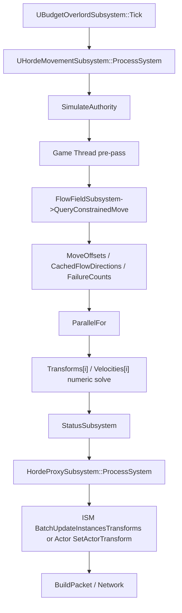
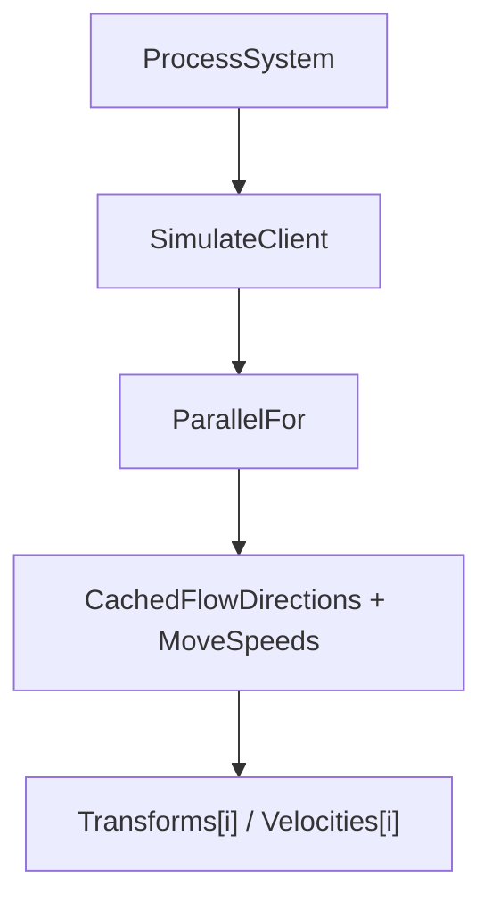
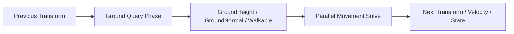
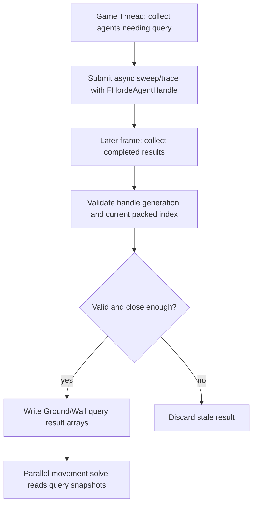
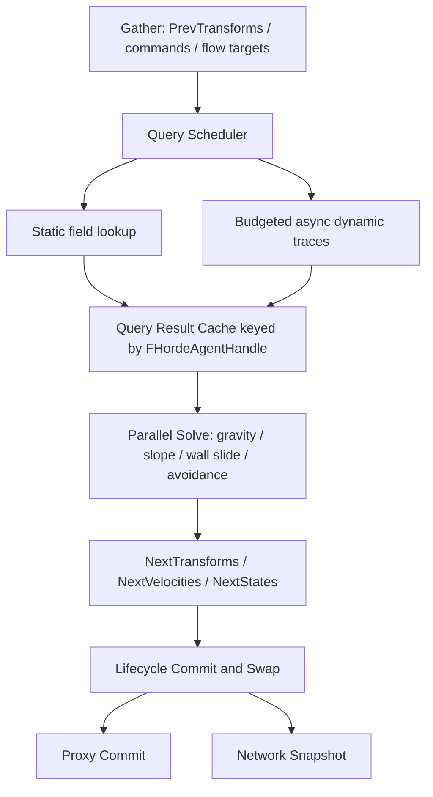

# Horde Parallel Movement Feasibility Audit

작성일: 2026-07-07  
대상 프로젝트: `C:\Users\Admin\Documents\Unreal Projects\OutBreak`  
목적: `UHordeMovementSubsystem`의 병렬 이동 계산 안에서 중력, 낙하, 착지, 바닥 추종, 경사, 벽 충돌, 슬라이드, 스텝업, 정적/동적 충돌, 다중 에이전트 충돌을 어디까지 구현할 수 있는지 실제 코드 기준으로 판단한다.

## 1. 요약 판단

현재 `UHordeMovementSubsystem::Parallel`은 이름과 달리 전체가 병렬은 아니다. Authority 경로에서는 Game Thread 선처리 루프가 `UFlowFieldSubsystem::QueryConstrainedMove`를 호출하고, 그 결과를 `MoveOffsets`에 저장한 뒤 `ParallelFor`에서는 `FTransform`/`Velocity`의 순수 수치 갱신만 수행한다. 이 구조 자체는 올바른 방향이다.

핵심 결론은 다음과 같다.

| 항목 | 판단 | 근거 |
|---|---:|---|
| 중력/수직 속도 적분 | 가능 | `Velocity.Z`, 위치 적분은 UObject 접근 없이 인덱스별 수치 계산으로 가능 |
| 낙하/착지 상태 전환 | 조건부 가능 | 바닥 결과가 사전 계산되어 있으면 병렬 가능 |
| 바닥 추종 | 조건부 가능 | Ground height/normal 캐시가 필요하며 NavMesh만으로는 부족 |
| 경사면 보정 | 가능 | Ground normal/walkable flag가 사전 입력이면 병렬 수학 처리 가능 |
| Unwalkable slope 처리 | 조건부 가능 | 사전 쿼리 결과와 상태 저장소 필요 |
| 벽 충돌 쿼리 | 현재 구조에서는 불가능 / 권장하지 않음 | `UWorld`, `ARecastNavMesh`, `UObject` 계열 쿼리를 worker에서 직접 부르는 보장이 없음 |
| 벽 슬라이드 계산 | 가능 | Hit normal/time이 사전 입력이면 병렬 계산 가능 |
| Step-up | 조건부 가능 | 여러 sweep/height 판정이 필요하므로 쿼리 phase 분리가 선행되어야 함 |
| 정적 장애물 대량 처리 | 조건부 가능 | static collision field 또는 Game Thread/Async query cache 필요 |
| 동적 장애물 처리 | 조건부 가능 | 제한된 예산의 async/query scheduler 필요 |
| 에이전트 간 충돌 | 조건부 가능 | spatial hash, double buffering, neighbor read 규칙 필요 |

따라서 권장 구조는 `ParallelFor` 내부를 "movement solve only"로 유지하고, 충돌/바닥/벽/Nav 쿼리는 Game Thread 또는 Async query phase에서 생산한 스냅샷을 읽게 만드는 것이다.

## 2. 분석 범위

확인한 주요 프로젝트 파일은 다음과 같다.

| 파일 | 확인 내용 |
|---|---|
| `Source/OutBreak/Private/FlowField/Subsystem/HordeMovementSubsystem.cpp` | Authority/client movement, `ParallelFor`, `QueryConstrainedMove`, cached direction/fallback |
| `Source/OutBreak/Public/FlowField/Struct/HordeSystemType.h` | movement storage, agent handle, traversal/storage arrays |
| `Source/OutBreak/Private/FlowField/Subsystem/BudgetOverlordSubsystem.cpp` | tick order, register/unregister, network packet build/apply |
| `Source/OutBreak/Private/FlowField/Subsystem/HordeProxySubsystem.cpp` | movement transform commit to ISM/Actor proxy |
| `Source/OutBreak/Private/FlowField/HordeProxyHost.cpp` | `BatchUpdateInstancesTransforms` usage |
| `Source/OutBreak/Private/FlowField/FlowFieldRecastNavMesh.cpp` | `QueryDirection`, `QueryConstrainedMove`, Recast query usage |
| `Source/OutBreak/Public/FlowField/Struct/FlowFieldNavTypes.h` | nav behavior/traversal bake types |
| `Source/OutBreak/Private/FlowField/Subsystem/HordeStatusSubsystem.cpp` | 별도 `ParallelFor` 패턴 |

확인한 UE 5.7 소스 위치는 다음과 같다.

| UE 소스 | 확인 API |
|---|---|
| `Engine/Source/Runtime/Engine/Classes/Engine/World.h` | `LineTraceSingleByChannel`, `SweepSingleByChannel`, `OverlapMultiByChannel`, async trace declarations |
| `Engine/Source/Runtime/Engine/Private/Collision/WorldCollision.cpp` | synchronous trace/sweep/overlap 구현 |
| `Engine/Source/Runtime/Engine/Private/Collision/WorldCollisionAsync.cpp` | `AsyncLineTraceByChannel`, `AsyncSweepByChannel`, `AsyncOverlapByChannel` 구현 |
| `Engine/Source/Runtime/NavigationSystem/Public/NavigationData.h` | `ProjectPoint`, `FindMoveAlongSurface` declarations |
| `Engine/Source/Runtime/NavigationSystem/Public/NavMesh/RecastNavMesh.h` | Recast projection/move declarations |
| `Engine/Source/Runtime/NavigationSystem/Private/NavMesh/RecastNavMesh.cpp` | Recast projection/move 구현 |
| `Engine/Source/Runtime/Engine/Classes/GameFramework/Actor.h` | `SetActorTransform` |
| `Engine/Source/Runtime/Engine/Private/Actor.cpp` | `AActor::SetActorTransform` 구현 |
| `Engine/Source/Runtime/Engine/Private/Components/SceneComponent.cpp` | `SetWorldTransform`, `MoveComponent` |
| `Engine/Source/Runtime/Engine/Classes/Components/InstancedStaticMeshComponent.h` | `BatchUpdateInstancesTransforms` |

## 3. 현재 이동 파이프라인

현재 `UBudgetOverlordSubsystem::Tick`의 큰 순서는 다음과 같다.

1. `MovementSubsystem->ProcessSystem(DeltaTime)`
2. `StatusSubsystem->ProcessSystem(DeltaTime)`
3. `ProxySubsystem->ProcessSystem(DeltaTime)`
4. `BuildPacket()`
5. `NetworkSubsystem->ProcessSystem(DeltaTime)`

Authority 이동 경로는 다음과 같다.



Client 이동 경로는 Authority보다 단순하다.



중요한 점은 현재 Authority `ParallelFor` 내부에서 `QueryConstrainedMove`를 호출하지 않는다는 것이다. Flow/Nav 쿼리는 Game Thread pre-pass에서 수행되고, worker는 `MoveOffsetsData[AgentIndex]`만 읽는다. 이는 병렬화 측면에서 좋은 분리다.

## 4. 현재 `ParallelFor` 메모리 감사

### Authority Movement

| 접근 대상 | 위치 | 접근 방식 | 병렬 안전성 |
|---|---|---|---|
| `MovementStorage.Transforms` | `ParallelFor` | `Transforms[AgentIndex]` read/write | 조건부 안전 |
| `MovementStorage.Velocities` | `ParallelFor` | `Velocities[AgentIndex]` write | 조건부 안전 |
| `MoveOffsets` | `ParallelFor` | `MoveOffsetsData[AgentIndex]` read-only | 안전 |
| `MovementStorage.CachedFlowDirections` | Game Thread pre-pass | read/write | 현재 구조에서는 안전 |
| `MovementStorage.FlowQueryFailureCounts` | Game Thread pre-pass | read/write | 현재 구조에서는 안전 |
| `FlowFieldSubsystem` / NavMesh | Game Thread pre-pass | UObject/Nav query | worker 사용 금지 권장 |

조건부 안전이라는 뜻은 다음 조건을 만족해야 한다는 의미다.

- `ParallelFor` 실행 중 `Transforms`, `Velocities` 배열이 resize/realloc되지 않아야 한다.
- 각 worker가 자기 `AgentIndex`만 써야 한다.
- 다른 시스템이 같은 배열을 동시에 mutate하지 않아야 한다.
- neighbor read/write가 추가되면 현재 판단은 깨진다.

현재 `Register`/`Unregister`는 `BudgetOverlordSubsystem`을 통해 Game Thread lifecycle에서 처리되고, movement `ParallelFor` 안에서 storage mutation이 일어나지 않는다. 이 점은 유지해야 한다.

### Client Movement

| 접근 대상 | 접근 방식 | 병렬 안전성 |
|---|---|---|
| `Transforms[AgentIndex]` | read/write | 조건부 안전 |
| `Velocities[AgentIndex]` | write | 조건부 안전 |
| `CachedFlowDirections[AgentIndex]` | read-only | 안전 |
| `MoveSpeeds[AgentIndex]` | read-only | 안전 |

Client 경로에는 현재 충돌/바닥/벽 상태가 없다. 서버 권위 이동에 지형 충돌 상태를 추가하면 client prediction/smoothing도 같은 상태를 최소한 일부 받아야 한다.

### Status Parallel

`UHordeStatusSubsystem::Parallel`도 `ParallelFor`를 사용한다. resolved damage event가 같은 packed index에 대해 중복 write를 만들지 않는다는 전제가 있어야 안전하다. Horde 이동 확장 시에도 같은 원칙을 적용해야 한다. 즉, 병렬 loop 안에서는 "한 index는 한 worker가 소유"해야 한다.

## 5. 현재 Flow/Nav Query 동작

`AFlowFieldRecastNavMesh::QueryDirection`은 다음 일을 한다.

- `QueryNodeRef` 호출
- `ProjectPoint(WorldLocation, ProjectedLocation, GetDefaultQueryExtent(), QueryFilter)` 호출
- `FlowNodes`에서 현재 poly의 flow node 조회
- `OutgoingNeighbors`를 따라 방향 gradient 계산
- `GetWorld()->GetSubsystem<UFlowFieldSubsystem>()` 접근

`AFlowFieldRecastNavMesh::QueryConstrainedMove`는 다음 일을 한다.

- `QueryDirection`
- `ProjectPoint`
- `FindMoveAlongSurface`
- `GetPolyWallSegments`
- 추가 `FindMoveAlongSurface`로 벽 회피/슬라이드성 보정

이 함수들은 현재 Game Thread pre-pass에서 호출된다. 이 호출을 그대로 `ParallelFor` worker로 옮기는 것은 권장하지 않는다. 함수 내부에 UObject, World, NavData, TMap 성격의 데이터 접근이 섞여 있고, 프로젝트 코드에서도 worker-safe snapshot으로 분리되어 있지 않다.

## 6. 사용자가 본 증상과 현재 원인 후보

사용자가 언급한 증상은 다음이다.

- Debug Flow Direction과 실제 이동 방향이 다름
- 큰 장애물은 뚫고 지나가는데 작은 장애물 근처에서는 멈춤/떨림
- 장애물이 있어 tile/poly가 많이 쪼개지면 미세하게 Nav를 벗어나 query가 실패하는 듯함
- Query 실패 시 마지막 query 방향으로 계속 가야 하는지 의문

현재 코드 기준 원인 후보는 다음과 같다.

| 증상 | 가능 원인 |
|---|---|
| Debug 방향과 이동 방향 차이 | 실제 이동은 `QueryConstrainedMove` 결과를 쓰고, debug는 raw flow direction 또는 다른 query를 볼 수 있음 |
| 장애물 관통 | Proxy commit에서 `SetActorTransform(..., bSweep=false)`이고 ISM 업데이트도 물리 충돌 sweep이 아님 |
| 작은 장애물 근처 query 실패 | Nav poly 경계/작은 장애물 주변에서 `ProjectPoint` 또는 node ref 조회 실패 가능 |
| 덜덜 떨림 | 현재 위치가 frame마다 다른 poly/edge 보정 결과를 받아 방향이 튐 |
| Nav 이탈 후 먹통 | Query 실패 시 방향이 zero가 되거나 fallback이 없으면 velocity가 끊김 |

최근 변경된 형태처럼 `QueryDirection` 단독이 아니라 `QueryConstrainedMove`를 Game Thread pre-pass에서 쓰고, query 실패 시 마지막 유효 방향을 제한적으로 재사용하는 것은 단기적으로 맞는 대응이다. 다만 이것은 Nav surface 기반 이동 안정화이며, 물리적 장애물 충돌/바닥/착지까지 해결하지는 않는다.

## 7. Gravity 구현 가능성

중력 자체는 병렬 구현 가능하다.

필요한 최소 데이터는 다음이다.

| 데이터 | 용도 |
|---|---|
| `Velocities.Z` | 수직 속도 |
| `MovementStates` | Grounded/Falling 구분 |
| `GroundHeights` | 착지 판정 |
| `GroundNormals` | 경사 및 walkable 판정 |
| `CapsuleHalfHeight` 또는 agent height | 바닥 접촉 위치 계산 |

worker 내부 계산 예시는 개념적으로 다음과 같다.

```cpp
if (MovementState == Falling)
{
    Velocity.Z += GravityZ * DeltaTime;
    Location.Z += Velocity.Z * DeltaTime;
}

if (Ground.bHasGround && Location.Z <= GroundLandingZ)
{
    Location.Z = GroundLandingZ;
    Velocity.Z = 0.0f;
    MovementState = Grounded;
}
```

단, `Ground.bHasGround`와 `GroundLandingZ`를 worker 안에서 `LineTrace`나 `Sweep`으로 직접 만들면 안 된다. 그 결과는 query phase가 미리 만들어야 한다.

## 8. 바닥 추종과 착지

바닥 추종은 "이동 solve"와 "바닥 query"를 분리하면 조건부 가능하다.



바닥 query의 후보는 다음과 같다.

| 후보 | 장점 | 한계 | 권장도 |
|---|---|---|---|
| NavMesh projected point | 저렴하고 이미 사용 중 | 실제 충돌 높이/normal/capsule과 다를 수 있음 | 보조 정보로만 사용 |
| `LineTrace` down | 간단함 | capsule 폭/step/edge 처리 약함 | 소규모 단기 |
| `Sweep` down | capsule 기반 착지에 더 적합 | 비용 증가 | 단기/중기 |
| Async sweep cache | frame budget 분산 가능 | 1 frame lag, lifecycle 관리 필요 | 중기 권장 |
| Static height/normal field | 대량 agent에 매우 유리 | bake/update 시스템 필요 | 장기 권장 |

NavMesh만으로 바닥/착지를 구현하면 안 된다. NavMesh는 이동 가능 surface의 추상화이고, 실제 static mesh collision, capsule bottom, step height, dynamic obstacle을 완전히 대체하지 않는다.

## 9. 경사면과 Walkable Slope

경사면 이동 계산은 병렬 가능하다. 필요한 입력은 `GroundNormal`과 `WalkableFloorZ` 또는 slope angle threshold다.

| 처리 | 병렬 가능성 | 조건 |
|---|---:|---|
| move vector를 ground plane에 projection | 가능 | `GroundNormal` 사전 입력 |
| slope 각도 계산 | 가능 | `Dot(GroundNormal, UpVector)` |
| walkable/unwalkable 분기 | 가능 | movement state 저장 필요 |
| unwalkable slope에서 미끄러짐 | 가능 | slide direction 수치 계산 |
| slope ground normal 획득 | 조건부 가능 | worker 밖 query 필요 |

권장 상태는 다음이다.

- `Grounded`: walkable floor 위
- `Falling`: 바닥 없음 또는 너무 멂
- `Sliding`: unwalkable slope 위
- `Blocked`: 벽/step 실패
- `Traversal`: climb/vault/drop link로 넘김

## 10. 벽 충돌과 Slide

벽 충돌은 두 단계로 나누어야 한다.

| 단계 | 내용 | 병렬 가능성 |
|---|---|---:|
| Query | capsule sweep, wall normal, hit time, blocking 여부 생성 | worker 직접 실행 권장하지 않음 |
| Solve | hit time만큼 이동, 남은 이동량을 wall plane에 project | 가능 |

worker 내부에서 가능한 것은 다음과 같은 수치 계산이다.

```cpp
if (Wall.bBlockingHit)
{
    Location += DesiredDelta * Wall.HitTime;
    const FVector Remaining = DesiredDelta * (1.0f - Wall.HitTime);
    const FVector SlideDelta = FVector::VectorPlaneProject(Remaining, Wall.Normal);
    Location += SlideDelta;
}
else
{
    Location += DesiredDelta;
}
```

즉, `Wall.Normal`과 `HitTime`이 사전에 준비되어 있으면 slide는 병렬 가능하다. 하지만 그 hit를 얻기 위해 `UWorld::SweepSingleByChannel`을 worker에서 직접 호출하는 것은 현재 코드 구조에서는 불가능에 가깝고 권장하지 않는다.

## 11. Step-up과 Traversal

Step-up은 단순 wall slide보다 어렵다. 일반적으로 다음 판정이 필요하다.

1. 전방 sweep으로 낮은 장애물 hit 확인
2. step height만큼 위로 올린 위치에서 전방/하방 sweep
3. landing floor walkable 판정
4. capsule penetration 여부 확인
5. 실패 시 slide 또는 blocked 처리

따라서 Step-up은 병렬 solve 안에서 완결하기보다 query phase가 `CanStepUp`, `StepTarget`, `StepGroundNormal` 같은 결과를 만들어야 한다. solve phase는 그 결과를 적용하는 정도가 적절하다.

`FlowFieldNavTypes.h`에는 이미 다음 traversal bake 개념이 있다.

| 타입 | 의미 |
|---|---|
| `EFlowFieldNavBehaviorType::DROP` | drop 이동 |
| `VAULT` | 넘기 |
| `CLIMB` | 오르기 |
| `EFlowFieldTraversalBakeType::SimpleClimb` | 단순 climb |
| `HordeTower` | Horde tower |
| `Drop` | 낙하 |
| `Vault` | vault |
| `Crawl` | crawl |

이 데이터는 정적/baked traversal 정보다. 런타임의 `Grounded/Falling/Sliding` 상태를 대체하지 않는다. 권장 분리는 다음이다.

| 시스템 | 책임 |
|---|---|
| Movement | 일반 이동, 중력, floor, slope, wall slide, step-up 적용 |
| Traversal | NavLink/Climb/Vault/Drop/Tower 같은 비일반 이동 |
| Proxy | 계산된 transform을 렌더/actor proxy에 commit |
| Network | movement/traversal state snapshot 전송 |

## 12. Unreal Engine Thread-Safety 판단

Engine source를 확인했지만, 아래 API들이 arbitrary `ParallelFor` worker에서 안전하다는 명시적 근거는 이 감사 범위에서 확보되지 않았다. 따라서 프로젝트 구현 원칙은 보수적으로 잡아야 한다.

| API/계열 | 현재 판단 | 이유 |
|---|---|---|
| `UWorld::LineTraceSingleByChannel` | worker 직접 호출 권장하지 않음 | World/physics scene 접근, thread-safe 보장 미확인 |
| `UWorld::SweepSingleByChannel` | worker 직접 호출 권장하지 않음 | 대량 capsule sweep을 worker에서 직접 수행하는 구조 위험 |
| `UWorld::OverlapMultiByChannel` | worker 직접 호출 권장하지 않음 | 결과 배열/physics scene 접근 |
| `UWorld::AsyncLineTraceByChannel` | 조건부 가능 | Game Thread scheduler에서 제출, 결과를 나중에 수집하는 형태 권장 |
| `UWorld::AsyncSweepByChannel` | 조건부 가능 | 대량 floor/wall query 분산 후보 |
| `ARecastNavMesh::ProjectPoint` | worker 직접 호출 권장하지 않음 | NavData 내부 접근, 현재 프로젝트도 Game Thread에서 사용 |
| `ARecastNavMesh::FindMoveAlongSurface` | worker 직접 호출 권장하지 않음 | Recast/Nav query를 worker-safe snapshot으로 분리하지 않음 |
| `UFlowFieldSubsystem::QueryDirection` | worker 직접 호출 금지 권장 | `GetWorld`, subsystem, navmesh, map 접근 |
| `AFlowFieldRecastNavMesh::QueryConstrainedMove` | worker 직접 호출 금지 권장 | 위 API들을 조합 |
| `AActor::SetActorTransform` | Game Thread only | Actor/component scene state mutation |
| `USceneComponent::MoveComponent` | Game Thread only로 취급 | component transform/collision mutation |
| `UInstancedStaticMeshComponent::BatchUpdateInstancesTransforms` | Game Thread only | component render/instance state mutation |

정리하면, `ParallelFor` 안에는 `FVector`, `FTransform`, primitive arrays, immutable snapshots만 들어가야 한다. UObject, UWorld, Actor, Component, NavData 호출은 들어가면 안 된다.

## 13. Collision Query 비용 평가

현재 프로젝트 설정에는 Horde agent 수 기본 상한이 500 수준이고, flow query budget도 제한되어 있다. 이 규모에서는 일부 Game Thread query가 가능할 수 있지만, 매 frame 모든 agent에게 sweep을 여러 번 하는 구조는 빠르게 한계가 온다.

대략적인 비용 판단은 다음과 같다. 실제 수치는 map collision 복잡도, Chaos scene, query channel, capsule 크기, broadphase 상태에 따라 달라서 반드시 profiling이 필요하다.

| Agent 수 | 매 frame floor line trace | 매 frame capsule sweep 1회 | wall+floor+step 복합 sweep | 권장 방식 |
|---:|---:|---:|---:|---|
| 100 | 낮음~중간 | 중간 | 중간~높음 | Game Thread query도 가능 |
| 500 | 중간 | 높음 | 매우 높음 | budgeted query 또는 async 필요 |
| 1,000 | 높음 | 매우 높음 | 실용성 낮음 | async + 캐시 + LOD 필요 |
| 5,000 | 실용성 낮음 | 실용성 낮음 | 불가에 가까움 | static field + 제한 query |
| 10,000 | 불가에 가까움 | 불가에 가까움 | 불가 | static field, crowd LOD, coarse collision |

특히 step-up은 보통 2~4개의 sweep/trace가 필요하다. 500 agent만 되어도 매 frame 수천 query가 될 수 있다.

## 14. Storage 확장 제안

현재 `HordeMovementStorage`에는 다음 핵심 배열이 있다.

| 배열 | 현재 용도 |
|---|---|
| `Transforms` | agent transform |
| `MoveSpeeds` | 이동 속도 |
| `Velocities` | 속도 |
| `CachedFlowDirections` | 마지막/캐시 flow direction |
| `FlowQueryFailureCounts` | flow query 실패 횟수 |
| `MovementStates` | movement state |
| `TraversalStates` | traversal state |
| `PriorityTiers` | update priority |

중력/충돌/경사 확장을 위해 필요한 후보는 다음이다.

| 배열/구조 | 용도 |
|---|---|
| `GroundNormals` | 경사 및 walkable 판정 |
| `GroundHeights` | 착지 Z/바닥 추종 |
| `GroundDistances` | grounded/falling 전환 hysteresis |
| `GroundWalkableFlags` | slope threshold 결과 |
| `WallNormals` | slide 계산 |
| `WallHitTimes` | sweep hit 위치 적용 |
| `CollisionFlags` | blocking/floor/step flags |
| `PreviousMovementStates` | 상태 전환 이벤트 |
| `NextTransforms` | double buffering용 |
| `NextVelocities` | double buffering용 |
| `LastGroundQueryFrames` | stale query 감지 |
| `PendingTraceHandles` | async trace 추적 |
| `AgentCollisionRadii` | agent-agent collision |
| `SpatialCellKeys` | spatial hash build |

`TBitArray` 같은 bit-packed 플래그는 병렬 write에 부적합하다. worker가 인접 bit를 갱신하면 같은 word를 건드릴 수 있다. 병렬로 쓸 가능성이 있는 flag는 `TArray<uint8>` 또는 struct-of-arrays 형태가 안전하다.

## 15. Double Buffering 분석

현재 단순 이동에서는 double buffering이 필수는 아니다. 각 worker가 자기 index의 `Transforms[i]`, `Velocities[i]`만 읽고 쓰며 neighbor를 읽지 않기 때문이다.

하지만 다음 기능을 넣으면 double buffering이 강하게 권장되거나 사실상 필요하다.

| 기능 | Double buffering 필요성 | 이유 |
|---|---:|---|
| 단순 gravity | 낮음 | 자기 index만 사용 |
| floor snap | 낮음~중간 | query 결과가 이전 위치 기준이면 명확성 필요 |
| wall slide | 중간 | hit query 기준 위치와 solve 결과 분리 필요 |
| agent-agent separation | 높음 | neighbor의 이전 위치를 읽고 다음 위치를 써야 order-independent |
| density/avoidance | 높음 | 주변 agent read 필요 |
| Horde tower/support | 높음 | vertical support graph가 frame-stable해야 함 |
| async query 결과 적용 | 중간~높음 | query request 위치와 apply 시점 위치가 달라짐 |

권장 원칙은 다음이다.

- Query phase는 `PrevTransforms` 기준으로 요청한다.
- Parallel solve는 `Prev*`와 `QueryResults`를 읽고 `Next*`에 쓴다.
- Commit phase에서 `Swap(Prev, Next)` 또는 `Transforms = NextTransforms`를 수행한다.

## 16. Async Query와 Lifecycle

현재 storage는 packed index 기반 배열이고, unregister 시 `RemoveAtSwap`으로 마지막 agent가 제거 위치로 이동할 수 있다. 따라서 async trace/query 결과를 packed index로만 저장하면 위험하다.

반드시 다음 키를 써야 한다.

| 키 | 필요성 |
|---|---|
| `FHordeAgentHandle` | agent id + generation으로 stale result 방지 |
| request frame/generation | 오래된 query 결과 폐기 |
| request source position | 현재 위치와 너무 다르면 결과 폐기 |
| packed index 재해석 | apply 시점에 handle로 현재 index를 다시 찾기 |

권장 async lifecycle은 다음과 같다.



## 17. Network 영향

현재 tick order상 movement가 transform/velocity를 갱신하고, proxy가 commit한 뒤, `BuildPacket()`이 movement storage를 읽어 network snapshot을 만든다.

중력/충돌 상태를 추가하면 서버와 클라이언트 사이에 다음 정보가 필요할 수 있다.

| 정보 | 전송 필요성 |
|---|---|
| `Transform` | 이미 필요 |
| `Velocity` | prediction/smoothing에 필요 |
| `MovementState` | Grounded/Falling/Sliding 차이 표현에 필요 |
| `TraversalState` | climb/vault/drop/tower 재생에 필요 |
| `Grounded flag` | client 보간 품질 개선 |
| `Query failure/fallback state` | 보통 전송 불필요, 서버 내부 진단용 |

Client가 계속 cached direction만으로 이동하면 서버의 floor/wall/slide 결과와 어긋날 수 있다. 따라서 최소한 서버 snapshot에서 movement state와 vertical velocity를 반영해야 한다.

## 18. Blueprint 한계

이 시스템의 핵심 이동 루프는 C++ storage와 `ParallelFor` 기반이다. Blueprint에서 다음을 안정적으로 처리하기는 어렵다.

| 항목 | Blueprint 한계 |
|---|---|
| 수천 agent SoA storage | 배열 접근/메모리 locality/성능 한계 |
| `ParallelFor` worker solve | Blueprint에서 직접 구성 불가 |
| async trace result lifecycle | handle/generation/stale result 관리 복잡 |
| thread-safety 제어 | UObject 접근을 worker에서 금지하는 구조화가 어려움 |
| spatial hash / double buffer | C++ 자료구조가 적합 |

Blueprint는 debug visualization, tuning 값, query channel 설정, movement profile asset 정도에 사용하는 것이 적절하다.

## 19. 후보 아키텍처 비교

| 후보 | 설명 | 장점 | 단점 | 판단 |
|---|---|---|---|---|
| A. Game Thread 전체 query + 병렬 solve | 현재 구조 확장. GT에서 floor/wall query 후 worker solve | 구현이 가장 단순, 디버깅 쉬움 | 500+부터 GT cost 증가 | 최소 구현 권장 |
| B. UE Async trace/sweep + 다음 frame 적용 | GT scheduler가 async query 제출, 완료 결과를 캐시에 저장 | query cost 분산, worker 안전 | 1 frame lag, lifecycle 복잡 | 중기 권장 |
| C. Static collision/height field + dynamic limited query | 정적 지형은 field lookup, 동적 장애물만 제한 query | 대량 agent 확장성 좋음 | bake/update 시스템 필요 | 장기 권장 |
| D. NavMesh/FlowField surface만 사용 | Recast projection/move 결과로 이동 제한 | 이미 구현 일부 존재, 저렴 | 실제 collision/floor/step/dynamic 부족 | 보조 수단 |

권장 순서는 A로 구조를 확정하고, B를 붙인 뒤, agent 수가 커지면 C로 확장하는 것이다. D는 flow 방향과 broad movement constraint에는 유효하지만 물리적 충돌 시스템으로 쓰기에는 부족하다.

## 20. 발견된 주요 리스크

| 심각도 | 리스크 | 설명 |
|---|---|---|
| Critical | UObject/World/Nav query를 `ParallelFor`에 직접 추가 | crash, race, 비결정성 가능 |
| High | 모든 agent 매 frame multi-sweep | 500~1000 agent 이상에서 Game Thread budget 초과 가능 |
| High | async result를 packed index로 적용 | `RemoveAtSwap` 후 다른 agent에 잘못 적용 가능 |
| High | NavMesh height를 실제 floor로 간주 | 착지/경사/capsule collision 오작동 |
| Medium | in-place transform으로 neighbor collision 추가 | order-dependent 결과 및 race 가능 |
| Medium | proxy `SetActorTransform`/ISM update는 sweep 없음 | 시각 proxy가 충돌을 막아주지 않음 |
| Medium | client movement state 부족 | 서버 보정/덜덜거림 증가 |
| Low~Medium | false sharing | 인접 index write가 많아지면 worker 효율 저하 |

## 21. 최소 구현 권고안

단기 목표가 "작은 장애물/쪼개진 poly에서 덜덜거림과 query 먹통을 줄이는 것"이라면 다음 순서가 적절하다.

1. `QueryConstrainedMove`를 계속 Game Thread pre-pass에 둔다.
2. query 실패 시 `CachedFlowDirections`를 제한적으로 사용한다.
3. 실패 횟수와 마지막 유효 방향에 timeout을 둔다.
4. `ProjectPoint` 실패 위치를 debug draw/log로 수집한다.
5. flow debug도 raw direction과 constrained move direction을 둘 다 표시한다.
6. 이동 solve 안에는 numeric integration만 둔다.

중력/바닥까지 넣는 최소 구현은 다음이다.

1. `GroundHeight`, `GroundNormal`, `bHasGround`, `bWalkable` storage를 추가한다.
2. Game Thread에서 frame budget을 둔 down sweep/trace를 수행한다.
3. query 결과는 `FHordeAgentHandle` 검증 후 storage에 쓴다.
4. `ParallelFor`에서는 gravity, landing, slope projection만 수행한다.
5. stale ground result일 때는 falling 전환을 지연하는 hysteresis를 둔다.

## 22. 장기 구현 권고안

수천 agent까지 고려한다면 구조를 다음과 같이 바꾸는 것이 맞다.



장기 구조의 핵심 원칙은 다음이다.

- Worker는 UObject를 만지지 않는다.
- Query 결과는 handle/generation으로 검증한다.
- 정적 지형은 field lookup으로 처리한다.
- 동적 충돌만 제한된 budget으로 async query한다.
- agent-agent collision은 spatial hash와 double buffering으로 처리한다.
- movement와 traversal을 분리한다.

## 23. 구현 전 필요한 결정

실제 구현 전에 다음을 정해야 한다.

| 결정 | 선택지 |
|---|---|
| Agent collision shape | point, sphere, capsule |
| Ground query 방식 | line trace, capsule sweep, static field |
| Walkable slope 기준 | UE CharacterMovement와 유사한 `WalkableFloorZ`, 별도 angle |
| Step-up 필요 범위 | small obstacle만, full character-style step-up, traversal로 위임 |
| Dynamic obstacle 범위 | physics actor, destructible, moving blocker |
| Client prediction 수준 | server-only correction, client local collision, hybrid |
| 최대 agent 수 목표 | 500, 1000, 5000, 10000 |

최대 agent 수 목표에 따라 구조가 달라진다. 500까지는 Game Thread budgeted query로 출발할 수 있지만, 5000 이상은 static field 없이는 어렵다.

## 24. 최종 답변

요청된 질문에 대한 명시 답변은 다음과 같다.

| 질문 | 답변 |
|---|---|
| `Parallel` 내부에서 gravity를 넣을 수 있는가? | 가능 |
| 수직 velocity와 위치 적분을 병렬 처리할 수 있는가? | 가능 |
| 바닥/착지 처리를 병렬 처리할 수 있는가? | 조건부 가능. 바닥 query 결과가 사전에 있어야 한다 |
| floor height/normal은 어디서 얻어야 하는가? | 단기는 Game Thread trace/sweep cache, 장기는 static field + dynamic async query |
| NavMesh/FlowField만으로 floor를 대체할 수 있는가? | 권장하지 않음. 실제 collision floor가 아니다 |
| 벽 충돌 query를 `ParallelFor` 내부에서 직접 할 수 있는가? | 현재 구조에서는 불가능 / 권장하지 않음 |
| 벽 slide 계산은 병렬 가능한가? | 가능. hit normal/time이 사전 입력이면 된다 |
| slope movement는 병렬 가능한가? | 가능. ground normal/walkable flag가 사전 입력이면 된다 |
| step-up은 병렬 가능한가? | 조건부 가능. query phase가 step 후보를 만들어야 한다 |
| `UWorld` trace를 agent마다 매 frame 호출해도 되는가? | 100 agent는 가능할 수 있으나 500+부터 권장하지 않음. profiling 필요 |
| async trace를 써도 lifecycle이 안전한가? | 조건부 가능. `FHordeAgentHandle`과 generation 검증이 필수다 |
| async 결과 key는 packed index로 충분한가? | 아니다. handle 기반이어야 한다 |
| double buffering이 필요한가? | 현재 단순 이동은 필수 아님. neighbor collision/avoidance/tower/async 적용에는 강하게 권장 |
| movement와 traversal은 분리해야 하는가? | 예. 일반 물리 이동과 climb/vault/drop/tower는 책임이 다르다 |
| 현재 설계로 최소 구현이 가능한가? | 조건부 가능. query/solve phase 분리를 유지하면 가능 |
| 수천 agent 확장은 가능한가? | 조건부 가능. static field, async query budget, spatial hash, double buffering이 필요하다 |
| 구현 전 반드시 고칠 구조는? | worker 내 UObject 호출 금지, query result storage, handle 기반 async lifecycle, movement state storage, query budget |

최종 판단: 현재 `UHordeMovementSubsystem`의 병렬 수치 solve 구조는 gravity, slope, wall slide, landing state 적용의 기반으로 사용할 수 있다. 그러나 collision/floor/nav query를 같은 `ParallelFor` 안으로 밀어 넣는 방식은 이 프로젝트 구조와 UE API 사용 방식상 권장하지 않는다. 올바른 방향은 Game Thread/Async query phase와 병렬 solve phase를 분리하고, worker는 검증된 스냅샷만 읽게 만드는 것이다.
