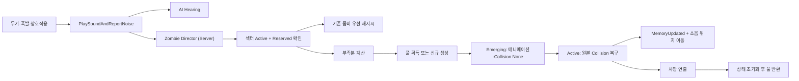

# Enemy Character Spawner 시스템 사용 가이드

## 1. 문서 목적

이 문서는 OutBreak 프로젝트에 구현된 좀비 스폰 시스템을 레벨과 게임플레이 코드에서 사용하는 방법을 설명한다.

시스템은 다음 작업을 서버에서 중앙 관리한다.

- `PlaySoundAndReportNoise`로 보고된 소음 수신
- 짧은 시간 안에 반복된 동일 소음 병합
- 소음이 발생한 섹터의 좀비 수와 상한 확인
- 주변의 기존 활성 좀비를 소음 위치로 우선 이동
- 부족한 수만큼 풀에서 좀비 확보 또는 신규 생성
- 등장 애니메이션 동안 충돌과 AI 정지
- 연출 완료 후 BeginPlay 시점의 원본 충돌 설정 복원
- 서버 AI에 소음 위치 조사 명령 전달
- 사망 연출 후 Actor와 Controller를 풀로 반환
- `AEnemyCharacter` 및 Spawn 상태를 서버에서 클라이언트로 복제

## 2. 주요 클래스

| 클래스 | 역할 |
|---|---|
| `UZombieDirectorWorldSubsystem` | 소음, 섹터 예산, 스폰 요청, 풀을 관리하는 서버 중앙 관리자 |
| `AEnemySpawnSectorVolume` | 공간을 섹터로 정의하고 해당 섹터의 좀비 상한을 제공 |
| `AEnemyCharacterSpawner` | 실제 등장 위치, 방향, 클래스, 연출, 검증 조건을 제공 |
| `UEnemySpawnProfile` | EnemyClass, PoolKey, 등장 Montage 등 재사용 가능한 스폰 설정 자산 |
| `UEnemySpawnableComponent` | 좀비의 풀 수명주기, 복제 상태, 충돌 스냅샷과 등장 완료 처리 담당 |
| `UOutBreakGlobal` | 사운드 재생과 AI Hearing/Director 소음 보고를 묶은 단일 진입점 |
| `UEnemyMemoryComponent` | Director가 지정한 소음 위치를 Hearing 자극과 동일한 형태로 AI에 전달 |

## 3. 전체 실행 흐름



## 4. 빠른 설정

### 4.1 EnemyClass 준비

스폰할 클래스는 `AEnemyCharacter`를 상속해야 한다.

기존 좀비 Blueprint를 사용할 때 다음 항목을 확인한다.

1. `EnemyAsset`이 유효하게 설정되어 있어야 한다.
2. AI Controller Class는 `AEnemyController` 또는 그 하위 클래스여야 한다.
3. Auto Possess AI는 `Placed in World or Spawned`를 사용한다. C++ 기본값도 이 값으로 설정되어 있다.
4. 등장 Montage는 해당 Skeletal Mesh와 AnimInstance에서 재생 가능한 자산이어야 한다.
5. 레벨에 `NavMeshBoundsVolume`이 배치되고 Navigation이 생성되어 있어야 한다.

`AEnemyCharacter`에는 `UEnemySpawnableComponent`가 기본 서브오브젝트로 자동 포함되므로 각 좀비 Blueprint에 컴포넌트를 다시 추가하지 않는다.

### 4.2 Spawn Profile 생성

Content Browser에서 다음 순서로 자산을 생성한다.

1. 우클릭 후 `Miscellaneous > Data Asset`을 선택한다.
2. Data Asset Class로 `EnemySpawnProfile`을 선택한다.
3. 예: `DA_ZombieSpawnProfile_Common`으로 저장한다.
4. 아래 값을 설정한다.

| 속성 | 설명 | 권장 시작값 |
|---|---|---:|
| `EnemyClass` | 스폰할 `AEnemyCharacter` 하위 Blueprint | 필수 |
| `PoolKey` | 같은 풀을 공유할 타입 식별자 | `Zombie.Common` |
| `SpawnMontage` | 등장 시 재생할 애니메이션 | 프로젝트 Montage |
| `PresentationDuration` | 충돌과 AI를 다시 켤 서버 기준 시간 | `1.25`초 |
| `GroundOffset` | 스포너 기준 최종 Z 보정 | `0`cm |
| `WarmPoolCount` | 첫 스포너 등록 시 미리 생성할 수 | `8` |

`PoolKey`가 같은 프로필은 같은 Actor 풀을 공유한다. 서로 다른 EnemyClass가 같은 `PoolKey`를 사용하지 않도록 한다.

### 4.3 섹터 배치

1. Place Actors에서 `EnemySpawnSectorVolume`을 레벨에 배치한다.
2. `SectorBounds` 크기를 해당 전투 구역에 맞춘다.
3. `SectorId`를 고유한 값으로 지정한다. 예: `Hospital.Floor1`.
4. 아래 상한을 설정한다.

| 속성 | 설명 | 현재 적용 여부 |
|---|---|---|
| `SectorId` | 소음과 스포너를 묶는 섹터 식별자 | 적용 |
| `SoftCap` | 평상시 목표 밀도용 값 | 설정 보존, 현재 스폰 차단에는 미사용 |
| `HardCap` | `Active + Reserved + Emerging` 절대 상한 | 적용 |
| `ResponseRadiusScale` | 섹터별 반응 범위 확장용 값 | 설정 보존, 현재 미사용 |

섹터 Volume이 겹치면 Director에 먼저 등록되어 위치를 포함한다고 판정된 섹터가 사용된다. 가능하면 섹터 Bounds가 서로 겹치지 않게 구성한다.

### 4.4 스포너 배치

1. `EnemyCharacterSpawner`를 레벨에 배치한다.
2. `SpawnDirection` Arrow가 좀비가 바라볼 방향을 가리키도록 회전한다.
3. `SpawnProfile`에 앞에서 만든 Data Asset을 지정한다.
4. `SectorId`에 해당 Volume과 같은 값을 입력한다.
5. `OccupancyPreview` Box를 좀비 캡슐보다 약간 크게 조정한다.

주요 속성은 다음과 같다.

| 속성 | 설명 | 권장 시작값 |
|---|---|---:|
| `SpawnProfile` | 재사용 가능한 주 설정 | 지정 권장 |
| `EnemyClass` | Profile이 없을 때 사용하는 클래스 | 선택 |
| `PoolKey` | Profile이 없을 때 사용하는 풀 키 | `DefaultZombie` |
| `SpawnMontage` | Profile이 없을 때 사용할 등장 Montage | 선택 |
| `PresentationDuration` | Profile이 없을 때 사용할 연출 시간 | `1.25`초 |
| `WarmPoolCount` | Profile이 없을 때 사용할 워밍 수 | `8` |
| `SectorId` | 이 스포너가 속한 섹터 | 섹터와 동일하게 지정 |
| `ReuseCooldown` | 같은 지점의 연속 등장 제한 | `2.0`초 |
| `MinPlayerDistance` | 플레이어 바로 옆 팝인 방지 거리 | `1200`cm |
| `bRequireNavigation` | NavMesh 투영 성공을 요구 | `true` |
| `bEnabled` | 런타임 후보 포함 여부 | `true` |

Profile이 지정되면 EnemyClass, PoolKey, Montage, Duration, WarmPoolCount는 Profile 값이 우선한다.

## 5. 소음 발생시키기

### 5.1 Blueprint

무기 발사, 폭발, 문 파괴 같은 서버 권한 이벤트에서 `Play Sound And Report Noise` 노드를 호출한다.

입력값:

| 입력 | 설명 |
|---|---|
| `WorldContextObject` | 보통 호출 중인 Actor 또는 Component |
| `SoundCue` | 재생할 SoundCue |
| `Location` | 실제 소음 발생 위치 |
| `Instigator` | 총을 쏘거나 폭발을 일으킨 Actor |
| `NoiseTag` | `Gunshot`, `Explosion`, `Impact` 같은 FName |
| `NoiseRangeScale` | SoundCue 감쇠 최대 거리 배율 |

호출은 서버의 실제 게임플레이 판정 경로에서 수행하는 것을 권장한다. 클라이언트에서만 호출하면 사운드는 들릴 수 있지만 AI Hearing과 Director 스폰 요청은 생성되지 않는다.

### 5.2 C++

```cpp
#include "Global/OutBreakGlobal.h"

UOutBreakGlobal::PlaySoundAndReportNoise(
    this,
    FireSoundCue,
    MuzzleLocation,
    GetOwner(),
    TEXT("Gunshot"),
    1.0f);
```

Global 래퍼는 Authority에서만 다음 두 이벤트를 함께 생성한다.

1. `UAISense_Hearing::ReportNoiseEvent`
2. `UZombieDirectorWorldSubsystem::ReportNoise`

따라서 게임플레이 코드에서 두 함수를 별도로 중복 호출하지 않는다.

## 6. 등장 애니메이션과 충돌

### 6.1 기본 동작

좀비가 풀에서 활성화되면 다음 순서로 동작한다.

1. Dormancy 해제
2. 새 `ActivationId` 발급
3. 스포너 Transform으로 이동
4. 체력, 절단, 래그돌, 오디오 상태 초기화
5. `SpawnPhase = Emerging` 복제
6. 모든 소유 PrimitiveComponent의 Collision 비활성화
7. 클라이언트에서 등장 Montage 재생
8. 서버 타이머가 `PresentationDuration` 후 완료 처리
9. BeginPlay에서 저장한 CollisionEnabled, ObjectType, Response, Overlap 설정 복원
10. Movement, Controller, Perception, Memory, StateTree 활성화
11. 소음 위치 조사 명령 실행

여기서 “원본 충돌”은 `UEnemySpawnableComponent::BeginPlay` 시점에 저장한 값이다. 런타임 중 임의로 변경한 충돌을 다음 활성화의 기본값으로 사용하지 않는다.

### 6.2 AnimNotify로 정확한 완료 시점 지정

서버 타이머만으로도 시스템은 동작한다. 발이 지면을 뚫고 나오는 정확한 프레임에 충돌을 복구하려면 Montage의 Notify에서 다음 함수를 호출할 수 있다.

```cpp
EnemyCharacter
    -> GetEnemySpawnableComponent()
    -> NotifySpawnPresentationReady();
```

Blueprint Notify에서는 Owner가 Authority인지 확인한 뒤 `EnemySpawnableComponent`의 `Notify Spawn Presentation Ready`를 호출한다.

Notify와 서버 타이머가 모두 실행되어도 `ActivationId`와 현재 Phase 검사 때문에 완료 처리는 한 번만 수행된다. Dedicated Server에서는 애니메이션 재생 여부와 관계없이 서버 타이머가 최종 보장 수단이다.

### 6.3 Blueprint 연출 확장

`AEnemyCharacterSpawner` Blueprint에서 `On Enemy Emerging` 이벤트를 구현할 수 있다.

권장 용도:

- 땅 파편 Niagara 실행
- 스포너 문 열림
- 지역 전용 사운드 재생
- 등장 지점 Decal 또는 먼지 연출

게임플레이 충돌이나 AI 활성화는 이 이벤트에서 직접 변경하지 않는다. 해당 상태는 `UEnemySpawnableComponent`가 소유한다.

## 7. 소음에 대한 좀비 수 계산

Director는 소음 하나에 대해 다음 순서로 대응한다.

1. 같은 Instigator와 NoiseTag가 `MergeWindow` 안에 반복되면 병합한다.
2. `DefaultResponders × Loudness`로 목표 대응 수를 계산한다.
3. `MaxRespondersPerNoise`로 제한한다.
4. 소음 반경 안의 Active 좀비를 거리순으로 선택한다.
5. 선택한 기존 좀비를 소음 위치로 재지시한다.
6. 목표 수의 부족분만 Pending Spawn Request에 넣는다.
7. 프레임마다 `SpawnBurstPerFrame`만큼 분산 처리한다.
8. GlobalHardCap과 섹터 HardCap을 넘으면 추가 활성화를 중단한다.

섹터 집계에는 다음 Phase가 포함된다.

- `Reserved`
- `Emerging`
- `Active`

`Dying`과 `InactivePooled`는 새 스폰 예산에 포함되지 않는다.

## 8. AI 이동

등장이 끝나면 Director가 지정한 위치가 `UEnemyMemoryComponent`에 Hearing 자극으로 기록된다.

그 뒤 다음 두 경로가 함께 실행된다.

- 기존 `MemoryUpdated` GameplayTag StateTree 이벤트 전송
- 서버 `AEnemyController::MoveToLocation` 요청

StateTree는 `LastHeardLocation` 또는 `LastStimulusLocation`을 조사 목표로 사용할 수 있다. 기존 Investigating State가 이 값을 읽도록 연결되어 있어야 한다.

좀비가 움직이지 않을 때는 다음을 확인한다.

1. NavMesh가 녹색으로 생성되어 있는지 확인한다.
2. 스포너와 소음 위치가 같은 연결 가능한 NavMesh 영역인지 확인한다.
3. Enemy Blueprint의 AIControllerClass를 확인한다.
4. StateTree가 `MemoryUpdated` 이벤트를 받아 Investigating State로 전환하는지 확인한다.
5. 등장 완료 후 SpawnPhase가 `Active`인지 확인한다.

## 9. 풀 반환

`AEnemyCharacter::Dead()`가 호출되면 기존 `Destroy`/`SetLifeSpan` 대신 다음 경로가 사용된다.

1. `bIsDead` 복제 및 사망 연출
2. Controller/StateTree/Perception 정지
3. Loot 생성
4. `DeathCleanupDelay` 동안 시체 유지
5. 체력, 절단, 래그돌, Montage, Memory, 이동 상태 초기화
6. Collision 비활성화 및 Actor 숨김
7. `SpawnPhase = InactivePooled`
8. Net Dormancy 적용
9. PoolKey 큐에 반환

풀을 정상적으로 사용하려면 외부 코드에서 좀비를 직접 `Destroy()`하지 말고 `Dead()`를 통해 사망 처리한다.

## 10. 네트워크 동작

`UZombieDirectorWorldSubsystem` 자체는 복제 객체가 아니다. 서버 Subsystem이 복제 가능한 `AEnemyCharacter`의 상태를 변경하고 Unreal Actor 복제 계층이 클라이언트에 전달한다.

클라이언트가 받는 주요 상태:

- Actor 생성과 Transform
- `bIsDead`
- `SpawnState.ActivationId`
- `SpawnState.Phase`
- `SpawnState.PoolKey`
- `SpawnState.SectorId`
- 등장 시작 서버 시간과 Duration
- 등장 Montage 자산 참조
- CharacterMovement 결과

AI 판단, 섹터 수 계산, 풀 큐 변경, NavMesh 경로 요청은 서버에서만 수행한다.

지연 입장 클라이언트가 `Emerging` 상태를 받으면 GameState 서버 시간과 등장 시작 시간의 차이만큼 Montage 위치를 보정한다. 이미 `Active`라면 등장 Montage를 다시 재생하지 않는다.

## 11. 전역 설정

Project Settings에서 `Enemy Director`를 검색해 기본값을 조정할 수 있다.

| 설정 | 기본값 | 설명 |
|---|---:|---|
| `GlobalHardCap` | `120` | 동시에 예산에 포함될 최대 좀비 수 |
| `DefaultSectorSoftCap` | `16` | Volume이 없을 때 사용할 소프트 값; 현재 차단에는 미사용 |
| `DefaultSectorHardCap` | `24` | Volume이 없을 때 사용할 절대 상한 |
| `SpawnBurstPerFrame` | `4` | 한 프레임에 활성화할 최대 수 |
| `DefaultResponders` | `6` | Loudness 1.0 소음의 기본 대응 수 |
| `MaxRespondersPerNoise` | `16` | 소음 한 건의 최대 대응 수 |
| `DefaultNoiseRange` | `10000`cm | SoundCue에 유효한 감쇠 거리가 없을 때 Director가 사용할 범위 |
| `MergeWindow` | `0.2`초 | 동일 소음 병합 시간 |
| `MergeRadius` | `500`cm | 동일 소음 병합 거리 |
| `SpawnRequestTimeout` | `3.0`초 | 후보가 없을 때 Pending 요청 유지 시간 |
| `DefaultWarmPoolCount` | `8` | 별도 워밍 값이 없을 때의 기본값 |
| `PooledActorZOffset` | `200000`cm | 워밍 Actor를 숨겨 둘 Z 오프셋 |

현재 Spawner와 Profile의 `WarmPoolCount`는 항상 0 이상의 값을 가지므로 해당 값이 전역 기본값보다 우선한다.

## 12. 권장 튜닝 순서

1. `GlobalHardCap`을 목표 서버 AI 예산에 맞춘다.
2. 각 섹터 `HardCap`을 공간 크기와 NavMesh 밀도에 맞춘다.
3. `DefaultResponders`와 `MaxRespondersPerNoise`로 전투 압박을 조정한다.
4. `SpawnBurstPerFrame`을 낮춰 순간 CPU/복제 스파이크를 줄인다.
5. `WarmPoolCount`를 첫 전투의 예상 부족분에 맞춘다.
6. `ReuseCooldown`으로 같은 구멍에서 반복 등장하는 현상을 완화한다.
7. `MinPlayerDistance`로 시야 앞 팝인을 막는다.
8. Montage 실제 길이에 맞춰 `PresentationDuration`을 조정한다.

## 13. PIE 검증 절차

### 13.1 단일 서버

1. 섹터 Volume 하나와 같은 SectorId의 Spawner 두 개 이상을 배치한다.
2. NavMesh 표시를 켜고 스폰 위치가 NavMesh 위인지 확인한다.
3. 서버에서 `PlaySoundAndReportNoise`를 호출한다.
4. 기존 좀비가 먼저 소음 위치로 이동하는지 확인한다.
5. 부족분만 Spawner에서 등장하는지 확인한다.
6. 등장 중 Pawn/Weapon 충돌이 없는지 확인한다.
7. 완료 직후 원래 충돌이 복원되는지 확인한다.
8. 좀비를 처치하고 동일 Actor가 다음 소음에서 재사용되는지 확인한다.

### 13.2 Listen Server + Client

1. PIE Players를 2 이상으로 설정한다.
2. Net Mode를 `Play As Listen Server`로 설정한다.
3. 서버에서 소음을 발생시킨다.
4. 서버와 클라이언트의 좀비 수가 같은지 확인한다.
5. 두 화면에서 등장 시작과 Active 전환이 일치하는지 확인한다.
6. 클라이언트 호출만으로 추가 스폰이 발생하지 않는지 확인한다.
7. 사망 및 풀 반환 후 Hidden/Collision 상태가 양쪽에서 일치하는지 확인한다.

### 13.3 Dedicated Server

1. Dedicated Server 옵션을 활성화한다.
2. AnimNotify 없이도 Duration 타이머로 Active 전환되는지 확인한다.
3. 2~4 클라이언트에서 같은 Actor 수와 이동 결과를 확인한다.
4. 자동화기 소음을 반복해 MergeWindow 동안 스폰 폭증이 없는지 확인한다.

## 14. 문제 해결

### 소리는 나지만 스폰되지 않는다

- 호출이 클라이언트 전용인지 확인한다.
- Spawner의 `bEnabled`와 EnemyClass/Profile을 확인한다.
- 소음 위치가 Sector Volume 안에 있는지 확인한다.
- Spawner의 SectorId가 소음 섹터와 같은지 확인한다.
- 플레이어가 `MinPlayerDistance`보다 가까운지 확인한다.
- OccupancyPreview 영역에 Pawn, PhysicsBody, Vehicle이 있는지 확인한다.
- Spawner가 NavMesh에 투영되는지 확인한다.
- ReuseCooldown, Sector HardCap, GlobalHardCap을 확인한다.

### 기존 좀비만 움직이고 새 좀비가 나오지 않는다

정상 동작일 수 있다. Director는 목표 대응 수를 기존 Active 좀비로 충족하면 새 Actor를 활성화하지 않는다.

### 등장 애니메이션이 보이지 않는다

- SpawnMontage가 Profile에 지정되었는지 확인한다.
- Enemy Skeletal Mesh와 Montage Skeleton이 호환되는지 확인한다.
- AnimInstance가 Montage Slot을 출력하는지 확인한다.
- PresentationDuration이 0으로 설정되지 않았는지 확인한다.
- 지연 입장 시 이미 Active 상태를 받은 것은 정상적으로 Montage를 생략한다.

### 등장 후에도 충돌이 켜지지 않는다

- SpawnPhase가 `Active`로 바뀌는지 확인한다.
- 서버 타이머가 실행될 수 있도록 Actor가 파괴되지 않았는지 확인한다.
- AnimNotify가 잘못된 객체에서 호출되고 있지 않은지 확인한다.
- BeginPlay 시점의 원본 Collision 설정이 실제로 활성 상태였는지 확인한다.

### 좀비가 소음 위치로 이동하지 않는다

- NavMesh와 경로 연결 상태를 확인한다.
- EnemyController가 풀에서 Resume되었는지 확인한다.
- StateTree가 이동 요청을 즉시 다른 State로 덮어쓰는지 확인한다.
- `LastHeardLocation`이 소음 위치로 갱신되는지 디버거에서 확인한다.

### 죽은 좀비가 풀로 돌아오지 않는다

- 외부 코드가 `Destroy()` 또는 `SetLifeSpan()`을 직접 호출하는지 확인한다.
- 사망 진입점이 `AEnemyCharacter::Dead()`인지 확인한다.
- `DeathCleanupDelay` 이후 Phase가 `InactivePooled`로 바뀌는지 확인한다.
- PoolKey가 활성화 때와 반환 때 동일한지 확인한다.

## 15. 로그 확인

Director 소음 로그는 `LogZombieDirector` 카테고리를 사용한다.

에디터 콘솔에서 다음 명령으로 Verbose 로그를 활성화할 수 있다.

```text
Log LogZombieDirector Verbose
```

주요 로그 정보:

- Noise EventId
- NoiseTag
- 목표 대응 수
- 재지시한 기존 좀비 수
- 스폰 부족분
- 판정된 SectorId

## 16. 현재 프로젝트 빌드 주의 사항

Spawner 시스템 관련 UHT 처리와 C++ 번역 단위는 컴파일을 통과했다. 다만 현재 전체 `OutBreakEditor` 빌드는 별도 Expedition 코드에 선언되지 않은 다음 API 때문에 중단된다.

- `AOBExpeditionGameMode::HandlePartyLeaderClaim`
- `AOBPlayerController::Client_BeginInsertionPresentation`
- `AOBPlayerController::Client_UpdateInsertionPresentation`

위 오류는 Spawner 시스템과 별개이며, 전체 에디터 실행 파일을 새로 링크하려면 해당 선언과 구현을 먼저 복구해야 한다.

## 17. 관련 소스

- `Source/OutBreak/Public/AI/Spawning/EnemySpawnTypes.h`
- `Source/OutBreak/Public/AI/Spawning/EnemyDirectorSettings.h`
- `Source/OutBreak/Public/AI/Spawning/EnemySpawnProfile.h`
- `Source/OutBreak/Public/AI/Spawning/EnemyCharacterSpawner.h`
- `Source/OutBreak/Public/AI/Spawning/EnemySpawnSectorVolume.h`
- `Source/OutBreak/Public/AI/Spawning/ZombieDirectorWorldSubsystem.h`
- `Source/OutBreak/Public/AI/Components/EnemySpawnableComponent.h`
- `Source/OutBreak/Private/Global/OutBreakGlobal.cpp`
