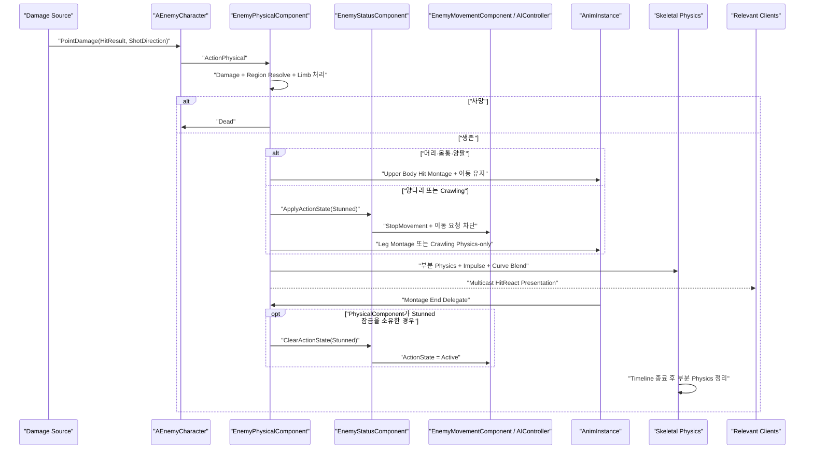

# 적 피격 Montage·물리 Impulse 블렌딩 작업 기획서

- 작성일: 2026-08-13
- 대상 프로젝트: OutBreak / Unreal Engine 5.7
- 대상 시스템: `AEnemyCharacter`, `UEnemyPhysicalComponent`, `UEnemyStatusComponent`, `UEnemyMovementComponent`, Enemy StateTree
- 문서 상태: 구현 반영 완료

## 1. 작업 목표

적이 총탄의 점 피해를 받으면 `DA_Enemy`의 피격 부위별 Montage를 재생하고, 현재 구현된 부분 물리 시뮬레이션과 Impulse를 Montage 포즈 위에 블렌딩한다.

최종 연출은 다음 조건을 만족해야 한다.

1. 머리, 몸통, 양팔, 양다리에 맞는 피격 Montage가 선택된다.
2. Montage가 기본 자세를 통제하고 부분 물리 반응이 충격의 변화를 더한다.
3. 머리·몸통·양팔 피격 Montage는 `Upper Body` Slot으로 재생하며 Capsule 기반 이동을 유지한다.
4. 양다리 피격과 Crawling 물리 리액트 동안에는 StateTree와 Path Following 이동을 잠근다.
5. 사망, 부위 파괴, 연속 피격, NavLink 이동, 풀 반환과 충돌하지 않는다.
6. 서버와 클라이언트가 같은 부위의 피격 연출을 본다.

핵심 방향은 **Montage를 주동작으로 사용하고 부분 Ragdoll을 보조 반응으로 제한하는 것**이다. 완전 Ragdoll은 사망 처리에만 유지한다.

## 2. 현재 상태 분석

### 2.1 `DA_Enemy`에 연결된 피격 자산

`Content/Enemy/ZombieAsset/Data/DA_Enemy.uasset`의 정적 참조에서 다음 자산 연결이 확인된다.

| 부위 | `FEnemyPhysicalReact` 속성 | 현재 연결 자산 |
|---|---|---|
| 머리 | `Hit_Montage_Head` | `ZombieIP_Hit_HeadNormal_Montage` |
| 오른팔 | `Hit_Montage_RightShoulder` | `ZombieIP_Hit_RightShoulderNormal_Montage` |
| 왼팔 | `Hit_Montage_LeftSholder` | `ZombieIP_Hit_LeftShoulderNormal_Montage` |
| 오른다리 | `Hit_Montage_RightLeg` | `ZombieIP_Hit_RightLegNormal_Montage` |
| 왼다리 | `Hit_Montage_LeftLeg` | `ZombieIP_Hit_LeftLegNormal_Montage` |
| 몸통 | `Hit_Montage_Spine` | `ZombieIP_Hit_SpineNormal_Montage` |

`ReactCurveFloat`, `ReactScale`, `BlendWeight_Anim_Physics` 및 여섯 개 Physical Material도 `DA_Enemy`에 존재한다.

`Hit_Montage_LeftSholder`에는 오탈자가 있지만 기존 `.uasset` 직렬화 호환성을 위해 이번 작업에서 즉시 이름을 바꾸지 않는다. 에디터 표시명만 정상 표기로 보완하거나, 별도 마이그레이션 작업에서 `FormerlySerializedAs` 정책을 적용한다.

### 2.2 현재 피격 처리 순서

현재 점 피해 경로는 다음과 같다.

```text
AEnemyCharacter::TakeDamage
  -> UEnemyPhysicalComponent::ActionPhysical
     -> Blood VFX Multicast
     -> 전체 체력 감소
     -> 부위 내구도 감소 및 절단 판정
     -> StopMovementImmediately
     -> 피격 Bone 이하 Physics 활성화
     -> Impulse 적용
     -> ReactTimeline으로 Physics Blend Weight 감소
     -> Timeline 종료 시 Physics 비활성화
```

현재 구현의 한계는 다음과 같다.

- `DA_Enemy`의 여섯 피격 Montage가 `EnemyPhysicalComponent`에서 사용되지 않는다.
- `PM_Torso`와 `Hit_Montage_Spine` 경로가 실제 부위 판정에 포함되지 않는다.
- `pelvis` 피격은 체력만 감소하고 모든 국소 반응을 건너뛴다.
- `StopMovementImmediately()`는 현재 속도만 0으로 만들며 다음 AI 이동 요청을 막지 않는다.
- `bIsHit`가 true이면 추가 물리 반응을 거부하지만, 명시적인 행동 잠금이나 정해진 이동 정지 시간은 없다.
- 부분 Skeletal Physics와 Impulse는 별도의 피격 Multicast가 없어 클라이언트 표현 일관성을 보장하지 않는다.
- `EEnemyActionState::Stunned`와 `UEnemyStatusComponent`가 선언돼 있지만, Status Component는 캐릭터에 생성되지 않고 상태 로직도 비어 있다.
- Timeline 콜백이 Curve 값을 그대로 Blend Weight로 적용하므로 `BlendWeight_Anim_Physics`가 첫 프레임 이후에도 상한으로 유지된다는 보장이 없다.

## 3. 범위

### 3.1 포함 범위

- Physical Material 및 Bone 기반 피격 부위 판정
- 부위별 Montage 선택과 재생
- Montage와 부분 물리 Impulse 동시 재생
- 서버 권한 기반 선택적 `Stunned` 상태
- 양다리 피격과 Crawling 물리 리액트 중 AI 이동·공격 차단
- 연속 피격 정책
- 서버/클라이언트 피격 Presentation 동기화
- 사망, 절단, 풀링, Animation Budget, NavLink 예외 처리
- Data Asset 검증 로그와 QA 체크리스트

### 3.2 제외 범위

- 전후좌우 방향별 4방향 피격 Montage
- 무기 종류나 피해량별 대형/소형 피격 애니메이션
- 비사망 Knockdown 및 기상 시스템
- 플레이어 Hit Stop, 카메라 Shake, 컨트롤러 진동
- 완전한 네트워크 Skeletal Physics 상태 복제

위 기능은 이번 구조 위에 확장할 수 있으나 1차 구현 완료 조건에는 포함하지 않는다.

## 4. 목표 구조

### 4.1 역할 분리

| 구성 요소 | 책임 |
|---|---|
| `UEnemyPhysicalComponent` | 피해, 부위 판정, Montage 선택, 부분 물리·Impulse, 피격 Presentation 시작과 정리 |
| `UEnemyStatusComponent` | 서버 권한 행동 상태와 선택적 `Stunned` 잠금의 단일 소유자 |
| `UEnemyMovementComponent` | 잠금 중 Path Following 이동 요청 거부 |
| `AEnemyCharacter` | 컴포넌트 접근자, Montage 재생 대상, 풀·사망 수명주기 연결 |
| Enemy StateTree | `Stunned` 동안 이동·공격 State 진입 억제 |
| `FEnemyPhysicalReact` | Montage, 물리 블렌드, Impulse, 비정상 종료 fallback 튜닝 데이터 |

### 4.2 권장 실행 흐름



다리 피격 이동 잠금은 서버 Montage End Delegate가 소유하며 물리 Timeline과 별개로 관리한다. 따라서 양다리 Montage 길이가 달라도 실제 Montage 종료 시점에 맞춰 이동·공격이 재개된다. 상체 피격은 `Upper Body` Slot으로 재생하고 행동 잠금을 적용하지 않아 Locomotion을 유지한다. Crawling에서는 Montage 없이 물리 Timeline이 잠금 종료를 담당한다.

## 5. 데이터 설계

### 5.1 기존 데이터 유지

다음 필드는 그대로 사용한다.

- `ReactCurveFloat`
- `ReactScale`
- `BlendWeight_Anim_Physics`
- `PM_Head`, `PM_Torso`, `PM_Arm_R`, `PM_Arm_L`, `PM_Leg_R`, `PM_Leg_L`
- 여섯 개 `Hit_Montage_*`

### 5.2 추가 권장 튜닝값

`FEnemyPhysicalReact`에 아래 값을 추가한다.

| 속성 | 형식 | 권장 시작값 | 용도 |
|---|---|---:|---|
| `HitReactPlayRate` | `float` | `1.0` | 모든 부위 피격 Montage 기본 재생 속도 |
| `HitReactMovementLockDuration` | `float` | `0.45s` | Montage 재생 실패 시 fallback 잠금 시간(직렬화 호환을 위해 기존 이름 유지) |
| `HitReactMontageBlendOutTime` | `float` | `0.08s` | 기존 공격 Montage 중단 및 피격 전환 블렌드 |
| `bRefreshLockOnRepeatedHit` | `bool` | `true` | 연속 피격 시 현재 반응을 새 부위 Montage로 교체하고 새 Montage 종료까지 잠금 |

메타데이터 권장값은 다음과 같다.

```cpp
meta=(ClampMin="0.0", ClampMax="3.0", Units="s")
```

1차 구현에서는 부위별로 다른 정지 시간이나 Play Rate를 두지 않는다. 실제 플레이 테스트에서 필요성이 확인되면 고정 필드를 `FEnemyHitReactEntry` 배열 또는 Map으로 재구성한다.

## 6. 피격 부위 판정 및 Montage 매핑

서버에서 부위를 한 번 확정하고, 클라이언트에는 Physical Material 포인터가 아니라 확정된 부위 enum을 전달한다.

신규 enum 예시:

```cpp
enum class EEnemyHitReactRegion : uint8
{
    None,
    Head,
    Torso,
    ArmRight,
    ArmLeft,
    LegRight,
    LegLeft,
};
```

권장 매핑은 다음과 같다.

| 우선 판정 | Bone 대체 판정 | Region | Montage | 물리 시작 Bone |
|---|---|---|---|---|
| `PM_Head` | `head`, `neck_*` | `Head` | `Hit_Montage_Head` | 실제 Hit Bone 또는 `head` |
| `PM_Torso` | `spine_*`, `pelvis` | `Torso` | `Hit_Montage_Spine` | 실제 `spine_*`, pelvis면 `spine_01` |
| `PM_Arm_R` | `clavicle_r`, `upperarm_r`, `lowerarm_r`, `hand_r` | `ArmRight` | `Hit_Montage_RightShoulder` | `upperarm_r` |
| `PM_Arm_L` | `clavicle_l`, `upperarm_l`, `lowerarm_l`, `hand_l` | `ArmLeft` | `Hit_Montage_LeftSholder` | `upperarm_l` |
| `PM_Leg_R` | `thigh_r`, `calf_r`, `foot_r` | `LegRight` | `Hit_Montage_RightLeg` | `thigh_r` |
| `PM_Leg_L` | `thigh_l`, `calf_l`, `foot_l` | `LegLeft` | `Hit_Montage_LeftLeg` | `thigh_l` |

판정 우선순위는 다음과 같다.

1. `HitResult.PhysMaterial`과 `DA_Enemy`의 Physical Material 비교
2. Physical Material이 없거나 일치하지 않으면 Bone 이름/부모 계층으로 대체 판정
3. 둘 다 실패하면 `Torso` Montage를 안전한 기본값으로 사용하고 물리는 적용하지 않는다.

`pelvis` 아래에 Physics를 활성화하면 사실상 전신 Ragdoll이 될 수 있으므로 비사망 몸통 피격의 물리 시작점은 `spine_01`로 제한한다. 기존의 “pelvis는 반응 생략” 정책은 “Spine Montage + 상체 물리 반응”으로 변경한다.

## 7. Montage와 부분 물리 블렌딩

### 7.1 재생 순서

생존 피격의 Presentation 순서는 아래로 고정한다.

1. 기존 공격/행동 Montage를 짧게 Blend Out한다.
2. 선택된 부위 Montage를 `HitReactPlayRate`로 재생한다.
3. 같은 프레임에 지정 Bone 이하의 부분 Physics를 활성화한다.
4. `BlendWeight_Anim_Physics`를 최대 물리 비중으로 설정한다.
5. Shot Direction 기반 Impulse를 지정 Bone에 적용한다.
6. `ReactCurveFloat`으로 물리 비중을 0까지 감쇠한다.
7. Timeline 완료 시 부분 Physics만 비활성화한다.

### 7.2 블렌드 계산

Curve 출력은 정규화된 `0..1` 값으로 취급한다.

```text
FinalPhysicsWeight = Clamp(CurveValue, 0, 1)
                   * Clamp(BlendWeight_Anim_Physics, 0, 1)
```

이 계산으로 Data Asset의 `BlendWeight_Anim_Physics`가 항상 물리 반응 상한이 된다. 권장 시작값은 `0.25~0.45`이며, `0.5` 이상은 Montage 통제가 약해지고 팔·머리가 과도하게 흔들릴 가능성이 있다.

### 7.3 Impulse 방향

가능하면 `FPointDamageEvent::ShotDirection`을 `ActionPhysical`에 전달해 사용한다. 현재 `HitResult.Normal`은 표면 법선이므로 탄환 진행 방향과 반대이거나 비스듬할 수 있다.

권장 API 형태:

```cpp
ActionPhysical(
    const FHitResult& HitResult,
    float DamageAmount,
    const FVector& ShotDirection);
```

Shot Direction이 유효하지 않을 때만 `-HitResult.ImpactNormal`을 대체값으로 사용한다. Impulse 크기는 기존 `ReactScale`을 유지하되 비정상적으로 큰 값은 Data Asset 검증 로그로 경고한다.

### 7.4 Animation 자산 규칙

- 모든 피격 Montage는 동일 Skeleton과 현재 Enemy AnimInstance에서 재생 가능해야 한다.
- 머리·몸통·양팔 Montage는 AnimGraph의 Locomotion 위에 `Layered Blend per Bone`으로 합성되는 `Upper Body` Slot을 사용한다.
- 양다리 Montage는 이동 잠금과 함께 재생되는 전신 Hit React Slot을 사용한다.
- Root Motion은 비활성화한다. 이동 정지 중 Capsule 위치가 Montage에 의해 움직이면 안 된다.
- Montage Blend In/Out은 짧게 유지한다. 권장 범위는 `0.03~0.10s`다.
- 공격 AnimNotify가 피격 후 남아 피해를 발생시키지 않도록 피격 시작 시 공격 Montage를 중단한다.
- Modular Proxy Mesh가 Leader Pose를 따르는 현재 구조에서는 Montage와 Physics 모두 `TargetMesh`에 적용하고 Proxy Mesh는 그 결과를 따라가게 한다.

## 8. 하체 피격 및 Crawling 이동·행동 잠금

### 8.1 Status Component 활성화

`AEnemyCharacter::InitializeComponents()`에서 현재 선언만 된 `UEnemyStatusComponent`를 기본 서브오브젝트로 생성한다.

```cpp
StatusComponent =
    CreateDefaultSubobject<UEnemyStatusComponent>(TEXT("StatusComponent"));
```

`UEnemyStatusComponent`가 `EEnemyActionState`의 유일한 변경 주체가 되도록 다음 API를 제공한다.

```cpp
void ApplyTimedActionState(EEnemyActionState NewState, float Duration);
void ApplyActionState(EEnemyActionState NewState);
void ClearActionState(EEnemyActionState StateToClear);
void ClearTimedActionState();
void ResetForPool();

EEnemyActionState GetActionState() const;
bool CanMove() const;
bool CanAct() const;
```

### 8.2 상태 우선순위

상태 우선순위는 아래로 고정한다.

```text
Dead > Knockdown > Stunned > Active
```

- Montage 종료 callback은 `ClearActionState(Stunned)`처럼 예상 상태를 지정해 현재 상태가 `Dead` 또는 `Knockdown`이면 `Active`로 되돌리지 않는다.
- 사망 시 Montage callback과 watchdog을 제거하고 상태를 `Dead`로 확정한다.
- 풀 활성화 시 callback, watchdog, 물리 Timeline을 제거하고 `Active`로 초기화한다.
- 연속 피격 허용 시 현재 Presentation을 중첩하지 않고 새 부위 Montage로 교체한다. 이전 End Delegate는 해제하므로 오래된 callback이 새 잠금을 풀지 못한다.
- Animation Budget 때문에 Montage callback이 비정상적으로 호출되지 않을 때만 Montage 예상 길이보다 1초 긴 watchdog이 잠금을 회수한다.

### 8.3 실제 이동 차단

양다리 피격 또는 Crawling 물리 리액트 시작 시 서버에서 아래를 모두 실행한다. 상체 피격에는 적용하지 않는다.

1. `AIController->StopMovement()`로 현재 Path Following 요청 취소
2. `UEnemyMovementComponent::StopMovementImmediately()`로 현재 속도 제거
3. `RequestDirectMove()`에서 `CanMove() == false`면 요청 거부
4. `RequestPathMove()`에서 `CanMove() == false`면 요청 거부
5. StateTree 이동 Task 진입 시 `CanMove()`를 확인
6. 공격 Montage Task 진입 시 `CanAct()`를 확인

`DisableMovement()`는 이번 기본안에서 사용하지 않는다. Movement Mode를 `MOVE_None`으로 바꾸면 낙하, NavLink, Crawling 상태를 복원할 때 원래 모드를 별도로 기억해야 하기 때문이다. 요청 게이트 방식은 중력과 바닥 접지를 유지하면서 수평 AI 이동만 차단한다.

Enemy StateTree에는 `ActionState == Stunned`인 동안 유지되는 최우선 대기 State를 추가한다. 이 State는 양다리 피격과 Crawling 물리 리액트에서만 진입한다. 상체 피격은 `Active`를 유지하므로 기존 이동 State가 계속 실행된다.

## 9. 연속 피격 정책

1차 구현은 시각적 안정성을 우선해 다음 정책을 사용한다.

- 모든 유효 피격은 체력과 부위 내구도를 정상 반영한다.
- 양다리 또는 Crawling 피격만 `Stunned` 잠금을 획득한다.
- `ReactTimeline`이 이미 실행 중이면 기존 Presentation을 정리한 뒤 새 Montage와 부분 Physics로 교체하며 중첩하지 않는다.
- 새 상체 피격으로 교체될 때 PhysicalComponent가 소유한 기존 다리 피격 잠금은 즉시 해제한다.
- Blood VFX는 기존처럼 각 타격마다 출력한다.

이 정책은 자동화기 연사 시 Skeletal Body가 매 프레임 다른 방향으로 튀는 현상을 막는다. 향후 반응성이 부족하다고 판단되면 최소 재생 간격을 둔 “최신 피격으로 교체” 정책을 2차 작업으로 도입한다.

## 10. 네트워크 설계

피해, 부위 내구도, 행동 잠금은 서버에서만 판정한다. Montage와 부분 물리는 일시적 Presentation이므로 관련 클라이언트에 `Unreliable NetMulticast`로 전달한다.

권장 RPC:

```cpp
UFUNCTION(NetMulticast, Unreliable)
void Multicast_PlayHitReact(
    EEnemyHitReactRegion Region,
    FName PhysicsBoneName,
    FVector_NetQuantizeNormal ImpulseDirection);
```

서버가 Region을 확정해 전송하므로 클라이언트가 Physical Material을 다시 판정하지 않는다. Montage 포인터 대신 Region을 보내고 각 클라이언트가 동일한 `EnemyAsset`에서 Montage를 가져온다.

처리 원칙:

- 서버: 피해, Status, Montage 중단, 서버 Presentation 실행
- 클라이언트: RPC 수신 후 동일 Montage·부분 Physics 실행
- 이동 정지: 서버 Actor Movement 복제를 기준으로 일치
- RPC 유실: 일시적 피격 연출 유실은 허용하지만 체력·사망·절단 상태에는 영향 없음
- Late Join: 이미 끝난 피격 연출은 재생하지 않음
- 사망 RPC/복제 상태가 도착하면 남아 있는 Hit React Montage와 Timeline을 즉시 정리

## 11. 예외 및 충돌 정책

### 11.1 사망

- 체력 또는 머리 파괴로 사망하면 Hit React Montage를 시작하지 않는다.
- 실행 중인 React Timeline과 Hit Montage를 중단한다.
- `HandleReactTimelineFinished()`가 사망 Ragdoll의 Physics를 끄지 않게 사망 여부를 먼저 검사한다.
- `ActionState`를 `Dead`로 올리고 Montage End Delegate와 watchdog을 제거한다.

### 11.2 부위 절단

현재 `ApplyLimbDestruction()`은 모든 Montage를 즉시 정지한다. 따라서 부위 내구도와 절단 처리를 피격 Montage 시작보다 먼저 완료한다.

- 머리 절단: 즉시 사망, Hit Montage 생략
- 팔·다리 절단 후 생존: 절단 반영 뒤 해당 부위 Hit Montage 또는 Spine fallback 재생
- 숨긴 Bone에 물리 Impulse를 적용할 수 없는 경우 Montage만 재생

단, 다리 상실로 `Crawling` 또는 `SlowCrawling`에 진입하면 예외 정책을 적용한다.

- 재생 중인 Hit React Montage의 End Delegate를 제거하고 Montage를 즉시 중단한다.
- 기존 부분 Physics Presentation을 정리한 뒤 현재 타격의 Physics·Impulse·Curve 반응을 새로 시작한다.
- Crawling 상태의 이후 피격은 부위별 Hit React Montage를 재생하지 않고 부분 Physics React만 실행한다.
- Physics Timeline 종료가 `Stunned -> Active` 해제를 담당한다.
- 서버가 계산한 `bAllowMontage`를 Multicast에 포함해 클라이언트의 부위 복제 도착 순서와 무관하게 같은 정책을 적용한다.

### 11.3 NavLink 및 공중 상태

1차 구현에서는 NavLink Traversal 중 피해와 VFX는 적용하되, 비사망 Hit Montage와 부분 Physics는 생략한다. Traversal 중간에 Movement Mode와 Custom Link를 강제 종료하면 AI가 공중에 고정되거나 링크 사용 상태가 누수될 위험이 있기 때문이다.

NavLink 중에도 강한 피격 반응이 필요하면 별도의 “Traversal 취소 후 Falling/Knockdown 전환” 작업으로 확장한다.

### 11.4 풀링

`ResetForPoolActivation()`과 `PrepareForPoolStorage()`에서 아래를 정리한다.

- Status callback/watchdog 및 `ActionState`
- Hit React Montage
- React Timeline
- `bIsHit`, Cached Region, Cached Bone
- 부분 Physics와 Physics Blend Weight
- 잔여 Velocity

이 정리가 없으면 풀에서 재사용된 적이 움직이지 않거나 이전 피격 자세로 활성화될 수 있다.

### 11.5 누락 자산

- Montage 누락: 물리 반응과 이동 잠금은 계속 실행하고 Warning 로그 기록
- Curve 누락: Montage와 이동 잠금만 실행하고 Physics 비활성화
- Physical Material 누락: Bone fallback 사용
- AnimInstance 누락: 물리 반응과 이동 잠금만 실행
- Status Component 누락: 크래시 없이 현재 속도 정지 후 Error 로그 기록

## 12. 예상 변경 파일

| 파일/자산 | 변경 내용 |
|---|---|
| `Public/AI/Data/EnemyState.h` | `EEnemyHitReactRegion` 추가 |
| `Public/AI/Data/EnemyAsset.h` | Hit React Play Rate, fallback 잠금 등 튜닝값 추가 |
| `Public/AI/Components/EnemyStatusComponent.h` | Action State 및 예상 상태 기반 해제 API 추가 |
| `Private/AI/Components/EnemyStatusComponent.cpp` | 서버 상태 우선순위, fallback Timer, 풀 초기화 구현 |
| `Public/AI/EnemyCharacter.h` | Status 접근자와 행동 가능 여부 API 추가 |
| `Private/AI/EnemyCharacter.cpp` | Status Component 생성, Shot Direction 전달, 사망·풀 정리 연결 |
| `Public/AI/Components/EnemyPhysicalComponent.h` | Region 해석, Presentation, Multicast 선언 |
| `Private/AI/Components/EnemyPhysicalComponent.cpp` | Montage 선택, 물리 블렌딩, 예외 처리 구현 |
| `Public/AI/Components/EnemyMovementComponent.h` | 피격 이동 잠금 조회 헬퍼 추가 필요 시 반영 |
| `Private/AI/Components/EnemyMovementComponent.cpp` | 잠금 중 Direct/Path Move 거부 |
| StateTree Evaluator 소스 | `ActionState`를 Context에 동기화 |
| `ST_EnemyAI_Advanced.uasset` | 최우선 Stunned State 및 전환 조건 추가 |
| Enemy Anim Blueprint | Hit React Slot 평가 경로 확인 또는 추가 |
| 6개 Hit Montage | Slot, Root Motion, Blend 설정 검수 |
| `DA_Enemy.uasset` | 신규 fallback·재생 속도 튜닝값 설정 |

## 13. 구현 단계

### 단계 1: 데이터와 자산 검증

1. 여섯 Montage가 Enemy Skeleton과 호환되는지 확인한다.
2. Montage Slot과 Root Motion 설정을 통일한다.
3. 신규 튜닝값과 Region enum을 추가한다.
4. `DA_Enemy`에 권장 시작값을 입력한다.

완료 조건: 에디터에서 모든 Montage와 Curve가 유효하며 Data Validation 로그에 오류가 없다.

### 단계 2: Status 기반 Montage 수명 잠금

1. Status Component를 `AEnemyCharacter` 기본 서브오브젝트로 생성한다.
2. `ApplyActionState`, 예상 상태 기반 `ClearActionState`, `CanMove`, `CanAct`, 풀 초기화를 구현한다.
3. AIController, Movement Component, StateTree Task에 잠금 검사를 연결한다.
4. 현재 `BP_EnemyController`가 사용하는 `ST_EnemyAI_Advanced`에 Stunned State를 추가한다.

완료 조건: 상체 Montage 중에는 이동이 유지되고, 양다리 Montage와 Crawling 물리 반응 중에는 이동·공격이 멈춘 뒤 종료 callback에서 정상 행동으로 복귀한다.

### 단계 3: 부위별 Montage 처리

1. Physical Material/Bone을 Region으로 해석한다.
2. Region에서 Montage와 안전한 Physics Bone을 선택한다.
3. 공격 Montage를 중단하고 피격 Montage를 재생한다.
4. Torso와 pelvis fallback을 적용한다.

완료 조건: 여섯 부위에서 각각 올바른 Montage가 출력된다.

### 단계 4: Montage·Physics 하이브리드

1. Montage 재생과 같은 프레임에 부분 Physics를 시작한다.
2. Curve 값에 최대 Blend Weight를 곱한다.
3. Shot Direction으로 Impulse를 적용한다.
4. Timeline 종료, 사망, 절단 시 정리 경로를 분리한다.

완료 조건: Capsule은 정지한 상태에서 Montage 포즈가 유지되고 피격 부위만 물리적으로 흔들린다.

### 단계 5: 네트워크 및 풀링

1. Hit React Presentation Multicast를 추가한다.
2. 서버, Listen Client, 원격 Client에서 동시 확인한다.
3. 풀 반환 및 재활성화 정리를 검증한다.

완료 조건: 모든 클라이언트가 같은 부위 반응을 보고 재사용 Actor에 잔여 상태가 없다.

## 14. 테스트 계획

### 14.1 기능 테스트

| ID | 시나리오 | 기대 결과 |
|---|---|---|
| HR-01 | 머리 피격 | Upper Body Head Montage + 머리 부분 물리 + 이동 유지 |
| HR-02 | 몸통/spine 피격 | Upper Body Spine Montage + 상체 물리 + 이동 유지 |
| HR-03 | pelvis 피격 | Spine Montage + `spine_01` 이하 물리, 전신 붕괴 없음 |
| HR-04 | 오른팔 피격 | Upper Body Right Shoulder Montage + 오른팔 물리 + 이동 유지 |
| HR-05 | 왼팔 피격 | Upper Body Left Shoulder Montage + 왼팔 물리 + 이동 유지 |
| HR-06 | 오른다리 피격 | Right Leg Montage + 오른다리 물리 + 이동 잠금 |
| HR-07 | 왼다리 피격 | Left Leg Montage + 왼다리 물리 + 이동 잠금 |
| HR-08 | Montage 누락 | 크래시 없이 물리와 잠금만 실행 |
| HR-09 | Curve 누락 | 크래시 없이 Montage와 잠금만 실행 |
| HR-10 | 공격 중 피격 | 공격 Montage/Notify 중단, Hit Montage 우선 |
| HR-11 | 연속 10발 피격 | 피해는 모두 적용, 물리 중첩 없이 새 부위 Montage로 교체, 마지막 부위 정책에 맞춰 잠금 갱신 |
| HR-12 | 치명타 | Hit React 대신 사망 Ragdoll 실행 |
| HR-13 | 부위 절단 | 절단 상태 보존, Montage/Physics 정리 충돌 없음 |
| HR-14 | NavLink 중 피격 | 피해·VFX 적용, Traversal 안전 유지, Hit Presentation 생략 로그 |
| HR-15 | 풀 반환 중 잠금 | End Delegate/watchdog 제거, 다음 활성화 시 즉시 이동 가능 |
| HR-16 | Hit Montage 중 다리 상실 | Montage 즉시 중단 후 Crawling 전환, 현재 타격은 Physics-only |
| HR-17 | Crawling 상태 추가 피격 | Hit Montage 없이 부분 Physics·Impulse만 실행, Timeline 종료 후 행동 복귀 |

### 14.2 Montage 수명 측정

- 잠금 시작 즉시 수평 Velocity가 0이 된다.
- 서버 기준 상체 Hit React Montage 재생 중에도 Direct/Path Move가 계속 적용된다.
- 양다리/Crawling 잠금 중에는 이동 요청과 공격 Montage가 새로 시작되지 않는다.
- 양다리 Montage End Delegate 또는 Crawling Physics Timeline 종료 직후 StateTree가 정상 이동·공격을 재개한다.
- 연속 피격 시 새로 선택된 마지막 Montage가 끝나야 해제된다.
- Montage가 재생되지 않는 예외 상황에서만 `Fallback Lock Duration` 이후 안전하게 해제된다.

### 14.3 네트워크 테스트

- Dedicated Server + Client 2대
- Listen Server + 원격 Client
- 각 Peer에서 Montage Region, 시작 시점, 부분 물리 방향 비교
- 높은 지연과 패킷 손실에서 체력·사망·절단 상태의 권한 일관성 확인
- Net Cull 거리 진입 시 과거 Hit React가 뒤늦게 재생되지 않는지 확인

### 14.4 회귀 테스트

- 일반 추적 및 공격 StateTree
- Spawn Presentation
- Vault/Climb/Drop NavLink
- Animation Budget reduced work
- 팔·다리 절단 후 Crawling 전환
- 사망 Ragdoll과 마지막 타격 Impulse
- 적 Warm Pool 생성, 반환, 재활성화

## 15. 완료 기준

아래 조건을 모두 만족하면 작업을 완료로 판정한다.

1. `DA_Enemy`의 여섯 Hit Montage가 런타임 부위 판정에 실제로 사용된다.
2. 각 비사망 피격에서 Montage와 부분 물리 Impulse가 같은 Presentation 구간에 출력된다.
3. 물리 비중은 `BlendWeight_Anim_Physics`를 초과하지 않는다.
4. 상체 피격은 `Upper Body` Montage 중 이동을 유지하고, 양다리/Crawling 피격은 종료까지 정지한 뒤 자동 복구된다.
5. 연속 피격이 Skeletal Physics를 중첩시키지 않으며 마지막 부위 정책에 맞춰 잠금을 안전하게 갱신한다.
6. 사망 Ragdoll을 Hit React 종료 callback이 해제하지 않는다.
7. 서버와 관련 클라이언트에서 동일 부위 Montage가 재생된다.
8. 풀 재사용 후 Montage, Timer, Velocity, 부분 Physics 잔여 상태가 없다.
9. 누락 자산과 잘못된 HitResult에서 크래시가 발생하지 않고 진단 로그가 남는다.
10. `OutBreakEditor Win64 Development` 빌드와 PIE 회귀 테스트를 통과한다.

## 16. 권장 1차 튜닝값

| 항목 | 권장값 |
|---|---:|
| Hit React Play Rate | `1.0` |
| 양다리 이동·공격 잠금 | 선택된 Hit React Montage 실제 수명 |
| Fallback 잠금 | `0.45s` |
| 기존 Montage Blend Out | `0.08s` |
| Animation/Physics 최대 Blend | `0.35` |
| 연속 피격 Presentation | 기존 반응 종료까지 병합 |
| pelvis 물리 시작 Bone | `spine_01` |

이 값은 구현을 시작하기 위한 기준이며, 최종값은 30 FPS 및 60 FPS PIE, Listen Server, Dedicated Server 환경에서 체감 테스트 후 확정한다.
