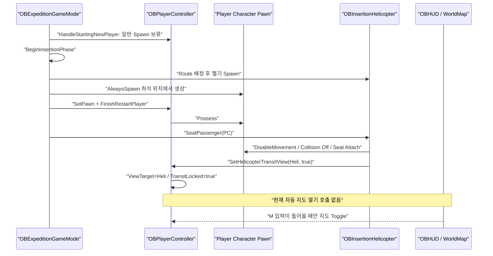
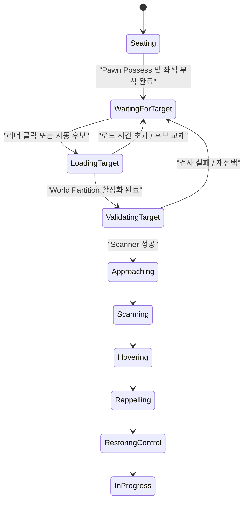

# 헬기 투입 중 화면·입력·착륙지 선택 교착 해소 구현 보고서

작성일: 2026-08-10  
대상 프로젝트: OutBreak / Unreal Engine 5.7  
범위: 원정 레벨 진입, 플레이어 Pawn 생성과 Possess, 헬기 좌석 탑승, 카메라, Enhanced Input, 월드맵, 착륙지 검사, 레펠 종료 및 입력 복구

## 1. 결론

현재 플레이어는 헬기 Actor에 Possess되지 않는다. `AOBPlayerController`는 생성된 플레이어 캐릭터 Pawn을 계속 Possess하고, Pawn을 헬기 좌석에 Attach한 뒤 카메라의 ViewTarget만 헬기로 변경한다.

문제는 다음 세 경로가 동시에 결합되어 발생한다.

1. 좌석 탑승과 동시에 캐릭터 이동, 점프, 상호작용, 인벤토리, 능력 입력을 차단한다.
2. 투입 페이즈가 시작되어도 PlayerController가 투입 UI를 자동으로 열지 않는다. 현재 페이즈 처리 함수는 `Ended`만 처리한다.
3. 30초 자동 선택 또는 지도 클릭 좌표를 월드 파티션 로드 완료 전에 즉시 Trace/NavMesh 검사한다. 실패하면 승객을 안전상 헬기에 남기지만 재시도·복구 루프가 없다.

따라서 현재 구조에서는 지도 토글 입력 하나가 전달되지 않거나 첫 착륙지 검사 한 번이 실패하는 것만으로 플레이어가 영구적으로 헬기에 갇힐 수 있다.

해결 방향은 아래와 같다.

- 투입 시작을 명시적인 클라이언트 Presentation 상태로 만든다.
- 투입 전용 Input Mapping Context를 별도로 유지한다.
- 파티 리더에게 월드맵을 자동으로 열어 준다.
- 선택 좌표에 별도 World Partition Streaming Source를 배치하고 로드 완료 후 검사한다.
- 검사 실패를 종료 상태가 아닌 재선택 가능한 상태로 처리한다.
- 정상 레펠과 모든 비정상 종료가 하나의 입력·카메라 복구 함수를 통과하게 한다.

## 2. 확인된 실행 증거

### 2.1 최근 실행

`Saved/Logs/OutBreak.log`에서 다음 순서가 확인된다.

- `BP_ExpeditionGameMode_C` 로드
- `InsertionOrbit routes found = 1`
- `Phase started. HelicopterClass=BP_OBInsertionHelicopter_C Routes=1`
- `BP_PlayerController_C_0 seated in BP_OBInsertionHelicopter_C_0`

좌석 배치는 09:54:04.423에 끝났고 Exterior PIE는 09:54:33.976에 종료됐다. 차이는 약 29.55초다. 자동 선택 제한시간은 30초이므로 이 실행은 자동 선택 직전에 종료됐다.

### 2.2 이전 실행

`Saved/Logs/OutBreak-backup-2026.08.07-10.35.04.log`에는 30초 타임아웃 뒤 아래 오류가 있다.

```text
[Insertion] Auto selection found no safe landing zone for Team 1 near V(0); passengers remain in helicopter.
```

즉 자동 선택 타이머는 실행됐지만 `(0,0)` 부근의 안전한 지점을 찾지 못했고, 현재 안전 정책에 따라 승객은 계속 헬기에 남았다.

### 2.3 uasset 연결 상태

정적 참조는 존재한다.

- `BP_PlayerController`: `IMC_Default`, `IA_Map`
- `BP_OBHUD`: `WBP_WorldMap`
- `BP_ExpeditionGameMode`: `BP_PlayerController`, `BP_OBHUD`, `BP_OBInsertionHelicopter`
- `IMC_Default`: `IA_Map`과 `M` 키 정보 포함

따라서 현재 확인된 핵심 문제는 단순 uasset 누락보다 런타임 상태 전환과 실패 복구 부재에 가깝다.

## 3. 현재 플레이어·스폰 로직 추적



### 3.1 진입과 Pawn 생성

관련 위치:

- `OBExpeditionGameMode.cpp:134` — 기존 PlayerStart Spawn 보류
- `OBExpeditionGameMode.cpp:185` — Insertion 페이즈 시작
- `OBExpeditionGameMode.cpp:247` — 팀별 헬기 생성
- `OBExpeditionGameMode.cpp:300` — 플레이어 등록
- `OBExpeditionGameMode.cpp:375` — 좌석 위치에 Pawn을 `AlwaysSpawn`하고 Possess

`SpawnAndSeatInsertionPawn`은 Pawn을 좌석 위치에 생성하고 `FinishRestartPlayer`를 호출한다. 따라서 PlayerController가 소유하는 것은 헬기가 아니라 캐릭터 Pawn이다.

### 3.2 헬기 좌석 탑승

`OBInsertionHelicopter.cpp:264`의 `SeatPassenger`는 다음을 실행한다.

- 캐릭터 이동 모드를 `DisableMovement()`로 변경
- 점프 중지
- Pawn Collision 비활성화
- 좌석 컴포넌트에 Attach
- `SetPassengerTransitState(Controller, true, this)` 호출

이는 헬기 안에서 플레이어가 움직이거나 능력을 사용하는 것을 막는 정상적인 물리 처리다.

### 3.3 카메라와 입력 잠금

`OBPlayerController.cpp:41`의 `SetHelicopterTransitView`는 다음 상태를 만든다.

- `bHelicopterTransitLocked = true`
- Ability Input 제거 및 `State.HelicopterTransit` 태그 적용
- 실행 중인 능력 취소
- `SetViewTarget(Helicopter)`
- 동일 상태를 Client RPC로 전달

이 함수는 Possess를 바꾸지 않는다. 카메라만 헬기 Actor를 바라본다.

입력 차단 위치는 다음과 같다.

- `Input_Move`: Transit 상태면 즉시 반환
- `Input_JumpStarted/Completed`: Transit 상태면 즉시 반환
- `Input_InventoryKey`: Transit 상태면 즉시 반환
- `Input_Interact`: Transit 상태면 즉시 반환
- Ability Input: 매 Tick Clear
- 장비/퀵슬롯 입력도 Transit 상태를 검사

`Input_Look`은 직접 Transit 상태를 검사하지 않지만, ViewTarget이 헬기이고 입력은 Pawn에 회전을 적용하므로 화면상 반응이 없다고 느끼기 쉽다.

### 3.4 지도 입력 경로

지도 경로는 아래와 같다.

```text
IMC_Default / IA_Map
  -> AOBPlayerController::Input_ToggleMap
  -> GetHUD<AOBHUD>()
  -> AOBHUD::ToggleWorldMap
  -> UOBWorldMapWidget::SetMapOpen
```

`MapAction` 자체는 Transit 잠금 검사를 하지 않는다. 설계상 M 키는 탑승 중에도 동작해야 한다.

그러나 다음 약점이 있다.

- 지도는 투입 시작 시 자동으로 열리지 않는다.
- `Input_ToggleMap`은 HUD 또는 WorldMapWidget이 없으면 아무 결과도 내지 않고 로그도 남기지 않는다.
- `SetMapOpen`은 `GameAndUI`를 설정하지만 위젯 Focus를 명시하지 않는다.
- 지도 열기 성공, 클릭 수신, RPC 전송 여부에 대한 진단 로그가 없다.
- PlayerController의 `HandleExpeditionPhaseChanged`는 `Ended`만 처리한다. `Insertion` 진입 시 UI 처리가 없다.

### 3.5 착륙지 선택과 검사

지도 클릭 경로는 아래와 같다.

```text
UOBWorldMapWidget::TrySelectInsertionPoint
  -> AOBPlayerController::RequestInsertionPoint
  -> Server_RequestInsertionPoint RPC
  -> AOBExpeditionGameMode::RequestInsertionPoint
  -> ResolveAndBeginInsertion
  -> UOBLandingZoneScannerComponent::FindSafeLandingZone
```

Scanner는 요청 프레임에 즉시 다음을 검사한다.

- Visibility Channel 지면 Trace
- 경사도
- 8방향 Footprint 높이 편차
- Exclusion Volume
- Navigation Projection
- 헬기 Hover Capsule 공간
- 레펠 수직 경로

선택 위치의 월드 파티션 셀, Collision 또는 NavMesh가 아직 활성화되지 않았다면 안전한 지형도 실패할 수 있다.

헬기에는 `UWorldPartitionStreamingSourceComponent`가 있지만 헬기 Actor 위치를 따라간다. 지도에서 선택한 먼 지점을 미리 로드하는 소스가 아니다.

### 3.6 실패 후 교착

`AutoSelectInsertionPoint`는 30초 후 MapData 중심을 한 번 검사한다. 실패하면 상태를 `WaitingForTarget`으로 되돌리고 승객을 헬기에 유지한다.

추락 방지는 되지만 아래가 없다.

- 다음 자동 후보
- 일정 시간 뒤 재검사
- 선택 지점 셀 로드
- 지도 자동 재오픈
- 사용자 오류 메시지의 보장된 표시
- 헬기 또는 UI 손상 시 Watchdog 복구

이 때문에 `WaitingForTarget + TransitLocked`가 영구 상태가 될 수 있다.

## 4. 결함 목록과 우선순위

| 우선순위 | 결함 | 영향 |
|---|---|---|
| P0 | Insertion 페이즈 진입 시 지도/전용 입력을 자동 활성화하지 않음 | 사용자가 진행 방법을 알 수 없고 입력 경로 하나에 의존 |
| P0 | 선택 좌표를 스트리밍하기 전에 즉시 Scanner 실행 | 먼 지점이 잘못된 착륙 불가 판정을 받을 수 있음 |
| P0 | 첫 자동 선택 실패 후 자동 복구 없음 | 플레이어가 영구적으로 헬기에 갇힘 |
| P1 | 입력·카메라·지도 상태를 서로 다른 클래스가 부분적으로 소유 | 정상/오류 종료에서 상태 누락 가능 |
| P1 | `Input_ToggleMap`과 HUD 실패가 Silent Failure | 원인 파악 불가능 |
| P1 | 정상 레펠 종료가 지도 닫기/InputMode 복구를 보장하지 않음 | 착지 뒤 UI 입력 모드가 남을 수 있음 |
| P2 | CommonUI를 사용하면서 CommonGameViewportClient가 아니라는 로그 | 향후 UI Action Router 기반 입력과 충돌 가능 |
| P2 | BP/uasset이 빈 엔진 버전으로 저장됐다는 경고 | 직접 원인은 아니지만 에셋 호환성 검증 필요 |

## 5. 목표 상태 머신

현재 물리 비행 상태와 UI/스트리밍 준비 상태를 한 상태 열거형에 섞지 않는 편이 안전하다. 서버 팀 투입 상태에는 아래 단계를 추가하는 것을 권장한다.



`EOBInsertionPhase`에 값을 추가할 경우 기존 Blueprint와 네트워크 숫자 호환성을 위해 새 항목을 뒤에 추가하거나 명시적인 숫자를 지정해야 한다.

## 6. 권장 구현

### 6.1 PlayerController가 투입 Presentation을 소유

추가 권장 API:

```cpp
UFUNCTION(Client, Reliable)
void Client_BeginInsertionPresentation(
    AOBInsertionHelicopter* Helicopter,
    float SelectionDeadlineServerTime,
    bool bCanSelectTarget);

UFUNCTION(Client, Reliable)
void Client_UpdateInsertionPresentation(
    EOBInsertionPhase Phase,
    const FString& StatusMessage,
    bool bForceMapOpen);

UFUNCTION(Client, Reliable)
void Client_EndInsertionPresentation(APawn* RestoredPawn);

void EnterInsertionInputMode(bool bCanSelectTarget);
void ExitInsertionInputMode();
void RestoreGameplayViewAndInput(APawn* Pawn);
```

`Client_BeginInsertionPresentation`의 책임:

- `SetViewTargetWithBlend(Helicopter, BlendSeconds)` 실행
- `bHelicopterTransitLocked = true`
- 전용 `InsertionMappingContext` 추가
- 게임플레이 입력은 각 Handler에서 계속 차단
- Controller 전체에 `DisableInput`은 사용하지 않음
- 파티 리더면 지도 자동 열기
- 일반 파티원은 읽기 전용 지도 또는 Cabin 안내 UI 표시
- 지도 생성 실패 시 명확한 Error 로그와 화면 메시지 표시

`Client_EndInsertionPresentation`의 책임:

- 지도 강제 닫기
- 투입 전용 Mapping Context 제거
- `FInputModeGameOnly` 복구
- Mouse Cursor 숨김
- `SetViewTargetWithBlend(Pawn, BlendSeconds)` 실행
- `bHelicopterTransitLocked = false`
- `State.HelicopterTransit` 태그 제거
- Ability Input Clear 후 다음 프레임부터 정상 처리

### 6.2 투입 전용 Input Mapping Context

기존 `IMC_Default`에만 의존하지 말고 아래 uasset을 추가하는 것을 권장한다.

- `IMC_Insertion`
- `IA_InsertionMapToggle`
- `IA_InsertionConfirm` 또는 지도 좌클릭
- `IA_InsertionCancel` 또는 재선택

권장 Mapping Priority는 기본 게임플레이 컨텍스트보다 높게 둔다. 전용 컨텍스트는 지도 열기/닫기와 확인 입력만 포함한다.

이 방식은 캐릭터 이동을 잠근 상태에서도 투입 UI 입력이 살아 있음을 구조적으로 보장한다.

### 6.3 Insertion 페이즈를 실제로 처리

현재 `AOBPlayerController::HandleExpeditionPhaseChanged`는 `Ended` 이외의 페이즈를 무시한다.

수정 방향:

```text
Insertion:
  투입 Presentation 준비 또는 서버 RPC 대기

InProgress:
  남아 있는 투입 UI/입력 잠금 강제 정리

Ended:
  기존 결과 화면 처리
```

`BindToGameStatePhase`가 늦게 성공한 경우에도 현재 페이즈를 즉시 처리해야 한다. 현재처럼 `Ended`일 때만 초기 반영하면 Insertion UI 시작 이벤트를 놓칠 수 있다.

다만 팀별 Helicopter 포인터와 리더 여부가 필요한 시점 때문에 실제 지도 오픈은 GameState 페이즈 하나만 믿기보다 GameMode가 보내는 `Client_BeginInsertionPresentation`을 기준으로 삼는 편이 안전하다.

### 6.4 HUD와 WorldMap을 Lazy Ensure 방식으로 변경

`AOBHUD`에 아래 API를 추가한다.

```cpp
UOBWorldMapWidget* EnsureWorldMapWidget();
bool OpenInsertionMap(bool bCanSelectTarget);
void CloseInsertionMap();
```

`EnsureWorldMapWidget`은 `BeginPlay` 생성 여부와 무관하게 필요 시 다시 생성한다. 실패하면 클래스명, OwningPlayer, HUDClass를 포함해 Error 로그를 남긴다.

`UOBWorldMapWidget`에는 일반 지도와 투입 지도 모드를 분리한다.

```cpp
void SetInsertionSelectionMode(bool bEnabled, bool bCanSelectTarget);
```

투입 모드에서 필요한 동작:

- Root Widget Focus 설정
- `FInputModeGameAndUI::SetWidgetToFocus`
- 리더만 클릭 선택 허용
- 현재 단계와 남은 시간 표시
- `LoadingTarget` 동안 클릭 잠금과 로딩 표시
- 검사 실패 메시지 및 재선택 안내
- 성공하면 확정 마커 표시 후 자동 닫기 또는 읽기 전용 전환

### 6.5 선택 지점 전용 World Partition Streaming Proxy

새 네이티브 Actor를 권장한다.

```text
AOBInsertionTargetStreamingProxy
  - USceneComponent Root
  - UWorldPartitionStreamingSourceComponent StreamingSource
  - 서버 전용 Transient Actor
  - Collision 없음
  - Replication 불필요
```

GameMode는 팀별 Proxy를 하나씩 유지한다.

선택 처리 순서:

1. 요청 좌표가 MapData 영역 안인지 검사
2. Proxy를 요청 XY와 안전한 기준 Z로 이동
3. Streaming Source 활성화
4. 팀 상태를 `LoadingTarget`으로 복제
5. 0.1~0.25초 주기로 `IsStreamingCompleted()` 확인
6. 완료 뒤 최소 1~2 프레임 대기
7. Navigation 준비 여부 확인
8. `FindSafeLandingZone` 실행
9. 성공 시 Proxy를 접근/레펠 종료까지 유지
10. 실패 시 후보 변경 또는 재선택 상태로 복귀

Streaming Source의 반경은 Scanner의 `SearchRadius + FootprintRadius + HelicopterClearanceRadius`보다 커야 한다. 현재 기본값 기준 최소 약 7,500~10,000cm를 권장한다.

`TargetState`는 Collision, Navigation, 배치 Actor가 실제 동작해야 하므로 `Activated`가 안전하다.

### 6.6 Scanner 실패 이유 반환

현재 Scanner는 `bool`만 반환하므로 실패 원인을 알 수 없다. 아래 실패 코드를 추가한다.

```cpp
enum class EOBLandingZoneFailure : uint8
{
    None,
    WorldNotReady,
    NoGroundHit,
    SlopeTooSteep,
    FootprintInvalid,
    HeightVariance,
    NavigationUnavailable,
    NavigationProjectionFailed,
    HelicopterClearanceBlocked,
    RappelPathBlocked,
    ExclusionVolume
};
```

최종 결과에는 대표 실패 이유와 검사 후보 수를 포함한다. UI에는 사용자용 메시지를 보내고 로그에는 좌표, 팀, WP 완료 여부, Nav 상태를 기록한다.

### 6.7 자동 선택을 단발이 아닌 후보 큐로 변경

현재 MapData 중심 하나만 검사하는 방식은 제거한다.

권장 후보 우선순위:

1. 리더가 마지막으로 클릭한 위치
2. InsertionOrbit Route에 가까운 플레이 가능 영역
3. MapData에 명시한 `DefaultInsertionCandidates`
4. 맵 중심 주변의 결정적 링 샘플

MapData에 아래 파라미터를 노출하면 Blueprint 없이 Data Asset으로 맵별 조정할 수 있다.

```cpp
UPROPERTY(EditDefaultsOnly)
TArray<FVector2D> DefaultInsertionCandidates;

UPROPERTY(EditDefaultsOnly)
float InsertionStreamingRadius = 10000.f;

UPROPERTY(EditDefaultsOnly)
float InsertionStreamingTimeout = 15.f;
```

후보 하나가 실패하면 다음 후보를 로드·검사한다. 모든 후보가 실패하면 지도 자동 재오픈과 함께 `WaitingForTarget`을 유지한다. 영구 무반응 상태로 두지 않는다.

### 6.8 입력·카메라 복구를 하나의 함수로 통합

현재 정상 레펠은 다음을 복구한다.

- 지면으로 이동
- Collision 활성화
- Movement Mode Walking
- ViewTarget을 Pawn으로 전환
- Transit Lock 해제

하지만 지도 상태와 InputMode까지 하나의 트랜잭션으로 보장하지 않는다.

아래 모든 경로가 동일한 `RestorePassengerControl`을 호출해야 한다.

- 정상 `FinishRappel`
- `ReleaseAllPassengers`
- 헬기 EndPlay/Destroyed
- 플레이어 Logout
- Pawn 교체
- 투입 강제 중단
- GameState가 비정상적으로 InProgress로 전환

복구 함수는 중복 호출에 안전해야 한다.

### 6.9 Watchdog

GameMode에서 팀별 투입 상태를 1초 간격으로 검사한다.

- Pending Controller가 있는데 Helicopter가 없음 → 헬기 재생성 및 재좌석
- `WaitingForTarget`이 설정 시간 이상 지속 → 지도 재오픈 + 다음 자동 후보
- `LoadingTarget` 시간 초과 → Proxy 재생성 또는 다음 후보
- `Rappelling`이 최대 시간 초과 → 유효한 확정 지면으로 강제 완료
- Pawn이 없는데 Controller가 Pending → 좌석 Pawn 재생성

Watchdog은 월드 원점 또는 미검증 지면에 플레이어를 투하해서는 안 된다.

## 7. 파일별 구현 지점

### `OBExpeditionGameMode.h/.cpp`

- 팀별 Streaming Proxy와 후보 큐 추가
- `RequestInsertionPoint`를 `요청 수락 -> 스트리밍 -> 검사` 비동기 흐름으로 분리
- `ResolveAndBeginInsertion`은 스트리밍 완료 뒤에만 호출
- 좌석 등록 성공 직후 `Client_BeginInsertionPresentation`
- 자동 선택 다중 후보 및 재시도
- Insertion Watchdog
- 모든 완료/중단에서 `Client_EndInsertionPresentation`

### `OBPlayerController.h/.cpp`

- 투입 Presentation Client RPC 추가
- `InsertionMappingContext`와 전용 Input Action 파라미터 추가
- 지도 Toggle 결과와 HUD 실패 로그 추가
- `HandleExpeditionPhaseChanged`에서 Insertion/InProgress 처리
- 카메라 전환을 `SetViewTargetWithBlend`로 명시
- 입력·커서·지도·GameplayTag 복구 함수 통합

### `OBHUD.h/.cpp`

- `EnsureWorldMapWidget`
- `OpenInsertionMap`
- `CloseInsertionMap`
- 지도 생성 실패를 반환값과 로그로 노출

### `OBWorldMapWidget.h/.cpp`

- 투입 선택 모드와 읽기 전용 모드 분리
- Widget Focus 지정
- 클릭 수신/월드 좌표/RPC 전송 로그
- Loading/Rejected/Accepted 상태 표시
- 선택 실패 시 재선택 안내

### `OBInsertionHelicopter.h/.cpp`

- 물리 좌석/레펠 책임만 유지
- Passenger 복구를 공통 함수로 정리
- `EndPlay` 안전 복구 또는 GameMode Watchdog 통지
- 정상 착지 때 UI/Input 종료를 PlayerController에 보장

### `OBLandingZoneScannerComponent.h/.cpp`

- 실패 이유와 후보 통계를 반환
- World/Navigation 준비 안 됨과 실제 지형 부적합을 구분
- 디버그 로그에 첫 실패와 최종 대표 실패를 출력

### 신규 `OBInsertionTargetStreamingProxy.h/.cpp`

- 선택 위치 전용 Streaming Source 제공
- 팀별 하나만 생성
- 검사와 레펠 완료 후 안전하게 비활성화

## 8. Blueprint 및 uasset 연결 항목

### `BP_PlayerController`

- `Default Mapping Context = IMC_Default` 유지
- `Map Action = IA_Map` 유지
- 신규 `Insertion Mapping Context = IMC_Insertion`
- 신규 투입 지도 Toggle/Confirm/Cancel Input Action 지정
- `BP_OnInsertionPointResult`에서 성공·실패 메시지 표시

### `BP_OBHUD`

- `World Map Widget Class = WBP_WorldMap`
- 투입 안내 Widget를 분리할 경우 신규 클래스 지정

### `WBP_WorldMap`

필수 BindWidget 이름 유지:

- `IMG_Map`
- `CVS_Markers`
- `OVR_MapRoot`

추가 권장 UI:

- 투입 단계 텍스트
- 선택 제한시간
- 로딩 Spinner
- 선택 실패 이유
- 리더 전용 클릭 안내
- 일반 팀원용 `리더가 위치 선택 중` 안내

### `BP_OBInsertionHelicopter`

- `CabinCamera` 위치와 활성 상태 확인
- `Seat_00~11` 위치 확인
- `Rappel_Left/Right` 위치 확인
- 화면 전환은 BP Possess로 구현하지 않고 C++ ViewTarget 이벤트에 시각 효과만 연결

### MapData Asset

- 실제 `WorldMapCenter`, `WorldMapSize`, `WorldMapTexture` 검증
- `DefaultInsertionCandidates` 배치
- 후보가 실제 플레이 영역과 NavMesh 영역에 포함되는지 검증

## 9. 로그 설계

다음 로그는 반드시 추가하는 것이 좋다.

```text
[InsertionInput] Begin PC=... Pawn=... ViewTarget=... Leader=...
[InsertionInput] MappingContext added: IMC_Insertion
[InsertionUI] WorldMap ensured/opened/failed
[InsertionUI] Click Screen=... UV=... WorldXY=...
[InsertionTarget] Streaming begin Team=... XY=... Radius=...
[InsertionTarget] Streaming complete Team=... Elapsed=...
[InsertionTarget] Validation failed Reason=... Candidates=...
[InsertionTarget] Validation accepted Ground=... Hover=...
[InsertionInput] Restore PC=... Pawn=... Reason=RappelCompleted
```

Development 빌드에서는 아래 콘솔 명령도 유용하다.

```text
OBInsertionDump
OBInsertionOpenMap
OBInsertionRetryTarget
```

`OBInsertionDump`는 Controller의 Pawn, ViewTarget, TransitLock, InputMode, Mapping Context, HUD, MapWidget, 팀 상태, Helicopter 상태를 한 번에 출력해야 한다.

## 10. 구현 순서

### 1차: 즉시 교착 해소

1. 좌석 등록 직후 리더 지도 자동 열기
2. `Input_ToggleMap`과 HUD 생성 실패 로그
3. Insertion 전용 Mapping Context
4. 정상 레펠/중단 시 지도·카메라·입력 공통 복구

### 2차: 착륙지 신뢰성

1. Target Streaming Proxy
2. Streaming 완료 뒤 Scanner 실행
3. Scanner 실패 이유
4. 자동 후보 큐와 재시도

### 3차: 운영 안정성

1. Watchdog
2. 디버그 콘솔 명령
3. 멀티플레이 리더 변경 처리
4. 지연/패킷 손실 테스트

## 11. 완료 조건

아래 조건을 모두 만족해야 구현 완료로 본다.

- 레벨 진입 후 플레이어 Pawn은 정상 Possess 상태다.
- 헬기 탑승 중 WASD/전투 입력은 차단되지만 투입 지도 입력은 항상 동작한다.
- 파티 리더의 지도는 별도 키를 누르지 않아도 자동으로 열린다.
- 일반 팀원은 선택 불가 상태와 진행 상황을 확인할 수 있다.
- 먼 지점을 클릭해도 셀 로드 완료 전에 Scanner를 실행하지 않는다.
- 첫 후보 실패 후 다른 후보 선택 또는 자동 재시도가 가능하다.
- 실패 상태가 60초 이상 무반응으로 지속되지 않는다.
- 레펠 종료 직후 Pawn ViewTarget, GameOnly InputMode, Cursor, Movement, Collision, Ability Input이 복구된다.
- 헬기 파괴, Pawn 누락, UI 클래스 누락 상황에서도 원점 낙하나 영구 입력 잠금이 없다.
- 1인 PIE, Listen Server 2인, Dedicated Server 2인 이상에서 동일하게 동작한다.

## 12. 테스트 매트릭스

| 시나리오 | 기대 결과 |
|---|---|
| 솔로 진입 | 지도 자동 오픈, 클릭 후 접근·레펠 |
| 파티 리더 진입 | 선택 가능 지도 자동 오픈 |
| 파티원 진입 | 읽기 전용 진행 UI, 리더 선택을 따라감 |
| 30초 무입력 | 후보 큐 자동 처리, 실패 시 다음 후보 |
| 먼 월드 파티션 셀 선택 | Streaming 완료 후 검사 |
| NavMesh 없는 지점 | 이유 표시 후 재선택 가능 |
| HUD/지도 클래스 누락 | Error 표시와 자동 후보 경로 유지 |
| 헬기 중간 파괴 | 교체 헬기 또는 통제된 복구, 영구 잠금 없음 |
| 레펠 중 연결 해제 | 남은 승객 진행에 영향 없음 |
| 착지 직후 M/WASD/마우스 | 지도 Toggle 및 이동·시점 정상 |

---

최우선 수정은 `지도 자동 오픈 + 투입 전용 입력 컨텍스트`와 `선택 좌표 스트리밍 후 검사`다. 두 항목이 함께 적용되어야 화면 전환 문제와 착륙지 실패 교착을 동시에 해결할 수 있다.

## 13. 시험 구현 반영 상태 (2026-08-10)

이번 시험 작업에서 다음 항목을 C++에 반영했다.

- 좌석 등록 직후 `Client_BeginInsertionPresentation`을 보내고 지도 자동 열기
- HUD의 `EnsureWorldMapWidget`, `OpenInsertionMap`, `CloseInsertionMap`
- 지도 Root 포커스 및 `GameAndUI` 입력 모드 지정
- 선택 가능/읽기 전용 투입 지도 모드 분리
- 선택 클릭, RPC 수신, 거절 사유, UI 생성 실패 로그
- 선택 위치에 별도 World Partition Streaming Source를 배치하고 완료 후 스캔
- `LoadingTarget`, `ValidatingTarget` 단계 추가
- Scanner 실패 이유 및 후보 검사 개수 기록
- 자동 선택을 MapData 후보, 맵 중앙, 중앙 주변 8개 후보 큐로 변경
- 정상 레펠, 강제 해제, 비정상 헬기 종료에서 입력·시점 복구
- `WaitingForTarget` 및 장시간 `Rappelling` 워치독
- `OBInsertionDump`, `OBInsertionOpenMap` 콘솔 진단 명령
- PlayerController Blueprint에서 사용할 Presentation Started/Updated/Ended 이벤트

Blueprint/uasset에서 선택적으로 연결할 신규 파라미터:

- `BP_PlayerController > Input|Insertion > Insertion Mapping Context`
- `BP_PlayerController > Input|Insertion > Insertion Map Action`
- `BP_PlayerController > Input|Insertion > Insertion Input Mapping Priority`
- `BP_PlayerController > Expedition|Insertion > Insertion View Blend Seconds`
- MapData > `Default Insertion Candidates`
- MapData > `Insertion Streaming Radius`
- MapData > `Insertion Streaming Timeout`

전용 입력 에셋이 아직 연결되지 않아도 기존 `MapAction`과 지도 자동 열기로 선택은 가능하다. 이 경우 `[InsertionInput] InsertionMappingContext is not assigned` 경고가 한 번 남는다.

검증 결과:

- UnrealHeaderTool `-WarningsAsErrors` 통과
- `OutBreakEditor Win64 Development` 빌드 통과
- `OutBreak_Exterior` 무인 런타임에서 좌석 탑승, 지도 자동 열기, 30초 자동 후보 선택, 대상 스트리밍 완료, 73개 착륙 후보 검사, 안전 지점 확정 및 접근 시작까지 로그 확인
- 무인 실행 종료 시 Steam 작업 스레드 종료 Assertion이 있었으며, 투입 로직 Fatal/Assertion은 확인되지 않음

## 14. 자유 시점·E Trace·착륙 허용 볼륨 추가 (2026-08-10)

### 14.1 최종 입력 흐름

헬기 탑승 중 입력은 다음과 같이 동작한다.

- 마우스 Look: 플레이어별 로컬 `ControlRotation`을 변경하고 헬기 `CalcCamera`가 CabinCamera 기준 자유 시점으로 반영
- `M`: 기존 MapAction을 사용해 지도를 열고 닫는 토글 유지
- `E`: 기존 InteractAction을 투입 중에만 가로채 현재 카메라 중앙 방향으로 Visibility Trace 실행
- Trace Hit 성공: Hit XY를 서버의 착륙 후보 요청으로 전송
- Trace Miss: 서버 요청 없이 `[InsertionTrace] Miss` 로그와 Blueprint 결과 이벤트 발생
- 헬기 하차 후 `E`: 기존 상호작용 로직으로 자동 복귀

자유 시점은 각 클라이언트의 PlayerController 회전을 사용하므로 멀티플레이 승객이 서로의 카메라 방향에 영향을 주지 않는다.

### 14.2 서버 검증 순서

클라이언트 Trace 결과는 신뢰하지 않고 서버에서 다음 순서로 다시 검증한다.

1. 파티 리더 여부 확인
2. MapData의 `WorldMapCenter/WorldMapSize` 범위 확인
3. 선택 XY 전용 World Partition 스트리밍 완료 대기
4. 선택 XY의 실제 지면 탐색
5. 요청 지면이 `AOBHelicopterInsertionAreaVolume` 내부인지 확인
6. Scanner가 찾은 최종 지면도 동일한 허용 볼륨 내부인지 다시 확인
7. 경사, Footprint, NavMesh, 헬기 Clearance, 레펠 경로, Exclusion Volume 검사

따라서 볼륨 밖 지점을 찍은 뒤 Scanner 반경 안의 볼륨 내부 지점으로 자동 보정되는 동작도 막는다. 요청 지면과 최종 지면이 모두 허용 볼륨 안이어야 한다.

### 14.3 신규 착륙 허용 볼륨

신규 네이티브 클래스:

```text
AOBHelicopterInsertionAreaVolume
  bAllowInsertion = true
```

Blueprint/uasset 작업:

1. `AOBHelicopterInsertionAreaVolume`을 부모로 `BP_HelicopterInsertionAreaVolume` 생성
2. `OutBreak_Exterior`의 실제 착륙 허용 지형을 덮도록 하나 이상 배치
3. 볼륨의 Z 범위가 지면 높이를 포함하도록 설정
4. World Partition에서 `Is Spatially Loaded`를 해제해 항상 로드
5. 물, 지붕, 실내처럼 볼륨 내부에서도 금지할 구역은 기존 `AOBHelicopterExclusionVolume`으로 차단

Scanner의 `bRequireInsertionAreaVolume` 기본값은 `true`다. 활성 허용 볼륨이 하나도 로드되지 않으면 모든 착륙 요청을 거절하고 다음 로그를 남긴다.

```text
[InsertionArea] No enabled AOBHelicopterInsertionAreaVolume is loaded.
```

### 14.4 Blueprint 노출 파라미터

`BP_OBInsertionHelicopter`:

- `Helicopter|Camera > Enable Passenger Free Look`
- `Passenger Free Look Yaw Limit`
- `Passenger Free Look Min Pitch`
- `Passenger Free Look Max Pitch`
- 기존 `CabinCamera` 위치와 기본 회전이 자유 시점의 기준

`BP_PlayerController`:

- `Expedition|Insertion|Trace > Insertion Target Trace Distance`
- `Insertion Target Trace Channel`
- `Draw Insertion Target Trace`
- `On Insertion View Trace` Blueprint 이벤트
- 기존 `InteractAction`이 `E`에 매핑되어 있어야 함

개발 중에는 `Draw Insertion Target Trace`를 켜면 Hit는 녹색, Miss는 빨간색 선으로 표시된다.

### 14.5 추가 로그

```text
[InsertionTrace] Hit PC=... Impact=... Actor=... Component=...
[InsertionTrace] Miss PC=... Start=... End=... Rotation=...
[InsertionArea] Requested point rejected ... Reason=OutsideInsertionArea
[InsertionTarget] Validation failed ... Reason=MissingInsertionAreaVolume
[InsertionTarget] Validation failed ... Reason=OutsideInsertionArea
```

이번 작업에서는 C++ 기반 클래스와 BP 연결 파라미터만 추가했으며, 실제 볼륨 uasset 생성과 레벨 배치는 별도 Blueprint 작업으로 남겨 두었다.

## 15. 입력·라인 트레이스 실시간 진단 보강 (2026-08-10)

Enhanced Input 액션이 연결되지 않았거나 지도 위젯이 키보드 포커스를 보유한 경우에도 원인을 분리할 수 있도록 입력 경로를 세 단계로 보강했다.

1. `PlayerController::InputKey`에서 투입 프레젠테이션 중 원시 `M/E` 키를 직접 수신한다.
2. 지도 위젯의 `NativeOnPreviewKeyDown`에서 포커스가 지도에 있을 때 `M/E`를 수신한다.
3. 기존 Enhanced Input `MapAction/InteractAction` 경로도 그대로 유지한다.

동일 키가 원시 입력과 Enhanced Input 양쪽에서 한 프레임에 들어오는 경우 0.08초 중복 방지로 한 번만 실행한다. 로그의 `Source` 값으로 실제 수신 경로를 구분할 수 있다.

화면 좌측 진단 메시지는 다음 순서로 표시된다.

```text
[INSERTION] INPUT ACTIVE | Mouse Look | M Map | E Trace
[INSERTION] M received [RawPlayerController 또는 MapWidgetPreview]
[INSERTION] E received [...] -> trace requested
[INSERTION] TRACE START ...
[INSERTION] TRACE HIT ... | sending to server
[INSERTION] Server result ACCEPTED 또는 REJECTED
```

Trace가 지형을 맞히지 못하면 `TRACE MISS: no Visibility blocking hit`, 로컬 상태에서 실행할 수 없으면 `LOCAL REJECT`, 서버 검증에서 거절되면 `Server result REJECTED`가 빨간색으로 표시된다. 개발 기본값으로 `Draw Insertion Target Trace=true`이며 Hit는 녹색 선/구, Miss는 빨간색 선으로 8초간 월드에 그려진다.

마우스 Look 액션이 실제로 들어오는 동안에는 0.5초 간격으로 다음 로그와 화면 메시지가 표시된다.

```text
[InsertionLook] Input received PC=... Axis=... ControlRotation=... ViewTarget=...
[INSERTION] LOOK received Axis=... Rot=...
```

콘솔 진단 명령:

- `OBInsertionDump`: Pawn, ViewTarget, 입력 잠금, 프레젠테이션, 리더 권한, 지도 상태, 팀 투입 Phase를 로그와 화면에 출력
- `OBInsertionOpenMap`: HUD를 통해 투입 지도를 강제로 다시 연다.
- `OBInsertionTrace`: `E`와 동일한 카메라 라인 트레이스를 강제로 실행한다.

Output Log에서는 `LogOBInsertionInput`, `LogOBInsertionMap`, `LogOBInsertion`, `LogOBLandingZone` 문자열로 필터링한다. 판독 기준은 다음과 같다.

- `M/E received` 자체가 없음: 현재 로컬 PlayerController 또는 지도 위젯까지 키 이벤트가 도달하지 않음
- `E received` 뒤 `LOCAL REJECT`: 투입 프레젠테이션, 리더 권한, 선택 가능 Phase, ViewTarget 중 하나가 맞지 않음
- `TRACE START` 뒤 `TRACE MISS`: 카메라 방향, Trace Channel, 지형의 Visibility Collision을 확인
- `TRACE HIT` 뒤 `Server result REJECTED`: MapData 범위, 로드된 `AOBHelicopterInsertionAreaVolume`, Scanner/NavMesh 로그를 확인
- `TRACE HIT`와 서버 결과 사이에서 멈춤: `[InsertionInput] Server RPC received` 유무로 클라이언트 RPC와 GameMode 진입을 분리

`AOBHelicopterInsertionAreaVolume`이 레벨에 로드되어 있지 않으면 Trace Hit까지는 성공해도 서버가 의도적으로 후보를 거절한다. 볼륨 uasset 생성·배치는 여전히 Blueprint/레벨 작업 범위다.

## 16. 레펠 종료 카메라 복구 및 예측 조향 접근 (2026-08-10)

### 16.1 레펠 종료 카메라 원인과 수정

레펠 중 캐릭터는 헬기 좌석에 부착된 위치에서 로프 시작점과 지상 착지점까지 큰 거리를 이동한다. 기존 복귀 코드는 헬기 카메라에서 캐릭터로 ViewTarget만 되돌렸고, 실제 플레이어 BP가 사용하는 카메라 시스템을 다시 활성화하지 않았다.

`BP_SandboxCharacter_Player`의 실제 플레이 카메라는 네이티브 `FollowCamera`가 아니라 Gameplay Cameras 플러그인의 `GameplayCamera` 컴포넌트와 `/Game/Blueprints/Cameras/CameraAsset_SandboxCharacter` 조합이다. 네이티브 `FollowCamera`는 이 BP에서 유효한 3인칭 오프셋을 만들지 않아 컴포넌트 위치가 Pawn 원점과 같았다. 레펠 복귀 때 이 컴포넌트를 강제로 활성화한 것이 화면이 캐릭터 골반/사타구니에 붙은 직접 원인이다.

- 헬기와 지상 캐릭터 사이의 큰 공간을 카메라가 블렌딩
- Gameplay Camera 평가 컨텍스트와 출력 카메라가 헬기 ViewTarget 전환 후 다시 생성되지 않음
- 잘못 활성화한 네이티브 FollowCamera가 Pawn 원점에서 먼저 선택됨
- 헬기 자유 시점의 ControlRotation이 캐릭터 카메라에 그대로 전달

수정된 복구 순서:

1. 지도와 투입 입력 컨텍스트 종료
2. `ResetIgnoreInputFlags`, `GameOnly`, 마우스 커서 숨김 적용
3. ControlRotation을 캐릭터 Yaw와 `InsertionExitCameraPitch`로 먼저 재설정
4. 캐릭터 `BeginPlay`에서 Gameplay Camera 컴포넌트 존재 여부로 카메라 제공자를 한 번 결정하고, 존재하면 상속된 네이티브 FollowCamera를 비활성화
5. 레펠 복귀 시 `ActivateCameraForPlayerController`로 Gameplay Camera 평가 컨텍스트와 출력 카메라를 다시 활성화
6. 기본값에서는 ViewTarget을 캐릭터로 즉시 Camera Cut

이전 시험 구현에 있던 SpringArm 강제 Tick, 카메라 랙 이력 강제 재기준화, 0.05초 재적용 타이머는 제거했다. Gameplay Camera를 쓰는 캐릭터와 네이티브 SpringArm을 쓰는 캐릭터의 경로를 런타임 복귀 시점에 섞지 않는다.

관련 로그:

```text
[CameraProvider] Gameplay Camera selected ... NativeFollowCameraActive=false
[InsertionCamera] Gameplay provider restored ... GameplayCamera=GameplayCamera GameplayReady=true ...
```

Blueprint PlayerController 조정값:

- `Expedition|Insertion|Camera > Insertion Exit Camera Pitch` 기본 `-10`
- `Cut Camera On Insertion Exit` 기본 `true`

### 16.2 헬기 예측 Steering 접근

기존 투입 접근은 시작 Transform과 스캔 Transform 사이를 `SmoothStep` 직선 보간했다. 새 기본 동작은 서버 권위 조향 시뮬레이션이며 다음 상태를 매 Tick 적분한다.

- 현재 수평 속도와 진행 방향
- 가속도 및 감속도 제한
- 초당 최대 Yaw 선회율
- 최대 상승·하강 속도
- 현재 운동량을 반영한 미래 위치 예측
- 선회량에 따른 Roll 뱅크
- 가속·감속과 상승·강하를 함께 반영한 Pitch
- 도착 거리 기반 감속

경로는 최종 Hover Transform을 바로 향하지 않는다. Scanner가 만든 스캔 대기 Transform 뒤쪽에 `SteeringFinalLegDistance`만큼 떨어진 접근 게이트를 만들고, 멀리 있을 때는 게이트를 먼저 통과한 다음 최종 스캔 지점으로 진입한다. 따라서 현재 진행 방향을 즉시 꺾는 대신 예측 선회 곡선과 안정된 최종 접근 구간이 형성된다.

Blueprint 헬기 조정값:

- `Use Steering Insertion Approach`: 새 조향 사용 여부
- `Steering Min/Max Approach Speed`: 접근 최저·최고 속도
- `Steering Acceleration/Deceleration`: 속도 변화 한도
- `Steering Max Turn Rate Degrees`: 초당 최대 선회각
- `Steering Look Ahead Seconds`: 운동량 예측 시간
- `Steering Final Leg Distance`: 접근 게이트 거리
- `Steering Gate Acceptance Radius`: 게이트 통과 허용 반경
- `Steering Arrival Radius`: 최종 도착 판정 반경
- `Steering Max Vertical Speed`: 최대 상승·강하 속도
- `Steering Max Bank Angle`: 선회 시 최대 Roll. 이 프로젝트의 기체 축 규약에 맞춰 `TurnInput`과 같은 부호를 사용
- `Steering Max Pitch Angle`: 가감속·상승강하 시 최대 Pitch
- `Steering Acceleration Pitch Weight`: 가속 시 기수 하강, 감속 시 기수 상승 반영 비율
- `Steering Vertical Pitch Weight`: 상승 시 기수 상승, 강하 시 기수 하강 반영 비율
- `Steering Attitude Interp Speed`: Pitch/Roll 반응 속도
- `Steering Timeout Multiplier`: 비정상 경로의 안전 종료 한도
- `Draw Steering Debug`: 예측선, 접근 게이트, 도착 반경 표시

Blueprint 시각 로직에서는 다음 Pure 함수를 읽을 수 있다.

- `IsSteeringFlightActive`
- `GetSteeringFlightVelocity`
- `GetSteeringTurnInput` (`-1` 좌선회, `+1` 우선회)
- `GetSteeringPitchInput` (`-1` 기수 하강, `+1` 기수 상승)

조향 상태는 복제되므로 헬기 BP에서 로터 효과, 기체 진동, 추가 메시/애니메이션 파라미터로 연결할 수 있다. 기본 C++ 로직 자체가 Actor Pitch/Roll을 적용하므로 BP에서 같은 축을 다시 덮어쓰는 경우에는 `VisualRoot` 하위 메시의 추가 오프셋만 적용하는 편이 안전하다.

Output Log의 `[HelicopterSteering] Begin/Tick/Final leg entered/Arrived` 순서로 목표, 속도, Yaw 오차, 선회 입력, Pitch 입력, 남은 거리를 확인할 수 있다. 정상적으로 도착하지 못하면 `Hard timeout; snapping to target`이 Error로 남는다.

무인 `OutBreak_Exterior` 실제 흐름 검증 결과:

- 허용 볼륨 1개 로드 및 자동 후보 Scanner 승인 확인
- 초기 Yaw 오차 `85.5°`, 초기 속도 `3500`, 계산 순항 속도 `4500`
- 강하·가속 구간 Pitch 입력 `-0.54`, 최종 감속 구간 기수 상승 입력 `+0.29` 확인
- 예측 전환 반경 `6053cm`에서 최종 구간 진입 `9.23초`
- 최종 스캔 지점으로 `18.56초`, 거리 `418cm`에서 `Arrived`, Hard Timeout 없음
- 레펠 완료 직후 Pawn `AttachedTo=None`, ViewTarget=Player Pawn, ControlRotation Pitch `-10`, Gameplay Camera 평가 컨텍스트 재생성 확인
- 캐릭터 시작 시 `[CameraProvider]`에서 Gameplay Camera 단일 제공자 선택과 네이티브 FollowCamera 비활성 확인
- `OutBreakEditor Win64 Development` 및 UHT `-WarningsAsErrors` 통과

## 17. Gameplay Camera 기준 사격 조준 통합 (2026-08-10)

### 17.1 직접 원인

화면은 Gameplay Cameras 플러그인의 출력 카메라로 렌더링됐지만 `UOBGameplayAbility_RangedWeapon::PerformServerWeaponTrace`는 `Character->GetFollowCamera()`를 고정 참조했다. 이 네이티브 컴포넌트는 플레이어 BP에서 Pawn 원점에 있으므로 화면 중앙과 무관하게 캐릭터 골반/엉덩이 부근에서 조준 프로브가 시작됐다.

또한 원격 플레이어의 서버에는 소유 클라이언트가 평가한 Gameplay Camera 출력이 없다. 서버에서 다른 카메라 컴포넌트를 찾아 대신 사용하는 방식으로는 멀티플레이에서 화면 중앙과 일치시킬 수 없다.

### 17.2 수정된 사격 데이터 흐름

1. 소유 클라이언트가 반동 적용 전에 `APlayerController::GetPlayerViewPoint`로 현재 `PlayerCameraManager`의 평가 완료 뷰를 캡처한다.
2. 카메라 원점과 방향을 GAS prediction key에 연결된 `FGameplayAbilityTargetData_LocationInfo`로 서버에 전달한다.
3. 서버 능력이 발급한 발사 횟수와 수신한 뷰 데이터를 1:1로 대응시켜 추가 타깃 데이터만으로 사격을 생성할 수 없게 한다.
4. 서버는 카메라 원점의 Pawn 거리, 복제된 ControlRotation과의 각도, Pawn 시점과 카메라 사이 차폐를 검증한다.
5. 검증된 카메라 뷰로 화면 중앙의 조준점을 서버에서 다시 Trace한다.
6. 실제 피해 탄도는 기존과 같이 총구에서 조준점 방향으로 발사한다. 벽 밀착 시 몸통-총구 차폐 보정도 유지한다.

따라서 카메라 Trace와 실제 탄환 Trace의 역할이 분리된다. 카메라 Trace는 화면 중앙 목표를 결정하고, 총구 Trace가 실제 탄도와 피해를 결정한다.

점사/연사도 동일 prediction key에서 샷마다 새 뷰 데이터를 전달한다. 점사 마지막 탄은 서버 타이머가 먼저 끝나더라도 대기 중인 서버 발사 토큰의 뷰 데이터가 모두 도착한 뒤 능력을 종료한다.

### 17.3 제거한 임시 경로와 진단 로그

제거한 경로:

- 서버에서 네이티브 `FollowCamera` 위치/회전을 사격 기준으로 사용하는 코드
- 레펠 종료 시 네이티브 FollowCamera를 강제로 활성화하는 코드
- SpringArm 위치·회전 랙 강제 Tick
- 0.05초 뒤 카메라를 다시 적용하는 검증 타이머

Output Log 판독:

```text
[WeaponAim] Local view captured ... Origin=... PawnOffset=...
[WeaponAim] Server view accepted ... AimError=... AimPoint=... Muzzle=...
```

거절 시에는 거리/각도 초과, 카메라 원점 차폐, 서버 발사 토큰 없는 추가 데이터가 각각 `[WeaponAim] Rejected ...`로 기록된다. 기본 검증값은 최대 카메라 거리 `1200cm`, 서버 조준 방향과의 최대 오차 `30°`이며 원거리 무기 Ability Blueprint 기본값에서 조정할 수 있다.
