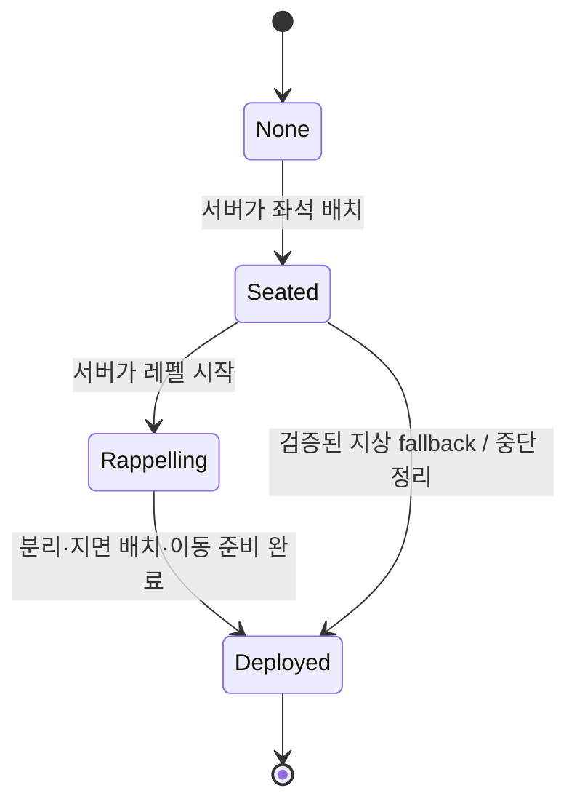

# 헬기 투입부터 플레이어 사격까지 통합 감사 및 수정 결과

작성일: 2026-08-10  
대상: `OutBreak_Exterior`, `AOBExpeditionGameMode`, `AOBInsertionHelicopter`, `AOBPlayerController`, GAS 사격 경로  
결론: C++ 통합 수정과 UE 5.7 Editor 빌드, 일반 스폰/헬기 투입 단독 런타임 시험까지 완료했다. 레펠 종료 후 다시 헬기에 잠기던 결정적 레이스와 원격 소유 클라이언트에서 총구/탄착 Gameplay Cue가 누락되던 원인을 제거했다.

## 1. 최종 동작 계약

게임모드의 `bEnableHelicopterInsertion`이 진입 방식을 결정한다.

| 설정 | 레벨 진입 동작 | 레거시 SpawnZone 사용 | 헬기 카메라/입력 잠금 |
|---|---|---:|---:|
| `false` | Unreal 일반 스폰 | 허용 | 없음 |
| `true` | Pawn 생성 후 헬기 좌석 배치 → 목표 선택 → 접근/스캔/호버 → 강제 레펠 | 투입 진행 중 금지 | 개인 상태가 `Seated` 또는 `Rappelling`일 때만 |

헬기 모드의 플레이어별 권위 상태는 다음 순서만 허용한다.

`FOBTeamInsertionState`는 팀 임무와 UI 표시만 설명한다. 카메라, Pawn 입력, GAS 차단 여부는 더 이상 팀 상태만 보고 결정하지 않는다. 소유자에게만 복제되는 `FOBPlayerInsertionTransitState`가 개인 잠금의 단일 권위다.

## 2. 확정된 근본 원인

### 2.1 레펠 뒤 입력과 사격이 다시 막힌 원인

수정 전 순서는 아래와 같았다.

1. `FinishRappel`이 `Client_SetHelicopterTransitView(false)`로 개인 잠금을 해제했다.
2. 곧바로 `OnPassengerDeployed`를 브로드캐스트했다.
3. 게임모드가 팀 배치 수를 갱신하고 GameState를 복제했다.
4. PlayerController의 reconcile은 “우리 팀의 헬기가 아직 유효하고 팀 단계가 Insertion인가”만 검사했다.
5. 방금 내려온 플레이어가 실제 승객인지 확인하지 않은 채 헬기 presentation과 잠금을 다시 시작했다.

따라서 1인 게임도 grace period 동안 다시 잠길 수 있었고, 같은 팀 다인 게임에서는 마지막 승객이 내려오기 전까지 먼저 내린 플레이어가 다시 헬기 카메라/입력 상태가 될 수 있었다. 이 상태에서 사격은 `bHelicopterTransitLocked`와 GAS transit 태그에 의해 차단됐다.

### 2.2 상태와 종료 API가 여러 곳에 중복된 문제

수정 전에는 같은 사실을 다음 네 곳이 각각 보유했다.

- GameMode의 팀 런타임 상태
- GameState의 복제 팀 상태
- Helicopter의 비행/승객 단계
- PlayerController의 로컬 bool과 presentation 상태

여기에 `Client_Set`, `Client_Begin`, `Client_Update`, `Client_End`, GameState OnRep reconcile이 동시에 카메라와 UI를 건드렸다. RPC와 actor reference 복제 순서가 다르면 동일 단계를 두 번 시작하거나, Pawn view로 잠긴 채 헬기 참조만 늦게 해석되는 상태가 발생했다.

### 2.3 실제 입력 소유자가 두 개였던 문제

`BP_PlayerController`의 C++ 입력은 `IMC_Default`의 Move/Look/Jump/Interact/GAS를 처리한다. 동시에 `BP_SandboxCharacter_Player`는 `IMC_Sandbox`를 LocalPlayer subsystem에 추가하고 자체 Enhanced Input 이벤트로 Move/Look/Jump/Interact 등을 처리한다.

Pawn의 `DisableInput`만 호출해도 LocalPlayer에 설치된 `IMC_Sandbox` 자체는 남는다. 같은 Mouse/E/WASD를 먼저 consume하면 헬기용 PlayerController 액션이 도착하지 않을 수 있고, 배치 뒤에는 Move/Look이 이중 적용될 수 있다.

### 2.4 GAS 전체 취소와 단순 Clear의 양쪽 문제

- 탑승 시 `CancelAbilities()` 전체 호출은 OnSpawn/passive까지 중단했다.
- 반대로 `ClearAbilityInput()`만 호출하면 입력 배열만 비우고 활성 스펙에 release/cancel을 전달하지 않아 ADS나 연사가 눌린 상태로 남을 수 있었다.
- `State.HelicopterTransit` 태그도 공통 ability activation gate에서 사용되지 않아 지연된 활성화 RPC를 확실히 막지 못했다.

### 2.5 `MOVE_None`이 “키가 안 먹는다”로 보인 문제

레펠 후 지면 trace가 즉시 실패하면 `HoldUntilGrounded`가 최대 15초간 `MOVE_None`을 설정했다. 카메라/입력 잠금이 풀려도 CharacterMovement가 입력을 소비하지 못하므로 사용자에게는 계속 키가 죽은 것처럼 보였다.

### 2.6 카메라 복원과 사격 trace가 다른 기준을 본 문제

카메라를 임의 소켓/높이로 밀어 맞추는 임시 보정은 실제 Gameplay Camera가 계산한 view와 총기 trace의 기준을 갈라놓는다. 사격은 이제 로컬 `PlayerController::GetPlayerViewPoint`로 평가한 origin/rotation을 TargetData에 싣고 서버가 거리, 방향, Pawn-to-camera obstruction을 검증한다. 캐릭터 골반이나 임의 SpringArm 위치를 발사 origin으로 대체하지 않는다.

### 2.7 사격할 때 shake만 남고 Fire/Impact FX가 사라진 원인

원격 소유 클라이언트가 TargetData를 보낸 prediction key가 서버의 `ExecuteGameplayCue`까지 유지됐다. GAS는 소유 클라이언트에서 그 key를 “이미 로컬 예측한 cue”로 간주해 서버 multicast를 억제한다. 그러나 기존 클라이언트는 recoil/camera shake만 예측하고 Fire Cue는 실행하지 않았다. 결과적으로 발사자는 shake만 보고 총구 이펙트와 소리를 못 받을 수 있었다.

Impact Cue도 같은 key를 쓰면 발사 클라이언트가 예측하지 않은 서버 탄착 이펙트까지 억제될 수 있었다.

### 2.8 승객 정리 순서와 실패 경로가 통합되지 않은 문제

- `OnPassengerDeployed`가 승객 배열/복제 상태 제거보다 먼저 발생해 passenger count가 순간적으로 1 크게 계산됐다.
- 레펠 중 Pawn 소실, queue Pawn 소실, Logout, `ReleaseAllPassengers`, EndPlay가 서로 다른 정리를 했다.
- Controller 또는 Pawn이 사라지면 transit tag, 좌석, rep state, Pending 배열이 남을 수 있었다.
- 후보 검증 실패 뒤 선택 deadline/timer를 다시 걸지 않아 WaitingForTarget이 무한 유지될 수 있었다.
- 헬기 누락, 좌석 부족, Pawn 등록 실패도 Pending을 영구 유지할 수 있었다.

### 2.9 검증 영역보다 레펠 배치 진형이 컸던 문제

Landing scanner 기본 검증 반경은 450 cm인데 기존 승객 배치 offset은 인원에 따라 최대 약 900 cm까지 커졌다. 후반 승객이 검증된 지형 바깥에 강제 배치될 수 있었다.

## 3. 적용한 통합 수정

### 3.1 소유자 전용 개인 transit 상태

`FOBPlayerInsertionTransitState`에 revision, `Phase`, Helicopter, ViewTarget, 서버가 계산한 `bCanSelectTarget`을 넣고 `COND_OwnerOnly`로 복제한다.

- `Seated`, `Rappelling`만 카메라/Pawn/GAS를 잠근다.
- `Deployed`, `None`은 잠금을 해제한다.
- GameState reconcile은 현재 소유자 transit가 active이고 같은 Helicopter를 가리킬 때만 투입 UI를 복원한다.
- 팀 상태가 아직 Insertion이어도 이미 `Deployed`인 플레이어를 다시 잠그지 않는다.
- party leader 정보의 복제 순서와 무관하도록 선택 권한을 owner transit state에 서버가 기록한다.
- party leader 값이 서버에서 바뀌면 활성 transit state의 revision과 권한도 다시 commit한다.

기존의 중복 client presentation RPC 네 종류는 제거했다. GameMode는 GameState의 한 presentation snapshot만 갱신하고, PlayerController는 owner transit state와 snapshot revision을 조합해 한 번만 적용한다.

### 3.2 배치 종료 순서와 네트워크 actor-channel 지연 방어

Helicopter의 공통 `FinalizePassenger`가 다음 순서를 지킨다.

1. Pawn detach와 지상 위치/이동 상태 적용
2. active rappel, queue, passenger controller, replicated passenger state 제거
3. owner transit를 `Deployed`로 commit
4. 마지막에 deploy delegate를 정확히 한 번 알림

PlayerController가 `Deployed`를 먼저 복제받더라도 Pawn actor channel에서 detach와 movement mode가 도착할 때까지 짧게 poll한다. Pawn이 더 이상 헬기에 attach되어 있지 않고 movement가 `MOVE_None`이 아닐 때 gameplay view/input을 복원한다. 대기는 3초로 제한하고 timeout 시 오류 로그와 함께 복원한다.

Pawn/controller 소실, Logout, ReleaseAll, EndPlay도 같은 승객 정리 함수로 수렴시켰다. 마지막 승객 알림은 idempotent하게 한 번만 발생한다.

### 3.3 입력 컨텍스트와 Pawn Blueprint 입력 격리

- transit 진입 시 실제로 활성 상태였던 Pawn 입력만 저장하고 `DisableInput`한다.
- `/Game/Input/IMC_Sandbox.IMC_Sandbox`가 적용돼 있으면 기존 priority와 함께 제거한다.
- transit 종료 시 정확히 억제했던 Pawn만 복원하고, 당시 저장한 priority로 mapping context를 복구한다.
- BP가 한 프레임 늦게 context를 다시 추가해도 transit 중 Tick에서 재차 격리한다.
- Pawn 교체/OnRep에도 현재 transit 상태를 재적용한다.
- `InsertionMappingContext`는 선택 사항이다. 지정하면 기존 `MapAction`과 `InteractAction`만 높은 priority로 매핑하며 새로운 중복 IA를 만들지 않는다.
- raw `InputKey` E/M 우회는 제거했다. 포커스가 지도에 있을 때만 Widget PreviewKey가 동일한 PlayerController 핸들러로 전달한다.

지도, 인벤토리, 파티, 상호작용 UI가 서로 input mode와 cursor를 덮지 않도록 PlayerController가 지도 input mode를 소유한다. 다른 modal을 열 때 지도는 먼저 닫히고, 다른 modal이 열려 있을 때 새 지도 열기는 거절된다.

중요: 배치 후에는 기존 게임 기능 보존을 위해 `IMC_Sandbox`를 원래대로 복구한다. 따라서 장기적으로는 `BP_SandboxCharacter_Player`와 PlayerController 중 Move/Look/Jump의 최종 소유자를 하나로 정리해야 한다. C++은 헬기 중 키 consume 문제를 차단하지만, BP 양쪽의 평시 중복 이벤트까지 자산을 임의 수정하지는 않았다.

### 3.4 GAS 입력 flush와 공통 transit gate

`UOBAbilitySystemComponent::FlushPlayerAbilityInput`을 추가했다.

- tracked press/held/release 스펙에 정상적인 release를 전달한다.
- 활성 상태인 non-OnSpawn `UOBGameplayAbility`만 선택 취소한다.
- OnSpawn/passive와 정책을 알 수 없는 외부 ability는 보존한다.
- transit 진입과 인벤토리 열기에 동일한 안전한 flush를 사용한다.

`UOBGameplayAbility::CanActivateAbility`는 non-OnSpawn ability가 `State.HelicopterTransit` 중 활성화되는 것을 공통 차단한다. Ranged ability는 매 local shot과 서버 authoritative commit 시점에도 transit/dead/downed 상태를 재검증한다.

### 3.5 지면 대기

즉시 지면을 찾으면 Walking으로 확정한다. World Partition collision이 늦으면 `MOVE_Falling`과 collision/gravity를 유지하며 poll한다. timeout이 되어도 `MOVE_None`에 고착시키지 않으며 `[SpawnGround]` 로그에 immediate/deferred/timeout과 위치, movement mode를 남긴다.

### 3.6 사격 Gameplay Cue와 camera trace

- 한 발마다 TargetData를 보내는 동일 prediction scope에서 소유 클라이언트가 Fire Cue를 먼저 실행한다.
- 서버 Fire Cue multicast는 동일 prediction key로 소유자 중복만 억제하고 다른 클라이언트에는 한 번 전달된다.
- Impact Cue는 서버에서 invalid/server key scope로 보내므로 소유 클라이언트도 authoritative hit FX를 받는다.
- `[WeaponFire] Local predicted fire cue`, `Authoritative shot committed ... PredictionKey=...` 로그를 추가했다.
- 발사 origin은 `GetPlayerViewPoint`, 실제 탄도 시작점은 muzzle, aim point는 camera trace 결과로 유지한다. 캐릭터 엉덩이/골반 기준의 임시 보정은 사용하지 않는다.

### 3.7 후보 검증, 실패 복구, 레펠 진형

- 후보 실패 시 WaitingForTarget deadline과 selection timer를 다시 건다.
- 헬기 spawn/좌석/Pawn 등록 실패 시 검증된 LZ가 있으면 safe-ground fallback으로 플레이어를 배치한다.
- fallback도 불가능하면 owner를 `Deployed`로 정리하고 Pending을 제거한 뒤 팀 상태를 명시적으로 `Aborted`로 전환한다.
- missing-helicopter watchdog도 같은 bounded failure 경로를 사용한다.
- InProgress 전환 직전에 유효한 PC가 active owner transit에 남아 있지 않은지 검증하고 필요하면 `Deployed`를 commit한다.
- `RappelLandingFormationRadius` 기본값을 350 cm로 노출했다. 기본 scanner `FootprintRadius` 450 cm 안쪽의 원형 진형으로 끝점을 계산한다.

## 4. 블루프린트/uasset에서 연결해야 할 항목

C++ 로직은 자산을 파라미터로 받을 준비가 되어 있다. 아래 작업은 에디터에서 사용자가 연결해야 한다.

### 4.1 `BP_ExpeditionGameMode`

- `Enable Helicopter Insertion`: 원하는 기본 모드 선택
- `Insertion Helicopter Class`: 사용자가 상속한 투입 헬기 BP
- `Extraction Helicopter Class`: 탈출용 헬기 BP
- `Personal Extraction Class`: 개인 탈출지점 BP
- 필요 시 URL 시험: `?HelicopterInsertion=1` 또는 `?HelicopterInsertion=0`

투입 모드가 켜진 동안 GameMode의 spawn guard가 레거시 SpawnZone 재사용을 막는다. 일반 모드에서는 기존 Unreal spawn 경로를 그대로 허용한다.

### 4.2 `OutBreak_Exterior` 월드

- 유효한 `AOBHelicopterRoute`를 최소 1개 배치하고 경로 점을 설정한다.
- `AOBHelicopterInsertionAreaVolume`을 배치하고 Enabled 상태로 둔다. E trace 후보는 이 볼륨 안에서만 서버 검증을 통과한다.
- World Partition에서 route/필수 volume/초기 헬기 관련 actor가 초기 로드돼야 한다면 `Is Spatially Loaded`를 끈다.
- MapData 자동 후보가 실제 insertion volume과 겹치는지 확인한다. 현재 로그에서는 자동 후보 1~5가 외부/stream timeout이었고 6번에서 유효 지점을 찾았다.

### 4.3 `BP_PlayerController`

- `Default Mapping Context`: `IMC_Default`
- `Pawn Mapping Contexts To Suspend During Insertion`: 기본 soft path로 `IMC_Sandbox`가 이미 들어간다. BP에서 다른 Character 전용 context를 추가했다면 배열에도 추가한다.
- `Insertion Mapping Context`: 선택 사항. 만들 경우 `MapAction`과 `InteractAction`만 넣고 priority를 기존 context보다 높게 둔다.
- 새로운 `IA_E`, `IA_M` 사본을 만들 필요가 없다. 기존 IA 자산을 재사용한다.

평시 입력 중복을 완전히 없애려면 다음 중 하나를 선택해야 한다.

1. PlayerController를 Move/Look/Jump의 단일 소유자로 삼고 Character BP의 동일 Enhanced Input 이벤트를 제거한다.
2. Character BP를 단일 소유자로 삼으려면 PlayerController의 평시 Move/Look/Jump 바인딩을 비활성화하고, 헬기 전용 context/handler만 PlayerController에 남긴다.

현재 수정은 BP의 sprint/crouch 등 미확인 기능을 파괴하지 않기 위해 자산 이벤트를 자동 삭제하지 않았다.

### 4.4 투입 헬기 BP

- 좌석/카메라/rope anchor scene component를 C++이 노출한 배열과 파라미터에 연결한다.
- `Rappel Landing Formation Radius`는 scanner footprint보다 작게 유지한다. 기본 권장값은 350 cm이다.
- steering 속도, bank/pitch 한계, approach/scan/hover 시간은 BP defaults에서 조정한다.
- C++이 flight authority와 상태 전이를 소유하므로 BP Tick에서 actor transform을 별도로 강제 설정하지 않는다.

### 4.5 Gameplay Cue 자산

- `GameplayCue.Weapon.Fire`에 총구 flash/sound cue 자산
- `GameplayCue.Weapon.Impact`에 물리 재질별 impact cue 자산
- 무기 muzzle component/socket이 올바른지 확인

코드는 cue 전송 경로를 복구했지만, cue tag에 연결된 자산이 비어 있으면 표시할 FX 자체는 없다.

### 4.6 탈출지점 BP의 현재 확정 오류

현재 `OutBreak_Exterior`의 `BP_ExtractionZone_Personal` 및 Public 변형 로그에서 `CallTriggerRadius=32.0 cm`가 확인됐다. 서 있는 Character capsule 중심이 이 구보다 높아 정확히 마커 위에 있어도 BeginOverlap이 발생하지 않을 수 있다.

BP에서 다음을 수정해야 한다.

- `CallTrigger` Sphere Radius: 최소 300 cm
- Collision Enabled: Query Only
- Pawn response: Overlap
- Generate Overlap Events: true
- 배치된 개인 zone을 직접 사용할지, GameMode가 팀별 runtime zone을 spawn할지 한 방식으로 정리

이 uasset 값은 사용자 작업 영역이므로 C++ 수정 과정에서 임의 저장하지 않았다.

## 5. 디버그 방법

콘솔 명령:

- `OBInsertionDump`: owner transit revision/phase, 팀 phase, view target, Pawn attach/movement, 지도 상태를 한 번에 출력
- `OBInsertionTrace`: 현재 camera view 기준으로 insertion trace를 쏘고 local/server 거절 이유를 출력
- `OBInsertionOpenMap`: 투입 지도를 강제로 열어 HUD/input 연결을 검사

주요 로그 마커:

- `[SpawnMode]`: 헬기/일반 모드 선택과 spawn branch
- `[InsertionState]`: owner-only transit commit/apply 및 revision
- `[InsertionInput]`: mapping context/Pawn input/GAS 잠금과 복원
- `[InsertionUI]`: 지도 열기, selection permission, modal input mode
- `[InsertionTrace]`, `[InsertionTarget]`, `[InsertionArea]`: E trace와 후보 검증
- `[SpawnGround]`: 지면 해석 및 movement mode
- `[WeaponAim]`, `[WeaponFire]`: camera origin, 서버 검증, cue prediction key
- `[ExtractionDebug]`: flare trigger overlap 및 BP 설정 진단

디버깅 시 핵심 불변식:

- 레펠 종료 직후 owner phase가 `Deployed`
- `TransitLocked=false`
- `ViewTarget=현재 Pawn`
- Pawn `AttachedTo=None`
- CharacterMovement가 `MOVE_None`이 아님
- `State.HelicopterTransit` loose tag count가 0
- 이후 다른 승객/팀 phase 복제가 와도 `Seated`로 되돌아가지 않음

## 6. 검증 결과

### 6.1 빌드

- Unreal Engine 5.7 `OutBreakEditor Win64 Development`
- 결과: 성공
- 최종 관련 파일 UHT/compile/link 통과
- `git diff --check` 통과

### 6.2 일반 스폰 모드

로그: `Saved/Logs/CodexIntegratedSpawnOffFinal2.log`

- `HelicopterInsertion=false`
- `Normal Unreal spawn active`
- `[SpawnGround] Immediate ground resolve`
- Player spawn 완료
- 헬기 creation/presentation과 owner insertion state가 시작되지 않음

### 6.3 헬기 투입 단독 런타임

로그: `Saved/Logs/CodexIntegratedHeliFinal.log`

- route 1개 발견, 투입 헬기 생성 및 좌석 배치
- `IMC_Sandbox` priority 0 저장 후 제거
- owner revision 1: `Seated`, locked=true
- 자동 후보 6번에서 73개 지점 평가 후 ground/hover 검증 성공
- 접근 → 스캔 → hover → rappel 진행
- owner revision 2: `Rappelling`, locked=true
- 2.77초 레펠 후 즉시 지면 해석, Pawn detach/Walking
- `IMC_Sandbox` 및 Pawn BP 입력 복원
- owner revision 3: `Deployed`, locked=false, ViewTarget=Pawn
- 3초 뒤 Expedition InProgress에도 transit=false/presentation=false 유지
- 배치 뒤 다시 locked=true가 되는 로그 없음

### 6.4 아직 수동 확인이 필요한 항목

- 실제 두 원격 클라이언트가 같은 팀으로 접속해 먼저 내린 플레이어가 두 번째 플레이어 레펠 중 이동/조준/사격 가능한지 PIE 또는 packaged network 환경에서 확인
- BP Gameplay Cue 자산이 실제 총기별 muzzle/socket과 정상 연결됐는지 시각 확인
- Character BP 평시 입력 중복 정리 후 sprint/crouch/interaction 회귀 시험
- CallTrigger radius 수정 뒤 개인/공용 flare, 헬기 도착 타이머, 탑승 완료 시험

## 7. 남은 의도된 트레이드오프

Fire Cue는 입력 반응성을 위해 클라이언트가 먼저 예측한다. 서버가 camera/상태/탄약 검증으로 그 샷을 거절하면 소유자는 순간적인 총구 FX/소리를 봤지만 탄약, 피해, Impact가 없는 false-positive를 볼 수 있다. 이를 완전히 제거하려면 발사 accept/reject cosmetic protocol을 별도로 추가하거나 모든 Fire Cue를 서버 확인 후 재생해 지연을 감수해야 한다. 현재 구현은 일반적인 즉시 반응형 선택을 사용한다.

## 8. 변경 파일

- `Public/Game/Expedition/OBHelicopterTypes.h`
- `Public/Game/Expedition/OBInsertionHelicopter.h`
- `Private/Game/Expedition/OBInsertionHelicopter.cpp`
- `Public/Game/GameMode/OBExpeditionGameMode.h`
- `Private/Game/GameMode/OBExpeditionGameMode.cpp`
- `Public/Player/Controller/OBPlayerController.h`
- `Private/Player/Controller/OBPlayerController.cpp`
- `Private/UI/Widgets/Expedition/OBWorldMapWidget.cpp`
- `Public/Ability/Components/OBAbilitySystemComponent.h`
- `Private/Ability/Components/OBAbilitySystemComponent.cpp`
- `Public/Ability/Abilities/OBGameplayAbility.h`
- `Private/Ability/Abilities/OBGameplayAbility.cpp`
- `Private/Ability/Abilities/OBGameplayAbility_RangedWeapon.cpp`
- `Public/Character/OBCharacterBase.h`
- `Private/Character/OBCharacterBase.cpp`

`Content/Blueprint/Character/BP_ExpeditionGameMode.uasset`은 작업 시작 전부터 수정 상태였던 사용자 자산이며 이번 C++ 통합에서 저장하거나 되돌리지 않았다.
