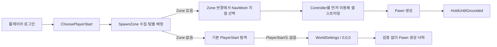
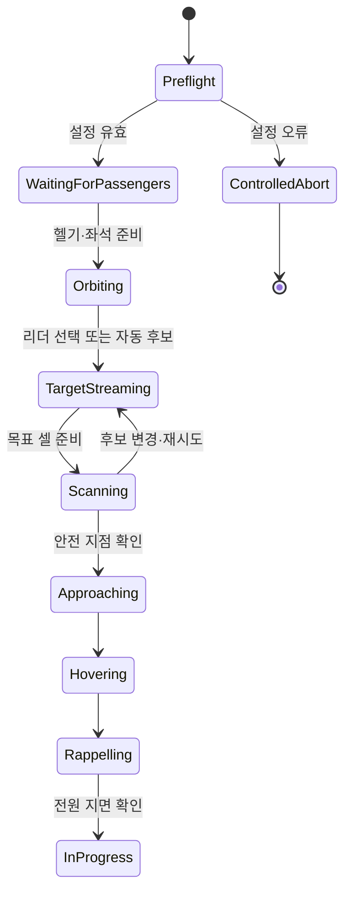

# 기존 스폰 시스템과 헬기 투입·탈출 시스템 통합 분석 보고서

- 작성일: 2026-08-07
- 대상 맵: `/Game/Maps/OutBreak_Exterior`
- 대상 GameMode: `BP_ExpeditionGameMode` / `AOBExpeditionGameMode`
- 범위: 최초 진입 스폰, World Partition 로딩, 헬기 좌석 탑승, 착륙 지점 스캔, 레펠, 개인·공용 탈출

## 1. 결론

이번 월드 아래 낙하는 `SpawnZone`을 삭제해서 헬기 좌표가 잘못된 단일 문제가 아니다. 기존 지상 스폰이 실행된 상태에서 `SpawnZone`과 유효한 `PlayerStart`가 모두 없어지자 Unreal의 기본 폴백이 `WorldSettings`, 즉 사실상 월드 원점 `(0,0,0)`을 시작점으로 사용한 것이 직접 원인이다.

최신 재현 로그는 다음 순서를 확정한다.

1. `OutBreak_Exterior`는 올바른 `BP_ExpeditionGameMode_C`로 실행되었다.
2. 기존 스폰 시스템이 `SpawnZones found = 0`을 기록했다.
3. 엔진이 `NO PLAYERSTART`를 기록했다.
4. 그 직후 `BP_SandboxCharacter_Player_C_0`의 카메라와 Pawn 초기화가 진행되었다.
5. Unreal 기본 코드가 시작점을 못 찾으면 `WorldSettings`를 반환하므로 Pawn은 원점에 생성되었다.
6. 이 경로는 SpawnZone 전용 지면 대기 로직을 호출하지 않으므로 Pawn은 이동 가능한 상태로 계속 낙하했다.

재현 시점에는 실행 중인 에디터가 구버전 DLL을 점유하고 있어, 소스에 추가한 헬기 삽입 선행 수정이 아직 런타임에 반영되지 않은 상태였다. 분석 후 에디터를 종료한 상태에서 `OutBreakEditor Win64 Development` 링크 빌드는 성공했다. 따라서 다음 실행부터는 해당 순서 수정이 포함되지만, 이 빌드 이후의 실제 플레이 회귀 테스트는 아직 수행하지 않았다. 아래에 정리한 구조적 괴리도 별도로 해소해야 한다.

핵심 통합 원칙은 다음과 같다.

> 헬기 투입 모드에서는 기존 지상 스폰으로 자동 폴백하면 안 된다. SpawnZone은 삭제 대상이 아니라 당분간 “자동 착륙 후보 지역”으로 재사용하고, 실제 Pawn 생성·배치는 헬기 투입 코디네이터만 소유해야 한다.

## 2. 확인된 증거

### 2.1 최신 재현 로그

`Saved/Logs/OutBreak.log`의 18:49 실행에서 확인된 핵심 기록이다.

```text
LogLoad: Game class is 'BP_ExpeditionGameMode_C'
LogTemp: [Expedition] SpawnZones found = 0
LogGameMode: FindPlayerStart: PATHS NOT DEFINED or NO PLAYERSTART with positive rating
LogCameraSystem: Creating camera system host for gameplay camera 'BP_SandboxCharacter_Player_C_0'.
LogTemp: [Map] 공용 탈출구 0개 수집.
```

따라서 맵이나 GameMode 선택 실패는 아니다. 기존 스폰 경로가 실행되었고, 그 경로에 줄 시작 액터가 없었던 것이 확인된다.

### 2.2 Unreal 기본 폴백

UE 5.7의 `Engine/Source/Runtime/Engine/Private/GameModeBase.cpp`에서 `FindPlayerStart_Implementation`은 적절한 시작점을 못 찾으면 `nullptr`로 종료하지 않는다.

```cpp
if (BestStart == nullptr)
{
    // Basically we are saying spawn at 0,0,0 if we didn't find a proper player start
    BestStart = World->GetWorldSettings();
}
```

이후 `RestartPlayerAtPlayerStart`는 반환된 `WorldSettings`의 Transform으로 기본 Pawn을 생성한다. Exterior 지형 높이가 원점보다 높거나 원점 셀이 아직 로드되지 않았다면 Pawn은 월드 아래에 놓인다.

사용자가 본 `Bad Size` 표시는 일반적으로 Pawn 캡슐이 시작점 주변 차폐 지오메트리와 겹친다는 에디터 경고이지만, 최신 로그에서 더 직접적으로 확인되는 런타임 원인은 “사용 가능한 PlayerStart 자체가 없음”이다. 두 문제 모두 시작 Transform을 검증하지 않고 기존 스폰으로 진입한다는 같은 구조적 결함에 속한다.

## 3. 기존 스폰 시스템의 실제 책임

기존 시스템은 단순 마커가 아니라 다음 책임을 함께 갖고 있다.



관련 구현은 다음과 같다.

- `OBExpeditionGameMode.cpp:574` — 레벨의 모든 `AOBExpeditionSpawnZone` 수집
- `OBExpeditionGameMode.cpp:609` — 팀별 SpawnZone 선택, 없으면 기본 PlayerStart로 폴백
- `OBExpeditionGameMode.cpp:634` — SpawnZone이면 NavMesh 산개 위치 생성
- `OBExpeditionGameMode.cpp:647` — Pawn 생성 전에 Controller 위치를 옮겨 World Partition 스트리밍 유도
- `OBExpeditionGameMode.cpp:655` — 선택 Transform으로 Pawn 생성
- `OBExpeditionGameMode.cpp:662` — 지면이 로드될 때까지 `HoldUntilGrounded`
- `OBExpeditionSpawnZone.cpp:17` — NavMesh 도달 가능 지점과 지면 위 100cm 보정

즉 SpawnZone 삭제는 세 가지를 동시에 제거했다.

1. 팀별 초기 위치 기준점
2. NavMesh 기반 안전 좌표 생성
3. World Partition 셀을 미리 불러올 스트리밍 기준점

헬기 시스템이 이 세 책임을 모두 대체하기 전에 SpawnZone만 삭제하면 기존 폴백이 노출된다.

## 4. 헬기 투입 시스템의 실제 책임

현재 신규 시스템의 의도된 흐름은 다음과 같다.

```mermaid
flowchart LR
    Init["Insertion 페이즈"] --> Team["TeamId 확정"]
    Team --> Route["InsertionOrbit Route 배정"]
    Route --> Heli["헬기 생성"]
    Heli --> Seat["Pawn 생성 후 좌석 부착"]
    Seat --> Select["리더의 지도 클릭 / 시간초과 자동 선택"]
    Select --> Scan["LandingZoneScanner"]
    Scan --> Approach["접근·스캔·정지비행"]
    Approach --> Rappel["강제 레펠"]
    Rappel --> Ground["지면 배치·충돌/입력 복구"]
    Ground --> Play["InProgress 시작"]
```



주요 구현은 다음과 같다.

- `OBExpeditionGameMode.cpp:96` — 헬기 삽입 활성 시 삽입 페이즈 시작
- `OBExpeditionGameMode.cpp:102` — 이미 접속한 Controller를 삽입 시스템에 등록
- `OBExpeditionGameMode.cpp:190` — 로드된 `InsertionOrbit` Route 수집
- `OBExpeditionGameMode.cpp:239` — Route 또는 절차적 궤도 위치를 계산하고 헬기 생성
- `OBExpeditionGameMode.cpp:284` — TeamId가 0이면 유효한 팀으로 보정
- `OBExpeditionGameMode.cpp:325` — 좌석 Transform에서 실제 Pawn 생성
- `OBInsertionHelicopter.cpp:264` — 이동·충돌을 끄고 Pawn을 좌석에 부착
- `OBLandingZoneScannerComponent.cpp:65` — 경사, 높이 편차, NavMesh, 헬기 공간, 로프 공간 검증
- `OBInsertionHelicopter.cpp:573` — 레펠 시작점과 지면 종료점 계산
- `OBInsertionHelicopter.cpp:620` — 레펠 완료 후 충돌과 보행 복구

## 5. 기존 시스템과 신규 시스템 사이의 괴리

### 5.1 최초 Pawn 생성 소유자가 둘이다

기존 시스템은 `HandleStartingNewPlayer → RestartPlayer → ChoosePlayerStart`가 Pawn을 만든다. 신규 시스템도 `RegisterPlayerForInsertion → RestartPlayerAtTransform`에서 Pawn을 만든다.

두 경로가 Boolean과 페이즈 타이밍으로만 분기되어 있어 삽입 준비가 늦거나 설정이 하나라도 실패하면 기존 스폰이 먼저 실행될 수 있다. 최신 재현은 이 구버전 경로였다.

현재 소스에는 삽입 준비 전 기존 스폰을 보류하고, 페이즈 초기화 후 접속자를 헬기에 등록하는 수정이 들어갔다. 그러나 정상 헬기 설정 실패 시 `Super::HandleStartingNewPlayer`로 돌아가는 폴백은 여전히 존재한다. 프로덕션 헬기 모드에서 이 폴백은 제거하거나 명시적인 디버그 옵션으로 격리해야 한다.

### 5.2 SpawnZone이 “구형 스폰 지점”이면서 “신형 자동 투입 후보”다

`AutoSelectInsertionPoint`는 30초 안에 리더가 위치를 선택하지 않으면 기존 SpawnZone 위치를 착륙 스캔 요청점으로 재사용한다. SpawnZone이 없으면 `MapData.WorldMapCenter`를 사용한다.

따라서 SpawnZone을 완전히 삭제하면 다음 위험이 생긴다.

- 자동 선택의 품질이 한 개의 WorldMapCenter에 의존한다.
- MapData 중심·크기가 실제 플레이 가능 영역과 다르면 잘못된 XY가 선택된다.
- 중심 셀이 언로드 상태면 지면 LineTrace가 실패한다.
- 여러 팀이 같은 중심으로 몰릴 수 있다.

SpawnZone의 “직접 Pawn 스폰” 책임은 폐기하되, 당분간 `InsertionCandidateArea` 역할로 유지하는 것이 안전하다. 장기적으로는 이름과 클래스를 분리해야 한다.

### 5.3 착륙 스캔 실패가 검증되지 않은 Z로 이어진다

자동 선택에서 안전 착륙 지점을 찾지 못하면 현재 코드는 요청 XY를 비상 위치로 사용하고 한 번 더 지면을 찾는다. 그 재시도도 실패하면 Z가 기본값 또는 마커 Z로 남은 상태에서 `ReleaseAllPassengers`를 호출할 수 있다.

이것은 새 시스템 안에서도 `(X,Y,0)` 또는 언로드된 지면으로 플레이어를 풀어 월드 아래 낙하를 재현할 수 있는 경로다.

정책을 다음과 같이 바꿔야 한다.

- 스캔 실패 시 승객을 절대 지상에 내리지 않는다.
- 헬기는 궤도 비행을 유지한다.
- 대상 셀 스트리밍을 요청하고 재스캔한다.
- 제한시간 후에도 실패하면 다른 후보 지역을 선택한다.
- 모든 후보가 실패하면 세션을 명시적으로 중단하고 홈으로 돌려보낸다.
- 검증되지 않은 Z=0 배치는 금지한다.

### 5.4 World Partition 로딩 주체가 투입 목표에 없다

헬기에는 `WorldPartitionStreamingSourceComponent`가 있어 헬기 주변 셀은 불러온다. 하지만 지도에서 선택한 먼 목표 XY는 헬기가 접근하기 전까지 스트리밍 소스가 아니다. 서버 LineTrace는 언로드된 지형을 맞힐 수 없으므로 안전한 지점도 스캔 실패로 판정될 수 있다.

필요한 중간 상태는 `TargetStreaming`이다.

1. 클릭 XY를 확정한다.
2. 목표 상공에 임시 스트리밍 소스를 활성화하거나 헬기를 안전한 고고도 XY까지 이동한다.
3. 목표 셀이 준비될 때까지 대기한다.
4. 그 후 착륙 스캔을 수행한다.
5. 유효한 `FOBLandingZoneResult`가 나온 경우에만 접근을 시작한다.

Route, ExtractionZone, ExtractionSite 같은 제어 액터는 `Is Spatially Loaded`를 꺼 Always Loaded로 유지해야 한다. 그렇지 않으면 `TActorIterator` 기반 수집 시점에 존재하지 않을 수 있다.

### 5.5 좌석 Transform에서 Pawn을 먼저 생성한다

현재 `RegisterPlayerForInsertion`은 좌석 Transform에서 `RestartPlayerAtTransform`으로 Pawn을 만든 뒤 `SeatPassenger`에서 충돌을 끄고 부착한다.

헬기 시각 메시가 Pawn 채널을 차단하거나 Seat Anchor가 동체 콜리전 안에 있으면 Pawn 생성이 실패하거나 위치 보정될 수 있다. 이것이 실제로 발생했다는 로그는 아직 없지만, `Bad Size`와 같은 충돌 문제를 만들 수 있는 명확한 구조적 위험이다.

권장 방식은 다음 중 하나다.

- 실제 Pawn 유지 방식: `AlwaysSpawn` 지연 생성 → 충돌과 이동을 먼저 끔 → 좌석에 부착 → FinishSpawning/빙의
- 표현 Pawn 방식: 투입 중에는 Controller와 승객 데이터만 유지하고 BP 더미 승객을 표시 → 레펠 직전에 실제 Pawn 생성

현재 프로젝트 구조를 적게 바꾸려면 첫 번째 방식이 적합하다. 헬기 시각 메시도 Pawn을 차단하지 않도록 하고, Seat 12개의 월드 Transform과 상호 간격을 시작 시 검증해야 한다.

### 5.6 `HoldUntilGrounded`는 지형 아래 위치를 복구하지 못한다

`AOBCharacterBase::TryLandOnGround`는 현재 위치에서 아래로 20,000cm만 LineTrace한다. Pawn이 지형 아래에서 시작하면 지면은 위쪽에 있으므로 절대로 맞지 않는다. 15초 후 이동을 다시 허용해 계속 낙하한다.

이 함수는 “올바른 지면 위에 있지만 셀이 늦게 로드되는 경우”만 보호한다. 잘못된 시작 Z를 복구하는 안전장치로 사용하면 안 된다.

통합 후에는 다음 중 하나로 바꿔야 한다.

- 이미 검증한 `LandingZoneResult.GroundLocation`으로만 최종 배치
- XY 기준으로 위쪽 충분한 높이에서 아래로 재탐색하는 양방향 복구
- 복구 실패 시 이동 재활성화가 아니라 안전 상태 유지 및 서버 오류 처리

### 5.7 ExtractionSite와 ExtractionZone의 역할이 다르다

`AOBExtractionSite`는 그 자체로 신호탄이나 탑승 트리거를 제공하지 않는다. `PersonalExtract` 태그를 가진 “개인 탈출 후보 마커”이며, 삽입이 끝난 뒤 GameMode가 `PersonalExtractClass`의 `AOBExtractionZone`을 동적으로 생성할 때 LandingAnchor와 Route 정보를 넘기는 용도다.

반면 실제 신호탄 호출·헬기 대기·탑승은 `AOBExtractionZone`이 담당한다.

- 공용 탈출을 바로 배치하려면 `AOBExtractionZone` 또는 그 BP 자식을 레벨에 둬야 한다.
- 개인 탈출 후보를 만들려면 `AOBExtractionSite`를 두고 GameMode의 `PersonalExtractClass`가 설정되어 있어야 한다.
- 개인 탈출 Zone은 팀 투입 원점이 확정된 뒤에야 배정된다.

최신 로그의 `공용 탈출구 0개 수집`은 런타임에 로드된 공용 `AOBExtractionZone`이 없었음을 뜻한다. 사용자가 배치한 액터가 `AOBExtractionSite`였다면 이 로그는 정상이며, 삽입 완료 전에는 실제 탈출 트리거가 아직 생성되지 않는다.

## 6. 권장 통합 구조

### 6.1 명시적 배치 모드

Boolean 하나 대신 다음과 같은 명시적 모드를 둔다.

```cpp
enum class EOBDeploymentMode : uint8
{
    Helicopter,
    LegacyGround,
    DebugPlayerStart
};
```

- `Helicopter`: 기존 `ChoosePlayerStart`를 절대로 호출하지 않는다.
- `LegacyGround`: SpawnZone 시스템만 사용한다.
- `DebugPlayerStart`: 개발자가 명시적으로 허용했을 때만 PlayerStart를 사용한다.

헬기 클래스, Route, MapData 또는 팀 배정이 잘못되어도 다른 모드로 조용히 폴백하지 않는다. 플레이어는 입력이 잠긴 대기 상태로 남고 구체적인 설정 오류를 로그와 화면에 표시해야 한다.

### 6.2 단일 투입 상태 머신



`InProgress`는 모든 필수 승객이 유효한 지면에 도착한 뒤에만 시작한다. 세션 타이머, 개인 탈출구 배정, 적 스폰 활성화도 이 전환에 묶는다.

### 6.3 SpawnZone의 마이그레이션

당장 SpawnZone을 삭제하지 말고 다음과 같이 역할을 축소한다.

1. `ChoosePlayerStart`에서는 Helicopter 모드일 때 SpawnZone을 사용하지 않는다.
2. 자동 투입 후보 XY, 팀 간 이격, 착륙 스캔 탐색 중심으로만 사용한다.
3. 각 후보에 우선순위, 허용 팀, 최소·최대 고도, 금지 태그를 추가한다.
4. 안정화 후 `AOBInsertionCandidateArea`로 새 클래스를 만들고 기존 SpawnZone을 변환한다.

이 방식이면 기존 맵에 배치한 이격 데이터는 재사용하면서 직접 지상 스폰만 제거할 수 있다.

### 6.4 좌표 계약

시스템 사이에 다음 계약이 필요하다.

| 좌표 | 생성 주체 | 소비 주체 | 유효 조건 |
|---|---|---|---|
| Orbit Transform | Route 또는 절차 궤도 해석기 | 헬기 | 유한 좌표, 안전 고도, 셀 로드 가능 |
| Seat Transform | 헬기 BP Anchor | Pawn Transit Spawn | 동체 Pawn 충돌 없음, 좌석 간 비중첩 |
| Requested XY | 지도 또는 자동 후보 | Streaming/Scanner | MapData 경계 내부 |
| Ground Location | LandingZoneScanner만 생성 | 레펠·개인 탈출 배정 | 지면 Hit, 경사/공간/Nav 검증 완료 |
| Hover Transform | LandingZoneScanner만 생성 | 헬기 접근 | 헬기 캡슐 공간 확보 |
| Extraction Landing | ExtractionZone/Site + 검증기 | 탈출 헬기 | 지면·접근 경로·탑승 공간 검증 |

특히 Ground Location을 일반 `FVector` 기본값과 구분해야 한다. `bValid=false`인 결과의 `(0,0,0)`을 어떤 배치 함수도 소비하지 못하도록 타입과 API를 제한하는 것이 좋다.

## 7. BP·레벨 설정 체크리스트

### BP_ExpeditionGameMode

- `Enable Helicopter Insertion = true`
- `Insertion Helicopter Class = BP_OBInsertionHelicopter`
- `Extraction Helicopter Class`는 필요 시 지정, 비우면 삽입 클래스 재사용
- `MapData` 또는 `MapCatalog`가 Exterior의 올바른 Data Asset을 반환
- `WorldMapCenter/WorldMapSize`가 실제 플레이 영역과 일치
- `LandingZoneScanner`의 Trace Channel이 실제 지형을 차단
- 개인 탈출을 쓸 경우 `PersonalExtractClass` 지정

### BP_OBInsertionHelicopter

- `Seat_00~11`이 실제 객실 내부의 서로 다른 위치
- `Rappel_Left/Right`가 동체 바깥쪽
- CabinCamera가 객실 시야 위치
- 시각 메시가 Pawn 채널을 차단하지 않거나 좌석 주변은 별도 콜리전 제외
- BP Construction Script가 상속 Anchor Transform을 원점으로 되돌리지 않는지 확인

### Insertion Route

- `Purpose = Insertion Orbit`
- `Loop = true`
- `Team Slot = 0`이면 공용, 팀별 예약이면 실제 TeamId와 일치
- Spline 길이가 0보다 충분히 큼
- 모든 Spline Point의 Z가 지형·건물보다 높음
- `World Partition > Is Spatially Loaded = false`

### Extraction

- 즉시 사용 가능한 공용 탈출: `AOBExtractionZone` BP 배치
- 개인 탈출 후보: `AOBExtractionSite` 배치 + `PersonalExtractClass` 설정
- Zone/Site/ApproachRoute/ExitRoute는 Always Loaded
- LandingAnchor와 BoardingTrigger가 같은 실제 착륙 공간에 위치
- SignalFlareClass 지정

## 8. 단계별 통합 계획

### 1단계 — 기존 폴백 격리

- `EOBDeploymentMode` 도입
- Helicopter 모드에서 `Super::HandleStartingNewPlayer`, `ChoosePlayerStart`, WorldSettings 원점 폴백 금지
- 설정 실패 시 ControlledAbort
- 현재 반영된 StartPlay 순서와 TeamId 보정 회귀 테스트

### 2단계 — SpawnZone을 투입 후보로 전환

- 기존 SpawnZone 직접 스폰 사용 중단
- 자동 선택과 팀 이격 데이터로만 사용
- 후보 0개일 때 MapData 중심을 바로 사용하지 않고 명시적 설정 오류 처리

### 3단계 — 원자적 좌석 Pawn 생성

- `AlwaysSpawn` 지연 생성
- 충돌·이동 비활성 후 좌석 부착
- 빙의 및 Transit 태그 적용
- 좌석 유효성/중복/수용 인원 사전 검사

### 4단계 — 목표 스트리밍과 착륙 검증

- `TargetStreaming` 상태 추가
- 목표 셀 준비 후 Scanner 실행
- 스캔 실패 시 후보 변경/재시도
- 검증되지 않은 지면으로 `ReleaseAllPassengers` 호출 금지

### 5단계 — 레펠과 지면 복구 통합

- 레펠 종료 좌표는 유효한 LandingZoneResult에서만 생성
- 슬롯별 캡슐 Overlap 검사와 Sweep 배치
- `HoldUntilGrounded`를 아래쪽 전용 대기에서 XY 기반 안전 지면 복구로 개선
- 복구 실패 시 보행 활성화 금지

### 6단계 — 탈출 시스템 연결

- 공용 Zone과 개인 Site 역할을 레벨 규칙으로 고정
- 삽입 완료 Ground Location을 개인 탈출 이격 계산의 유일한 원점으로 사용
- 탈출 착륙 위치도 삽입 Scanner와 동일한 안전 검증 재사용
- 탈출 중단 시 승객을 검증된 Landing Location에만 복귀

### 7단계 — 구형 시스템 제거

- Helicopter 모드 검증 완료 후 `ChoosePlayerStart`의 SpawnZone 분기를 Legacy 전용으로 이동
- 프로덕션 맵의 임시 PlayerStart 제거
- 기존 SpawnZone 에셋을 InsertionCandidateArea로 변환

## 9. 필수 검증 시나리오

1. SpawnZone 0개, PlayerStart 0개 — 원점 Pawn이 생기지 않고 명시적 설정 오류가 나와야 한다.
2. Route가 Spatially Loaded — 프리플라이트가 Route 미탐지를 보고해야 한다.
3. Route가 Always Loaded — 발견 개수와 클래스명이 로그에 나와야 한다.
4. TeamId 0 — 좌석 등록 전에 1 이상의 값으로 보정되어야 한다.
5. Seat Anchor가 동체 콜리전 내부 — Pawn 생성 실패 대신 사전 검증 오류가 나와야 한다.
6. 선택 지점 셀이 언로드 — TargetStreaming 후 스캔되어야 한다.
7. 물·급경사·옥상 선택 — 다른 후보를 찾거나 선택 거부, 강제 배치 금지.
8. 리더가 선택하지 않음 — 팀별 InsertionCandidateArea로 자동 선택.
9. 레펠 중 셀 언로드/지연 — Pawn은 고정되고 유효 지면 확인 후 보행 시작.
10. AOBExtractionSite만 배치 — 개인 Zone이 삽입 완료 후 생성되는지 확인.
11. 공용 AOBExtractionZone 배치 — 신호탄, ETA, 탑승, 출발 후 정산 확인.
12. 탈출 헬기 또는 Route 유실 — 검증된 지면 복귀 또는 ControlledAbort.

## 10. 다음 실행에서 확인할 로그

현재 빌드에는 삽입 순서와 TeamId 보정 로그가 포함되었다. 정상 시작이면 다음 두 메시지는 항상 보여야 한다.

```text
[Insertion] InsertionOrbit routes found = N
[Insertion] Phase started. HelicopterClass=BP_OBInsertionHelicopter_C Routes=N
```

로그인 순서와 TeamId 상태에 따라 다음 메시지가 추가로 보일 수 있다.

```text
[Insertion] ... spawn deferred until insertion phase initialization.
[Insertion] ... had TeamId 0; assigned TeamId 1 before seating.   // 필요한 경우에만
```

다음 조합이 다시 나오면 헬기 시스템이 아닌 기존 폴백이 실행된 것이다.

```text
[Expedition] SpawnZones found = 0
FindPlayerStart: PATHS NOT DEFINED or NO PLAYERSTART with positive rating
```

## 11. 최종 판단

SpawnZone 삭제는 최종 목표로는 가능하지만 현재 시점에는 이르다. SpawnZone은 구형 직접 스폰 기능 외에도 안전 좌표, 팀 이격, 자동 선택, 스트리밍 시작점 역할을 암묵적으로 제공했다. 헬기 시스템이 이 책임을 명시적으로 인수하기 전까지는 해당 액터를 자동 투입 후보로 유지해야 한다.

통합의 핵심은 기존 스폰을 헬기 실패 폴백으로 남기는 것이 아니라, 두 방식을 명시적 모드로 분리하고 헬기 모드 안에서 모든 좌표를 검증된 상태로만 전달하는 것이다. 이렇게 해야 원점 스폰, Bad Size, 언로드 셀 LineTrace 실패, 비상 Z=0 레펠 같은 문제를 한 번에 차단할 수 있다.
