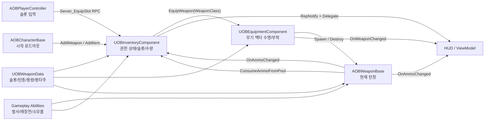

# OBInventoryComponent 코드 분석 및 소스 흐름 보고서

- 분석 대상: `OBInventoryComponent.h`, `OBInventoryComponent.cpp`
- 연계 범위: 캐릭터 초기화, 장비 컴포넌트, 무기 액터/데이터, GAS 어빌리티, 플레이어 입력, HUD/MVVM
- 기준 엔진: Unreal Engine 5.7
- 작성일: 2026-07-30

## 1. 결론 요약

`UOBInventoryComponent`는 단순 아이템 목록이 아니라 다음 세 가지 서버 권한 상태를 한곳에서 관리하는 컴포넌트다.

1. 슬롯별 무기 클래스와 슬롯별 잔여 탄창
2. Gameplay Tag별 예비 탄약 수량
3. Gameplay Tag별 소모품 수량

실제 무기 액터의 생성·파괴·부착과 무기 어빌리티 부여는 `UOBEquipmentComponent`가 담당한다. 인벤토리는 현재 슬롯에 들어갈 무기 클래스를 장비 컴포넌트에 전달하고, 무기 액터의 `OnAmmoChanged` 이벤트를 구독하여 액터가 파괴된 뒤에도 슬롯별 탄창 수량이 유지되도록 한다.

모든 수량 변경과 장착 결정은 서버에서 수행되고, `WeaponSlots`, `ActiveSlot`, `AmmoPool`, `Items`가 클라이언트에 복제된다. 서버에서는 변경 직후 델리게이트를 직접 브로드캐스트하고, 클라이언트에서는 `OnRep` 함수가 같은 델리게이트를 브로드캐스트하여 HUD를 갱신한다.

현재 시작 로드아웃과 기본 장착, 발사 후 탄창 저장, 재장전 시 예비탄 차감, 소모품 사용 후 수량 차감 흐름은 서로 연결되어 있다. 다만 런타임 슬롯 교체, 교체 상태 태그 복제, 재장전 취소, 종료 시 태그 정리에는 실제 오동작 가능성이 있어 우선 보완이 필요하다.

## 2. 분석 범위와 주요 소스

| 역할 | 소스 | 핵심 구간 |
|---|---|---|
| 인벤토리 선언 | `Public/Inventory/Components/OBInventoryComponent.h` | 16~40, 43~123 |
| 인벤토리 구현 | `Private/Inventory/Components/OBInventoryComponent.cpp` | 15~346 |
| 시작 로드아웃 구성 | `Private/Character/OBCharacterBase.cpp` | 497~540 |
| 슬롯 입력 및 서버 RPC | `Private/Player/Controller/OBPlayerController.cpp` | 189~202, 281~288 |
| 무기 액터 장착/해제 | `Private/Equipment/Components/OBEquipmentComponent.cpp` | 32~104, 116~131 |
| 탄창/예비탄 연계 | `Private/Weapon/OBWeaponBase.cpp` | 49~101 |
| 사격 시 탄창 차감 | `Private/Ability/Abilities/OBGameplayAbility_RangedWeapon.cpp` | 130~145 |
| 재장전 | `Private/Ability/Abilities/OBGameplay/OBGameplayAbility_Reload.cpp` | 24~72 |
| 소모품 사용 | `Private/Ability/Abilities/OBGameplay/OBGameplayAbility_Consumable.cpp` | 26~104 |
| 탄약 HUD | `Private/UI/ViewModels/OBAmmoViewModel.cpp` | 9~64 |
| 소모품 HUD | `Private/UI/HUD/OBConsumableWidget.cpp` | 9~39 |

## 3. 전체 구조



핵심 소유권은 다음과 같이 분리된다.

- `UOBInventoryComponent`: 무엇을 보유하고 있고 수량이 얼마인지 관리한다.
- `UOBEquipmentComponent`: 현재 손에 든 무기 액터 하나를 생성·부착·파괴하고 해당 무기의 AbilitySet을 부여·회수한다.
- `AOBWeaponBase`: 현재 생성된 무기 액터의 탄창 수량을 관리한다.
- `UOBWeaponData`: 무기 슬롯, 탄종, 탄창 크기, 예비탄 설정, 장착 몽타주 등 정적 설정을 제공한다.
- `Gameplay Ability`: 사용자 행동의 시작/종료 시점을 관리하고 무기 또는 인벤토리에 실제 소비를 요청한다.

## 4. 데이터 모델

### 4.1 무기 슬롯

`FOBWeaponSlotEntry`는 다음 상태를 가진다.

| 필드 | 의미 | 기본값 |
|---|---|---|
| `Slot` | Primary, Secondary, Melee 중 하나 | Primary |
| `WeaponClass` | 장착 시 스폰할 `AOBWeaponBase` 하위 클래스 | null |
| `MagazineAmmo` | 해당 슬롯을 마지막으로 사용했을 때의 탄창 수량 | -1 |

`MagazineAmmo == -1`은 아직 한 번도 장착하지 않은 슬롯이라는 센티널 값이다. 최초 장착 시 새 무기는 `MagazineSize`만큼 초기화되고 그 값을 슬롯에 저장한다. 이후 장착부터는 저장된 값을 새 무기 액터에 복원한다.

즉, 인벤토리가 무기 액터 자체를 보관하지 않고 `WeaponClass + MagazineAmmo`만 보존하며, 슬롯을 바꿀 때마다 장비 컴포넌트가 무기 액터를 새로 만든다.

### 4.2 탄약과 소모품

`FOBCountEntry`는 `FGameplayTag -> int32 Count` 형태의 공용 수량 엔트리다.

- `AmmoPool`: `Ammo.AssaultRifle`, `Ammo.Pistol` 같은 탄종별 예비탄
- `Items`: `Item.Bandage`, `Item.Grenade` 같은 소모품별 수량

두 배열 모두 선형 검색을 사용한다. 현재 태그 수가 적은 구조에서는 단순하고 충분하지만, 아이템 종류가 크게 증가하면 `TMap` 또는 Fast Array 기반 구조를 검토할 수 있다.

### 4.3 런타임 전용 상태

| 필드 | 역할 | 복제 여부 |
|---|---|---|
| `BoundWeapon` | 현재 탄창 이벤트를 구독한 무기 약참조 | 복제 안 함 |
| `WeaponAmmoHandle` | `OnAmmoChanged` 구독 해제용 핸들 | 복제 안 함 |
| `bSwitching` | 서버의 중복 무기 교체 방지 플래그 | 복제 안 함 |
| `SwapTimerHandle` | draw 종료 후 교체 잠금 해제 | 복제 안 함 |
| `DefaultDrawTime` | 장착 몽타주가 없을 때 교체 잠금 시간 | 에디터 기본값 |

## 5. 초기화와 시작 로드아웃 흐름

캐릭터 생성자에서 장비 컴포넌트와 인벤토리 컴포넌트가 함께 생성된다. 서버가 캐릭터를 빙의하면 `AOBCharacterBase::PossessedBy`가 다음 순서로 실행된다.

```text
AOBCharacterBase::PossessedBy
  -> InitAbilitySystemComponent
  -> PlayerState의 선택 무기 조회
  -> 선택 무기가 없으면 PawnData::DefaultWeapons 사용
  -> 각 무기마다 InventoryComponent::AddWeapon
  -> PawnData::StartingItems를 InventoryComponent::AddItem으로 추가
  -> InventoryComponent::EquipDefaultSlot
```

`EquipDefaultSlot`의 우선순위는 `Primary -> Secondary -> Melee`다. 처음 존재하는 슬롯을 `EquipSlot`에 넘긴다.

현재 프로젝트에서 `AddWeapon`의 외부 호출 지점은 `PossessedBy` 한 곳뿐이다. `AddAmmo`의 외부 호출도 없고 `AddWeapon` 내부에서만 사용된다. 따라서 현재 코드는 시작 로드아웃 구성에는 연결되어 있지만, 월드 픽업이나 상점 구매로 무기·탄약을 런타임에 추가하는 흐름은 아직 연결되지 않았다.

## 6. 무기 등록 흐름

`AddWeapon(WeaponClass)`는 서버에서만 실행된다.

1. 무기 클래스의 CDO에서 `UOBWeaponData`를 읽는다.
2. `WeaponSlot`, `AmmoType`, `MaxReserveAmmo`를 가져온다.
3. 같은 슬롯 엔트리가 있으면 `WeaponClass`를 교체하고, 없으면 새 엔트리를 추가한다.
4. `AmmoType`이 유효하면 `MaxReserveAmmo`만큼 `AmmoPool`에 더한다.
5. `OnInventoryChanged`를 브로드캐스트한다.

여기서 `MaxReserveAmmo`는 이름과 달리 상한으로 적용되지 않고, 무기 등록 시 지급할 시작 수량처럼 사용된다. 같은 탄종의 무기를 여러 개 등록하면 각 무기의 값이 누적된다.

## 7. 슬롯 장착과 교체 흐름

### 7.1 사용자 입력

플레이어 컨트롤러는 1/2/3 슬롯 입력을 `Input_EquipSlot`에 바인딩한다. 로컬 입력이 들어오면 폰의 인벤토리를 찾아 `Server_EquipSlot(Slot)` Reliable RPC를 호출한다.

```text
슬롯 키 입력
  -> AOBPlayerController::Input_EquipSlot
  -> UOBInventoryComponent::Server_EquipSlot
  -> UOBInventoryComponent::EquipSlot (서버)
```

### 7.2 서버 검증

`EquipSlot`은 다음 조건을 순서대로 검사한다.

- Owner가 존재하고 서버 권한인지
- 요청 슬롯에 무기 클래스가 있는지
- 이미 다른 교체가 진행 중인지
- 현재 무기가 있고 요청 슬롯이 이미 활성 슬롯인지

현재 손에 든 무기가 없으면 슬롯을 즉시 활성화하고 `EquipActiveWeapon`을 호출한다. 현재 무기가 있고 다른 슬롯을 요청하면 `SwapToSlot`으로 진입한다.

### 7.3 실제 무기 액터 교체

`EquipActiveWeapon`은 장비 컴포넌트에 현재 슬롯의 클래스를 전달한다.

```text
Inventory::EquipActiveWeapon
  -> Equipment::EquipWeapon(WeaponClass)
      -> 기존 무기의 AbilitySet 회수
      -> 기존 무기 액터 Destroy
      -> 새 무기 액터 Spawn
      -> 캐릭터 손 소켓에 Attach
      -> 탄창을 MagazineSize로 초기화
      -> EquipMontage 재생
      -> 새 무기의 AbilitySet 부여
      -> OnWeaponChanged 브로드캐스트
  -> 슬롯에 저장된 MagazineAmmo를 새 무기에 복원
  -> 새 무기의 OnAmmoChanged 구독
```

슬롯 교체 시 무기 액터는 유지되지 않는다. 무기 클래스와 탄창 이외의 런타임 상태가 추가될 경우 별도 저장 구조가 없으면 교체할 때 사라진다.

### 7.4 교체 잠금

`SwapToSlot`은 다음 작업을 한다.

1. `bSwitching = true`
2. 재장전 취소 요청 및 `State.Weapon.Switching` loose tag 추가
3. `ActiveSlot` 변경 및 무기 액터 교체
4. 새 무기의 `EquipMontage` 길이 또는 `DefaultDrawTime`만큼 타이머 설정
5. 타이머 종료 시 `bSwitching = false` 및 태그 제거

발사·재장전·근접·소모품 어빌리티는 `State.Weapon.Switching`을 `ActivationBlockedTags`로 사용하므로, 이 태그가 올바르게 서버와 예측 클라이언트에 존재하는지가 교체 중 입력 차단의 핵심이다.

## 8. 탄창, 발사, 재장전 흐름

### 8.1 발사

```text
RangedWeapon Ability::FireOneShot
  -> AOBWeaponBase::ConsumeAmmo(1) (서버)
  -> CurrentAmmo 감소
  -> AOBWeaponBase::OnAmmoChanged
      -> Inventory::SyncActiveMagazine
      -> AmmoViewModel::HandleAmmoChanged
```

서버의 인벤토리는 현재 무기 탄창이 바뀔 때마다 `WeaponSlots[ActiveSlot].MagazineAmmo`에 값을 저장한다. 무기 액터의 `CurrentAmmo`도 별도로 복제되므로 클라이언트 탄약 HUD가 갱신된다.

### 8.2 재장전

```text
Reload Ability 활성화
  -> Weapon::CanReload
      -> 탄창이 가득 찼는지 검사
      -> Inventory::GetAmmo(AmmoType) > 0 검사
  -> 몽타주/대기 완료
  -> Weapon::PerformReload (서버)
      -> Needed = MagazineSize - CurrentAmmo
      -> Inventory::ConsumeAmmoFromPool(AmmoType, Needed)
      -> 실제 꺼낸 수량만 CurrentAmmo에 추가
      -> Weapon::OnAmmoChanged
          -> 슬롯 MagazineAmmo 동기화
```

예비탄 부족 시 `ConsumeAmmoFromPool`은 `Min(보유량, 요청량)`만 반환하므로 부분 재장전이 가능하다. 예비탄 변경은 `OnAmmoPoolChanged`, 탄창 변경은 `OnAmmoChanged`로 각각 HUD에 전달된다.

## 9. 소모품 흐름

시작 소모품은 `PawnData::StartingItems`에서 `AddItem`으로 들어온다. 소모품 어빌리티는 활성화 시 보유 수량을 확인하고, 실제 효과가 발생하는 release 시점에만 서버에서 한 개를 차감한다.

```text
Consumable Ability::ActivateAbility
  -> Inventory::GetItemCount(ItemTag) 검사
  -> 몽타주/사용 시간 진행
  -> OnReleased (서버)
      -> ApplyConsumableEffect
      -> Inventory::ConsumeItem(ItemTag, 1)
      -> OnInventoryChanged
      -> OBConsumableWidget::Refresh
```

release 전에 취소되면 효과와 수량 차감이 모두 발생하지 않는다. `ConsumeItem`은 보유 수량보다 큰 요청이 와도 실제 보유량까지만 차감하고 실제 소비량을 반환한다.

## 10. 복제와 UI 갱신

| 상태 | 복제 선언 | 서버 변경 통지 | 클라이언트 변경 통지 | 현재 소비자 |
|---|---|---|---|---|
| `WeaponSlots` | `Replicated` | `OnInventoryChanged` | 전용 `OnRep` 없음 | 명시적 UI 소비자 없음 |
| `ActiveSlot` | `ReplicatedUsing=OnRep_ActiveSlot` | `OnInventoryChanged` | `OnInventoryChanged` | 향후 슬롯 UI용 |
| `AmmoPool` | `ReplicatedUsing=OnRep_AmmoPool` | `OnAmmoPoolChanged` | `OnAmmoPoolChanged` | `UOBAmmoViewModel` |
| `Items` | `ReplicatedUsing=OnRep_Items` | `OnInventoryChanged` | `OnInventoryChanged` | `UOBConsumableWidget` |
| 장착 무기 액터 | 장비 컴포넌트의 `CurrentWeapon` RepNotify | `OnWeaponChanged` | `OnWeaponChanged` | HUD, 캐릭터 이동/조준 상태 |
| 현재 무기 탄창 | 무기 액터의 `CurrentAmmo` RepNotify | `OnAmmoChanged` | `OnAmmoChanged` | `UOBAmmoViewModel` |

HUD의 탄약 표시는 두 이벤트를 조합한다.

- 현재 탄창: 현재 무기의 `OnAmmoChanged`
- 예비 탄약: 인벤토리의 `OnAmmoPoolChanged`

소모품 HUD는 `OnInventoryChanged`를 구독하고 붕대와 수류탄 태그의 수량을 다시 조회한다.

델리게이트는 `DECLARE_MULTICAST_DELEGATE` 기반 네이티브 델리게이트이므로 현재 C++ 구독에는 적합하지만, `BlueprintAssignable` 이벤트는 아니다.

## 11. 함수별 역할 요약

| 함수 | 역할 |
|---|---|
| `GetCount` | 태그 배열에서 수량 선형 검색, 미존재 시 0 |
| `FindSlotEntry` | 슬롯 엔트리의 수정 가능한 포인터 검색 |
| `GetWeaponInSlot` | 슬롯에 저장된 무기 클래스 조회 |
| `AddWeapon` | 슬롯 클래스 등록/교체 및 예비탄 지급 |
| `EquipSlot` | 서버 장착 요청 검증 및 첫 장착/교체 분기 |
| `Server_EquipSlot` | 클라이언트 슬롯 입력을 서버로 전달 |
| `EquipActiveWeapon` | 장비 컴포넌트 호출, 탄창 복원, 이벤트 구독 |
| `SyncActiveMagazine` | 현재 무기 탄창을 활성 슬롯 엔트리에 저장 |
| `SwapToSlot` | 교체 잠금, 즉시 액터 교체, draw 타이머 시작 |
| `EndSwitching` | 교체 잠금과 GAS 태그 해제 |
| `SetSwitching` | 재장전 취소 및 교체 상태 태그 추가/제거 |
| `GetAmmo` / `GetItemCount` | 태그별 현재 수량 조회 |
| `AddAmmo` / `AddItem` | 서버에서 수량 증가 후 델리게이트 통지 |
| `ConsumeAmmoFromPool` / `ConsumeItem` | 서버에서 가능한 수량만 차감하고 실제 차감량 반환 |
| `EquipDefaultSlot` | Primary, Secondary, Melee 순으로 첫 무기 장착 |
| `OnRep_*` | 클라이언트에서 복제 변경을 로컬 델리게이트로 변환 |

## 12. 잘 구성된 부분

1. **서버 권한이 일관적이다.** 슬롯 변경, 수량 추가·소비, 탄창 복원은 모두 서버 권한 검사 뒤 수행된다.
2. **보관과 장착 책임이 분리되어 있다.** 인벤토리는 상태를 보관하고 장비 컴포넌트는 액터 수명과 AbilitySet을 책임진다.
3. **슬롯별 탄창 보존이 단순하다.** 무기 액터를 매번 새로 만들어도 탄창은 `MagazineAmmo`와 `OnAmmoChanged` 구독으로 유지된다.
4. **부분 재장전과 과소비 방지가 구현되어 있다.** 소비 함수가 실제 차감량을 반환한다.
5. **서버와 클라이언트의 UI 통지 경로가 구분되어 있다.** 서버는 직접 Broadcast, 클라이언트는 RepNotify 후 Broadcast 구조다.
6. **Tick을 사용하지 않는다.** 모든 갱신이 RPC, 복제, 델리게이트, 타이머 기반이라 평상시 비용이 작다.

## 13. 위험 요소와 개선 권고

### P1. 같은 슬롯의 무기 교체 시 이전 탄창 상태가 남는다

`AddWeapon`은 기존 슬롯의 `WeaponClass`만 바꾸고 `MagazineAmmo`를 초기화하지 않는다. 예를 들어 기존 5발이 남은 Primary를 다른 Primary 무기로 교체하면 새 무기에도 5발이 복원되며, 새 무기의 탄창 크기가 작으면 `SetCurrentAmmo`에서 잘린다.

또한 현재 장착 중인 슬롯을 런타임에 교체해도 장비 컴포넌트의 실제 `CurrentWeapon`은 즉시 바뀌지 않는다. 인벤토리의 클래스와 손에 든 무기 액터가 다음 슬롯 전환 전까지 서로 달라진다.

권고:

- 클래스가 실제로 변경될 때 `MagazineAmmo = -1`로 초기화한다.
- 활성 슬롯 교체 정책을 명확히 정한다. 즉시 재장착하거나, 현재 무기는 유지하고 다음 장착 때 적용한다는 별도 상태를 둔다.
- 무기 등록과 시작 예비탄 지급을 별도 함수/옵션으로 분리한다.

현재 외부 호출은 시작 로드아웃 구성뿐이라 초기화 시점에는 문제가 드러나지 않지만, 픽업·상점 연동 시 바로 문제가 될 가능성이 높다.

### P1. 교체 상태 loose tag가 주석과 달리 기본 설정으로 복제되지 않는다

`SetSwitching`은 서버에서 다음을 호출한다.

```cpp
ASC->AddLooseGameplayTag(OBGameplayTags::State_Weapon_Switching);
```

설치된 UE 5.7의 `AbilitySystemComponent.h`에서 이 함수의 기본 `TagRepState`는 `EGameplayTagReplicationState::None`이며, 호출 코드가 서버/클라이언트 양쪽에서 태그를 맞춰야 한다고 명시되어 있다. 따라서 소스의 “복제 loose 태그”라는 주석과 실제 호출이 일치하지 않는다.

서버 권한 판정은 태그로 차단되더라도 소유 클라이언트의 로컬 예측 상태에는 태그가 없을 수 있어, draw 중 발사/재장전 입력이 예측 실행된 뒤 서버에서 거절되는 현상이 생길 수 있다.

권고:

- UE 5.7 방식에 맞춰 추가와 제거 모두 동일한 복제 상태, 예를 들어 `EGameplayTagReplicationState::CountToOwner`, 를 사용한다.
- 또는 교체를 짧은 Gameplay Ability/Gameplay Effect로 모델링하여 태그 수명과 복제를 GAS가 책임지게 한다.
- 네트워크 지연 환경에서 소유 클라이언트의 태그 존재 여부와 예측 어빌리티 차단을 확인한다.

### P1. `CancelAbilities(State.Reloading)`가 현재 C++ 태그 구성과 일치하지 않는다

UE 5.7의 `UAbilitySystemComponent::CancelAbilities`는 활성 어빌리티의 `GetAssetTags()`와 전달 태그를 비교한다. 현재 재장전 어빌리티 C++ 생성자는 `State.Reloading`을 `ActivationOwnedTags`에만 추가하고 Asset Tags에는 추가하지 않는다.

따라서 Blueprint 하위 클래스에서 별도로 Asset Tag를 설정하지 않았다면 `ASC->CancelAbilities(&ReloadTags)`가 진행 중 재장전을 찾지 못할 수 있다. 그 결과 교체 후 이전 재장전 타이머가 새 무기에 `PerformReload()`를 호출할 위험이 있다.

권고:

- 재장전 어빌리티의 Asset Tags에도 취소용 태그를 명시한다.
- 또는 활성 재장전 spec handle을 추적해 `CancelAbilityHandle`로 직접 취소한다.
- “재장전 도중 슬롯 전환 후 새 무기에 탄이 들어가지 않는지”를 전용 멀티플레이 테스트로 검증한다.

### P1. 교체 도중 컴포넌트가 종료되면 PlayerState ASC에 태그가 남을 수 있다

교체 태그는 타이머가 `EndSwitching`을 호출할 때만 제거된다. 인벤토리 컴포넌트에는 `EndPlay` 정리가 없고 ASC는 `PlayerState`에 있어 폰보다 오래 생존한다. 교체 중 사망, 리스폰, 추출, 폰 파괴가 발생하면 타이머 콜백이 실행되지 않으면서 `State.Weapon.Switching`이 다음 폰까지 남을 가능성이 있다.

권고:

- `EndPlay`에서 교체 타이머를 지우고, `bSwitching`이면 태그를 확실히 제거한다.
- `BoundWeapon`의 델리게이트도 같은 위치에서 명시적으로 해제한다.
- 리스폰 직후 ASC에 교체 태그가 없는지 자동 테스트한다.

### P2. `WeaponSlots`에는 RepNotify가 없다

`WeaponSlots`는 복제되지만 전용 `OnRep_WeaponSlots`가 없다. `ActiveSlot`이 바뀌면 `OnRep_ActiveSlot`이 알림을 주지만 다음 경우에는 슬롯 변경 알림이 보장되지 않는다.

- 기본값과 같은 Primary 슬롯이 초기 활성 슬롯인 경우
- 활성 슬롯을 바꾸지 않고 비활성 슬롯의 무기 클래스가 교체된 경우
- 홀스터 슬롯의 `MagazineAmmo`만 바뀐 경우

현재 슬롯 목록을 직접 표시하는 UI가 없어 즉시 드러나지는 않지만, 로드아웃/상점/관전 UI를 붙이면 갱신 누락이 생길 수 있다.

권고:

- `WeaponSlots`를 `ReplicatedUsing=OnRep_WeaponSlots`로 바꾸고 `OnInventoryChanged`를 브로드캐스트한다.
- 슬롯 데이터가 커지거나 자주 변경되면 Fast Array Serializer를 검토한다.

### P2. `MaxReserveAmmo`가 최대치가 아니라 누적 지급량으로 동작한다

`AddWeapon`은 매 호출마다 `StartAmmo = Data->MaxReserveAmmo`를 `AddAmmo`로 더하고, `AddAmmo`는 상한을 적용하지 않는다. 같은 탄종을 공유하는 두 무기나 중복 초기화가 있으면 이름상 최대치를 초과한다.

권고:

- `StartingReserveAmmo`와 `MaxReserveAmmo`를 분리한다.
- 탄종별 최대치가 필요하면 탄약 정의 데이터에서 상한을 조회해 `Clamp`한다.
- 같은 폰에 `PossessedBy`가 재호출될 수 있는 설계라면 로드아웃 초기화 완료 가드를 둔다.

### P2. 무기 액터 재생성 방식은 탄창 이외의 런타임 상태를 잃는다

현재 설계는 슬롯 전환마다 기존 무기를 파괴하고 새 액터를 스폰한다. 지금은 탄창만 별도로 보관하므로 요구사항을 충족하지만 다음 상태가 추가되면 자동으로 보존되지 않는다.

- 부착물과 개조 상태
- 내구도, 품질, 고유 아이템 ID
- 무기별 쿨다운/과열
- 스킨 또는 런타임 머티리얼 상태

권고:

- 상태가 늘어나면 `FOBWeaponInstanceData` 같은 명시적 인스턴스 구조를 슬롯에 저장한다.
- 액터 상태 자체가 중요하면 슬롯별 무기 액터를 유지하고 장착/비장착만 전환하는 구조를 검토한다.

### P3. 모든 인벤토리 상태가 기본 조건으로 복제된다

`WeaponSlots`, `AmmoPool`, `Items`는 별도 조건 없이 복제된다. 캐릭터가 네트워크 relevancy 안에 있으면 다른 클라이언트에도 보유 탄약과 소모품이 전달될 수 있다. 현재 배열이 작아 성능 문제는 제한적이지만 정보 노출과 확장성 측면에서 검토가 필요하다.

권고:

- HUD와 소유자 게임플레이에만 필요한 `AmmoPool`과 `Items`는 `COND_OwnerOnly` 후보로 검토한다.
- 다른 플레이어에게 필요한 시각 정보는 `CurrentWeapon` 복제와 공개 상태만 남긴다.

### P3. 이벤트가 거칠고 Blueprint에서 직접 구독할 수 없다

무기 보유 변경과 소모품 변경이 모두 `OnInventoryChanged` 하나로 합쳐져 있으며 네이티브 델리게이트다. 현재 C++ HUD에는 충분하지만 Blueprint 중심 UI나 부분 갱신이 필요하면 확장성이 떨어진다.

권고:

- `OnWeaponSlotsChanged`, `OnItemsChanged`로 의미를 분리한다.
- Blueprint 구독이 필요하면 `UPROPERTY(BlueprintAssignable)` 동적 멀티캐스트 또는 전용 MVVM ViewModel을 제공한다.

## 14. 권장 수정 순서

1. 교체 태그 복제, 재장전 취소 태그 매칭, `EndPlay` 정리를 한 묶음으로 수정한다.
2. `AddWeapon`의 슬롯 교체 정책을 정하고 `MagazineAmmo` 초기화와 활성 무기 동기화를 수정한다.
3. 시작 예비탄과 최대 예비탄 의미를 분리하고 중복 지급을 막는다.
4. `WeaponSlots` RepNotify와 이벤트 분리를 추가한다.
5. 픽업·상점·무기 인스턴스 확장 계획에 따라 복제 조건과 데이터 구조를 재설계한다.

## 15. 검증 체크리스트

- Primary 무기만 있을 때 최초 장착과 클라이언트 HUD가 정상인지
- Primary에서 사격 후 Secondary로 갔다가 돌아오면 탄창이 정확히 복원되는지
- 예비탄이 부족한 상태에서 부분 재장전 수량이 정확한지
- 재장전 도중 슬롯 전환 시 이전 재장전이 새 무기에 적용되지 않는지
- 100~200ms 지연에서 draw 중 소유 클라이언트의 발사/재장전 예측이 차단되는지
- 교체 도중 사망·리스폰·추출 후 `State.Weapon.Switching`이 남지 않는지
- 활성 슬롯을 다른 무기 클래스로 교체할 때 실제 장착 무기와 슬롯 데이터가 일치하는지
- 같은 탄종 무기를 두 개 등록하거나 같은 무기를 중복 등록해도 예비탄 정책이 지켜지는지
- 비활성 슬롯 변경이 클라이언트 슬롯 UI에 즉시 통지되는지
- Dedicated Server 환경에서 소모품 사용 후 서버 수량과 HUD 수량이 일치하는지

## 16. 최종 평가

현재 구현은 소규모 태그 기반 인벤토리와 3슬롯 무기 시스템에 적합한 단순한 구조다. 서버 권한, 컴포넌트 책임 분리, 슬롯별 탄창 보존, RepNotify 기반 HUD 갱신은 방향이 좋다.

다만 무기 교체와 GAS 상태 차단의 경계에서 주석이 보장하는 동작과 실제 UE 5.7 API 동작이 일치하지 않는 부분이 있다. 특히 재장전 중 교체와 폰 종료 시점은 실게임에서 간헐적이면서 재현이 어려운 버그가 되기 쉬우므로 먼저 보완하는 것이 좋다. 이후 상점·픽업으로 런타임 무기 교체를 연결하기 전에 `AddWeapon`의 교체/탄약 지급 의미를 명확히 정하면 현재 구조를 안전하게 확장할 수 있다.
