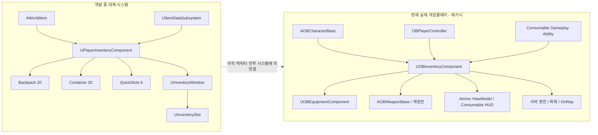
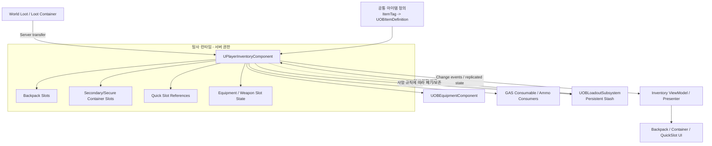

# PlayerInventory 대체 시스템 구성 및 설계 의도 분석 보고서

- 작성일: 2026-08-03
- 분석 대상: 현재 `OutBreak` 프로젝트의 Inventory, Item, LoadOut, Character, Weapon, Ability, HUD 연계 코드
- 전제: `UOBInventoryComponent`는 레거시이며 `UPlayerInventoryComponent`가 대체용으로 개발 중임
- 분석 방식: 현재 코드에서 직접 확인되는 사실과 구조적 추론을 분리하여 기술

## 1. 최종 결론

`UPlayerInventoryComponent`가 지향하는 형태는 **플레이어가 실제 슬롯 위치와 스택을 소유하는 탐사/루팅용 통합 인벤토리**다.

현재 코드에서 읽히는 목표 구성은 다음과 같다.

1. 플레이어가 고정 크기의 백팩, 보조 컨테이너, 퀵슬롯을 소유한다.
2. 아이템은 식별자, 타입, 수량으로 구성되며 슬롯 단위로 저장된다.
3. 월드 아이템을 획득하면 기존 스택을 먼저 채운 후 빈 슬롯을 사용한다.
4. 전량을 넣지 못하면 월드 아이템에 잔여 수량을 남긴다.
5. 조회와 소비는 백팩과 보조 컨테이너를 하나의 논리적 보유 영역으로 취급한다.
6. UI는 인벤토리 배열의 스냅샷을 받아 필요한 수만큼 슬롯 위젯을 생성하고 갱신한다.
7. 장기적으로는 무기, 방어구, 소모품, 탄약까지 하나의 슬롯 모델로 통합하려는 흔적이 있다.

따라서 신규 시스템은 레거시처럼 `태그 -> 총수량`만 저장하는 카운터가 아니라, **아이템이 어느 칸에 몇 개 있는지 보존하는 위치 기반 모델**로 해석하는 것이 타당하다.

다만 현재 구현은 대체 시스템의 핵심 저장 알고리즘만 만들어진 상태다. 레거시가 실제 게임에 제공하는 서버 권한, 복제, 무기 장착, 탄약 재장전, Gameplay Ability, HUD 변경 이벤트는 아직 신규 컴포넌트로 이관되지 않았다. 현재 시점의 `UPlayerInventoryComponent`는 빌드는 통과하지만 실제 캐릭터 런타임에 연결되지 않은 독립 개발 브랜치에 가깝다.

## 2. 판단 신뢰도

| 판단 | 신뢰도 | 근거 |
|---|---:|---|
| `UPlayerInventoryComponent`가 레거시 대체 대상 | 확정 | 사용자 확인 |
| 위치 기반 슬롯 인벤토리가 목표 | 높음 | 고정 크기 배열, 빈 슬롯, 인덱스 조회 결과, 슬롯 위젯 |
| 스택 가능한 루팅 인벤토리가 목표 | 높음 | 최대 스택 조회, 기존 스택 우선 충전, 잔여 수량 반환 |
| 백팩과 보조 컨테이너를 함께 조회·소비 | 높음 | `QueryHasItem`, `ConsumeItem`, `AddItem`의 순회 순서 |
| 퀵슬롯이 소모품/장비 사용 진입점 | 중간 | 6칸 배열과 `FQuickSlotData`만 존재하며 사용 로직은 없음 |
| 보조 컨테이너가 보안 컨테이너인지 별도 가방인지 | 미확정 | 소유 배열이라는 점 외에 사망/저장 규칙이 없음 |
| 무기·방어구 장착까지 신규 컴포넌트가 직접 담당 | 중간 | `EItemType`에는 장비 부위가 있으나 장착 API는 없음 |

## 3. 현재 코드의 두 계층

### 3.1 레거시 런타임 계층

`UOBInventoryComponent`는 현재 게임플레이에 실제 연결된 시스템이다.

- `AOBCharacterBase`가 기본 서브오브젝트로 생성한다.
- 무기 슬롯, 활성 슬롯, 슬롯별 탄창 수량을 관리한다.
- 탄종별 예비탄과 소모품 수량을 관리한다.
- 서버 권한 검사를 수행하고 배열을 복제한다.
- `Server_EquipSlot` RPC를 제공한다.
- `OnInventoryChanged`, `OnAmmoPoolChanged`를 통해 HUD를 갱신한다.
- Weapon, Gameplay Ability, PlayerController, HUD가 이 타입을 직접 조회한다.

즉 레거시는 데이터 구조가 단순하지만, 실제 게임플레이 계약은 넓다.

### 3.2 신규 대체 계층

`UPlayerInventoryComponent`는 다음 세 배열을 소유한다.

| 영역 | 기본 크기 | 현재 역할 |
|---|---:|---|
| `InventoryBackPackArray` | 20 | 주 저장소, UI 표시 대상 |
| `InventoryContrainerArray` | 20 | 백팩 다음 순서의 보조 저장소 |
| `InventoryQuickSlotsArray` | 6 | 선언·크기 초기화만 존재 |

외부에서 확인되는 신규 기능은 다음과 같다.

- 이름과 필요 수량으로 보유 아이템 조회
- 백팩과 보조 컨테이너에 분산된 스택 소비
- 월드 아이템 획득
- 기존 스택 우선 충전
- 백팩 빈 슬롯 우선 사용 후 보조 컨테이너 사용
- 전량 수납 여부 반환과 잔여 스택 보존
- 백팩 크기와 보조 컨테이너 크기 변경
- 백팩 UI 갱신

현재 `Source` 전체에서 `UPlayerInventoryComponent`를 캐릭터가 생성하거나 외부 시스템이 조회하는 호출은 없다. `AWorldItem`과 신규 위젯 코드만 이 타입을 알고 있다.

## 4. 현재 구조도



## 5. 신규 코드에서 복원한 의도된 동작

### 5.1 아이템 획득

현재 `AddItem`의 우선순위는 다음과 같다.

```text
동일 아이템의 백팩 기존 스택
  -> 동일 아이템의 보조 컨테이너 기존 스택
  -> 백팩 빈 슬롯
  -> 보조 컨테이너 빈 슬롯
  -> 남은 수량을 호출자에게 반환
```

이 순서는 슬롯 공간을 보존하면서 플레이어 소유 영역 전체에 아이템을 수납하려는 의도다. `PickUpWorldItem`은 전량 수납되었을 때만 월드 액터를 제거하므로 부분 획득도 고려하고 있다.

### 5.2 조회와 소비

`QueryHasItem`은 백팩과 보조 컨테이너 양쪽에서 아이템을 검색하고 각 배열의 인덱스와 총수량을 반환한다. `ConsumeItem`은 현재 상태를 다시 조회한 다음 백팩부터 소비하고 부족분을 보조 컨테이너에서 소비한다.

이는 UI 슬롯 위치와 게임플레이의 논리적 총수량을 동시에 지원하기 위한 구조다.

### 5.3 UI

컴포넌트는 백팩 배열을 `UInventoryWindow`에 전달한다. Window는 배열 크기에 맞춰 `UUniformGridPanel`의 자식 수를 조절하고 각 `UInventorySlot`에 데이터를 복사한다. Slot은 아이템 메타데이터에서 아이콘을 조회하고 스택 수량을 표시한다.

이 구조는 다음 책임 분리를 의도한다.

- Component: 실제 인벤토리 데이터와 규칙
- Window: 슬롯 위젯 개수와 데이터 분배
- Slot: 단일 아이템의 시각 표현

현재는 컴포넌트가 위젯 객체를 직접 보유해 UI와 도메인 계층이 강하게 결합되어 있다. 최종 구조에서는 변경 이벤트 또는 ViewModel/Presenter를 사이에 두는 편이 기존 HUD 구성과도 일치한다.

### 5.4 장비 확장

신규 `EItemType`은 주무기, 보조무기, 근접무기, 헬멧, 방어구, 장갑, 바지, 신발, 소모품, 탄약을 구분한다. 현재 구현은 `ItemType`을 실제로 채우거나 장착에 사용하지 않지만, 단순 소모품 가방보다 넓은 **장비 포함 통합 인벤토리**를 목표로 한 흔적이다.

## 6. 프로젝트 공통 아이템 계층과의 관계

프로젝트에는 신규 Inventory 폴더와 별도로 다음 공통 아이템 계층이 이미 존재한다.

- `FOBItemStack`: `FGameplayTag + Count`
- `UOBItemDefinition`: 이름, 설명, 아이콘, 카테고리, 최대 스택, 무게, 가격, 무기 클래스
- `UOBItemRegistry`: Gameplay Tag로 ItemDefinition 조회
- `UOBLoadoutSubsystem`: 장착 슬롯, 영구 창고, 저장 파일, 통화
- Asset Manager: `/Game/Data/Items`의 `OBItemDefinition`을 스캔하고 AlwaysCook

반면 신규 `UPlayerInventoryComponent` 계열은 별도로 다음 모델을 만든다.

- `FInventoryData`: `FName + EItemType + ItemStack`
- `FItemMetaData`: DataTable 행
- `UItemDataSubsystem`: `FName`으로 DataTable 조회
- `UInventorySystemSetting`: DataTable과 SlotWidget 설정

따라서 현재 프로젝트에는 아이템을 표현하는 두 언어가 병존한다.

| 항목 | 프로젝트 공통 계층 | 신규 PlayerInventory 계층 |
|---|---|---|
| 식별자 | `FGameplayTag` | `FName` |
| 정적 정의 | `UPrimaryDataAsset` | `UDataTable` 행 |
| 런타임 스택 | `FOBItemStack` | `FInventoryData` |
| 카테고리 | `EOBItemCategory` | `EItemType` |
| 조회 | `UOBItemRegistry` | `UItemDataSubsystem` |
| 설정 상태 | Asset Manager에 등록됨 | Config 값 없음 |
| 콘텐츠 | 다수 ItemDefinition 에셋 존재 | DataTable/Inventory UI 설정 확인 안 됨 |

`FOBItemStack` 주석에는 이 타입이 창고, 가방, 드랍테이블, 컨테이너의 공통 단위라고 명시되어 있다. 따라서 프로젝트 전체 일관성과 기존 에셋 재사용을 기준으로 보면, `UPlayerInventoryComponent`의 슬롯 구조는 유지하되 아이템 식별과 메타데이터는 `FGameplayTag + UOBItemDefinition` 쪽으로 통합하는 것이 가장 자연스럽다.

DataTable/FName 모델을 최종 표준으로 선택하는 것도 가능하지만, 그 경우 ItemRegistry, ItemDefinition 에셋, Loadout, SaveGame, GameplayTag 기반 Ability와 Weapon 호출부를 모두 변환해야 한다. 두 모델을 장기간 병행하는 것은 권장하지 않는다.

## 7. 레거시에서 신규 시스템으로 이관해야 할 계약

`UOBInventoryComponent`를 제거하려면 클래스 이름만 교체해서는 안 된다. 다음 런타임 계약이 신규 시스템에 먼저 들어가야 한다.

| 레거시 계약 | 현재 사용자 | 신규 시스템에 필요한 대응 |
|---|---|---|
| 캐릭터 기본 컴포넌트 | `AOBCharacterBase` | `UPlayerInventoryComponent` 생성 및 초기 데이터 주입 |
| 서버 권한 검사 | 모든 Add/Consume/Equip | 서버 전용 mutation API와 클라이언트 요청 RPC |
| 배열 복제와 `OnRep` | 원격 플레이어/HUD | 슬롯 배열 복제, 가능하면 Fast Array 검토 |
| 무기 슬롯 추가·교체 | Character, Controller | 장비 슬롯 API 또는 Equipment 전용 계층과 명확한 경계 |
| 슬롯별 탄창 저장 | Weapon/Equipment | 장착 인스턴스 상태 또는 슬롯 상태로 이관 |
| 탄약 조회·소비 | `AOBWeaponBase` | Ammo ItemTag 기반 총수량 조회·원자적 소비 |
| 소모품 조회·소비 | Gameplay Ability | ItemTag 기반 보유/소비 API |
| 변경 델리게이트 | HUD, ViewModel | 전체/슬롯/수량별 변경 이벤트 |
| 기본 장착 | Character PossessedBy | Loadout -> 신규 슬롯 -> Equipment 초기화 흐름 |
| HUD 바인딩 | OBHUD, AmmoViewModel, ConsumableWidget | 신규 컴포넌트 또는 읽기 전용 인터페이스로 재바인딩 |

## 8. 현재 신규 구현의 완성도와 차단점

### 8.1 P0: 대체 전 반드시 해결

1. **런타임 미연결**  
   캐릭터는 여전히 레거시만 생성한다. 신규 컴포넌트의 외부 사용처가 없다.

2. **멀티플레이 권한·복제 부재**  
   신규 컴포넌트에는 `SetIsReplicatedByDefault`, 복제 프로퍼티, `OnRep`, 서버 RPC, `HasAuthority` 검사가 없다. 현재 상태로 교체하면 클라이언트별 인벤토리가 갈라질 수 있다.

3. **아이템 식별 체계 이중화**  
   레거시 소비자는 Gameplay Tag를 사용하지만 신규 API는 `FName`을 사용한다. 마이그레이션 전에 하나의 표준을 확정해야 한다.

4. **메타데이터 설정 미완료**  
   `UInventorySystemSetting`의 `ItemDataTable`과 `SlotWidget` 값이 Config에서 확인되지 않는다. 현재 설정 그대로면 아이템 추가와 동적 슬롯 생성이 정상 동작하지 않는다.

5. **레거시 전투 계약 미구현**  
   무기 슬롯, 활성 슬롯, 탄창 보존, 장비 컴포넌트 호출, 탄약 API가 없다.

### 8.2 P1: 기능 완성에 필요

1. 퀵슬롯은 배열만 있고 등록, 해제, 사용, 원본 슬롯 추적 규칙이 없다.
2. 보조 컨테이너의 정확한 의미와 사망·추출·저장 규칙이 없다.
3. UI는 백팩만 표시하며 보조 컨테이너와 퀵슬롯을 표시하지 않는다.
4. `ItemType`은 새 슬롯에 아이템을 넣을 때 메타데이터로부터 설정되지 않는다.
5. 슬롯 이동, 교환, 분할, 합치기, 드롭, 정렬 API가 없다.
6. 크기를 줄이면 잘린 슬롯의 아이템을 보호하거나 반환하는 정책이 없다.
7. `RemoveItem`은 백팩 인덱스 전체 삭제만 지원한다.
8. `AWorldItem`에는 실제 상호작용, 충돌, 표시, 서버 권한, 복제 처리가 없다.
9. 동적 UniformGrid 슬롯의 Row/Column 배치 규칙이 없다.
10. 탈출 성공 시 런타임 가방을 영구 Stash로 정산하는 흐름이 없다.

### 8.3 P2: 구조 정리

- 컴포넌트가 Widget 인스턴스를 직접 소유하는 결합 제거
- 변경 이벤트 또는 읽기 전용 ViewModel 도입
- `InventoryContrainerArray`, `SeconderyWeapon`, `Glave` 오타 정리
- 비활성 Tick 선언 제거
- 인덱스를 외부로 전달하는 QueryResult의 수명 규칙 명시
- 중복 ItemDefinition 에셋 이름과 폴더 정리
- 자동화 테스트 추가

## 9. 권장 최종 구조



핵심 원칙은 다음과 같다.

- 정적 아이템 정보는 하나의 정의 계층만 사용한다.
- 런타임 인벤토리는 서버가 소유하고 슬롯 상태를 복제한다.
- 퀵슬롯은 아이템 복제본이 아니라 실제 슬롯/아이템을 참조한다.
- UI는 인벤토리를 변경하지 않고 명령 API를 호출하며, 표시 데이터는 이벤트로 갱신한다.
- Equipment는 무기 액터 생성·부착을 계속 담당하고 Inventory는 보유·슬롯 상태를 담당한다.
- 영구 Stash와 탐사 중 가방은 수명과 권한을 분리한다.

## 10. 권장 마이그레이션 순서

### 단계 1: 도메인 계약 확정

- 아이템 식별자를 `FGameplayTag` 또는 `FName` 중 하나로 확정
- 권장: 기존 에셋·Ability·Loadout과 호환되는 `FGameplayTag`
- 공통 스택 구조를 하나로 통합
- `Container`가 보안 컨테이너인지 다른 저장소인지 규칙 확정
- 퀵슬롯의 소유/참조 규칙 확정

### 단계 2: 신규 컴포넌트를 서버 권한 저장소로 완성

- 컴포넌트 복제 활성화
- 슬롯 배열 복제 및 `OnRep`/변경 이벤트 추가
- Add, Consume, Move, Split, Drop, Transfer 명령을 서버에서 검증
- ItemDefinition의 MaxStack과 카테고리 적용

### 단계 3: 일반 아이템·탄약 소비자 이관

- `GetItemCount`, `ConsumeItem` 호환 API 제공
- `GetAmmo`, `ConsumeAmmoFromPool`을 Ammo ItemTag 기반으로 대체
- Gameplay Ability, Weapon, HUD를 신규 읽기 인터페이스에 연결

### 단계 4: 무기와 Equipment 이관

- 무기 보유 슬롯과 장착 슬롯의 관계 확정
- 활성 슬롯, 슬롯별 탄창 상태, 교체 RPC와 전환 잠금 이관
- Character와 PlayerController가 신규 컴포넌트를 사용하도록 변경

### 단계 5: UI·월드 루팅 완성

- 백팩/보조 컨테이너/퀵슬롯 ViewModel 구성
- 슬롯 이동·분할·드롭·루팅 컨테이너 전송 구현
- WorldItem과 LootContainer에 서버 상호작용 및 복제 적용

### 단계 6: 탐사 수명주기 연결

- 로비 Stash에서 탐사 인벤토리로 아이템 지급
- 탈출 성공 시 가방을 Stash로 정산
- 사망 시 백팩·보조 컨테이너의 보존/손실 정책 적용
- SaveGame 마이그레이션 검증

### 단계 7: 레거시 제거

- 모든 직접 `UOBInventoryComponent` 참조 제거 확인
- 호환 어댑터 제거
- 레거시 타입과 문서 삭제
- 서버 2인 이상 PIE, 재접속, 사망, 탈출 회귀 테스트

## 11. 구현 전 확정해야 할 질문

1. `InventoryContrainerArray`는 보안 컨테이너, 장비 수납 공간, 또는 현재 열어 본 월드 컨테이너 중 무엇인가?
2. 퀵슬롯은 아이템을 별도로 소유하는가, 백팩 슬롯을 참조하는가?
3. 무기는 백팩에도 들어갈 수 있는 일반 아이템인가, 장비 슬롯에서만 존재하는가?
4. 탄약은 일반 슬롯을 차지하는가, 별도 풀을 유지하는가?
5. 사망 시 백팩과 보조 컨테이너는 각각 어떻게 처리되는가?
6. 탈출 시 어떤 영역이 Stash로 이전되는가?
7. 아이템 식별과 정적 정의의 최종 표준은 Gameplay Tag/DataAsset인가, FName/DataTable인가?

이 중 1, 2, 3, 7번은 이후 자료구조와 네트워크 포맷을 바꾸므로 UI 확장 전에 결정해야 한다.

## 12. 최종 평가

신규 코드는 **슬롯 기반 인벤토리 코어의 방향은 잡혀 있지만 레거시 대체 마이그레이션은 아직 시작되지 않은 상태**다.

- 저장 알고리즘 의도: 명확함
- 월드 아이템 부분 획득 의도: 명확함
- 백팩 UI 책임 분리: 초기 형태 존재
- 프로젝트 공통 아이템 데이터와의 통합: 미결정
- 레거시 소비자 이관: 미착수
- 멀티플레이 대체 가능성: 현재는 불가
- 탐사/사망/탈출 수명주기: 미연결

가장 중요한 다음 작업은 UI 기능 추가가 아니라 **아이템 식별 표준과 컨테이너 의미를 확정한 뒤, 신규 컴포넌트에 서버 권한·복제·변경 이벤트를 먼저 넣는 것**이다. 이 기반이 확정되어야 레거시 Weapon, Ability, HUD를 안전하게 순차 교체할 수 있다.

## 13. 조사 중 변경 사항

Inventory 및 게임플레이 소스는 변경하지 않았다. 본 분석 보고서만 추가했다.
