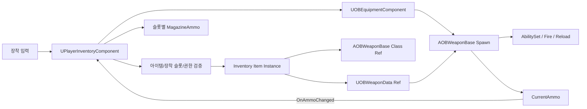
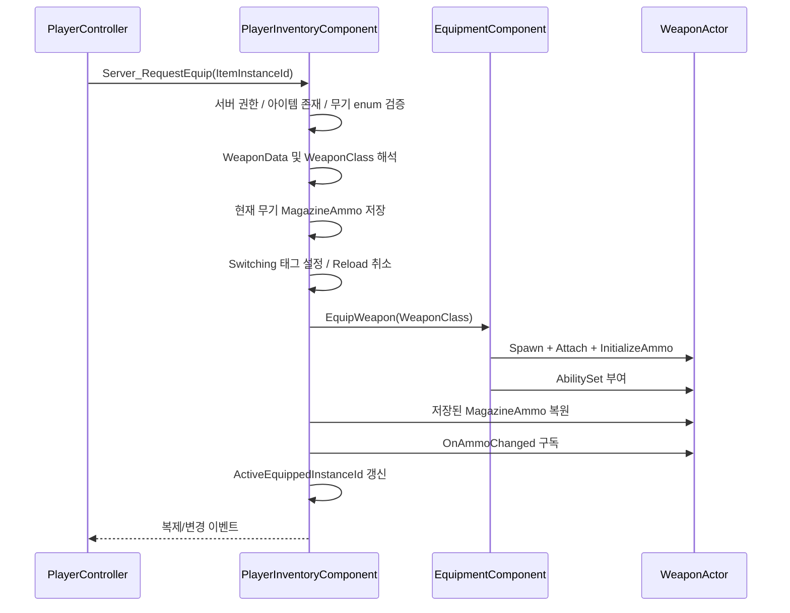

# PlayerInventory 무기 장착 로직 및 기존 DataAsset 재사용 설계 보고서

- 작성일: 2026-08-03
- 대상: `UPlayerInventoryComponent`의 무기 장착 기능 확장
- 기준 결정: `UOBInventoryComponent`의 무기 장착 흐름을 신규 컴포넌트로 이관
- 재사용 방침: 인벤토리 장비 아이템이 기존 Weapon DataAsset 참조를 보유하고, 해당 DataAsset을 이용해 기존 장착 구조를 재사용
- 조사 중 소스 변경: 없음

## 1. 설계 의도 해석

제시된 방향은 다음 구조로 해석된다.

1. `UPlayerInventoryComponent`가 플레이어의 인벤토리 슬롯과 장착 슬롯 상태를 소유한다.
2. 무기 아이템은 이름과 enum만 저장하지 않고 기존 `UOBWeaponData`를 참조한다.
3. 장착 요청 시 신규 컴포넌트가 슬롯 아이템의 DataAsset을 읽어 무기 슬롯, 탄종, 장착 시간 등의 정적 정보를 얻는다.
4. 레거시 `UOBInventoryComponent`의 장착·교체·탄창 보존 흐름은 신규 컴포넌트 안에서 재사용한다.
5. 실제 무기 액터의 스폰, 캐릭터 부착, GAS AbilitySet 부여, 코스메틱 처리는 기존 `UOBEquipmentComponent`가 계속 담당한다.
6. `AOBWeaponBase`와 `UOBWeaponData`에 이미 구현된 사격·탄창·애니메이션 설정은 중복 작성하지 않는다.

이 방향은 **Inventory가 보유 상태와 장착 결정을 담당하고, Equipment가 실제 무기 액터를 실행하는 기존 책임 분리**를 유지하면서 저장 모델만 슬롯 기반으로 교체하는 방식이다.

## 2. 결론

설계 방향은 재사용성과 마이그레이션 안정성 측면에서 적절하다. 특히 `UOBWeaponData`에는 다음 정보가 이미 집중되어 있다.

- `EOBWeaponType`
- `EOBWeaponSlot`
- `EOBWeaponCategory`
- 무기 메시와 부착 소켓
- AbilitySet
- 장착/공격/재장전 몽타주
- 탄종, 탄창 크기, 예비탄 기본값
- 사거리, 데미지, 반동, 탄퍼짐, ADS 설정

따라서 신규 Inventory에 같은 필드를 다시 복사하면 DataAsset과 슬롯 데이터가 서로 달라지는 이중 원본 문제가 생긴다. 인벤토리 아이템은 DataAsset 참조와 런타임 상태만 보유하고, 정적 스펙은 DataAsset에서 읽는 것이 맞다.

단, 현재 `UOBEquipmentComponent::EquipWeapon`은 `UOBWeaponData`가 아니라 `TSubclassOf<AOBWeaponBase>`를 입력으로 받는다. 또한 `UOBWeaponData` 자체에는 스폰할 WeaponClass가 없다. 따라서 **DataAsset에서 실제 무기 액터 클래스로 연결하는 방법**을 먼저 확정해야 한다.

## 3. 권장 책임 구조



책임은 다음과 같이 유지하는 것이 적합하다.

| 계층 | 책임 |
|---|---|
| PlayerInventory | 무기 아이템 보유, 장착 슬롯 배정, 활성 슬롯, 교체 명령, 슬롯별 런타임 상태 |
| Weapon DataAsset | 무기 정적 스펙과 장착 메타데이터 |
| EquipmentComponent | 무기 액터 생성·제거·부착, AbilitySet 부여·회수, 코스메틱 적용 |
| Weapon Actor | 현재 탄창, 발사·재장전 동작, 탄창 변경 이벤트 |
| HUD/ViewModel | Inventory/Equipment 변경 이벤트 구독 및 표시 |

## 4. 인벤토리 아이템 자료형

### 4.1 핵심 원칙

장비 enum은 DataAsset의 타입을 판별하는 구분자 역할을 하고, DataAsset은 실제 정적 스펙의 원본 역할을 한다.

무기 아이템에 필요한 데이터는 두 종류로 나뉜다.

#### 공유 정적 데이터

- 무기 슬롯
- 무기 타입과 카테고리
- WeaponMesh
- AbilitySet
- AttachSocket
- EquipMontage
- AmmoType
- MagazineSize

이 값은 `UOBWeaponData`에서 읽는다. 인벤토리 배열에 복사하지 않는다.

#### 아이템 인스턴스 상태

- 현재 탄창 수량
- 내구도 또는 개조 상태(추후)
- 어느 장착 슬롯에 배정되었는지
- 아이템 인스턴스 식별자

이 값은 DataAsset에 쓰지 않고 Inventory 슬롯 또는 별도 인스턴스 구조체가 보유한다.

### 4.2 최소 전환형 구조 예시

현재 `FInventoryData`를 최대한 유지하는 최소 형태는 다음과 같다.

```cpp
USTRUCT(BlueprintType)
struct FInventoryData
{
    GENERATED_BODY()

    UPROPERTY(BlueprintReadWrite)
    FName ItemName;

    UPROPERTY(BlueprintReadWrite)
    EItemType ItemType = EItemType::Consumable;

    UPROPERTY(BlueprintReadWrite)
    int32 ItemStack = 0;

    // Primary/Secondary/Melee 무기 타입에서만 유효.
    UPROPERTY(EditAnywhere, BlueprintReadWrite)
    TObjectPtr<UOBWeaponData> WeaponData;

    // DataAsset만으로 스폰 클래스를 얻을 수 없으므로 전환 기간에 필요.
    UPROPERTY(EditAnywhere, BlueprintReadWrite)
    TSoftClassPtr<AOBWeaponBase> WeaponClass;

    // 무기 아이템마다 달라지는 런타임 상태.
    UPROPERTY(BlueprintReadOnly)
    int32 MagazineAmmo = INDEX_NONE;

    UPROPERTY(BlueprintReadOnly)
    FGuid InstanceId;
};
```

무기는 `ItemStack == 1`을 강제하고, 탄약·소모품만 일반 스택 규칙을 사용해야 한다.

### 4.3 장기 구조

장기적으로는 일반 슬롯에 무기 전용 필드가 계속 추가되지 않도록 다음처럼 분리하는 편이 낫다.

```text
FInventoryItemInstance
  - ItemId
  - Count
  - InstanceId
  - Definition/DataAsset reference
  - Optional runtime instance state

UOBWeaponItemDefinition 또는 무기용 정의
  - UOBWeaponData reference
  - WeaponActorClass
```

사용자가 말한 “enum이 있는 자료형이 기존 DataAsset Ref를 보유한다”는 구조는 초기 구현에 적합하다. 다만 enum별로 서로 다른 DataAsset 타입이 늘어나면 공통 `UObject` 포인터 하나에 모두 넣기보다 타입이 명확한 정의 계층 또는 장비별 구조체로 분리해야 한다.

## 5. DataAsset에서 WeaponClass를 얻는 방법

현재 호출 방향은 다음과 같다.

```text
WeaponClass
  -> WeaponClass CDO
     -> GetWeaponData()
```

계획한 방향은 반대다.

```text
Inventory Item
  -> WeaponData
     -> WeaponClass 필요
```

하지만 현재 `UOBWeaponData`에는 WeaponClass 필드가 없다. 가능한 선택지는 다음과 같다.

### 선택지 A: 인벤토리 무기 아이템이 DataAsset과 WeaponClass를 함께 보유

- 기존 DataAsset과 Equipment API 수정이 가장 적다.
- `Equipment->EquipWeapon(WeaponClass)`를 그대로 호출할 수 있다.
- 스폰 후 `NewWeapon->GetWeaponData()`와 인벤토리의 `WeaponData`가 같은지 검증할 수 있다.
- 전환 단계 권장안이다.

### 선택지 B: UOBWeaponData에 WeaponActorClass 추가

- DataAsset 하나만 전달하면 된다.
- `EquipWeapon(const UOBWeaponData* Data)` 오버로드를 만들기 쉽다.
- 기존 Weapon Blueprint가 DataAsset을 참조하고 DataAsset이 다시 WeaponClass를 참조하는 순환 에셋 관계가 생길 수 있다.
- 에셋 로딩과 의존성 검토가 필요하다.

### 선택지 C: UOBItemDefinition을 장비 아이템의 참조로 사용

현재 `UOBItemDefinition`에는 `WeaponClass`가 이미 있다. ItemDefinition에서 WeaponClass를 얻고 WeaponClass CDO에서 `UOBWeaponData`를 얻으면 기존 구조와 호환된다.

```text
Inventory Item
  -> UOBItemDefinition
     -> WeaponClass
        -> CDO.GetWeaponData()
```

인벤토리에 넣으려는 DataAsset Ref가 `UOBItemDefinition`을 의미한다면 이 방식이 가장 자연스럽다. 만약 Ref가 `UOBWeaponData`를 의미한다면 선택지 A가 현재 코드 변경량이 가장 적다.

### 비권장: Asset Registry를 매번 역검색

장착할 때마다 DataAsset과 일치하는 WeaponClass를 검색하는 방식은 비용, 중복, 실패 진단이 모두 나쁘므로 피해야 한다.

## 6. 레거시 함수 재사용 방안

| 레거시 함수 | 이관 방법 | 비고 |
|---|---|---|
| `AddWeapon` | 그대로 복사하지 않고 일반 Inventory Add + 장착 슬롯 배정으로 분해 | 무기가 가방 아이템이 되므로 기존 즉시 슬롯 교체 방식은 부적합 |
| `GetWeaponInSlot` | 장착 슬롯이 참조하는 Inventory Instance 조회 | 배열 인덱스보다 InstanceId 권장 |
| `EquipSlot` | 권한·보유·전환 중 검사를 유지하고 신규 아이템 참조 사용 | 핵심 재사용 대상 |
| `Server_EquipSlot` | 신규 PlayerInventory RPC로 이관 | 서버에서 Instance/Slot 재검증 |
| `EquipActiveWeapon` | DataAsset/WeaponClass를 Inventory Item에서 해석하도록 변경 | Equipment 호출은 유지 |
| `SyncActiveMagazine` | 거의 그대로 재사용 | `FOBWeaponSlotEntry` 대신 아이템 인스턴스에 기록 |
| `SwapToSlot` | Switching 태그, 재장전 취소, draw 타이머 재사용 | 중복 요청 방지 필요 |
| `SetSwitching` | GAS 태그 처리 그대로 재사용 가능 | EndPlay/사망 시 정리 필요 |
| `EquipDefaultSlot` | Primary -> Secondary -> Melee 우선순위 재사용 | 신규 장착 슬롯 참조를 조회 |

### 그대로 유지할 컴포넌트

`UOBEquipmentComponent`의 다음 책임은 Inventory로 옮기지 않는 것이 좋다.

- 서버 무기 액터 Spawn
- 이전 무기 Unequip 및 Destroy
- 캐릭터 메시 소켓 부착
- AbilitySet 부여와 회수
- CurrentWeapon 복제
- Equip montage 등 코스메틱 적용
- `OnWeaponChanged` 방송

Inventory가 이 책임까지 흡수하면 슬롯 데이터, 네트워크, 액터 수명, GAS가 한 클래스에 모여 복잡도가 급격히 증가한다.

## 7. 권장 장착 흐름



구체적인 서버 흐름은 다음 순서가 안전하다.

1. 클라이언트는 인벤토리 인덱스가 아니라 `InstanceId` 또는 논리 장착 슬롯을 서버에 요청한다.
2. 서버가 해당 아이템이 실제 인벤토리에 존재하는지 확인한다.
3. `ItemType`이 무기 타입인지 검사한다.
4. DataAsset과 WeaponClass가 유효하고 서로 일치하는지 확인한다.
5. 전환 중이면 요청을 거절한다.
6. 현재 무기 탄창을 기존 아이템 인스턴스에 저장한다.
7. 이전 `OnAmmoChanged` 델리게이트를 해제한다.
8. `UOBEquipmentComponent`에 WeaponClass를 전달한다.
9. 새 무기 액터가 생성되면 인벤토리에 저장된 탄창을 복원한다.
10. 새 무기의 `OnAmmoChanged`를 구독한다.
11. 활성 아이템 ID와 장착 슬롯을 복제하고 UI 변경 이벤트를 발생시킨다.

## 8. 정적 데이터와 런타임 상태 분리

가장 중요한 불변식은 **DataAsset을 런타임 상태 저장소로 사용하지 않는 것**이다.

### DataAsset에 둘 값

- MagazineSize
- AmmoType
- AbilitySet
- WeaponSlot
- EquipMontage
- WeaponMesh

### Inventory Item Instance에 둘 값

- 현재 MagazineAmmo
- InstanceId
- 현재 장착 슬롯 또는 장착 여부
- 내구도/개조 상태(추후)

### Weapon Actor에 둘 값

- 현재 활성화된 액터의 CurrentAmmo
- 발사/재장전 중 임시 상태

DataAsset은 모든 무기 인스턴스가 공유하므로 `CurrentAmmo`를 DataAsset에 기록하면 같은 종류의 모든 무기가 동일 탄창 상태를 공유하는 오류가 생긴다.

## 9. enum과 DataAsset 간 단일 원본 규칙

현재 신규 `EItemType`에는 `PrimaryWeapon`, `SeconderyWeapon`, `MeleeWeapon`이 있고 `UOBWeaponData`에는 별도로 `EOBWeaponSlot WeaponSlot`이 있다.

두 값이 모두 장착 슬롯을 결정하면 충돌할 수 있다.

권장 규칙:

- `EItemType`: UI 분류와 “이 아이템이 무기인지” 판단
- `UOBWeaponData::WeaponSlot`: 실제 장착 가능한 무기 슬롯 결정

또는 신규 enum에서 Primary/Secondary/Melee를 제거하고 `Weapon` 하나로 통합한 뒤 DataAsset의 `WeaponSlot`만 사용한다.

두 필드를 유지한다면 아이템 생성 시 반드시 일치 검증을 해야 한다.

## 10. 복잡도가 발생하는 지점

### 10.1 DataAsset과 WeaponClass의 양방향 연결

현재 가장 즉각적인 복잡도다. 기존 코드는 WeaponClass에서 DataAsset을 찾지만 신규 설계는 DataAsset에서 WeaponClass를 찾아야 한다. 명시적인 매핑 필드 없이 역검색으로 해결하면 장착 코드가 불안정해진다.

### 10.2 인벤토리 배열 인덱스와 장착 참조

정렬, 슬롯 이동, 크기 변경 후 배열 인덱스는 바뀔 수 있다. 장착 슬롯이 `BackpackIndex`만 저장하면 다른 아이템을 장착한 것으로 바뀔 수 있다. 무기 같은 비스택 장비에는 `FGuid InstanceId`가 필요하다.

### 10.3 탄창 상태의 세 위치

탄창 값은 DataAsset 기본값, 인벤토리 인스턴스 저장값, 현재 Weapon Actor 값 세 층에 존재한다. 초기화와 복원 순서가 명확하지 않으면 무기 교체 시 탄창이 다시 가득 차거나 다른 무기의 값이 들어간다.

### 10.4 복제 순서

Inventory 슬롯, 활성 InstanceId, Equipment의 CurrentWeapon 액터가 서로 다른 복제 경로를 사용한다. 클라이언트에서 어느 것이 먼저 도착할지 가정하면 안 된다. UI는 모든 참조가 준비될 때 재해석할 수 있어야 한다.

### 10.5 장착 중 아이템 조작

장착된 무기를 이동, 드롭, 판매, 소비, 삭제하려 할 때 다음 정책이 필요하다.

- 장착 상태에서 이동 허용 여부
- 드롭 전에 자동 Unequip 여부
- 탄창 저장 후 월드 아이템으로 전달 여부
- 장착 슬롯 참조 해제 시점

### 10.6 탄약 모델 이관

`AOBWeaponBase::CanReload`와 `PerformReload`는 아직 `UOBInventoryComponent`를 직접 찾는다. 신규 장착만 먼저 적용하면 무기는 장착되지만 재장전은 계속 레거시 탄약 풀을 사용한다. 이후 일반 Ammo 아이템 스택 소비 API로 반드시 교체해야 한다.

### 10.7 GAS 전환 상태

무기 교체는 단순 Spawn이 아니라 Reload Ability 취소, `State.Weapon.Switching` 태그, draw 타이머, 발사 차단까지 포함한다. 이 흐름을 일부만 이관하면 교체 중 발사나 이전 무기 재장전 완료 같은 문제가 발생한다.

## 11. 단계별 구현 계획

### 1단계: 단일 플레이어 장착 검증

1. 무기용 Inventory Item에 `UOBWeaponData`와 WeaponClass 참조 추가
2. 무기는 Stack 1 강제
3. PlayerInventory에 장착 슬롯 참조와 Active Slot 추가
4. `EquipWeaponItem` 구현
5. EquipmentComponent의 기존 `EquipWeapon(WeaponClass)` 호출
6. DataAsset과 스폰된 Actor의 `GetWeaponData()` 일치 검증

이 단계에서는 레거시 탄약 풀을 유지해도 된다. 장착, 부착, 애니메이션, AbilitySet 재사용 여부만 먼저 확인한다.

### 2단계: 교체와 탄창 보존

1. 슬롯별 `MagazineAmmo` 저장
2. `OnAmmoChanged` 구독/해제
3. Primary/Secondary/Melee 교체
4. Switching 태그와 draw 타이머 이관
5. 동일 슬롯 중복 요청 차단

### 3단계: 탄약 인벤토리 이관

1. Ammo DataAsset/ItemType 판별
2. PlayerInventory `GetAmmoCount`, `ConsumeAmmo` 구현
3. WeaponBase의 레거시 컴포넌트 직접 참조 제거
4. 재장전 시 여러 슬롯에서 탄약 스택 소비

### 4단계: 서버 권한과 복제

1. 장착 요청 RPC
2. Inventory Item/장착 슬롯 복제
3. Active InstanceId 복제
4. 서버에서 모든 요청 재검증
5. 2인 이상 PIE에서 스폰·부착·탄창 동기화 검증

### 5단계: 레거시 소비자 전환

1. PlayerController 입력 대상 교체
2. Character 기본 장착 대상 교체
3. Ammo HUD와 Consumable HUD 재바인딩
4. Ability와 Weapon의 Inventory 조회 대상 교체
5. 모든 직접 `UOBInventoryComponent` 참조 제거 후 레거시 삭제

## 12. 테스트 체크리스트

| 테스트 | 기대 결과 |
|---|---|
| DataAsset이 없는 무기 아이템 장착 | 거절, 크래시 없음 |
| WeaponClass가 없는 무기 아이템 장착 | 거절 및 명확한 로그 |
| DataAsset과 WeaponClass CDO 데이터 불일치 | 장착 거절 또는 검증 경고 |
| Primary 최초 장착 | 올바른 액터, 메시, 소켓, AbilitySet 적용 |
| Primary -> Secondary 교체 | 이전 액터 제거, 새 액터 생성, draw 동안 발사 차단 |
| 무기별 탄창 감소 후 왕복 교체 | 각 아이템 탄창 수량 유지 |
| 교체 중 연속 입력 | 중복 Spawn 없음 |
| 교체 중 재장전 | 이전 Reload 취소 |
| 장착 무기 드롭 | 탄창 보존, 안전한 Unequip, 슬롯 참조 해제 |
| 장착 무기 인벤토리 이동 | InstanceId로 같은 아이템 유지 |
| 원격 클라이언트 관찰 | 올바른 무기 액터와 소켓 표시 |
| 사망/EndPlay | AbilitySet, 델리게이트, Switching 태그 정리 |

## 13. 최종 권고

제시한 방향대로 `PlayerInventoryComponent`에 레거시 장착 흐름을 이관하고 기존 DataAsset을 참조하는 구조가 적합하다.

가장 안전한 초기 형태는 다음과 같다.

```text
Inventory Item
  = ItemType
  + UOBWeaponData Ref
  + WeaponClass Ref
  + InstanceId
  + MagazineAmmo
```

장착 실행은 계속 `UOBEquipmentComponent`에 위임한다. 이후 데이터 구조가 안정되면 WeaponClass 매핑을 ItemDefinition 또는 전용 Weapon Item Definition으로 옮겨 인벤토리 아이템의 중복 필드를 줄일 수 있다.

구현 시 첫 번째 우선순위는 `DataAsset -> WeaponClass` 해석 규칙과 `DataAsset 정적 값 / 인벤토리 런타임 값`의 경계를 확정하는 것이다. 이 두 규칙이 확정되면 레거시의 `EquipSlot`, `SwapToSlot`, `SyncActiveMagazine`, `SetSwitching` 로직은 비교적 직접적으로 재사용할 수 있다.
